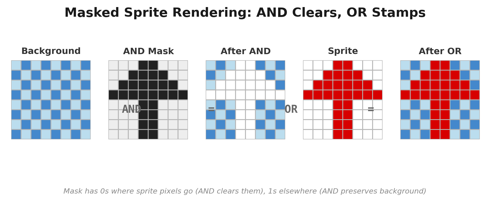

# Chapter 16: Fast Sprites

> *"Two colours per cell? Fine. But those two colours are going to move."*

---

Every game needs things that move. Bullets, enemies, the player character, explosions. On any hardware with a blitter or a GPU, the mechanics of putting a small image at an arbitrary screen position are handled for you. On the ZX Spectrum, they are your problem.

The Spectrum has no hardware sprites, no blitter, no co-processor. Every pixel of every sprite is placed by your Z80 code, one instruction at a time, into the same video memory the ULA is reading 50 times per second. And because the screen memory layout is interleaved (Chapter 2), "one row down" means `INC H` --- unless you are crossing a character boundary, in which case it means something considerably uglier.

This chapter presents six methods for drawing sprites on the Spectrum, from the simplest XOR routine to compiled sprites that execute at the theoretical maximum speed of the hardware. Each method has trade-offs. We will also look at the Agon Light 2, where the VDP provides hardware sprites and the entire problem collapses to a handful of API calls.

---

## Method 1: XOR Sprites

### The simplest approach

XOR drawing is the minimum viable sprite. It requires no mask data, no background save buffer, and no erase step. You draw the sprite by XORing its pixel data with the screen, and you erase it by XORing the same data again --- the property of XOR that `A XOR B XOR B = A` guarantees that the background is restored.

Here is a complete 16x16 XOR sprite routine:

```z80 id:ch16_the_simplest_approach
; Draw a 16x16 XOR sprite
; Input:  HL = screen address (top-left byte of sprite position)
;         IX = pointer to sprite data (32 bytes: 2 bytes x 16 rows)
;
xor_sprite_16x16:
    ld   b, 16              ;  7 T   16 rows

.row:
    ld   a, (ix+0)          ; 19 T   left byte of sprite row
    xor  (hl)               ;  7 T   combine with screen
    ld   (hl), a            ;  7 T   write back
    inc  l                  ;  4 T   move right one byte

    ld   a, (ix+1)          ; 19 T   right byte of sprite row
    xor  (hl)               ;  7 T
    ld   (hl), a            ;  7 T   write back
    dec  l                  ;  4 T   restore column

    inc  ix                 ; 10 T   \  advance sprite
    inc  ix                 ; 10 T   /  data pointer

    inc  h                  ;  4 T   move down one pixel row
    ld   a, h               ;  4 T   \
    and  7                  ;  7 T    | check character
    jr   nz, .no_boundary   ; 12/7T  /  boundary crossing

    ; Character boundary: adjust HL
    ld   a, l               ;  4 T
    add  a, 32              ;  7 T
    ld   l, a               ;  4 T
    jr   c, .no_fix         ; 12/7T
    ld   a, h               ;  4 T
    sub  8                  ;  7 T
    ld   h, a               ;  4 T
.no_fix:

.no_boundary:
    djnz .row               ; 13 T  (8 on last)
    ret                     ; 10 T
```

The inner loop costs 134 T-states per row in the common case (no boundary crossing): two IX loads at 19T each, two XOR-and-store sequences at 18T each, two INC IX at 10T, row advance (INC H + check) at 27T, and DJNZ at 13T. At character boundaries, the cost rises to ~164 T-states (the extra adjustment instructions replace the taken JR). For 16 rows: approximately 2,200 T-states per draw. To erase the sprite, call the same routine again with the same screen address --- the XOR undoes itself.

Total cost to animate one XOR sprite: ~4,400 T-states per frame (draw + erase).

### When XOR works

XOR sprites are perfect for:

- **Cursors.** A blinking text cursor, a crosshair, a selection highlight. Anything that sits on top of a static background and does not need to look pretty.
- **Bullets.** A 2x2 or 4x4 projectile that moves fast enough that visual glitches are invisible.
- **Debug markers.** Plotting collision boxes, entity positions, path nodes.

### When XOR fails

XOR has two serious problems. First, the visual quality is poor. Where the sprite overlaps with existing screen data, the pixels invert rather than replacing. A white sprite passing over white text turns invisible. A carefully drawn character becomes a mess of inverted pixels against a detailed background.

Second, XOR gives you no control over attributes. The sprite's colour is whatever ink/paper combination happens to be in the cells it overlaps. For a bullet or cursor this is fine. For a character sprite, it is not.

Despite its limitations, XOR is useful enough that every game programmer should have it in their toolkit. Twenty lines of code, zero extra memory, and it just works.

---

## Method 2: OR+AND Masked Sprites

### The industry standard

Almost every commercial Spectrum game released after 1984 used this technique or a close variant. A masked sprite carries two pieces of data for each row: a *mask* and the *graphic*. The mask defines the sprite's shape --- which pixels belong to the sprite and which are transparent. The graphic defines the sprite's appearance --- which of the shaped pixels are set.

The drawing algorithm for each byte is:

1. Read the screen byte.
2. AND it with the mask. This clears the pixels where the sprite will appear, leaving the rest of the background intact.
3. OR it with the graphic. This stamps the sprite's pixels into the cleared area.

The result: the sprite appears on screen with transparent areas showing the background through. No XOR artifacts. No inverted pixels. Clean, professional-looking sprites.


### Data format

For a 16x16 sprite, each row contains 4 bytes: mask-left, graphic-left, mask-right, graphic-right. The mask byte has `1` for transparent pixels and `0` for opaque pixels (because ANDing with 1 preserves the background, ANDing with 0 clears it). Total data per sprite: 16 rows x 4 bytes = 64 bytes.

### The inner loop

```z80 id:ch16_the_inner_loop
; Draw a 16x16 masked sprite (byte-aligned)
; Input:  HL = screen address
;         DE = pointer to sprite data
;              Format per row: mask_L, gfx_L, mask_R, gfx_R
;
masked_sprite_16x16:
    ld   b, 16              ;  7 T

.row:
    ; --- Left byte ---
    ld   a, (de)            ;  7 T   load mask
    and  (hl)               ;  7 T   clear sprite-shaped hole in background
    inc  de                 ;  6 T
    ld   c, a               ;  4 T   save masked background

    ld   a, (de)            ;  7 T   load graphic
    or   c                  ;  4 T   stamp sprite into hole
    ld   (hl), a            ;  7 T   write to screen
    inc  de                 ;  6 T
    inc  l                  ;  4 T   move right

    ; --- Right byte ---
    ld   a, (de)            ;  7 T   load mask
    and  (hl)               ;  7 T
    inc  de                 ;  6 T
    ld   c, a               ;  4 T

    ld   a, (de)            ;  7 T   load graphic
    or   c                  ;  4 T
    ld   (hl), a            ;  7 T
    inc  de                 ;  6 T
    dec  l                  ;  4 T   restore column

    ; --- Next row (DOWN_HL) ---
    inc  h                  ;  4 T
    ld   a, h               ;  4 T
    and  7                  ;  7 T
    jr   nz, .no_boundary   ; 12/7T

    ld   a, l               ;  4 T
    add  a, 32              ;  7 T
    ld   l, a               ;  4 T
    jr   c, .no_fix         ; 12/7T
    ld   a, h               ;  4 T
    sub  8                  ;  7 T
    ld   h, a               ;  4 T
.no_fix:
.no_boundary:
    djnz .row               ; 13 T
    ret                     ; 10 T
```

### Cycle counting

Let us count the common case (no character boundary crossing). Note that `JR NZ` is taken (12T) in the common case because the boundary crossing is rare --- only 1 in 8 rows crosses a character boundary.

| Section | Instructions | T-states |
|---------|-------------|----------|
| Left byte: mask+draw | `ld a,(de)` + `and (hl)` + `inc de` + `ld c,a` + `ld a,(de)` + `or c` + `ld (hl),a` + `inc de` + `inc l` | 52 |
| Right byte: mask+draw | Same sequence + `dec l` | 52 |
| Row advance | `inc h` + `ld a,h` + `and 7` + `jr nz` (taken) | 27 |
| Loop | `djnz` | 13 |
| **Total per row** | | **144** |

For 16 rows: 16 x 144 = **2,304 T-states** (common case). Add boundary-crossing overhead for ~2 boundaries in a 16-pixel sprite: roughly **2,400 T-states** total.

But this only draws the sprite. You also need to erase the previous frame's sprite, which means restoring the background --- we will address this in Method 6 (Dirty Rectangles). For now, note that the draw alone is about 35% more expensive than XOR, but the visual quality is incomparably better.



### Byte alignment and the shift problem

The routine above assumes the sprite starts at a byte boundary --- that is, the x coordinate is a multiple of 8. In practice, game characters move pixel by pixel, not in 8-pixel jumps. If your sprite's x position is 53, it starts at byte column 6, pixel 5 within that byte. The sprite data needs to be shifted right by 5 bits.

You can shift at draw time:

```z80 id:ch16_byte_alignment_and_the_shift
; Shift mask and graphic right by A bits
; This adds significant cost per byte
    ld   a, (de)            ;  7 T   load mask byte
    ld   c, a               ;  4 T
    ld   a, b               ;  4 T   shift count
.shift:
    srl  c                  ;  8 T   \
    dec  a                  ;  4 T    | per-bit shift loop
    jr   nz, .shift         ; 12 T   /
```

Each bit of shift costs 24 T-states per byte in this naive loop. For a 5-bit shift on a 16-wide sprite (3 bytes per row after shift, since the sprite spills into a third byte), you are looking at an extra 5 x 24 x 3 = 360 T-states per row --- doubling the draw cost. For 8 sprites at 25 fps, this shift overhead alone would consume roughly 46,000 T-states per frame --- over 60% of your budget.

This is why pre-shifted sprites exist.

---

## Method 3: Pre-Shifted Sprites

### The memory-for-speed trade-off

The idea is simple: instead of shifting the sprite data at draw time, pre-compute shifted versions of the sprite at load time (or at assembly time) and store them alongside the original. When you need to draw the sprite at pixel offset 3 within a byte, you use the version that was pre-shifted by 3 pixels.

There are two common configurations:

**4 shifted copies** (shift by 0, 2, 4, 6 pixels). This gives 2-pixel horizontal resolution. The sprite snaps to even pixel positions, which is often acceptable for game characters. Memory cost: 4x the unshifted data.

**8 shifted copies** (shift by 0, 1, 2, 3, 4, 5, 6, 7 pixels). Full pixel-level horizontal positioning. Memory cost: 8x the unshifted data. But each shifted version is also wider: a 16-pixel-wide sprite shifted by 1--7 bits spills into a third byte column, so each shifted copy is 3 bytes wide instead of 2.

### Memory calculation

For a 16x16 masked sprite:

| Configuration | Bytes per row | Rows | Copies | Total |
|---------------|--------------|------|--------|-------|
| Unshifted only | 4 (mask+gfx x 2 bytes) | 16 | 1 | 64 |
| 4 shifts | 4 | 16 | 4 | 256 |
| 8 shifts (3 bytes wide) | 6 (mask+gfx x 3 bytes) | 16 | 8 | 768 |

For a sprite with 4 animation frames, multiply by 4:

| Configuration | Per frame | 4 frames | 8 sprites |
|---------------|-----------|----------|-----------|
| Unshifted + runtime shift | 64 | 256 | 2,048 |
| 4 pre-shifts | 256 | 1,024 | 8,192 |
| 8 pre-shifts | 768 | 3,072 | 24,576 |

24 KB for 8 sprites with full pre-shifting. On a 128K Spectrum, that is one and a half memory banks just for sprite data. On a 48K machine, it is nearly half of available RAM. The trade-off is stark.

### Practical compromise

Most games use 4 pre-shifted copies. The 2-pixel horizontal resolution is barely noticeable in gameplay. Some games use 8 copies for the player character (where smooth movement matters most) and 4 copies or even runtime shifting for less important sprites.

The draw routine for pre-shifted sprites is identical to the byte-aligned masked sprite routine --- you just select the correct pre-shifted data set before calling it:

```z80 id:ch16_practical_compromise
; Select pre-shifted sprite data
; Input:  A = x coordinate (0-255)
;         IY = base of pre-shift table (4 entries, each pointing to 16-row data)
; Output: DE = pointer to correct shifted sprite data
;
select_preshift:
    and  $06                ;  7 T   mask to shifts 0,2,4,6 (4 copies)
    ld   c, a               ;  4 T
    ld   b, 0               ;  7 T
    add  iy, bc             ; 15 T
    ld   e, (iy+0)          ; 19 T
    ld   d, (iy+1)          ; 19 T   DE = pointer to shifted data
    ret
```

The draw time is the same as Method 2: ~2,300 T-states. But you have eliminated the per-pixel shift cost entirely. The price is paid in memory, not T-states.

---

## Method 4: Stack Sprites (The PUSH Method)

### The fastest output on the Z80

We saw in Chapter 3 that PUSH writes 2 bytes in 11 T-states --- 5.5 T-states per byte, the fastest write operation on the Z80. Stack sprites exploit this for sprite output: set SP to the bottom of the sprite's screen area, load register pairs with sprite data, and PUSH them onto the screen.

The technique requires a critical setup:

1. **DI** --- disable interrupts. If an interrupt fires while SP points to the screen, the CPU pushes its return address into your pixel data, corrupting the display and probably crashing.
2. **Save SP** --- stash the real stack pointer using self-modifying code.
3. **Set SP** to the bottom-right of the sprite area on screen (PUSH works downward).
4. **Load and PUSH** --- load sprite data into register pairs and PUSH them in sequence.
5. **Restore SP and EI** --- put the stack back and re-enable interrupts.

### The inner loop

For a 16x16 sprite (2 bytes wide), each row is a single PUSH:

```z80 id:ch16_the_inner_loop_2
; Stack sprite: 16x16, writes 2 bytes per row via PUSH
; Input:  screen_addr = pre-calculated bottom-right screen address
;         sprite_data = 32 bytes of pixel data (2 bytes x 16 rows,
;                       stored bottom-to-top because PUSH goes downward)
;
stack_sprite_16x16:
    di                           ;  4 T

    ld   (restore_sp + 1), sp    ; 20 T   save SP (self-mod)

    ld   sp, (screen_addr)       ; 20 T   SP = bottom of sprite on screen
    ld   ix, sprite_data         ; 14 T

    ; Row 15 (bottom) - each PUSH writes 2 bytes and decrements SP
    ld   h, (ix+31)              ; 19 T   \
    ld   l, (ix+30)              ; 19 T    | load bottom row
    push hl                      ; 11 T   /  write to screen

    ; But wait --- SP just decremented by 2, and the next row UP
    ; on the Spectrum screen is NOT at SP-2. The interleaved layout
    ; means "one row up" is at a completely different address.
    ;
    ; This is the fundamental problem with stack sprites on the
    ; Spectrum: the screen is not contiguous in memory.
```

And here is the fundamental difficulty. The PUSH method is the fastest possible write, but the Spectrum's interleaved screen layout means that consecutive screen rows are not at consecutive addresses. SP decrements linearly, but screen rows follow the `010TTSSS LLLCCCCC` pattern from Chapter 2.

### Making it work: pre-calculated SP chain

The solution is to not rely on SP auto-decrement for row navigation. Instead, you explicitly set SP for each row:

```z80 id:ch16_making_it_work_pre_calculated
; Stack sprite: 16x16 with explicit SP per row
; This is the practical version --- each row gets SP set independently
;
stack_sprite_16x16:
    di                           ;  4 T
    ld   (restore_sp + 1), sp    ; 20 T

    ld   hl, (sprite_data + 0)   ; 16 T   row 0 data
    ld   sp, (row_addrs + 0)     ; 20 T   SP = screen addr for row 0 + 2
    push hl                      ; 11 T   write row 0
                                 ;        total per row: 47 T

    ld   hl, (sprite_data + 2)   ; 16 T   row 1 data
    ld   sp, (row_addrs + 2)     ; 20 T
    push hl                      ; 11 T
    ; ... repeated for all 16 rows ...

restore_sp:
    ld   sp, $0000               ; 10 T   self-modified
    ei                           ;  4 T
    ret                          ; 10 T
```

Each row costs 47 T-states. For 16 rows: 16 x 47 = 752 T-states, plus setup and teardown (~60 T-states). Total: approximately **810 T-states**.

Compare this to Method 2's ~2,300 T-states. The stack sprite is nearly 3x faster --- but it comes with constraints.

### The costs

**No masking.** The PUSH writes 2 bytes unconditionally. It overwrites whatever was on screen. There is no AND-with-mask step. The sprite is always a solid rectangle --- any "transparent" pixels will show the sprite's background colour, not the game background. For sprites on a solid-colour background (many classic Spectrum games used black), this is fine. For sprites over detailed backgrounds, it is not.

**Pre-calculated row addresses.** You need a table of screen addresses for all 16 rows of the sprite, updated whenever the sprite moves. This is a per-frame setup cost --- not enormous, but not free.

**Interrupts are off.** For 8 sprites, roughly 6,500 T-states with interrupts disabled. If your music runs from IM2, schedule sprite drawing immediately after HALT.

**Data must be stored in PUSH order.** Since PUSH writes the high byte at (SP-1) and the low byte at (SP-2), and SP decrements *before* writing, the data layout requires careful attention. The sprite data is stored reversed: the rightmost byte of a row becomes the low byte loaded into the register, the leftmost becomes the high byte.

### When to use stack sprites

Stack sprites are the weapon of choice when you need raw speed and your background is simple enough that full-rectangle overwrites are acceptable. Arcade-style games with black backgrounds, score overlays, and fast-moving objects are the natural fit. The PUSH method is also used for screen clearing and bulk data output (Chapter 3), where the "no masking" limitation is irrelevant.

---

## Method 5: Compiled Sprites

### The sprite is the code

A compiled sprite takes the code-generation philosophy from Chapter 3 to its logical conclusion. Instead of a data table interpreted by a draw routine, the sprite *is* an executable routine. Each visible pixel byte in the sprite becomes a `LD (HL), n` instruction. Transparent runs become `INC L` or `INC H` instructions to skip over them. The entire sprite is rendered by `CALL`-ing it.

### How it works

Consider a simple 8x8 sprite with some transparent pixels. In a masked sprite, you would store mask+graphic pairs and run the AND/OR loop. In a compiled sprite, you generate Z80 instructions at assembly time (or at load time):

```z80 id:ch16_how_it_works
; Compiled sprite for a small arrow shape
; Input:  HL = screen address of top-left byte
; The sprite draws itself.
;
compiled_arrow:
    ; Row 0: one pixel byte
    ld   (hl), $18          ; 10 T   ..##....
    inc  h                  ;  4 T   next row

    ; Row 1: one pixel byte
    ld   (hl), $3C          ; 10 T   ..####..
    inc  h                  ;  4 T

    ; Row 2: one pixel byte
    ld   (hl), $7E          ; 10 T   .######.
    inc  h                  ;  4 T

    ; Row 3: one pixel byte
    ld   (hl), $FF          ; 10 T   ########
    inc  h                  ;  4 T

    ; Row 4: one pixel byte
    ld   (hl), $3C          ; 10 T   ..####..
    inc  h                  ;  4 T

    ; Row 5: one pixel byte
    ld   (hl), $3C          ; 10 T   ..####..
    inc  h                  ;  4 T

    ; Row 6: one pixel byte
    ld   (hl), $3C          ; 10 T   ..####..
    inc  h                  ;  4 T

    ; Row 7: one pixel byte
    ld   (hl), $3C          ; 10 T   ..####..

    ret                     ; 10 T

    ; Total: 8 x (10 + 4) + 10 = 122 T-states
    ; Compare: masked routine for 8x8 = ~600 T-states
```

That is 122 T-states for an 8x8 sprite. The masked approach takes roughly 5x longer.

### 16x16 compiled sprite

For a wider sprite, each row may have multiple `LD (HL), n` instructions separated by `INC L`:

```z80 id:ch16_16x16_compiled_sprite
; Compiled sprite: 16x16 (2 bytes wide)
; Input:  HL = screen address of top-left
;
compiled_sprite_16x16:
    ; Row 0
    ld   (hl), $3C          ; 10 T   left byte
    inc  l                  ;  4 T
    ld   (hl), $0F          ; 10 T   right byte
    dec  l                  ;  4 T   restore column
    inc  h                  ;  4 T   next row
                            ;        row cost: 32 T

    ; Row 1
    ld   (hl), $7E          ; 10 T
    inc  l                  ;  4 T
    ld   (hl), $1F          ; 10 T
    dec  l                  ;  4 T
    inc  h                  ;  4 T
                            ;        row cost: 32 T

    ; ... rows 2-6 similar ...

    ; Row 7 (character boundary)
    ld   (hl), $FF          ; 10 T
    inc  l                  ;  4 T
    ld   (hl), $FF          ; 10 T
    dec  l                  ;  4 T
    ; Character boundary crossing:
    ld   a, l               ;  4 T
    add  a, 32              ;  7 T
    ld   l, a               ;  4 T
    ld   a, h               ;  4 T
    sub  8                  ;  7 T
    ld   h, a               ;  4 T   boundary cost: 30 T
    inc  h                  ;  4 T
                            ;        row cost: 62 T

    ; Rows 8-15 similar to 0-6, with another boundary at row 15
    ; ...
    ret                     ; 10 T
```

Per row (common case): 32 T-states. For 16 rows with 1--2 boundary crossings: roughly **570 T-states**.

### The trade-offs

**Strengths:**
- The fastest masked-capable sprite method. You can incorporate AND masking into compiled sprites --- each byte becomes `ld a,(hl)` / `and mask` / `or graphic` / `ld (hl),a` instead of a simple `ld (hl),n`. Even with masking, the compiled approach avoids loop overhead, data pointer management, and row counting.
- No loop overhead at all. The code is completely straight-line.
- Transparent regions cost nothing if they span entire bytes --- you just skip them with `INC L` or `INC H`.

**Weaknesses:**
- **Code size.** Each visible byte takes 2 bytes of code (`LD (HL), n`). With masking (4 instructions per byte), code size roughly triples. A full set of 8 pre-shifted compiled sprites with 4 animation frames can reach several kilobytes per sprite.
- **No runtime data changes.** Pixel values are baked into instruction operands. Animation requires a separate compiled routine per frame.
- **Boundary handling is baked in.** Character boundary crossings sit at fixed positions, so the sprite must maintain consistent vertical alignment or you need multiple compiled versions.

### Compiled sprites with masking

For sprites that need to appear over a detailed background, you compile the mask into the code:

```z80 id:ch16_compiled_sprites_with_masking
; Compiled sprite with masking: one byte
; Instead of ld (hl),n, we do:
    ld   a, (hl)            ;  7 T   read screen
    and  $C3                ;  7 T   mask: clear sprite pixels
    or   $3C                ;  7 T   graphic: stamp sprite
    ld   (hl), a            ;  7 T   write back
                            ;        per-byte cost: 28 T
```

28 T-states per byte, versus 52 T-states per byte in the general-purpose masked routine (Method 2). The saving comes from eliminating pointer management, loop counting, and data loading --- the mask and graphic values are immediate operands.

For 16 rows x 2 bytes: 16 x (28 + 28 + 4 + 4 + 4) = 16 x 68 = **1,088 T-states**. This is about half the cost of the generic masked routine, with full transparency support.

| Method | 16x16 draw cost | Masking | Notes |
|--------|-----------------|---------|-------|
| XOR sprite | ~2,200 T | No | Draw + erase = ~4,400 T |
| OR+AND masked | ~2,400 T | Yes | Standard approach |
| Pre-shifted masked | ~2,400 T | Yes | No shift cost; 4--8x memory |
| Stack sprite (PUSH) | ~810 T | No | DI required; solid rectangle |
| Compiled (no mask) | ~570 T | No | Code = sprite; large footprint |
| Compiled (masked) | ~1,088 T | Yes | Best of both; largest footprint |

<!-- figure: ch16_sprite_methods -->


---

## Method 6: Dirty Rectangles

### The background problem

Methods 1--5 all address the question of *putting* pixels on screen. But sprites move. Every frame, the sprite is in a new position. Before drawing the sprite at its new position, you must erase it from the old position --- or the screen fills up with ghostly after-images.

The XOR method handles this implicitly: XOR the old position to erase, XOR the new position to draw. But for all other methods, you need a way to restore the background.

There are three common approaches:

**Full screen clear.** Wipe the pixel area every frame (~36,000 T-states with PUSH from Chapter 3), then redraw everything. Feasible but expensive.

**Background save/restore.** Before drawing each sprite, save the screen behind it. To erase, copy the saved buffer back. Cost is O(sprite_size) per sprite, not O(screen_size).

**Dirty rectangle tracking.** A refinement: track which rectangles were modified, restore only those, then draw new sprites (saving new background as you go).

### The save/restore cycle

The practical approach for most Spectrum games is per-sprite background save/restore. Here is the cycle for one sprite per frame:

1. **Restore** the background saved last frame (copy saved buffer to old screen position).
2. **Save** the background at the new screen position (copy screen to save buffer).
3. **Draw** the sprite at the new position.

The order matters. You restore before saving to avoid overwriting the new background save with stale data if sprites overlap.

### Save/restore routine

For a 16x16 sprite (2 bytes wide, 16 rows), the background buffer is 32 bytes:

```z80 id:ch16_save_restore_routine
; Save background behind a 16x16 sprite
; Input:  HL = screen address (top-left)
;         DE = pointer to save buffer (32 bytes)
;
save_background_16x16:
    ld   b, 16              ;  7 T

.row:
    ld   a, (hl)            ;  7 T   read left byte
    ld   (de), a            ;  7 T   save it
    inc  de                 ;  6 T
    inc  l                  ;  4 T

    ld   a, (hl)            ;  7 T   read right byte
    ld   (de), a            ;  7 T   save it
    inc  de                 ;  6 T
    dec  l                  ;  4 T

    ; DOWN_HL (same as sprite routines)
    inc  h                  ;  4 T
    ld   a, h               ;  4 T
    and  7                  ;  7 T
    jr   nz, .no_boundary   ; 12/7T
    ld   a, l               ;  4 T
    add  a, 32              ;  7 T
    ld   l, a               ;  4 T
    jr   c, .no_fix         ; 12/7T
    ld   a, h               ;  4 T
    sub  8                  ;  7 T
    ld   h, a               ;  4 T
.no_fix:
.no_boundary:
    djnz .row               ; 13 T
    ret                     ; 10 T
```

The restore routine is identical with source and destination swapped: read from the buffer, write to the screen. Each routine takes approximately **1,500 T-states** for 16 rows.

### Full frame budget

Let us calculate the per-frame cost for 8 animated 16x16 sprites using OR+AND masking with background save/restore:

| Operation | Per sprite | 8 sprites |
|-----------|-----------|-----------|
| Restore background | ~1,500 T | 12,000 T |
| Save new background | ~1,500 T | 12,000 T |
| Draw sprite (masked) | ~2,400 T | 19,200 T |
| **Total** | **~5,400 T** | **~43,200 T** |

On a Pentagon (71,680 T-states per frame): 43,200 T leaves **28,480 T** for game logic, input processing, music, and everything else. At 25 fps you have twice the budget (two frames per update), giving ~100,000 T-states for non-sprite work. This is comfortable for a game.

If you use compiled masked sprites instead:

| Operation | Per sprite | 8 sprites |
|-----------|-----------|-----------|
| Restore background | ~1,500 T | 12,000 T |
| Save new background | ~1,500 T | 12,000 T |
| Draw sprite (compiled, masked) | ~1,088 T | 8,704 T |
| **Total** | **~4,088 T** | **~32,704 T** |

That saves over 10,000 T-states per frame --- a meaningful improvement that buys you more room for game logic or more sprites.

### Draw order and overlap

When multiple sprites overlap, draw order matters. The simplest correct approach:

1. Restore all backgrounds (in reverse draw order, to handle overlaps correctly).
2. Save all new backgrounds.
3. Draw all sprites.

Reverse-order restoration ensures that when two sprites overlapped last frame, the earlier sprite's save buffer (which captured the clean background) is restored last, correctly cleaning up the overlap area.

The reasoning: if sprite A was drawn on top of sprite B, A's save buffer contains B's pixels. Restoring A first exposes B, then restoring B reveals the clean background. Forward-order restoration leaves artifacts. Many games sidestep this by preventing overlap or accepting minor glitches.

---

## Optimising the Inner Loops

### Eliminating pointer management

The routines above spend significant time on pointer management: `inc de`, `inc l`, `dec l`, and the DOWN_HL boundary logic. Several optimisations can reduce this overhead.

**Use LDI instead of manual copy.** For save/restore operations, an LDI chain (Chapter 3) copies a byte from (HL) to (DE), increments both, and decrements BC --- all in 16 T-states. Compared to our manual `ld a,(hl)` + `ld (de),a` + `inc de` + `inc l` at 24 T-states, LDI saves 8 T-states per byte. For a 16x16 sprite (32 bytes), that is 256 T-states saved per save or restore operation.

```z80 id:ch16_eliminating_pointer
; Save background using LDI (partial unroll, 2 bytes per row)
; HL = screen address, DE = save buffer
;
save_bg_ldi:
    ld   b, 16              ;  7 T
.row:
    ldi                     ; 16 T   copy left byte
    ldi                     ; 16 T   copy right byte
    dec  l                  ;  4 T   \
    dec  l                  ;  4 T   /  LDI advanced L by 2, undo it

    ; DOWN_HL
    inc  h                  ;  4 T
    ld   a, h               ;  4 T
    and  7                  ;  7 T
    jr   nz, .no_boundary   ; 12/7T
    ld   a, l               ;  4 T
    add  a, 32              ;  7 T
    ld   l, a               ;  4 T
    jr   c, .no_fix         ; 12/7T
    ld   a, h               ;  4 T
    sub  8                  ;  7 T
    ld   h, a               ;  4 T
.no_fix:
.no_boundary:
    djnz .row               ; 13 T
    ret                     ; 10 T
```

Common-case row cost: 16 + 16 + 4 + 4 + 4 + 4 + 7 + 12 + 13 = **80 T-states** (JR NZ is taken at 12T in the common case --- no boundary crossing). For 16 rows: approximately **1,280 T-states** --- a worthwhile improvement over the 1,500 T-states of the manual approach.

**Combine save and draw.** Instead of save-then-draw as two separate passes over the screen area, combine them into one pass: for each byte, read the screen (save it), then write the sprite data. This halves the number of row-advance operations and eliminates one complete DOWN_HL traversal:

```z80 id:ch16_eliminating_pointer_2
; Combined save-and-draw for masked sprite
; HL = screen address, DE = sprite data (mask, gfx pairs)
; IX = save buffer
;
save_and_draw_16x16:
    ld   b, 16              ;  7 T
.row:
    ; Left byte
    ld   a, (hl)            ;  7 T   read screen (for saving)
    ld   (ix+0), a          ; 19 T   save to buffer
    ld   c, a               ;  4 T

    ld   a, (de)            ;  7 T   load mask
    and  c                  ;  4 T   mask background
    inc  de                 ;  6 T
    ld   c, a               ;  4 T

    ld   a, (de)            ;  7 T   load graphic
    or   c                  ;  4 T   stamp sprite
    ld   (hl), a            ;  7 T   write to screen
    inc  de                 ;  6 T
    inc  l                  ;  4 T

    ; Right byte (similar)
    ld   a, (hl)            ;  7 T
    ld   (ix+1), a          ; 19 T
    ld   c, a               ;  4 T

    ld   a, (de)            ;  7 T
    and  c                  ;  4 T
    inc  de                 ;  6 T
    ld   c, a               ;  4 T

    ld   a, (de)            ;  7 T
    or   c                  ;  4 T
    ld   (hl), a            ;  7 T
    inc  de                 ;  6 T
    dec  l                  ;  4 T

    ; Advance IX and HL
    inc  ix                 ; 10 T
    inc  ix                 ; 10 T

    inc  h                  ;  4 T
    ld   a, h               ;  4 T
    and  7                  ;  7 T
    jr   nz, .no_boundary   ; 12/7T
    ld   a, l               ;  4 T
    add  a, 32              ;  7 T
    ld   l, a               ;  4 T
    jr   c, .no_fix         ; 12/7T
    ld   a, h               ;  4 T
    sub  8                  ;  7 T
    ld   h, a               ;  4 T
.no_fix:
.no_boundary:
    djnz .row               ; 13 T
    ret                     ; 10 T
```

This combines save and draw into a single pass. The cost per row (common case): roughly **205 T-states** (JR NZ taken at 12T). For 16 rows: approximately **3,400 T-states** --- compared to separate save (~1,280 T) + draw (~2,400 T) = 3,680 T-states. The saving is modest (~280 T per sprite), but it adds up across 8 sprites.

For maximum performance, unroll the entire routine: no DJNZ loop, explicit per-row code with boundary crossings baked in at rows 7 and 15. This eliminates loop and boundary-test overhead, bringing the total to roughly **2,780 T-states** at the cost of ~300 bytes of code per sprite routine.

---

## Agon Light 2: Hardware VDP Sprites

The Agon Light 2 takes a fundamentally different approach. The eZ80 communicates with a VDP (Video Display Processor) on an ESP32, which handles all sprite rendering in hardware. The CPU uploads bitmaps, then issues commands to position, show, hide, and animate sprites. The VDP composites sprites during its own rendering pass, with no CPU cost per pixel. Up to 256 sprite slots are supported.

The VDU command sequence for defining and activating a sprite:

```text
VDU 23, 27, 0, n                     ; Select sprite n
VDU 23, 27, 1, w, h, format          ; Create sprite: w x h pixels
; ... upload bitmap data ...
VDU 23, 27, 4, x_lo, x_hi, y_lo, y_hi  ; Set position
VDU 23, 27, 11                        ; Show sprite
```

In eZ80 assembly, these commands are sent as byte sequences to the VDP via `RST $10` (MOS character output). Each command is a sequence of `ld a, byte : rst $10` pairs.

### Moving a sprite

Once defined, moving a sprite is just the position command:

```z80 id:ch16_moving_a_sprite
; Agon: Move sprite 0 to (x, y)
; Input: BC = x, DE = y
;
move_sprite:
    ld   a, 23 : rst $10
    ld   a, 27 : rst $10
    ld   a, 4  : rst $10    ; move command
    ld   a, 0  : rst $10    ; sprite number

    ld   a, c  : rst $10    ; x low
    ld   a, b  : rst $10    ; x high
    ld   a, e  : rst $10    ; y low
    ld   a, d  : rst $10    ; y high
    ret
```

The CPU cost for moving a sprite is just the cost of sending ~10 bytes over the serial interface. At 1,152,000 baud, each byte takes roughly 9 microseconds, so moving one sprite takes approximately 90 microseconds --- about 1,660 T-states at 18.432 MHz. Moving 8 sprites: ~13,000 T-states. The VDP handles all pixel compositing, transparency, and background management in hardware.

### Scanline limits

The VDP has a practical limit on sprite pixels per horizontal scanline. When too many sprites overlap on the same line, some may flicker --- the same phenomenon seen on the NES and Master System. A reasonable guideline is 8 to 12 16x16 sprites per scanline. For 8 sprites distributed across the screen, you are unlikely to hit this limit.

### The trade-off

The Agon eliminates the entire sprite-drawing problem. No save/restore, no masking, no interleaved screen navigation. The cost is abstraction: no per-pixel tricks, no creative data manipulation, and dependency on VDP firmware capabilities. The Spectrum forces you to build everything from nothing. The Agon frees you to spend that effort on game design.

---

## Practical: 8 Animated Sprites at 25 fps

### Spectrum implementation

Our target: 8 animated 16x16 sprites with background save/restore, running at 25 fps (updating every 2 frames) on a ZX Spectrum 128K.

**Architecture:**

Each sprite has a data structure:

```z80 id:ch16_spectrum_implementation
; Sprite structure (12 bytes per sprite)
;
SPRITE_X        EQU 0       ; x coordinate (0-255)
SPRITE_Y        EQU 1       ; y coordinate (0-191)
SPRITE_OLD_X    EQU 2       ; previous x (for erase)
SPRITE_OLD_Y    EQU 3       ; previous y
SPRITE_FRAME    EQU 4       ; current animation frame (0-3)
SPRITE_DIR      EQU 5       ; direction / flags
SPRITE_DX       EQU 6       ; x velocity (signed)
SPRITE_DY       EQU 7       ; y velocity (signed)
SPRITE_GFX      EQU 8       ; pointer to sprite graphic data (2 bytes)
SPRITE_SAVE     EQU 10      ; pointer to background save buffer (2 bytes)

SPRITE_SIZE     EQU 12
NUM_SPRITES     EQU 8
```

**Frame cycle (every 2 VBLANKs):**

```z80 id:ch16_spectrum_implementation_2
main_loop:
    halt                    ; wait for VBLANK
    halt                    ; wait again (25 fps = every 2nd frame)

    ; Phase 1: Restore all backgrounds (reverse order)
    ld   ix, sprites + (NUM_SPRITES - 1) * SPRITE_SIZE
    ld   b, NUM_SPRITES
.restore_loop:
    call restore_sprite_bg
    ld   de, -SPRITE_SIZE
    add  ix, de
    djnz .restore_loop

    ; Phase 2: Update positions
    ld   ix, sprites
    ld   b, NUM_SPRITES
.update_loop:
    call update_sprite_position
    ld   de, SPRITE_SIZE
    add  ix, de
    djnz .update_loop

    ; Phase 3: Save backgrounds and draw (forward order)
    ld   ix, sprites
    ld   b, NUM_SPRITES
.draw_loop:
    call save_and_draw_sprite
    ld   de, SPRITE_SIZE
    add  ix, de
    djnz .draw_loop

    ; Phase 4: Game logic, input, sound
    call process_input
    call update_game_logic
    call update_sound

    jr   main_loop
```


**Cycle budget:**

| Phase | Cost |
|-------|------|
| 2 x HALT | 0 T (waiting) |
| Restore 8 backgrounds | 8 x 1,280 = 10,240 T |
| Update 8 positions | 8 x 200 = 1,600 T |
| Save + Draw 8 sprites | 8 x 3,400 = 27,200 T |
| Loop overhead | ~2,000 T |
| **Total sprite work** | **~41,040 T** |
| **Available for game logic** | **~102,000 T** |

With a 2-frame budget of 143,360 T-states (2 x 71,680 on Pentagon), we have roughly 102,000 T-states for game logic, input, and sound. This is generous --- enough for entity AI (Chapter 19), tile collision detection, music playback, and input processing.

> **Contention and sprite rendering (48K/128K Spectrum).** The budget above assumes Pentagon timing with no wait states. On a standard 48K or 128K Spectrum, writes to video RAM ($4000--$5AFF for pixels, $5800--$5AFF for attributes) are contended --- the ULA steals cycles during the active display period. Each `PUSH` in a stack sprite or each `LD (HL),A` in a masked sprite costs roughly 1 extra T-state per access to this region, adding up to ~1.3 T per 2-byte PUSH. For an 8-sprite system, this can add 3,000--5,000 T-states of overhead. **Practical rule:** on non-Pentagon machines, schedule sprite drawing during the border period (top/bottom border give ~14,000 T-states of contention-free time) or accept a 2-frame budget with wider margins. See Chapter 15.2 for the full anatomy of ULA contention patterns and mitigation strategies.

Before drawing each sprite, calculate the screen address from (x, y) using the routine from Chapter 2, and select the correct pre-shifted data based on `x AND $06` (for 4 shift levels). The pre-shift selection logic from Method 3 applies directly.

### Agon implementation

On the Agon, the main loop becomes trivially simple: wait for VSync, update positions, send `VDU 23,27,4` move commands for each sprite, and proceed to game logic. No save/restore, no masking, no screen address calculation, no interleaved row navigation. The VDP handles everything.

The contrast is instructive. On the Spectrum, sprite rendering is the dominant cost --- over 40,000 T-states per frame, where every cycle saved in the inner loop translates directly to more sprites or more game logic. On the Agon, sprite rendering is effectively free from the CPU's perspective, and your engineering effort goes into game design rather than pixel-pushing. Both approaches have their satisfactions.

---

## Summary

- **XOR sprites** are the simplest method: XOR to draw, XOR again to erase. ~2,200 T-states to draw a 16x16 sprite. No mask, no background save needed. Visual quality is poor (inverted pixels over background detail). Good for cursors, bullets, and debug markers.

- **OR+AND masked sprites** are the industry standard. Each byte goes through an AND-with-mask, OR-with-graphic sequence that produces clean transparency. ~2,400 T-states for a 16x16 sprite. This is what most commercial Spectrum games use.

- **Pre-shifted sprites** eliminate the per-pixel shift cost by storing 4 or 8 pre-computed shifted copies of the sprite data. Draw time is the same as the masked routine. Memory cost scales from 4x (4 shifts, 2-pixel resolution) to 8x (8 shifts, full pixel resolution). The standard memory-vs-speed trade-off.

- **Stack sprites (PUSH method)** are the fastest raw output: ~810 T-states for a 16x16 sprite. Requires DI/EI, explicit SP management per row, and produces solid rectangles (no masking). Best for games with simple backgrounds.

- **Compiled sprites** turn the sprite into executable code. Each pixel byte becomes a `LD (HL),n` instruction. ~570 T-states without masking, ~1,088 T-states with compiled masking. The fastest masked method, at the cost of large code size. Animation requires separate compiled routines per frame.

- **Dirty rectangles** with background save/restore are the standard technique for sprite animation. Save the background before drawing, restore it before drawing the next frame. Restore in reverse draw order to handle overlapping sprites correctly. The combined save-and-draw approach reduces per-sprite cost to ~3,400 T-states.

- **8 sprites at 25 fps** on a Spectrum 128K costs approximately 41,000 T-states per update cycle (every 2 frames), leaving ~102,000 T-states for game logic --- a comfortable budget for a real game.

- **Agon Light 2 hardware sprites** eliminate the entire rendering problem. Define sprites once, move them with VDU commands. CPU cost is negligible. The trade-off is abstraction: you gain performance but lose the ability to do per-pixel tricks with sprite data.

- The choice of sprite method depends on your game's requirements: background complexity, sprite count, animation needs, available memory, and target frame rate. Most Spectrum games use OR+AND masking with pre-shifting and dirty rectangles. Demoscene productions and performance-critical games reach for compiled sprites or the PUSH method.

---

## Try It Yourself

1. **Implement all six methods.** Take a simple 8x8 sprite design and implement XOR, masked, and compiled versions. Use the border-colour timing harness from Chapter 1 to compare their draw costs. The difference should be clearly visible.

2. **Pre-shift generator.** Write a utility (in Python, Processing, or Z80 assembly) that takes a masked sprite and generates 4 pre-shifted versions. Store them in memory and write a draw routine that selects the correct version based on x-coordinate.

3. **Background save/restore demo.** Put a masked sprite on a patterned background (the checkerboard from Chapter 2's practical). Move the sprite with keyboard input. Verify that the background is correctly restored as the sprite moves. Then add a second sprite and verify that overlapping areas are handled correctly.

4. **The 8-sprite challenge.** Implement the full 8-sprite system with background save/restore and animation. Start with the OR+AND masked approach. Measure the cycle budget with border colours. If you have room, switch to compiled masked sprites and measure the improvement.

5. **Agon comparison.** If you have an Agon Light 2, implement the same 8-sprite animation using VDP hardware sprites. Compare the code complexity and the CPU budget available for game logic.

---

> **Sources:** Spectrum graphics programming folklore, widely documented across the ZX community; Chapter 3 of this book for PUSH tricks and self-modifying code; Chapter 2 for screen layout and DOWN_HL; Agon Light 2 VDP documentation (Quark firmware, FabGL sprite API); the game-dev chapters of *book-plan.md* for the six-method framework and practical targets.
