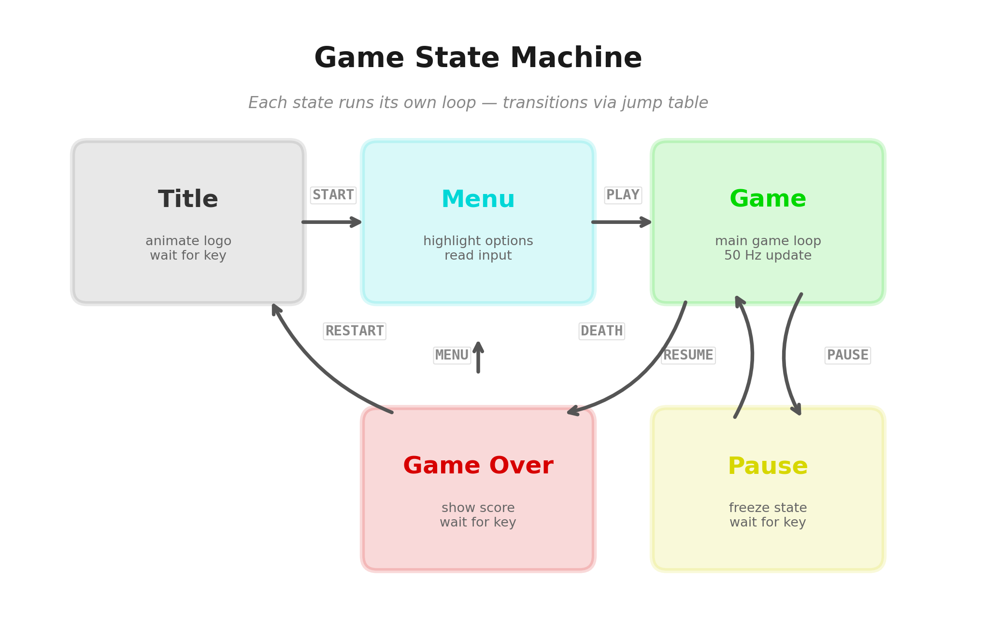

# Chapter 18: Game Loop and Entity System

> "A game is a demo that listens."

---

Every demo effect we have built so far runs in a closed loop: calculate, render, repeat. The viewer watches. The code does not care whether anyone is in the room. A game breaks this contract. A game *responds*. The player presses a key and something must change -- immediately, reliably, within the same frame budget we have been counting since Chapter 1.

This chapter is about building the architecture that makes a game possible on the ZX Spectrum and Agon Light 2. Not the rendering (Chapter 16 covered sprites, Chapter 17 covered scrolling) and not the physics (Chapter 19 will handle collisions and AI). This chapter is the skeleton: the main loop that drives everything, the state machine that organises the flow from title screen to gameplay to game over, the input system that reads the player's intentions, and the entity system that manages every object in the game world.

By the end, you will have a working game skeleton with 16 active entities -- a player, eight enemies, and seven bullets -- running within the frame budget on both platforms.

---

## 18.1 The Main Loop

Every game on the ZX Spectrum follows the same fundamental rhythm:

```text
1. HALT          -- wait for the frame interrupt
2. Read input    -- what does the player want?
3. Update state  -- move entities, run AI, check collisions
4. Render        -- draw the frame
5. Go to 1
```

This is the game loop. It is not complicated. Its power comes from the fact that it runs fifty times per second, every second, and everything the player experiences emerges from this cycle.

Here is the minimal implementation:

```z80 id:ch18_the_main_loop_2
    ORG  $8000

    ; Install IM1 interrupt handler (standard for games)
    im   1
    ei

main_loop:
    halt                    ; 4T + wait -- sync to frame interrupt

    call read_input         ; poll keyboard/joystick
    call update_entities    ; move everything, run logic
    call render_frame       ; draw to screen

    jr   main_loop          ; 12T -- loop forever
```

The `HALT` instruction is the heartbeat. When the CPU executes `HALT`, it stops and waits for the next maskable interrupt. On the Spectrum, the ULA fires this interrupt at the start of each frame -- once every 1/50th of a second. The CPU wakes up, the IM1 handler at address $0038 runs (on a stock ROM this simply increments the frame counter), and then execution resumes at the instruction after `HALT`. Your main loop code runs, does its work, and hits `HALT` again to wait for the next frame.

This gives you exactly one frame's worth of T-states to do everything. If your work finishes early, the CPU idles inside `HALT` until the next interrupt -- no wasted power, no drift, perfect sync. If your work takes too long and the interrupt fires before you reach `HALT`, you miss a frame. The loop still works (the next `HALT` will catch the following interrupt), but the game drops to 25 fps for that frame. Miss consistently and you are at 25 fps permanently. Miss badly and you are at 16.7 fps (every third frame). The player notices.

### The Frame Budget, Revisited

We established the numbers in Chapter 1, but they bear repeating in the context of a game:

| Machine | T-states per frame | Practical budget |
|---------|-------------------|------------------|
| ZX Spectrum 48K | 69,888 | ~62,000 (after interrupt overhead) |
| ZX Spectrum 128K | 70,908 | ~63,000 |
| Pentagon 128 | 71,680 | ~64,000 |
| Agon Light 2 | ~368,640 | ~360,000 |

The "practical budget" accounts for the interrupt handler, the `HALT` instruction itself, and the border timing overhead. On the Spectrum, you have roughly 64,000 T-states of usable time per frame. On the Agon, you have over five times that.

How does a typical game spend those 64,000 T-states? Here is a realistic breakdown for a Spectrum platformer:

| Subsystem | T-states | % of budget |
|-----------|----------|-------------|
| Input reading | ~500 | 0.8% |
| Entity update (16 entities) | ~8,000 | 12.5% |
| Collision detection | ~4,000 | 6.3% |
| Music player (PT3) | ~5,000 | 7.8% |
| Sprite rendering (8 visible) | ~24,000 | 37.5% |
| Background/scroll update | ~12,000 | 18.8% |
| Miscellaneous (HUD, state) | ~3,000 | 4.7% |
| **Remaining headroom** | **~7,500** | **11.7%** |

That 11.7% headroom is your safety margin. Eat into it and you start dropping frames on complex scenes. The border-colour profiling technique from Chapter 1 -- red for sprites, blue for music, green for logic -- is how you monitor this budget during development. Use it constantly.

On the Agon, the same game logic runs in a fraction of the budget. The entity update, collision detection, and input reading might consume 15,000 T-states total -- about 4% of the Agon's frame. The VDP handles sprite rendering on the ESP32 coprocessor, so CPU-side sprite cost drops to the VDU command overhead. You have enormous room for more complex AI, more entities, or simply less stress.

<!-- figure: ch18_game_loop -->


---

## 18.2 The Game State Machine

A game is not one loop -- it is several. The title screen has its own loop (animate logo, wait for keypress). The menu has its own loop (highlight options, read input). The gameplay loop is what we described above. The pause screen freezes the gameplay loop and runs a simpler one. The game-over screen has yet another.

The cleanest way to organise these is a **state machine**: a variable that tracks which state the game is in, and a table of handler addresses -- one per state.



### State Definitions

```z80 id:ch18_state_definitions
; Game states (byte values, used as table offsets)
STATE_TITLE     EQU  0
STATE_MENU      EQU  2      ; x2 because each table entry is 2 bytes
STATE_GAME      EQU  4
STATE_PAUSE     EQU  6
STATE_GAMEOVER  EQU  8

; Current state variable
game_state:     DB   STATE_TITLE
```

### The Jump Table

```z80 id:ch18_the_jump_table
; Table of handler addresses, indexed by state
state_table:
    DW   state_title        ; STATE_TITLE   = 0
    DW   state_menu         ; STATE_MENU    = 2
    DW   state_game         ; STATE_GAME    = 4
    DW   state_pause        ; STATE_PAUSE   = 6
    DW   state_gameover     ; STATE_GAMEOVER = 8
```

### The Dispatcher

The main loop becomes a dispatcher that reads the current state and jumps to the appropriate handler:

```z80 id:ch18_the_dispatcher
main_loop:
    halt                    ; sync to frame

    ; Dispatch to current state handler
    ld   a, (game_state)    ; 13T  load state index
    ld   l, a               ; 4T
    ld   h, 0               ; 7T
    ld   de, state_table    ; 10T
    add  hl, de             ; 11T  HL = state_table + offset
    ld   e, (hl)            ; 7T   low byte of handler address
    inc  hl                 ; 6T
    ld   d, (hl)            ; 7T   high byte of handler address
    ex   de, hl             ; 4T   HL = handler address
    jp   (hl)               ; 4T   jump to handler
                            ; --- 73T total dispatch overhead
```

The `JP (HL)` instruction is the key. It does not jump to the address stored *at* HL -- it jumps to the address *in* HL. This is Z80's indirect jump, and it costs only 4 T-states. The entire dispatch -- loading the state variable, computing the table offset, reading the handler address, and jumping -- takes 73 T-states. That is negligible: about 0.1% of the frame budget.

Each handler runs its own logic and then jumps back to `main_loop`:

```z80 id:ch18_the_dispatcher_2
state_title:
    call draw_title_screen
    call read_input
    ; Check for start key (SPACE or ENTER)
    ld   a, (input_flags)
    bit  BUTTON_FIRE, a
    jr   z, .no_start
    ; Transition to menu
    ld   a, STATE_MENU
    ld   (game_state), a
    call init_menu          ; set up menu screen
.no_start:
    jp   main_loop

state_game:
    call read_input
    ; Check for pause
    ld   a, (input_keys)
    bit  KEY_P, a
    jr   z, .not_paused
    ld   a, STATE_PAUSE
    ld   (game_state), a
    jp   main_loop
.not_paused:
    call update_entities
    call check_collisions
    call render_frame
    call update_music       ; AY player -- see Chapter 11
    jp   main_loop

state_pause:
    ; Game is frozen -- only check for unpause
    call read_input
    ld   a, (input_keys)
    bit  KEY_P, a
    jr   z, .still_paused
    ld   a, STATE_GAME
    ld   (game_state), a
.still_paused:
    ; Optionally blink "PAUSED" text
    call blink_pause_text
    jp   main_loop

state_gameover:
    call draw_gameover_screen
    call read_input
    ld   a, (input_flags)
    bit  BUTTON_FIRE, a
    jr   z, .wait
    ld   a, STATE_TITLE
    ld   (game_state), a
    call init_title
.wait:
    jp   main_loop
```

### Why Not a Chain of Comparisons?

You might be tempted to write the dispatcher as:

```z80 id:ch18_why_not_a_chain_of
    ld   a, (game_state)
    cp   STATE_TITLE
    jp   z, state_title
    cp   STATE_MENU
    jp   z, state_menu
    cp   STATE_GAME
    jp   z, state_game
    ; ...
```

This works, but it has two problems. First, the cost grows linearly: each additional state adds a `CP` (7T) and a `JP Z` (10T), so the worst case is 17T per state. With 5 states, the game state (the most common case) might take 51T to reach if it is the third comparison. The jump table takes 73T regardless of which state is active -- it is O(1), not O(n).

Second, and more importantly, the jump table scales cleanly. Adding a sixth state (say, STATE_SHOP) means adding one `DW` entry to the table and one constant definition. The dispatcher code does not change at all. With comparison chains, you add more instructions to the dispatcher itself, and the ordering starts to matter for performance. The table approach is both faster in the common case and cleaner to maintain.

### State Transitions

State transitions happen by writing a new value to `game_state`. Typically you also call an initialisation routine for the new state:

```z80 id:ch18_state_transitions
; Transition: Game -> Game Over
game_over_transition:
    ld   a, STATE_GAMEOVER
    ld   (game_state), a
    call init_gameover       ; set up game over screen, save score
    ret
```

Keep transitions explicit and centralised. A common bug in Z80 games is a state transition that forgets to initialise the new state's data -- the game-over screen shows garbage because nobody cleared the screen or reset the animation counter. Every state should have an `init_` routine that the transition calls.

---

## 18.3 Input: Reading the Player

### ZX Spectrum Keyboard

The Spectrum keyboard is read through port `$FE`. The keyboard is wired as a matrix of 8 half-rows, each selected by setting a bit low in the high byte of the port address. Reading port `$FE` with a specific high byte returns the state of that half-row: 5 bits, one per key, where 0 means pressed and 1 means not pressed.

The half-row map:

| High byte | Keys (bit 0 to bit 4) |
|-----------|----------------------|
| $FE (bit 0 low) | SHIFT, Z, X, C, V |
| $FD (bit 1 low) | A, S, D, F, G |
| $FB (bit 2 low) | Q, W, E, R, T |
| $F7 (bit 3 low) | 1, 2, 3, 4, 5 |
| $EF (bit 4 low) | 0, 9, 8, 7, 6 |
| $DF (bit 5 low) | P, O, I, U, Y |
| $BF (bit 6 low) | ENTER, L, K, J, H |
| $7F (bit 7 low) | SPACE, SYMSHIFT, M, N, B |

The standard game controls -- Q/A/O/P for up/down/left/right and SPACE for fire -- span three half-rows. Here is a routine that reads them and packs the result into a single byte:

```z80 id:ch18_zx_spectrum_keyboard
; Input flag bits
INPUT_RIGHT  EQU  0
INPUT_LEFT   EQU  1
INPUT_DOWN   EQU  2
INPUT_UP     EQU  3
INPUT_FIRE   EQU  4

; Read QAOP+SPACE into input_flags
; Returns: A = input_flags byte, also stored at (input_flags)
read_keyboard:
    ld   d, 0               ; 7T   accumulate result in D

    ; Read O and P: half-row $DF (P=bit0, O=bit1)
    ld   bc, $DFFE          ; 10T
    in   a, (c)             ; 12T
    bit  0, a               ; 8T   P key
    jr   nz, .no_right      ; 12/7T
    set  INPUT_RIGHT, d     ; 8T
.no_right:
    bit  1, a               ; 8T   O key
    jr   nz, .no_left       ; 12/7T
    set  INPUT_LEFT, d      ; 8T
.no_left:

    ; Read Q and A: half-rows $FB (Q=bit0) and $FD (A=bit0... wait)
    ; Q is in half-row $FB at bit 0
    ld   b, $FB             ; 7T
    in   a, (c)             ; 12T
    bit  0, a               ; 8T   Q key
    jr   nz, .no_up         ; 12/7T
    set  INPUT_UP, d        ; 8T
.no_up:

    ; A is in half-row $FD at bit 0
    ld   b, $FD             ; 7T
    in   a, (c)             ; 12T
    bit  0, a               ; 8T   A key
    jr   nz, .no_down       ; 12/7T
    set  INPUT_DOWN, d      ; 8T
.no_down:

    ; SPACE: half-row $7F at bit 0
    ld   b, $7F             ; 7T
    in   a, (c)             ; 12T
    bit  0, a               ; 8T
    jr   nz, .no_fire       ; 12/7T
    set  INPUT_FIRE, d      ; 8T
.no_fire:

    ld   a, d               ; 4T
    ld   (input_flags), a   ; 13T
    ret                     ; 10T
    ; Total: ~220T worst case (all keys pressed)
```

At roughly 220 T-states worst case, input reading is trivial in the frame budget. Even on the Spectrum you could afford to read the keyboard ten times per frame and barely notice.

### Kempston Joystick

The Kempston interface is even simpler. One port read returns all five directions plus fire:

```z80 id:ch18_kempston_joystick
; Kempston joystick port
KEMPSTON_PORT  EQU  $1F

; Read Kempston joystick
; Returns: A = joystick state
;   bit 0 = right, bit 1 = left, bit 2 = down, bit 3 = up, bit 4 = fire
read_kempston:
    in   a, (KEMPSTON_PORT)  ; 11T
    and  %00011111           ; 7T   mask to 5 bits
    ld   (input_flags), a    ; 13T
    ret                      ; 10T
    ; Total: 41T
```

Notice something convenient: the Kempston bit layout matches our `INPUT_*` flag definitions exactly. This is not a coincidence -- the Kempston interface was designed with this standard in mind, and most Spectrum games adopt the same bit ordering. If you support both keyboard and joystick, you can OR the results together:

```z80 id:ch18_kempston_joystick_2
read_input:
    call read_keyboard       ; D = keyboard flags
    push de
    call read_kempston       ; A = joystick flags
    pop  de
    or   d                   ; combine both sources
    ld   (input_flags), a
    ret
```

Now the rest of your code only checks `input_flags` and does not care whether the input came from the keyboard or a joystick.

### Edge Detection: Press vs Hold

For some actions -- firing a bullet, opening a menu -- you want to respond to the *press* event, not the held state. If you check `bit INPUT_FIRE, a` every frame, the player fires a bullet every 1/50th of a second while holding the button. That might be intentional for rapid-fire, but for a single-shot weapon or a menu selection, you need edge detection.

The technique: store the previous frame's input alongside the current frame's, and XOR them to find the bits that changed:

```z80 id:ch18_edge_detection_press_vs_hold
input_flags:      DB  0    ; current frame
input_prev:       DB  0    ; previous frame
input_pressed:    DB  0    ; newly pressed this frame (edges)

read_input_with_edges:
    ; Save previous state
    ld   a, (input_flags)
    ld   (input_prev), a

    ; Read current state
    call read_input          ; updates input_flags

    ; Compute edges: pressed = current AND NOT previous
    ld   a, (input_prev)
    cpl                      ; 4T   invert previous
    ld   b, a                ; 4T
    ld   a, (input_flags)    ; 13T
    and  b                   ; 4T   current AND NOT previous
    ld   (input_pressed), a  ; 13T  = newly pressed this frame
    ret
```

Now `input_pressed` has a 1 bit only for buttons that were *not* pressed last frame but *are* pressed this frame. Use `input_flags` for continuous actions (movement) and `input_pressed` for one-shot actions (fire, jump, menu select).

### Agon Light 2: PS/2 Keyboard via MOS

The Agon reads its PS/2 keyboard through the MOS (Machine Operating System) API. The eZ80 does not directly scan a keyboard matrix -- instead, the ESP32 VDP coprocessor handles the keyboard hardware and passes keypress events to the eZ80 via a shared buffer.

The MOS system variable `sysvar_keyascii` (at address $0800 + offset) holds the ASCII code of the most recently pressed key, or 0 if no key is down. For game controls, you typically poll this variable or use the MOS `waitvblank` / keyboard API calls:

```z80 id:ch18_agon_light_2_ps_2_keyboard
; Agon: Read keyboard via MOS sysvar
; MOS sysvar_keyascii at IX+$05
read_input_agon:
    ld   a, (ix + $05)      ; read last key from MOS sysvars
    ; Map ASCII to input_flags
    cp   'o'
    jr   nz, .not_left
    set  INPUT_LEFT, d
.not_left:
    cp   'p'
    jr   nz, .not_right
    set  INPUT_RIGHT, d
.not_right:
    ; ... etc for Q, A, SPACE
    ld   a, d
    ld   (input_flags), a
    ret
```

The Agon also supports reading individual key states via VDU commands (VDU 23,0,$01,keycode), which return whether a specific key is currently held. This is closer to the Spectrum's half-row approach and better suited for games that need simultaneous key detection. The MOS API handles the PS/2 protocol, scan code translation, and auto-repeat -- none of which you need to worry about.

---

## 18.4 The Entity Structure

A game entity is anything that moves, animates, interacts, or needs per-frame updating: the player character, enemies, bullets, explosions, floating score numbers, power-ups. On the Z80, we represent each entity as a fixed-size block of bytes in memory.

### Structure Layout

Here is the entity structure we will use throughout the game-dev chapters:

```text
Offset  Size  Name        Description
------  ----  ----------  -------------------------------------------
 +0     2     x           X position, 8.8 fixed-point (high=pixel, low=subpixel)
 +2     1     y           Y position, pixel (0-191)
 +3     1     type        Entity type (0=inactive, 1=player, 2=enemy, 3=bullet, ...)
 +4     1     state       Entity state (0=idle, 1=active, 2=dying, 3=dead, ...)
 +5     1     anim_frame  Current animation frame index
 +6     1     dx          Horizontal velocity (signed, fixed-point fractional)
 +7     1     dy          Vertical velocity (signed, fixed-point fractional)
 +8     1     health      Hit points remaining
 +9     1     flags       Bit flags (see below)
------  ----
 10 bytes total per entity
```

Flag bits in the `flags` byte:

```text id:ch18_structure_layout_2
Bit 0: ACTIVE      -- entity is alive and should be updated/rendered
Bit 1: VISIBLE     -- entity should be rendered (active but invisible = logic only)
Bit 2: COLLIDABLE  -- entity participates in collision detection
Bit 3: FACING_LEFT -- horizontal facing direction
Bit 4: INVINCIBLE  -- temporary invulnerability (player after being hit)
Bit 5: ON_GROUND   -- entity is standing on solid ground (set by physics)
Bit 6-7: reserved
```

### Why 10 Bytes?

Ten bytes is a deliberate choice. It is small enough that 16 entities occupy only 160 bytes -- trivial in memory terms. More importantly, multiplying an entity index by 10 to find its offset is straightforward on the Z80:

```z80 id:ch18_why_10_bytes
; Calculate entity address from index in A
; Input: A = entity index (0-15)
; Output: HL = address of entity structure
; Destroys: DE
get_entity_addr:
    ld   l, a               ; 4T
    ld   h, 0               ; 7T
    add  hl, hl             ; 11T  x2
    ld   d, h               ; 4T
    ld   e, l               ; 4T   DE = index x 2
    add  hl, hl             ; 11T  x4
    add  hl, hl             ; 11T  x8
    add  hl, de             ; 11T  x8 + x2 = x10
    ld   de, entity_array   ; 10T
    add  hl, de             ; 11T  HL = entity_array + index * 10
    ret                     ; 10T
    ; Total: 94T
```

The multiplication by 10 uses the standard decomposition: 10 = 8 + 2. We compute index * 2, save it, compute index * 8, and add them together. No actual multiply instruction needed -- just shifts (ADD HL,HL) and an addition.

If you chose a power-of-two size like 8 or 16 bytes per entity, the index calculation would be even simpler (three shifts for 8, four for 16). But 8 bytes is too cramped -- you would lose either velocity or health, both of which matter. And 16 bytes wastes 6 bytes per entity on padding, which adds up: 16 entities x 6 wasted bytes = 96 bytes of dead space. On the Spectrum, every byte matters. Ten bytes is the right fit for the data we actually need.

### Why 16-bit X but 8-bit Y?

The X position is 16-bit fixed-point (8.8 format): the high byte is the pixel column (0-255) and the low byte is a sub-pixel fraction for smooth movement. This is essential for horizontal scrolling games where the player moves at fractional-pixel speeds. A character moving at 1.5 pixels per frame with only integer coordinates would alternate between 1-pixel and 2-pixel steps, producing visible judder. With 8.8 fixed-point, the movement is smooth: add 0x0180 to X each frame and the pixel position advances 1, 2, 1, 2, 1, 2... in a pattern the eye perceives as a steady 1.5 pixels per frame.

The Y position is only 8 bits because the Spectrum's screen is 192 pixels tall -- a single byte covers the full range. For a game with vertical scrolling, you would promote Y to 16-bit fixed-point as well, at the cost of one extra byte per entity.

### The 8.8 Fixed-Point System

Fixed-point arithmetic was introduced in Chapter 4. Here is a quick recap of how it applies to entity movement:

```z80 id:ch18_the_8_8_fixed_point_system
; Move entity right at velocity dx
; HL points to entity X (2 bytes: low=fractional, high=pixel)
; A = dx (signed velocity, treated as fractional byte)
move_entity_x:
    ld   c, (hl)            ; 7T   load X fractional part
    inc  hl                  ; 6T
    ld   b, (hl)            ; 7T   load X pixel part
    ; BC = 16-bit fixed-point X

    ld   e, a               ; 4T   dx into E
    ; Sign-extend dx into DE
    rla                      ; 4T   carry = sign bit
    sbc  a, a               ; 4T   A = $FF if negative, $00 if positive
    ld   d, a               ; 4T   DE = signed 16-bit dx

    ex   de, hl             ; 4T
    add  hl, de             ; 11T  new_X = old_X + dx (16-bit add)
    ; HL = new X position (fractional in L, pixel in H)

    ; Store back
    ld   a, l               ; 4T
    ld   (entity_x_lo), a   ; 13T  (self-modifying, or use IX)
    ld   a, h               ; 4T
    ld   (entity_x_hi), a   ; 13T
    ret
```

The beauty of fixed-point: addition and subtraction are just regular 16-bit `ADD HL,DE` operations. No special handling, no lookup tables, no multiplication. The fractional precision happens automatically because we carry the sub-pixel bits along.

---

## 18.5 The Entity Array

Entities live in a statically allocated array. No dynamic memory allocation, no linked lists, no heap. Static arrays are the standard approach on the Z80 for good reason: they are fast, predictable, and cannot fragment.

```z80 id:ch18_the_entity_array
; Entity array: 16 entities, 10 bytes each = 160 bytes
MAX_ENTITIES    EQU  16
ENTITY_SIZE     EQU  10

entity_array:
    DS   MAX_ENTITIES * ENTITY_SIZE    ; 160 bytes, zeroed at init
```

### Entity Slot Allocation

Slot 0 is always the player. Slots 1-8 are enemies. Slots 9-15 are projectiles and effects (bullets, explosions, score popups). This fixed partitioning simplifies the code: when you need to iterate over enemies for AI, you iterate slots 1-8. When a bullet needs spawning, you search slots 9-15. The player is always at a known address.

```z80 id:ch18_entity_slot_allocation
; Fixed slot assignments
SLOT_PLAYER      EQU  0
SLOT_ENEMY_FIRST EQU  1
SLOT_ENEMY_LAST  EQU  8
SLOT_PROJ_FIRST  EQU  9
SLOT_PROJ_LAST   EQU  15
```

### Iterating Entities

The core update loop walks through every entity slot, checks the ACTIVE flag, and calls the appropriate update handler:

```z80 id:ch18_iterating_entities
; Update all active entities
; Total cost: ~2,500T for 16 entities (most inactive), up to ~8,000T (all active)
update_entities:
    ld   ix, entity_array   ; 14T  IX points to first entity
    ld   b, MAX_ENTITIES    ; 7T   loop counter

.loop:
    ; Check if entity is active
    ld   a, (ix + 9)        ; 19T  load flags byte (offset +9)
    bit  0, a               ; 8T   test ACTIVE flag
    jr   z, .skip           ; 12/7T skip if inactive

    ; Entity is active -- dispatch by type
    ld   a, (ix + 3)        ; 19T  load type byte (offset +3)
    ; Jump table dispatch based on type
    call update_by_type     ; ~200-500T depending on type

.skip:
    ; Advance IX to next entity
    ld   de, ENTITY_SIZE    ; 10T
    add  ix, de             ; 15T  IX += 10
    djnz .loop              ; 13/8T
    ret
```

This uses IX as the entity pointer, which is convenient because IX-indexed addressing lets you access any field by its offset: `(IX+0)` is X low, `(IX+2)` is Y, `(IX+3)` is type, and so on. The downside of IX is cost: every `LD A,(IX+n)` takes 19 T-states versus 7 for `LD A,(HL)`. For the entity update loop, which runs 16 times per frame, this overhead is acceptable. For the inner rendering loop where you touch entity data thousands of times per frame, you would copy the relevant fields into registers first.

### Update Dispatch by Type

Each entity type has its own update handler. We use the same jump-table technique as the game state machine:

```z80 id:ch18_update_dispatch_by_type
; Entity type constants
TYPE_INACTIVE  EQU  0
TYPE_PLAYER    EQU  1
TYPE_ENEMY     EQU  2
TYPE_BULLET    EQU  3
TYPE_EXPLOSION EQU  4

; Handler table (2 bytes per entry)
type_handlers:
    DW   update_inactive     ; type 0: no-op, should not be called
    DW   update_player       ; type 1
    DW   update_enemy        ; type 2
    DW   update_bullet       ; type 3
    DW   update_explosion    ; type 4

; Dispatch to type handler
; Input: A = entity type, IX = entity pointer
update_by_type:
    add  a, a               ; 4T   type * 2 (table entries are 2 bytes)
    ld   l, a               ; 4T
    ld   h, 0               ; 7T
    ld   de, type_handlers   ; 10T
    add  hl, de             ; 11T
    ld   e, (hl)            ; 7T
    inc  hl                 ; 6T
    ld   d, (hl)            ; 7T
    ex   de, hl             ; 4T
    jp   (hl)               ; 4T   jump to handler (RET will return to caller)
                            ; --- 64T dispatch overhead
```

Each handler receives IX pointing to the entity and can access all fields via indexed addressing. When the handler executes `RET`, it returns to the entity update loop, which advances to the next slot.

### The Player Update Handler

Here is a typical player update -- read input flags, apply movement, update animation:

```z80 id:ch18_the_player_update_handler
; Update player entity
; IX = entity pointer (slot 0)
update_player:
    ; Read horizontal input
    ld   a, (input_flags)    ; 13T
    bit  INPUT_RIGHT, a      ; 8T
    jr   z, .not_right       ; 12/7T
    ; Move right: add dx to X
    ld   a, 2               ; 7T   dx = 2 subpixels per frame (~1 pixel/frame)
    add  a, (ix + 0)        ; 19T  add to X fractional
    ld   (ix + 0), a        ; 19T
    jr   nc, .no_carry_r    ; 12/7T
    inc  (ix + 1)           ; 23T  carry into X pixel
.no_carry_r:
    res  3, (ix + 9)        ; 23T  clear FACING_LEFT flag
    jr   .horiz_done        ; 12T
.not_right:
    bit  INPUT_LEFT, a       ; 8T
    jr   z, .horiz_done      ; 12/7T
    ; Move left: subtract dx from X
    ld   a, (ix + 0)        ; 19T  load X fractional
    sub  2                   ; 7T   subtract dx
    ld   (ix + 0), a        ; 19T
    jr   nc, .no_borrow_l   ; 12/7T
    dec  (ix + 1)           ; 23T  borrow from X pixel
.no_borrow_l:
    set  3, (ix + 9)        ; 23T  set FACING_LEFT flag
.horiz_done:

    ; Update animation frame (cycle every 8 frames)
    ld   a, (ix + 5)        ; 19T  anim_frame
    inc  a                   ; 4T
    and  7                   ; 7T   wrap 0-7
    ld   (ix + 5), a        ; 19T
    ret
    ; Total: ~250-350T depending on input
```

This is deliberately simple. Chapter 19 will add gravity, jumping, and collision response. For now, the point is the *structure*: entity pointer in IX, fields accessed by offset, input flags driving state changes, animation counter ticking.

---

## 18.6 The Object Pool

Bullets, explosions, and particle effects are transient. A bullet exists for a fraction of a second before it hits something or leaves the screen. An explosion animates for 8-16 frames and vanishes. You could spawn these dynamically, but on the Z80, "dynamic" means searching for free memory, managing allocation, and risking fragmentation. Instead, we use an **object pool**: a fixed set of slots that entities are activated into and deactivated from.

We already have the pool -- it is the entity array. Slots 9-15 are the projectile/effect pool. Spawning a bullet means finding an inactive slot in that range and filling it in. Destroying a bullet means clearing its ACTIVE flag.

### Spawning a Bullet

```z80 id:ch18_spawning_a_bullet
; Spawn a bullet at position (B=x_pixel, C=y)
; moving in direction determined by player facing
; Returns: carry set if no free slot available
spawn_bullet:
    ld   ix, entity_array + (SLOT_PROJ_FIRST * ENTITY_SIZE)
    ld   d, SLOT_PROJ_LAST - SLOT_PROJ_FIRST + 1  ; 7 slots to check

.find_slot:
    ld   a, (ix + 9)        ; 19T  flags
    bit  0, a               ; 8T   ACTIVE?
    jr   z, .found          ; 12/7T found an inactive slot

    push de                 ; 11T  save loop counter (D)
    ld   de, ENTITY_SIZE    ; 10T  DE = 10 (D=0, E=10)
    add  ix, de             ; 15T  next slot
    pop  de                 ; 10T  restore loop counter
    dec  d                  ; 4T
    jr   nz, .find_slot     ; 12T

    ; No free slot -- set carry and return
    scf                      ; 4T
    ret

.found:
    ; Fill in the bullet entity
    ld   (ix + 0), 0        ; fractional X = 0
    ld   (ix + 1), b        ; pixel X = B
    ld   (ix + 2), c        ; Y = C
    ld   (ix + 3), TYPE_BULLET ; type
    ld   (ix + 4), 1        ; state = active
    ld   (ix + 5), 0        ; anim_frame = 0
    ld   (ix + 8), 1        ; health = 1 (dies on first collision)

    ; Set velocity based on player facing
    ld   a, (entity_array + 9)  ; player flags
    bit  3, a               ; FACING_LEFT?
    jr   z, .fire_right
    ld   (ix + 6), -4       ; dx = -4 (fast, leftward)
    jr   .set_flags
.fire_right:
    ld   (ix + 6), 4        ; dx = +4 (fast, rightward)
.set_flags:
    ld   (ix + 7), 0        ; dy = 0 (horizontal bullet)
    ld   (ix + 9), %00000111  ; flags: ACTIVE + VISIBLE + COLLIDABLE
    or   a                   ; clear carry (success)
    ret
```

### Deactivating an Entity

When a bullet leaves the screen or an explosion finishes its animation, deactivation is a single instruction:

```z80 id:ch18_deactivating_an_entity
; Deactivate entity at IX
deactivate_entity:
    ld   (ix + 9), 0        ; 19T  clear all flags (ACTIVE=0)
    ret
```

That is it. Next frame, the update loop sees ACTIVE=0 and skips the slot. The slot is now available for the next `spawn_bullet` call to reuse.

### Bullet Update Handler

```z80 id:ch18_bullet_update_handler
; Update a bullet entity
; IX = entity pointer
update_bullet:
    ; Move horizontally
    ld   a, (ix + 6)        ; 19T  dx
    ld   e, a               ; 4T
    ; Sign-extend
    rla                      ; 4T
    sbc  a, a               ; 4T
    ld   d, a               ; 4T   DE = signed 16-bit dx

    ld   l, (ix + 0)        ; 19T  X lo
    ld   h, (ix + 1)        ; 19T  X hi
    add  hl, de             ; 11T  new X
    ld   (ix + 0), l        ; 19T
    ld   (ix + 1), h        ; 19T

    ; Check screen bounds (0-255 pixel range)
    ld   a, h               ; 4T   pixel X
    or   a                   ; 4T
    jr   z, .off_screen     ; boundary check: if X=0, leftward bullet exited
    cp   248                ; 7T   near right edge?
    jr   nc, .off_screen    ; past right boundary

    ; Still alive -- return
    ret

.off_screen:
    ; Deactivate
    ld   (ix + 9), 0        ; clear flags
    ret
    ; Total: ~170T active, ~190T when deactivating
```

### Pool Sizing

Seven projectile slots (indices 9-15) might sound limited. In practice, it is more than enough for most Spectrum games. Consider: a bullet that crosses the full screen width (256 pixels) at 4 pixels per frame takes 64 frames -- over a second. If the player fires once every 8 frames (a rapid fire rate), at most 8 bullets can exist simultaneously. Seven slots with occasional spawn failures (the bullet simply does not fire that frame) feels natural, not buggy. The player is unlikely to notice a missed bullet at the edge of their fire rate.

If you need more, expand the entity array. But be aware of the cost: each additional entity adds ~160 T-states to the worst-case update loop (when active) and ~50 T-states even when inactive (the ACTIVE flag check and the IX advance still run). Thirty-two entities with all active would consume roughly 16,000 T-states in the update loop alone -- a quarter of the frame budget before you have rendered a single pixel.

On the Agon, you can afford larger pools. With 360,000 T-states per frame and hardware sprite rendering, 64 or even 128 entities are feasible.

---

## 18.7 Explosion and Effect Entities

Explosions, score popups, and particle effects use the same entity slots as bullets. The difference is in their update handlers: they animate through a sequence of frames and then self-destruct.

```z80 id:ch18_explosion_and_effect_entities
; Update an explosion entity
; IX = entity pointer
update_explosion:
    ; Advance animation frame
    ld   a, (ix + 5)        ; 19T  anim_frame
    inc  a                   ; 4T
    cp   8                   ; 7T   8 frames of animation
    jr   nc, .done          ; 12/7T animation complete

    ld   (ix + 5), a        ; 19T  store new frame
    ret

.done:
    ; Animation complete -- deactivate
    ld   (ix + 9), 0        ; 19T  clear flags
    ret
```

To spawn an explosion when an enemy dies:

```z80 id:ch18_explosion_and_effect_entities_2
; Spawn explosion at the enemy's position
; IX currently points to the dying enemy
spawn_explosion_at_entity:
    ld   b, (ix + 1)        ; enemy's X pixel
    ld   c, (ix + 2)        ; enemy's Y

    ; Find a free projectile/effect slot
    push ix
    ld   ix, entity_array + (SLOT_PROJ_FIRST * ENTITY_SIZE)
    ld   d, SLOT_PROJ_LAST - SLOT_PROJ_FIRST + 1

.find:
    ld   a, (ix + 9)
    bit  0, a
    jr   z, .got_slot
    ld   e, ENTITY_SIZE
    add  ix, de
    dec  d
    jr   nz, .find
    pop  ix
    ret                      ; no free slot -- skip explosion

.got_slot:
    ld   (ix + 0), 0        ; X fractional
    ld   (ix + 1), b        ; X pixel
    ld   (ix + 2), c        ; Y
    ld   (ix + 3), TYPE_EXPLOSION
    ld   (ix + 4), 1        ; state = active
    ld   (ix + 5), 0        ; anim_frame = 0
    ld   (ix + 6), 0        ; dx = 0 (stationary)
    ld   (ix + 7), 0        ; dy = 0
    ld   (ix + 8), 0        ; health = 0 (not collidable in a meaningful way)
    ld   (ix + 9), %00000011 ; ACTIVE + VISIBLE, not COLLIDABLE
    pop  ix
    ret
```

The pattern is always the same: find a free slot, fill in the structure, set the flags. The update handler does type-specific work. The deactivation clears the flags. The slot is reused next time something needs to spawn. This is the entire dynamic object lifecycle on the Z80 -- no allocator, no garbage collector, no free list. Just an array and a flag.

---

## 18.8 Putting It All Together: The Game Skeleton

Here is the complete game skeleton that ties everything together. This is a compilable framework with all the pieces wired up: state machine, input, entity system, and the main loop.

```z80 id:ch18_putting_it_all_together_the
    ORG  $8000

; ============================================================
; Constants
; ============================================================
MAX_ENTITIES    EQU  16
ENTITY_SIZE     EQU  10

STATE_TITLE     EQU  0
STATE_MENU      EQU  2
STATE_GAME      EQU  4
STATE_PAUSE     EQU  6
STATE_GAMEOVER  EQU  8

TYPE_INACTIVE   EQU  0
TYPE_PLAYER     EQU  1
TYPE_ENEMY      EQU  2
TYPE_BULLET     EQU  3
TYPE_EXPLOSION  EQU  4

INPUT_RIGHT     EQU  0
INPUT_LEFT      EQU  1
INPUT_DOWN      EQU  2
INPUT_UP        EQU  3
INPUT_FIRE      EQU  4

FLAG_ACTIVE     EQU  0
FLAG_VISIBLE    EQU  1
FLAG_COLLIDABLE EQU  2
FLAG_FACING_L   EQU  3

; ============================================================
; Entry point
; ============================================================
entry:
    di
    ld   sp, $C000          ; set stack (below banked memory on 128K)
                            ; NOTE: $FFFF is in banked page on 128K Spectrum,
                            ; which causes stack corruption during bank switches.
                            ; Use $C000 (or $BFFF) for 128K compatibility.
    im   1
    ei

    ; Clear entity array
    ld   hl, entity_array
    ld   de, entity_array + 1
    ld   bc, MAX_ENTITIES * ENTITY_SIZE - 1
    ld   (hl), 0
    ldir

    ; Start in title state
    ld   a, STATE_TITLE
    ld   (game_state), a

; ============================================================
; Main loop with state dispatch
; ============================================================
main_loop:
    halt                     ; sync to frame interrupt

    ; --- Border profiling: red = active processing ---
    ld   a, 2
    out  ($FE), a

    ; Dispatch to current state
    ld   a, (game_state)
    ld   l, a
    ld   h, 0
    ld   de, state_table
    add  hl, de
    ld   e, (hl)
    inc  hl
    ld   d, (hl)
    ex   de, hl
    jp   (hl)

; Called by each state handler when done
return_to_loop:
    ; --- Border black: idle ---
    xor  a
    out  ($FE), a
    jr   main_loop

; ============================================================
; State table
; ============================================================
state_table:
    DW   state_title
    DW   state_menu
    DW   state_game
    DW   state_pause
    DW   state_gameover

; ============================================================
; State: Title screen
; ============================================================
state_title:
    call read_input_with_edges
    ld   a, (input_pressed)
    bit  INPUT_FIRE, a
    jr   z, .wait
    ; Transition to game
    ld   a, STATE_GAME
    ld   (game_state), a
    call init_game
.wait:
    jp   return_to_loop

; ============================================================
; State: Game
; ============================================================
state_game:
    call read_input_with_edges

    ; Check pause
    ; (using 'P' key -- half-row $DF, bit 0 is P, but for simplicity
    ;  we check input_pressed bit 4 / FIRE as a toggle here)

    ; Update all entities
    call update_entities

    ; Render all visible entities
    call render_entities

    ; Update music
    ; call music_play         ; PT3 player -- see Chapter 11

    jp   return_to_loop

; ============================================================
; State: Pause (minimal)
; ============================================================
state_pause:
    call read_input_with_edges
    ld   a, (input_pressed)
    bit  INPUT_FIRE, a
    jr   z, .still_paused
    ld   a, STATE_GAME
    ld   (game_state), a
.still_paused:
    jp   return_to_loop

; ============================================================
; State: Game Over (minimal)
; ============================================================
state_gameover:
    call read_input_with_edges
    ld   a, (input_pressed)
    bit  INPUT_FIRE, a
    jr   z, .wait
    ld   a, STATE_TITLE
    ld   (game_state), a
.wait:
    jp   return_to_loop

; ============================================================
; State: Menu (minimal — expand for your game)
; ============================================================
state_menu:
    ; A full menu would display options and handle UP/DOWN/FIRE.
    ; For this skeleton, the menu simply transitions to the title.
    ; See Exercise 2 below for adding a real menu with item selection.
    jp   state_title

; ============================================================
; Init game: set up player and enemies
; ============================================================
init_game:
    ; Clear entity array
    ld   hl, entity_array
    ld   de, entity_array + 1
    ld   bc, MAX_ENTITIES * ENTITY_SIZE - 1
    ld   (hl), 0
    ldir

    ; Set up player (slot 0)
    ld   ix, entity_array
    ld   (ix + 0), 0        ; X fractional = 0
    ld   (ix + 1), 128      ; X pixel = 128 (centre)
    ld   (ix + 2), 160      ; Y = 160 (near bottom)
    ld   (ix + 3), TYPE_PLAYER
    ld   (ix + 4), 1        ; state = active
    ld   (ix + 5), 0        ; anim_frame
    ld   (ix + 6), 0        ; dx
    ld   (ix + 7), 0        ; dy
    ld   (ix + 8), 3        ; health = 3
    ld   (ix + 9), %00000111 ; ACTIVE + VISIBLE + COLLIDABLE

    ; Set up 8 enemies (slots 1-8) in a formation
    ld   ix, entity_array + ENTITY_SIZE   ; slot 1
    ld   b, 8               ; 8 enemies
    ld   c, 24              ; starting X pixel

.enemy_loop:
    ld   (ix + 0), 0        ; X fractional
    ld   (ix + 1), c        ; X pixel
    ld   (ix + 2), 32       ; Y = 32 (near top)
    ld   (ix + 3), TYPE_ENEMY
    ld   (ix + 4), 1        ; state = active
    ld   (ix + 5), 0        ; anim_frame
    ld   (ix + 6), 1        ; dx = 1 (moving right slowly)
    ld   (ix + 7), 0        ; dy = 0
    ld   (ix + 8), 1        ; health = 1
    ld   (ix + 9), %00000111 ; ACTIVE + VISIBLE + COLLIDABLE

    ; Advance to next slot and X position
    ld   de, ENTITY_SIZE
    add  ix, de
    ld   a, c
    add  a, 28              ; 28 pixels apart
    ld   c, a
    djnz .enemy_loop

    ret

; ============================================================
; Input system
; ============================================================
input_flags:      DB  0
input_prev:       DB  0
input_pressed:    DB  0

read_input_with_edges:
    ; Save previous
    ld   a, (input_flags)
    ld   (input_prev), a

    ; Read keyboard (QAOP + SPACE)
    ld   d, 0

    ; P key: half-row $DF, bit 0
    ld   bc, $DFFE
    in   a, (c)
    bit  0, a
    jr   nz, .no_right
    set  INPUT_RIGHT, d
.no_right:
    ; O key: half-row $DF, bit 1
    bit  1, a
    jr   nz, .no_left
    set  INPUT_LEFT, d
.no_left:

    ; Q key: half-row $FB, bit 0
    ld   b, $FB
    in   a, (c)
    bit  0, a
    jr   nz, .no_up
    set  INPUT_UP, d
.no_up:

    ; A key: half-row $FD, bit 0
    ld   b, $FD
    in   a, (c)
    bit  0, a
    jr   nz, .no_down
    set  INPUT_DOWN, d
.no_down:

    ; SPACE: half-row $7F, bit 0
    ld   b, $7F
    in   a, (c)
    bit  0, a
    jr   nz, .no_fire
    set  INPUT_FIRE, d
.no_fire:

    ld   a, d
    ld   (input_flags), a

    ; Compute edges
    ld   a, (input_prev)
    cpl
    ld   b, a
    ld   a, (input_flags)
    and  b
    ld   (input_pressed), a
    ret

; ============================================================
; Entity update loop
; ============================================================
update_entities:
    ld   ix, entity_array
    ld   b, MAX_ENTITIES

.loop:
    push bc
    ld   a, (ix + 9)        ; flags
    bit  FLAG_ACTIVE, a
    jr   z, .skip

    ld   a, (ix + 3)        ; type
    call update_by_type

.skip:
    ld   de, ENTITY_SIZE
    add  ix, de
    pop  bc
    djnz .loop
    ret

; ============================================================
; Type dispatch
; ============================================================
type_handlers:
    DW   .nop_handler       ; TYPE_INACTIVE
    DW   update_player
    DW   update_enemy
    DW   update_bullet
    DW   update_explosion

update_by_type:
    add  a, a
    ld   l, a
    ld   h, 0
    ld   de, type_handlers
    add  hl, de
    ld   e, (hl)
    inc  hl
    ld   d, (hl)
    ex   de, hl
    jp   (hl)

.nop_handler:
    ret

; ============================================================
; Player update
; ============================================================
update_player:
    ld   a, (input_flags)
    bit  INPUT_RIGHT, a
    jr   z, .not_right
    ld   a, (ix + 0)
    add  a, 2               ; move right (subpixel)
    ld   (ix + 0), a
    jr   nc, .x_done_r
    inc  (ix + 1)
.x_done_r:
    res  FLAG_FACING_L, (ix + 9)
    jr   .horiz_done
.not_right:
    bit  INPUT_LEFT, a
    jr   z, .horiz_done
    ld   a, (ix + 0)
    sub  2                   ; move left (subpixel)
    ld   (ix + 0), a
    jr   nc, .x_done_l
    dec  (ix + 1)
.x_done_l:
    set  FLAG_FACING_L, (ix + 9)
.horiz_done:

    ; Fire bullet on press (edge-detected)
    ld   a, (input_pressed)
    bit  INPUT_FIRE, a
    jr   z, .no_fire
    ld   b, (ix + 1)        ; player X pixel
    ld   c, (ix + 2)        ; player Y
    call spawn_bullet
.no_fire:

    ; Animate
    ld   a, (ix + 5)
    inc  a
    and  7
    ld   (ix + 5), a
    ret

; ============================================================
; Enemy update (simple patrol)
; ============================================================
update_enemy:
    ; Move by dx
    ld   a, (ix + 6)        ; dx
    add  a, (ix + 1)        ; add to X pixel
    ld   (ix + 1), a

    ; Bounce at screen edges
    cp   240
    jr   c, .no_bounce_r
    ld   (ix + 6), -1       ; reverse direction
    jr   .bounce_done
.no_bounce_r:
    cp   8
    jr   nc, .bounce_done
    ld   (ix + 6), 1        ; reverse direction
.bounce_done:

    ; Animate
    ld   a, (ix + 5)
    inc  a
    and  3                   ; 4-frame animation cycle
    ld   (ix + 5), a
    ret

; ============================================================
; Bullet update
; ============================================================
update_bullet:
    ld   a, (ix + 6)        ; dx
    add  a, (ix + 1)        ; add to X pixel (simplified: integer movement)
    ld   (ix + 1), a

    ; Off screen?
    cp   248
    jr   nc, .deactivate
    or   a
    jr   z, .deactivate
    ret

.deactivate:
    ld   (ix + 9), 0        ; clear all flags
    ret

; ============================================================
; Explosion update
; ============================================================
update_explosion:
    ld   a, (ix + 5)        ; anim_frame
    inc  a
    cp   8                   ; 8 frames
    jr   nc, .done
    ld   (ix + 5), a
    ret
.done:
    ld   (ix + 9), 0
    ret

; ============================================================
; Spawn bullet
; ============================================================
spawn_bullet:
    ; B = x pixel, C = y
    push ix
    ld   ix, entity_array + (9 * ENTITY_SIZE)   ; first projectile slot
    ld   d, 7               ; 7 slots to search

.find:
    ld   a, (ix + 9)
    bit  FLAG_ACTIVE, a
    jr   z, .found
    push de                  ; save loop counter in D
    ld   de, ENTITY_SIZE     ; DE = 10 (D=0, E=10)
    add  ix, de
    pop  de                  ; restore loop counter
    dec  d
    jr   nz, .find
    ; No free slot
    pop  ix
    scf
    ret

.found:
    ld   (ix + 0), 0
    ld   (ix + 1), b
    ld   (ix + 2), c
    ld   (ix + 3), TYPE_BULLET
    ld   (ix + 4), 1
    ld   (ix + 5), 0
    ld   (ix + 7), 0        ; dy = 0

    ; Direction from player facing
    ld   a, (entity_array + 9)   ; player flags
    bit  FLAG_FACING_L, a
    jr   z, .right
    ld   (ix + 6), -4       ; dx = -4
    jr   .dir_done
.right:
    ld   (ix + 6), 4        ; dx = +4
.dir_done:
    ld   (ix + 8), 1        ; health = 1
    ld   (ix + 9), %00000111 ; ACTIVE + VISIBLE + COLLIDABLE

    pop  ix
    or   a                   ; clear carry
    ret

; ============================================================
; Render entities (stub -- see Chapter 16 for sprite rendering)
; ============================================================
render_entities:
    ; In a real game, this iterates visible entities and draws sprites.
    ; See Chapter 16 for OR+AND masked sprites, pre-shifted sprites,
    ; and the dirty-rectangle system.
    ; For this skeleton, we use a minimal attribute-block renderer.
    ld   ix, entity_array
    ld   b, MAX_ENTITIES

.loop:
    push bc
    ld   a, (ix + 9)
    bit  FLAG_VISIBLE, a
    jr   z, .skip

    ; Draw a 1-character coloured block at entity position.
    ; For real sprite rendering, see Chapter 16 (OR+AND masks,
    ; pre-shifted sprites, compiled sprites, dirty rectangles).
    ld   a, (ix + 1)        ; X pixel
    rrca                     ; /2
    rrca                     ; /4
    rrca                     ; /8 = character column
    and  $1F                 ; mask to 0-31
    ld   e, a
    ld   a, (ix + 2)        ; Y pixel
    rrca
    rrca
    rrca
    and  $1F                 ; character row (0-23)
    ; Compute attribute address: $5800 + row*32 + col
    ld   l, a
    ld   h, 0
    add  hl, hl             ; row * 2
    add  hl, hl             ; row * 4
    add  hl, hl             ; row * 8
    add  hl, hl             ; row * 16
    add  hl, hl             ; row * 32
    ld   d, 0
    add  hl, de             ; + column
    ld   de, $5800
    add  hl, de             ; HL = attribute address

    ; Colour by type
    ld   a, (ix + 3)        ; type
    add  a, a               ; type * 2 (crude colour mapping)
    or   %01000000           ; BRIGHT bit
    ld   (hl), a            ; write attribute

.skip:
    ld   de, ENTITY_SIZE
    add  ix, de
    pop  bc
    djnz .loop
    ret

; ============================================================
; Data
; ============================================================
game_state:     DB   STATE_TITLE

entity_array:
    DS   MAX_ENTITIES * ENTITY_SIZE, 0
```

This skeleton compiles, runs, and does something visible: coloured blocks move across the attribute grid. The player block responds to QAOP controls. Pressing SPACE spawns bullets that fly across the screen. Enemies bounce between the screen edges. When a bullet exits the screen, its slot frees up for the next shot.

It is ugly -- attribute blocks instead of sprites, no scrolling, no sound. But the architecture is complete. Every piece from this chapter is present and wired together: the HALT-driven main loop, the state machine dispatch, the input reader with edge detection, the entity array with per-type update handlers, and the object pool for projectiles. Chapters 16 and 17 provide the rendering. Chapter 19 provides the physics and collisions. Chapter 11 provides the music. This skeleton is where they all plug in.

---

## 18.9 Agon Light 2: The Same Architecture, More Room

The Agon Light 2 uses the same fundamental game loop structure. The eZ80 runs Z80 code natively (in Z80-compatible mode or ADL mode), so the HALT-based main loop, the state machine, the entity system, and the input logic all translate directly.

The key differences:

**Frame sync.** The Agon uses MOS's `waitvblank` call (RST $08, function $1E) instead of `HALT` for frame synchronisation. The VDP generates the vertical blank signal and the MOS API exposes it.

**Input.** Keyboard reading goes through MOS system variables rather than direct port I/O. The half-row matrix does not exist -- the PS/2 keyboard is handled by the ESP32 VDP. The input abstraction layer we built (everything funnels into `input_flags`) means the rest of the game code does not care about the difference.

**Entity budget.** With ~360,000 T-states per frame and hardware sprite rendering, the entity update loop is no longer a bottleneck. You could update 64 entities with complex AI and still use under 10% of the frame budget. The limiting factor on the Agon is VDP sprite count per scanline (typically 16-32 hardware sprites visible on the same line) rather than CPU time.

**Rendering.** The Agon's VDP handles sprite rendering. Instead of manually blitting pixels into screen memory (Chapter 16's six methods), you issue VDU commands to position hardware sprites. The CPU cost per sprite drops from ~1,200 T-states (OR+AND blit on Spectrum) to ~50-100 T-states (sending a VDU position command). This frees enormous CPU time for game logic.

**Memory.** The Agon has 512KB of flat memory -- no banking, no contended regions. Your entity array, lookup tables, sprite data, level maps, and music can all coexist without the bank-switching gymnastics that Chapter 15 describes for the Spectrum 128K.

The practical takeaway: on the Agon, this chapter's architecture scales effortlessly. More entities, more complex state machines, more AI logic -- none of it threatens the frame budget. The discipline of counting every T-state still matters (it is good engineering), but the constraints that force agonising trade-offs on the Spectrum simply do not apply.

---

## 18.10 Design Decisions and Trade-Offs

### Fixed vs Variable Frame Rate

This chapter's main loop assumes a fixed 50 fps frame rate: do everything in one frame, or drop. The alternative is a variable time step: measure how long the frame took and scale all movement by delta-time. Variable time steps are standard in modern game engines but add complexity on the Z80 -- you need a frame timer, multiplication by delta in every movement calculation, and careful handling of physics stability at variable rates.

For Spectrum games, fixed 50 fps is almost universally the right choice. The hardware is deterministic, the frame budget is predictable, and the simplicity of fixed-step physics (everything moves by constant amounts each frame) eliminates an entire category of bugs. If your game drops below 50 fps, the answer is to optimise until it does not -- not to add a variable time step.

On the Agon, with its larger budget, you are even less likely to need variable timing. Fix the frame rate at 50 or 60 fps and keep life simple.

### Entity Size: Lean vs Generous

Our 10-byte entity structure is lean. Some commercial Spectrum games used 16 or even 32 bytes per entity, storing additional fields like previous position (for dirty-rectangle erasure), sprite address, collision box dimensions, AI timer, and more.

The trade-off is iteration speed versus field access. Our 16-entity array takes 160 bytes and the full update loop runs in ~8,000 T-states. A 32-byte structure with 16 entities takes 512 bytes (still small) but the iteration overhead grows because IX advances by 32 each step, and indexed accesses to fields at high offsets like `(IX+28)` take the same 19 T-states but are harder to keep track of.

If you need more per-entity data, consider splitting the structure: a compact "hot" array (position, type, flags -- the fields touched every frame) and a parallel "cold" array (sprite address, AI state, score value -- fields accessed only when needed). This is the same structure-of-arrays versus array-of-structures trade-off that modern game engines face, applied at the Z80 scale.

### When to Use HL Instead of IX

IX-indexed addressing is convenient but expensive: 19 T-states per access versus 7 for `(HL)`. In the update loop (called 16 times per frame), the IX overhead is acceptable -- 16 x 12 extra T-states per access = 192 T-states, negligible.

But in the rendering loop, where you might touch 4-6 entity fields for each of 8 visible sprites, the cost adds up. The technique: at the start of the render pass for each entity, copy the fields you need into registers:

```z80 id:ch18_when_to_use_hl_instead_of_ix
    ; Copy entity fields to registers for fast rendering
    ld   l, (ix + 0)        ; 19T  X lo
    ld   h, (ix + 1)        ; 19T  X hi
    ld   c, (ix + 2)        ; 19T  Y
    ld   a, (ix + 5)        ; 19T  anim_frame
    ; Now render using H (X pixel), C (Y), A (frame)
    ; All subsequent accesses are register-to-register: 4T each
```

Four IX accesses at 19T = 76T up front, then the entire render routine uses 4T register accesses instead of 19T IX accesses. If the render routine touches those fields 10 times, you save (19-4) x 10 - 76 = 74 T-states per entity. Small, but over 8 entities per frame, that is 592 T-states -- enough to draw another half-sprite.

---

## Summary

- The **game loop** is `HALT -> Input -> Update -> Render -> repeat`. The `HALT` instruction synchronises to the frame interrupt, giving you exactly one frame's worth of T-states (roughly 64,000 on a Pentagon, 360,000 on the Agon).

- A **state machine** with a jump table of handler pointers (`DW state_title`, `DW state_game`, etc.) organises the flow from title screen through gameplay to game over. Dispatch costs 73 T-states regardless of state count -- constant time, clean scaling.

- **Input reading** on the Spectrum uses `IN A,(C)` to poll keyboard half-rows through port `$FE`. Five keys (QAOP + SPACE) cost roughly 220 T-states to read. The Kempston joystick is a single 11T port read. Edge detection (press vs hold) uses XOR between current and previous frames.

- The **entity structure** is 10 bytes: X (16-bit fixed-point), Y, type, state, anim_frame, dx, dy, health, flags. Sixteen entities occupy 160 bytes. Multiplication by 10 for index-to-address conversion uses the decomposition 10 = 8 + 2.

- The **entity array** is statically allocated with fixed slot assignments: slot 0 for the player, slots 1-8 for enemies, slots 9-15 for projectiles and effects. Iteration checks the ACTIVE flag and dispatches to per-type handlers via a second jump table.

- The **object pool** is the entity array itself. Spawning sets fields and the ACTIVE flag. Deactivation clears the flags. Free-slot search is a linear scan of the relevant slot range. Seven projectile slots handle typical fire rates without the player noticing missed spawns.

- **IX-indexed addressing** is convenient for entity field access (19T per access) but expensive in inner loops. Copy fields to registers at the start of rendering for 4T access throughout.

- The Agon Light 2 uses the same architecture with more headroom. MOS `waitvblank` replaces `HALT`, PS/2 keyboard replaces half-row scanning, hardware sprites replace CPU blitting. The entity update loop is no longer the bottleneck.

- The practical skeleton in this chapter runs a state machine, 16 entities (1 player + 8 enemies + 7 bullet/effect slots), input with edge detection, per-type update handlers, and a minimal attribute-block renderer. It is the chassis that Chapters 16 (sprites), 17 (scrolling), 19 (collisions), and 11 (sound) plug into.

---

## Try It Yourself

1. **Build the skeleton.** Compile the game skeleton from section 18.8 and run it in an emulator. Use QAOP to move the player block and SPACE to fire. Watch the coloured blocks move. Add border-colour profiling (Chapter 1) to see how much frame budget is used.

2. **Add a sixth state.** Implement STATE_SHOP between Menu and Game. The shop screen should display three items and let the player choose one with UP/DOWN and FIRE. This exercises the state machine -- add the constant, the table entry, the handler, and the transition logic.

3. **Expand the entity count.** Increase MAX_ENTITIES to 32, add 16 more enemies, and measure the frame budget impact with border profiling. At what entity count does the update loop start threatening 50 fps?

4. **Implement Kempston support.** Add the Kempston joystick reader and combine it with keyboard input using OR. Test in an emulator that supports Kempston emulation (Fuse: Options -> Joysticks -> Kempston).

5. **Split hot and cold data.** Create a second "cold" array with 4 bytes per entity (sprite address, AI timer, AI state, score value). Modify the update loop to access cold data only when the entity type requires it (enemies for AI, not bullets). Measure the T-state savings.

---

*Next: Chapter 19 -- Collisions, Physics, and Enemy AI. We will add AABB collision detection, gravity, jumping, and four enemy behaviour patterns to the skeleton from this chapter.*

---

> **Sources:** ZX Spectrum keyboard matrix and port layout from Sinclair Research technical documentation; Kempston joystick interface specification; fixed-point arithmetic techniques from Chapter 4 (Dark/X-Trade, Spectrum Expert #01, 1997); border-colour profiling from Chapter 1; sprite rendering methods referenced from Chapter 16; AY music integration referenced from Chapter 11; Agon Light 2 MOS API documentation (Bernardo Kastrup, agon-light.com)
