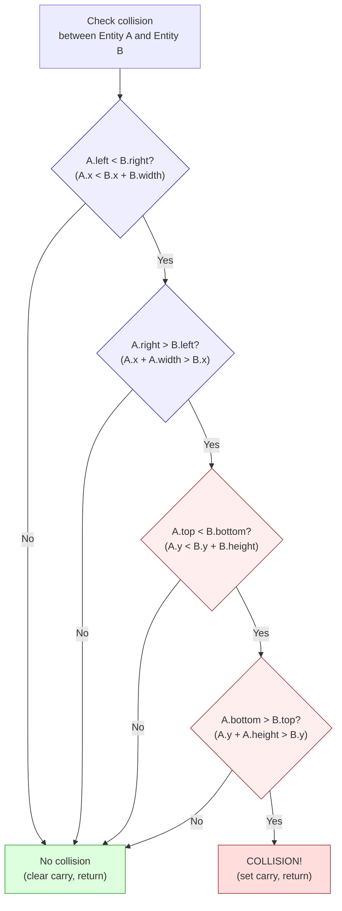
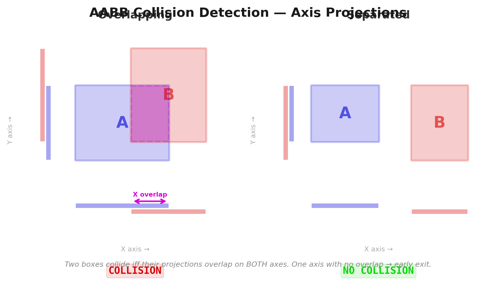

# Chapter 19: Collisions, Physics, and Enemy AI

> "Every game is a lie. Physics is faked. Intelligence is a table lookup. The player never notices because the lies are told at 50 frames per second."

In Chapter 18, we built a game loop, an entity system that tracks sixteen objects, and an input handler. But right now our player walks through walls, floats above the ground, and the enemies stand still. A game with no collisions is a screensaver. A game with no physics is a slide puzzle. A game with no AI is a sandbox with nothing to push back.

This chapter adds the three systems that turn a tech demo into a game: collision detection, physics, and enemy AI. All three share a design philosophy: fake it well enough, fast enough, and nobody will know the difference. We build on the entity structure from Chapter 18 -- the 16-byte record with X/Y positions in 8.8 fixed-point, velocity in dx/dy, type, state, and flags.

---

## Part 1: Collision Detection

### AABB: The Only Shape You Need

Axis-Aligned Bounding Boxes. Every entity gets a rectangle defined by its position and dimensions: left edge, right edge, top edge, bottom edge. Two rectangles overlap if and only if all four of these conditions are true:

1. A's left edge is less than B's right edge
2. A's right edge is greater than B's left edge
3. A's top edge is less than B's bottom edge
4. A's bottom edge is greater than B's top edge

If any one of these conditions fails, the boxes do not overlap. This is the **early exit** that makes AABB fast: on average, most entity pairs are *not* colliding, so most checks bail out after one or two comparisons rather than doing all four.

<!-- figure: ch19_aabb_collision -->


> **Early exit saves cycles:** Most entity pairs are far apart. The first X-overlap test rejects them in ~91 T-states. Only pairs that pass all four tests (worst case: ~270 T-states) are actual collisions. Test horizontal overlap first in side-scrollers -- entities are more spread out on X than Y.



On the Z80, we store entity positions as 8.8 fixed-point values, but for collision detection we only need the integer part -- the high byte of each coordinate. Pixel-level precision is more than enough. Here is a complete AABB collision routine:

```z80 id:ch19_aabb_the_only_shape_you_need_2
; check_aabb -- Test whether two entities overlap
;
; Input:  IX = pointer to entity A
;         IY = pointer to entity B
; Output: Carry set if collision, clear if no collision
;
; Entity structure offsets (from Chapter 18):
;   +0  x_frac    (low byte of 8.8 X position)
;   +1  x_int     (high byte -- the pixel X coordinate)
;   +2  y_frac
;   +3  y_int
;   +4  type
;   +5  state
;   +6  anim_frame
;   +7  dx_frac
;   +8  dx_int
;   +9  dy_frac
;   +10 dy_int
;   +11 health
;   +12 flags
;   +13 width     (bounding box width in pixels)
;   +14 height    (bounding box height in pixels)
;   +15 (reserved)
;
; Cost: 91-270 T-states (Pentagon), depending on early exit
; Average case (no collision): ~120 T-states

check_aabb:
    ; --- Test 1: A.left < B.right ---
    ; A.left  = A.x_int
    ; B.right = B.x_int + B.width
    ld   a, (iy+1)        ; 19T  B.x_int
    add  a, (iy+13)       ; 19T  + B.width = B.right
    ld   b, a             ; 4T   B = B.right (save for test 2)
    ld   a, (ix+1)        ; 19T  A.x_int = A.left
    cp   b                ; 4T   A.left - B.right
    jr   nc, .no_collision ; 12/7T  if A.left >= B.right, no collision
                           ; --- early exit: 91T (taken, incl. .no_collision) ---

    ; --- Test 2: A.right > B.left ---
    ; A.right = A.x_int + A.width
    ; B.left  = B.x_int
    add  a, (ix+13)       ; 19T  A.x_int + A.width = A.right
    ld   b, (iy+1)        ; 19T  B.x_int = B.left
    cp   b                ; 4T   A.right - B.left (we need A.right > B.left)
    jr   c, .no_collision  ; 12/7T  if A.right < B.left, no collision
    jr   z, .no_collision  ; 12/7T  if A.right = B.left, touching but not overlapping

    ; --- Test 3: A.top < B.bottom ---
    ld   a, (iy+3)        ; 19T  B.y_int
    add  a, (iy+14)       ; 19T  + B.height = B.bottom
    ld   b, a             ; 4T
    ld   a, (ix+3)        ; 19T  A.y_int = A.top
    cp   b                ; 4T   A.top - B.bottom
    jr   nc, .no_collision ; 12/7T  if A.top >= B.bottom, no collision

    ; --- Test 4: A.bottom > B.top ---
    add  a, (ix+14)       ; 19T  A.y_int + A.height = A.bottom
    ld   b, (iy+3)        ; 19T  B.y_int = B.top
    cp   b                ; 4T   A.bottom - B.top
    jr   c, .no_collision  ; 12/7T
    jr   z, .no_collision  ; 12/7T

    ; All four tests passed -- collision detected
    scf                    ; 4T   set carry flag
    ret                    ; 10T

.no_collision:
    or   a                 ; 4T   clear carry flag
    ret                    ; 10T
```


The IX/IY indexed addressing is convenient but expensive -- 19 T-states per access versus 7 for `ld a, (hl)`. For a game with 8 enemies and 7 bullets, it is acceptable. Worst case (all four tests pass, collision detected): approximately 270 T-states. Best case (first test fails): approximately 91 T-states. For 8 enemies checked against the player, the average case is about 8 x 120 = 960 T-states -- 1.3% of the Pentagon frame budget. Collisions are cheap.

**Overflow warning:** The `ADD A, (ix+13)` instructions compute `x + width` in an 8-bit register. If an entity is positioned at X=240 with width=24, the result wraps around to 8, producing incorrect comparisons. Ensure that entity positions are clamped so that `x + width` and `y + height` never exceed 255 -- typically by limiting the play area to leave a margin at the right and bottom edges. Alternatively, promote the comparison to 16-bit arithmetic at the cost of additional instructions.

### Ordering the Tests for Fastest Rejection

The order matters. In a side-scroller, entities far apart horizontally are the common case. Testing horizontal overlap first rejects these after two comparisons. You can go further with a quick pre-rejection:

```z80 id:ch19_ordering_the_tests_for
; Quick X-distance rejection before calling check_aabb
; If the horizontal distance between entities exceeds
; MAX_WIDTH (the widest entity), they cannot collide.

    ld   a, (ix+1)        ; 19T  A.x_int
    sub  (iy+1)           ; 19T  - B.x_int
    jr   nc, .pos_dx      ; 12/7T
    neg                   ; 8T   absolute value
.pos_dx:
    cp   MAX_WIDTH        ; 7T   widest possible entity
    jr   nc, .skip        ; 12/7T  too far apart, skip AABB check
    call check_aabb       ; only test close pairs
.skip:
```

This pre-rejection costs about 60 T-states, saving the 82+ T-states of the full AABB check. On a scrolling level, typically only 2-3 enemies are close enough to need the full test.

### Tile Collisions: The Tilemap as a Collision Surface

In a platformer, the player collides with the world -- floors, walls, ceilings, spikes. We use the tilemap itself as a lookup table: convert pixel position to a tile index, look up the tile type, branch on the result. One array lookup replaces dozens of rectangle checks.

Assume a 32x24 tilemap with 8x8 pixel tiles (the natural Spectrum character grid):

```z80 id:ch19_tile_collisions_the_tilemap
; tile_at -- Look up the tile type at a pixel position
;
; Input:  B = pixel X, C = pixel Y
; Output: A = tile type (0=empty, 1=solid, 2=hazard, 3=ladder, etc.)
;
; Map is 32 columns wide, stored row-major at 'tilemap'
; Cost: ~182 T-states (Pentagon)

tile_at:
    ld   a, c             ; 4T   pixel Y
    srl  a                ; 8T   /2
    srl  a                ; 8T   /4
    srl  a                ; 8T   /8 = tile row
    ld   l, a             ; 4T

    ; Multiply row by 32 (shift left 5)
    ld   h, 0             ; 7T
    add  hl, hl           ; 11T  *2
    add  hl, hl           ; 11T  *4
    add  hl, hl           ; 11T  *8
    add  hl, hl           ; 11T  *16
    add  hl, hl           ; 11T  *32

    ld   a, b             ; 4T   pixel X
    srl  a                ; 8T   /2
    srl  a                ; 8T   /4
    srl  a                ; 8T   /8 = tile column
    ld   e, a             ; 4T
    ld   d, 0             ; 7T
    add  hl, de           ; 11T  row*32 + column = tile index

    ld   de, tilemap      ; 10T
    add  hl, de           ; 11T  absolute address

    ld   a, (hl)          ; 7T   tile type
    ret                    ; 10T
```

Now check the corners and edges of the entity against the tilemap:

```z80 id:ch19_tile_collisions_the_tilemap_2
; check_player_tiles -- Check player against tilemap
;
; Input: IX = player entity
; Output: Updates player position/velocity based on tile collisions
;
; We check up to 6 points around the player's bounding box,
; but bail out as soon as we find a solid tile.

check_player_tiles:
    ; --- Check below (feet) ---
    ; Bottom-left corner of player
    ld   b, (ix+1)        ; 19T  x_int
    ld   a, (ix+3)        ; 19T  y_int
    add  a, (ix+14)       ; 19T  + height = bottom edge
    ld   c, a             ; 4T
    call tile_at           ; 17T+body
    cp   TILE_SOLID        ; 7T
    jr   z, .on_ground     ; 12/7T

    ; Bottom-right corner
    ld   a, (ix+1)        ; 19T  x_int
    add  a, (ix+13)       ; 19T  + width
    dec  a                ; 4T   -1 (rightmost pixel of entity)
    ld   b, a
    ld   a, (ix+3)
    add  a, (ix+14)
    ld   c, a
    call tile_at
    cp   TILE_SOLID
    jr   z, .on_ground

    ; Not standing on solid ground -- apply gravity
    jr   .in_air

.on_ground:
    ; Snap Y to top of tile, clear vertical velocity
    ld   a, c              ; bottom edge Y
    and  %11111000         ; align to tile boundary (clear low 3 bits)
    sub  (ix+14)           ; subtract height to get top-left Y
    ld   (ix+3), a         ; snap y_int
    xor  a
    ld   (ix+9), a         ; dy_frac = 0
    ld   (ix+10), a        ; dy_int = 0
    set  0, (ix+12)        ; set "on_ground" flag in flags byte
    jr   .check_walls

.in_air:
    res  0, (ix+12)        ; clear "on_ground" flag

.check_walls:
    ; --- Check right (wall) ---
    ld   a, (ix+1)
    add  a, (ix+13)        ; right edge
    ld   b, a
    ld   a, (ix+3)
    add  a, 4              ; check midpoint vertically
    ld   c, a
    call tile_at
    cp   TILE_SOLID
    jr   nz, .check_left

    ; Push out left: snap X to left edge of tile
    ld   a, b
    and  %11111000
    dec  a
    sub  (ix+13)
    inc  a
    ld   (ix+1), a
    xor  a
    ld   (ix+7), a         ; dx_frac = 0
    ld   (ix+8), a         ; dx_int = 0

.check_left:
    ; --- Check left (wall) ---
    ld   b, (ix+1)         ; left edge
    ld   a, (ix+3)
    add  a, 4
    ld   c, a
    call tile_at
    cp   TILE_SOLID
    jr   nz, .check_ceiling

    ; Push out right: snap X to right edge of tile + 1
    ld   a, b
    and  %11111000
    add  a, 8
    ld   (ix+1), a
    xor  a
    ld   (ix+7), a
    ld   (ix+8), a

.check_ceiling:
    ; --- Check above (head) ---
    ld   b, (ix+1)
    ld   c, (ix+3)         ; top edge
    call tile_at
    cp   TILE_SOLID
    ret  nz

    ; Hit ceiling: push down, zero vertical velocity
    ld   a, c
    and  %11111000
    add  a, 8              ; bottom of ceiling tile
    ld   (ix+3), a
    xor  a
    ld   (ix+9), a
    ld   (ix+10), a
    ret
```

The critical insight: point-in-tile lookups are O(1) array accesses. Each `tile_at` call costs ~182 T-states. The entire tile collision system (checking feet, head, left, and right) costs roughly 800-1,200 T-states per entity, regardless of map size.

### Sliding Collision Response

When the player hits a wall while moving diagonally, they should *slide*, not stop dead. Resolve collisions on each axis independently:

1. Apply horizontal velocity. Check horizontal tile collisions. If blocked, push out and zero horizontal velocity.
2. Apply vertical velocity. Check vertical tile collisions. If blocked, push out and zero vertical velocity.

This is exactly what `check_player_tiles` does -- each axis is handled separately. Diagonal motion against a wall naturally becomes sliding. Most platformers apply X first (player-controlled), then Y (gravity). Experiment with both orders and feel the difference.

---

## Part 2: Physics

What we are building is not a rigid-body simulation -- it is a small set of rules that produce the *feeling* of weight and momentum. Three operations cover 90% of what a platformer needs: gravity, jumping, and friction.

### Gravity: Falling Convincingly

Every frame, add a constant to the entity's vertical velocity:

```z80 id:ch19_gravity_falling_convincingly
; apply_gravity -- Add gravity to an entity's vertical velocity
;
; Input:  IX = entity pointer
; Output: dy updated (8.8 fixed-point, positive = downward)
;
; GRAVITY_FRAC and GRAVITY_INT define the gravity constant
; in 8.8 fixed-point. A good starting value: 0.25 per frame
; = $0040 (INT=0, FRAC=64, i.e. 64/256 = 0.25 pixels/frame^2)
;
; Cost: ~50 T-states (Pentagon)

GRAVITY_FRAC equ 40h     ; 0.25 pixels/frame^2 (fractional part)
GRAVITY_INT  equ 00h     ; (integer part)
MAX_FALL_INT equ 04h     ; terminal velocity: 4 pixels/frame

apply_gravity:
    ; Skip if entity is on the ground
    bit  0, (ix+12)       ; 20T  check on_ground flag
    ret  nz               ; 11/5T  on ground -- no gravity

    ; dy += gravity (16-bit fixed-point add)
    ld   a, (ix+9)        ; 19T  dy_frac
    add  a, GRAVITY_FRAC  ; 7T
    ld   (ix+9), a        ; 19T

    ld   a, (ix+10)       ; 19T  dy_int
    adc  a, GRAVITY_INT   ; 7T   add with carry from frac
    ld   (ix+10), a       ; 19T

    ; Clamp to terminal velocity
    cp   MAX_FALL_INT     ; 7T
    ret  c                ; 11/5T  below terminal velocity, done
    ld   (ix+10), MAX_FALL_INT ; 19T  clamp integer part
    xor  a                ; 4T
    ld   (ix+9), a        ; 19T  zero fractional part (exact clamp)
    ret                    ; 10T
```

The fixed-point representation from Chapter 4 is doing the heavy lifting here. Gravity is 0.25 pixels per frame squared -- a value that would be impossible to represent with integer arithmetic. In 8.8 fixed-point, it is simply `$0040`. Each frame, `dy` grows by 0.25. After 4 frames, the entity is falling at 1 pixel per frame. After 16 frames, it is falling at 4 pixels per frame (terminal velocity). The acceleration curve feels natural because it *is* natural -- constant acceleration is just velocity incrementing linearly.

The terminal velocity clamp prevents entities from falling so fast they skip through floors (the "tunnelling" problem). A maximum fall speed of 4 pixels per frame means the entity can never move more than half the tile height in one frame, so tile collision checks will always catch it.

### Why Fixed-Point Matters Here

Without fixed-point, gravity is either 0 or 1 pixel per frame -- float or stone, nothing in between. 8.8 fixed-point gives you 256 values between each integer. $0040 (0.25) produces a gentle arc. $0080 (0.5) feels heavy. $0020 (0.125) feels like a moon jump. Tuning these constants is where your game finds its character. If the fixed-point fundamentals are hazy, revisit Chapter 4.

### Jump: The Anti-Gravity Impulse

Jumping is the simplest physics operation in the game: set the vertical velocity to a large negative value (upward). Gravity will decelerate it, bring it to zero at the apex, and pull it back down. The jump arc is a natural parabola -- no explicit arc calculation needed.

```z80 id:ch19_jump_the_anti_gravity_impulse
; try_jump -- Initiate a jump if the player is on the ground
;
; Input:  IX = player entity
; Output: dy set to -jump_force if on ground
;
; JUMP_FORCE defines the initial upward velocity in 8.8 fixed-point.
; A good starting value: -3.5 pixels/frame = $FC80
;   (INT = $FC = -4 signed, FRAC = $80 = +0.5, so -4 + 0.5 = -3.5)
;
; Cost: ~50 T-states (Pentagon)

JUMP_FRAC equ 80h        ; fractional part of jump force
JUMP_INT  equ 0FCh       ; integer part (-4 signed + 0.5 frac = -3.5)

try_jump:
    ; Must be on ground to jump
    bit  0, (ix+12)       ; 20T  on_ground flag
    ret  z                ; 11/5T  in air -- cannot jump

    ; Set upward velocity
    ld   (ix+9), JUMP_FRAC  ; 19T  dy_frac
    ld   (ix+10), JUMP_INT  ; 19T  dy_int = -3.5 (upward)

    ; Clear on_ground flag
    res  0, (ix+12)       ; 23T

    ; (Optional: play jump sound effect here)
    ret                    ; 10T
```

With gravity at 0.25/frame^2 and jump force at -3.5/frame, the player rises for 14 frames to a peak of about 24 pixels (~3 tiles), then falls for another 14 frames. Total airtime: 28 frames, just over half a second. Responsive but not twitchy.

### Variable-Height Jumps

If the player releases the jump button while ascending, cut the upward velocity in half. A tap produces a short hop, a hold produces a full jump.

```z80 id:ch19_variable_height_jumps
; check_jump_release -- Cut jump short if button released
;
; Input:  IX = player entity
; Output: dy halved if ascending and jump button not held
;
; Cost: ~40 T-states (Pentagon)

check_jump_release:
    ; Only relevant while ascending
    bit  7, (ix+10)       ; 20T  check sign of dy_int
    ret  z                ; 11/5T  not ascending (dy >= 0), skip

    ; Check if jump button is still held
    ; (assume A contains current input state from input handler)
    bit  4, a             ; 8T   bit 4 = fire/jump
    ret  nz               ; 11/5T  still held, do nothing

    ; Button released -- halve upward velocity
    ; Arithmetic right shift of 16-bit dy (preserves sign)
    ld   a, (ix+10)       ; 19T  dy_int
    sra  a                ; 8T   shift right arithmetic (sign-extending)
    ld   (ix+10), a       ; 19T
    ld   a, (ix+9)        ; 19T  dy_frac
    rra                   ; 4T   rotate right through carry (carry from SRA above)
    ld   (ix+9), a        ; 19T
    ret                    ; 10T
```

This is a 16-bit arithmetic right shift: `SRA` preserves the sign on the high byte, `RRA` picks up the carry on the low byte. Upward velocity halves, the arc flattens. Forty T-states for a vastly better-feeling jump.

### Friction: Slowing Down on the Ground

When the player releases the direction keys, they should decelerate, not stop dead. The operation is a single right-shift of horizontal velocity.

```z80 id:ch19_friction_slowing_down_on_the
; apply_friction -- Decelerate horizontal movement
;
; Input:  IX = entity pointer
; Output: dx decayed toward zero
;
; Friction is applied as a right shift (divide by power of 2).
; SRA by 1 = divide by 2 (heavy friction, like rough ground)
; SRA by 1 every other frame = divide by ~1.4 (lighter friction)
;
; Cost: ~55 T-states (Pentagon)

apply_friction:
    ; Only apply friction on the ground
    bit  0, (ix+12)       ; 20T  on_ground flag
    ret  z                ; 11/5T  in air -- no ground friction

    ; 16-bit arithmetic right shift of dx (signed)
    ld   a, (ix+8)        ; 19T  dx_int
    sra  a                ; 8T   shift right, sign-extending
    ld   (ix+8), a        ; 19T
    ld   a, (ix+7)        ; 19T  dx_frac
    rra                   ; 4T   rotate right through carry
    ld   (ix+7), a        ; 19T
    ret                    ; 10T
```

Shifting right by 1 divides velocity by 2 every frame -- the player stops within a few frames. For ice, apply friction less frequently:

```z80 id:ch19_friction_slowing_down_on_the_2
; apply_friction_ice -- Light friction, every other frame
;
    ld   a, (frame_counter)
    and  1
    ret  nz               ; skip odd frames
    jr   apply_friction   ; apply on even frames only
```

Vary friction by surface type -- look up the tile under the entity's feet and branch:

```z80 id:ch19_friction_slowing_down_on_the_3
    ; Determine surface type
    ld   b, (ix+1)        ; player X
    ld   a, (ix+3)        ; player Y
    add  a, (ix+14)       ; + height (feet position)
    inc  a                ; one pixel below feet
    ld   c, a
    call tile_at
    cp   TILE_ICE
    jr   z, .ice_friction
    ; Default: heavy friction
    call apply_friction
    jr   .done
.ice_friction:
    call apply_friction_ice
.done:
```

### Applying Velocity to Position

The final step: move the entity by its velocity via 16-bit fixed-point addition on each axis:

```z80 id:ch19_applying_velocity_to_position
; move_entity -- Apply velocity to position
;
; Input:  IX = entity pointer
; Output: X and Y positions updated by dx and dy
;
; Cost: ~80 T-states (Pentagon)

move_entity:
    ; X position += dx (16-bit fixed-point add)
    ld   a, (ix+0)        ; 19T  x_frac
    add  a, (ix+7)        ; 19T  + dx_frac
    ld   (ix+0), a        ; 19T

    ld   a, (ix+1)        ; 19T  x_int
    adc  a, (ix+8)        ; 19T  + dx_int (with carry)
    ld   (ix+1), a        ; 19T

    ; Y position += dy (16-bit fixed-point add)
    ld   a, (ix+2)        ; 19T  y_frac
    add  a, (ix+9)        ; 19T  + dy_frac
    ld   (ix+2), a        ; 19T

    ld   a, (ix+3)        ; 19T  y_int
    adc  a, (ix+10)       ; 19T  + dy_int (with carry)
    ld   (ix+3), a        ; 19T
    ret                    ; 10T
```

### The Physics Loop

Putting it all together, the per-frame physics update for one entity looks like this:

```z80 id:ch19_the_physics_loop
; update_physics -- Full physics update for one entity
;
; Input:  IX = entity pointer
; Call order matters: gravity first, then move, then collide

update_entity_physics:
    call apply_gravity         ; accumulate downward velocity
    call apply_friction        ; decay horizontal velocity
    call move_entity           ; apply velocity to position
    call check_player_tiles    ; resolve tile collisions
    ret
```

The order is deliberate: forces first, then move, then collide. This is the standard for platformers. Total cost per entity: approximately 1,000-1,500 T-states (dominated by tile collision lookups at ~182T each). For 16 entities: 16,000-24,000 T-states, about 25-33% of the Pentagon frame budget. In practice, only the player and gravity-affected enemies need full tile collision checks -- bullets and effects can use simpler bounds tests.

---

## Part 3: Enemy AI

You do not have the T-states for pathfinding or decision trees. What you have is a jump table and a state byte. That is enough.

### The Finite State Machine

Every enemy has a `state` byte (offset +5 in our entity structure) that selects which behaviour routine runs this frame:

| State | Name    | Behaviour |
|-------|---------|-----------|
| 0     | PATROL  | Walk back and forth between two points |
| 1     | CHASE   | Move toward the player |
| 2     | ATTACK  | Fire a projectile or charge |
| 3     | RETREAT | Move away from the player |
| 4     | DEATH   | Play death animation, then deactivate |

Transitions are simple conditions: proximity checks, cooldown timers, health thresholds. Each is a comparison or bit test -- never anything expensive.

### The JP Table

The core of the AI dispatcher is a **jump table** indexed by the state byte. O(1) dispatch regardless of how many states you have:

```z80 id:ch19_the_jp_table
; ai_dispatch -- Run the AI for one enemy entity
;
; Input:  IX = enemy entity pointer
; Output: Entity state/position/velocity updated
;
; The state byte (ix+5) indexes into a table of handler addresses.
; Each handler is responsible for:
;   1. Executing this frame's behaviour
;   2. Checking transition conditions
;   3. Setting (ix+5) to the new state if transitioning
;
; Cost: ~45 T-states dispatch overhead + handler cost

; State constants
ST_PATROL  equ 0
ST_CHASE   equ 1
ST_ATTACK  equ 2
ST_RETREAT equ 3
ST_DEATH   equ 4

ai_dispatch:
    ld   a, (ix+5)        ; 19T  load state byte
    add  a, a             ; 4T   *2 (each table entry is 2 bytes)
    ld   e, a             ; 4T
    ld   d, 0             ; 7T
    ld   hl, ai_state_table ; 10T
    add  hl, de           ; 11T  HL = table + state*2
    ld   e, (hl)          ; 7T   low byte of handler address
    inc  hl               ; 6T
    ld   d, (hl)          ; 7T   high byte of handler address
    ex   de, hl           ; 4T   HL = handler address
    jp   (hl)             ; 4T   jump to handler
                           ;      (handler returns via RET)

ai_state_table:
    dw   ai_patrol         ; state 0
    dw   ai_chase          ; state 1
    dw   ai_attack         ; state 2
    dw   ai_retreat        ; state 3
    dw   ai_death          ; state 4
```

The `jp (hl)` instruction costs only 4 T-states -- the entire dispatch overhead is about 45 T-states regardless of state count. Note: `jp (hl)` jumps to the address *in* HL, not the address pointed to by HL. The parentheses are a Zilog notation quirk.

### Patrol: The Dumb Walk

The simplest AI behaviour: walk in one direction until you reach a boundary, then turn around.

```z80 id:ch19_patrol_the_dumb_walk
; ai_patrol -- Walk back and forth between two points
;
; Input:  IX = enemy entity
; Output: Position updated, state may transition to CHASE
;
; The enemy walks at a constant speed (PATROL_SPEED).
; Direction is stored in bit 1 of the flags byte:
;   bit 1 = 0: moving right
;   bit 1 = 1: moving left
;
; Patrol boundaries are defined per-enemy type (hardcoded
; or stored in a level table). Here we use a simple range
; check against the initial spawn position +/- PATROL_RANGE.
;
; Cost: ~120 T-states (Pentagon)

PATROL_SPEED equ 1        ; 1 pixel per frame
PATROL_RANGE equ 32       ; 32 pixels from centre point

ai_patrol:
    ; --- Move in current direction ---
    bit  1, (ix+12)       ; 20T  check direction flag
    jr   nz, .move_left   ; 12/7T

.move_right:
    ld   a, (ix+1)        ; 19T  x_int
    add  a, PATROL_SPEED  ; 7T
    ld   (ix+1), a        ; 19T
    ; Check right boundary
    cp   PATROL_RIGHT_LIMIT ; 7T  (or use spawn_x + PATROL_RANGE)
    jr   c, .check_player ; 12/7T  not at edge yet
    ; Hit right edge -- turn left
    set  1, (ix+12)       ; 23T  set direction = left
    jr   .check_player    ; 12T

.move_left:
    ld   a, (ix+1)        ; 19T  x_int
    sub  PATROL_SPEED     ; 7T
    ld   (ix+1), a        ; 19T
    ; Check left boundary
    cp   PATROL_LEFT_LIMIT ; 7T
    jr   nc, .check_player ; 12/7T
    ; Hit left edge -- turn right
    res  1, (ix+12)       ; 23T

.check_player:
    ; --- Detection: is the player nearby? ---
    ; Simple range check: |player.x - enemy.x| < DETECT_RANGE
    ld   a, (player_x)    ; 13T  player x_int (cached in RAM)
    sub  (ix+1)           ; 19T  delta X
    jr   nc, .pos_dx      ; 12/7T
    neg                   ; 8T   absolute value
.pos_dx:
    cp   DETECT_RANGE     ; 7T   e.g., 48 pixels
    ret  nc               ; 11/5T  too far -- stay in PATROL

    ; Player detected -- transition to CHASE
    ld   (ix+5), ST_CHASE ; 19T  set state = CHASE
    ret                    ; 10T
```

A patrol enemy costs about 120 T-states per frame. That is trivial. Eight patrolling enemies cost under 1,000 T-states -- barely a blip in the frame budget.

### Chase: The Relentless Follower

The chase behaviour is simple: compute the sign of the horizontal distance between the enemy and the player, and move in that direction.

```z80 id:ch19_chase_the_relentless_follower
; ai_chase -- Move toward the player
;
; Input:  IX = enemy entity
; Output: Position updated, state may transition to ATTACK or RETREAT
;
; Cost: ~100 T-states (Pentagon)

CHASE_SPEED equ 2         ; faster than patrol

ai_chase:
    ; --- Move toward player ---
    ld   a, (player_x)    ; 13T
    sub  (ix+1)           ; 19T  dx = player.x - enemy.x
    jr   z, .vertical     ; 12/7T  same column -- skip horizontal

    ; Sign of dx determines direction
    jr   c, .chase_left   ; 12/7T  player is to the left (dx negative)

.chase_right:
    ld   a, (ix+1)        ; 19T
    add  a, CHASE_SPEED   ; 7T
    ld   (ix+1), a        ; 19T
    res  1, (ix+12)       ; 23T  face right
    jr   .check_attack    ; 12T

.chase_left:
    ld   a, (ix+1)        ; 19T
    sub  CHASE_SPEED      ; 7T
    ld   (ix+1), a        ; 19T
    set  1, (ix+12)       ; 23T  face left

.vertical:
.check_attack:
    ; --- Close enough to attack? ---
    ld   a, (player_x)
    sub  (ix+1)
    jr   nc, .pos_atk
    neg
.pos_atk:
    cp   ATTACK_RANGE     ; 7T   e.g., 16 pixels
    jr   nc, .check_retreat ; 12/7T  not close enough

    ; In attack range -- transition to ATTACK
    ld   (ix+5), ST_ATTACK
    ret

.check_retreat:
    ; --- Low health? Retreat. ---
    ld   a, (ix+11)       ; 19T  health
    cp   RETREAT_THRESHOLD ; 7T   e.g., 2 out of 8
    ret  nc               ; 11/5T  health OK -- stay in CHASE

    ; Health critical -- retreat
    ld   (ix+5), ST_RETREAT
    ret
```

The sign-of-dx technique: subtract, check carry. Carry set means player is to the left. Two instructions, no trigonometry, no pathfinding.

### Attack: Fire and Cooldown

The ATTACK state fires a projectile, then waits for a cooldown timer. We reuse the `anim_frame` field (offset +6) as a countdown.

```z80 id:ch19_attack_fire_and_cooldown
; ai_attack -- Fire projectile, then cool down
;
; Input:  IX = enemy entity
; Output: May spawn a bullet, transitions back to CHASE when ready
;
; Cost: ~60 T-states (cooldown tick) or ~150 T-states (fire + spawn)

ATTACK_COOLDOWN equ 30    ; 30 frames between shots (0.6 seconds)

ai_attack:
    ; --- Cooldown timer ---
    ld   a, (ix+6)        ; 19T  anim_frame used as cooldown
    or   a                ; 4T
    jr   z, .fire         ; 12/7T  timer expired -- fire

    ; Decrement cooldown
    dec  (ix+6)           ; 23T
    ret                    ; 10T  wait

.fire:
    ; --- Spawn a bullet ---
    ; Find a free slot in the entity pool (bullet type)
    call find_free_entity  ; returns IY = free entity, or Z flag if none
    ret  z                 ; no free slots -- skip this shot

    ; Configure the bullet entity
    ld   a, (ix+1)
    ld   (iy+1), a         ; bullet X = enemy X
    ld   a, (ix+3)
    add  a, 4
    ld   (iy+3), a         ; bullet Y = enemy Y + 4 (mid-body)
    ld   (iy+4), TYPE_BULLET ; entity type
    ld   (iy+5), 0         ; state = 0 (active)

    ; Bullet direction: toward the player
    ld   a, (player_x)
    sub  (ix+1)
    jr   c, .bullet_left

.bullet_right:
    ld   (iy+8), BULLET_SPEED  ; dx_int = positive
    jr   .fire_done

.bullet_left:
    ld   a, 0
    sub  BULLET_SPEED
    ld   (iy+8), a         ; dx_int = negative (two's complement)

.fire_done:
    ; Set cooldown and return to CHASE
    ld   (ix+6), ATTACK_COOLDOWN  ; reset cooldown timer
    ld   (ix+5), ST_CHASE         ; back to chase state
    ret
```

The `find_free_entity` routine (from Chapter 18) scans for an inactive slot. If the pool is full, the shot is dropped.

### Retreat: The Reverse Chase

The mirror of chase -- compute sign of dx, move the other way:

```z80 id:ch19_retreat_the_reverse_chase
; ai_retreat -- Move away from the player
;
; Input:  IX = enemy entity
; Output: Position updated, transitions to PATROL if far enough away
;
; Cost: ~100 T-states (Pentagon)

RETREAT_DISTANCE equ 64   ; flee until 64 pixels away

ai_retreat:
    ; --- Move away from player ---
    ld   a, (player_x)
    sub  (ix+1)           ; dx = player.x - enemy.x
    jr   c, .flee_right   ; player is left, so flee right

.flee_left:
    ld   a, (ix+1)
    sub  CHASE_SPEED
    ld   (ix+1), a
    set  1, (ix+12)       ; face left (fleeing)
    jr   .check_safe

.flee_right:
    ld   a, (ix+1)
    add  a, CHASE_SPEED
    ld   (ix+1), a
    res  1, (ix+12)       ; face right (fleeing)

.check_safe:
    ; --- Far enough away? Return to patrol ---
    ld   a, (player_x)
    sub  (ix+1)
    jr   nc, .pos_ret
    neg
.pos_ret:
    cp   RETREAT_DISTANCE
    ret  c                ; not far enough -- keep fleeing

    ; Safe distance reached -- return to PATROL
    ld   (ix+5), ST_PATROL
    ret
```

### Death: Animate and Remove

Health reaches zero, state becomes DEATH. The handler plays an animation, then deactivates the entity.

```z80 id:ch19_death_animate_and_remove
; ai_death -- Play death animation, then deactivate
;
; Input:  IX = enemy entity
; Output: Entity deactivated after animation completes
;
; Uses anim_frame as a countdown. When it reaches 0,
; the entity is marked inactive.
;
; Cost: ~40 T-states per frame

DEATH_FRAMES equ 8        ; 8 frames of death animation

ai_death:
    ld   a, (ix+6)        ; 19T  anim_frame (countdown)
    or   a                ; 4T
    jr   z, .deactivate   ; 12/7T

    dec  (ix+6)           ; 23T  count down
    ret                    ; 10T

.deactivate:
    res  7, (ix+12)       ; 23T  clear "active" flag (bit 7 of flags)
    ret                    ; 10T
```

Once bit 7 is cleared, the entity vanishes from rendering and its slot becomes available for reuse.

### Optimisation: Update AI Every 2nd or 3rd Frame

**Players cannot tell the difference between 50 Hz AI and 25 Hz AI.** The screen and player input run at 50 fps, but enemy decisions at 25 fps (every 2nd frame) or 16.7 fps (every 3rd) are indistinguishable. Velocity carries the entity smoothly between AI ticks.

```z80 id:ch19_optimisation_update_ai_every
; update_all_ai -- Update enemy AI on alternate frames
;
; Input:  frame_counter = current frame number
; Output: All enemies updated (on even frames only)

update_all_ai:
    ld   a, (frame_counter) ; 13T
    and  1                  ; 7T   check bit 0
    ret  nz                 ; 11/5T  odd frame -- skip AI entirely

    ; Even frame -- run AI for all active enemies
    ld   ix, entity_array + ENTITY_SIZE  ; skip player (entity 0)
    ld   b, MAX_ENEMIES    ; 8 enemies
.loop:
    push bc                ; 11T  save counter

    ; Check if entity is active
    bit  7, (ix+12)        ; 20T
    call nz, ai_dispatch   ; 17T + handler (only if active)

    ; Advance to next entity
    ld   de, ENTITY_SIZE   ; 10T  16 bytes per entity
    add  ix, de            ; 15T

    pop  bc                ; 10T
    djnz .loop             ; 13/8T
    ret
```

This halves the AI cost. For 3rd-frame updating, use a modulo-3 check:

```z80 id:ch19_optimisation_update_ai_every_2
    ld   a, (frame_counter)
    ld   b, 3
    ; A mod 3: subtract 3 repeatedly
.mod3:
    sub  b
    jr   nc, .mod3
    add  a, b              ; restore: A = frame_counter mod 3
    or   a
    ret  nz                ; skip unless remainder is 0
```

The key insight: physics runs every frame for smooth movement. AI runs every 2nd or 3rd frame for decisions. The player sees fluid motion with slightly delayed reactions, and the result feels natural.

---

## Part 4: Practical -- Four Enemy Types

Four enemy types, each with distinct behaviour, wired into the entity system from Chapter 18.

**1. The Walker** -- patrols a platform, reverses at edges. Detects the player by proximity. Chase behaviour: follow at ground level. Damage: contact only (no projectiles). Health: 1 hit.

| State | Behaviour | Transition |
|-------|-----------|------------|
| PATROL | Walk left/right within range | Player within 48px: CHASE |
| CHASE | Move toward player at 2x speed | Within 16px: ATTACK |
| ATTACK | Pause, lunge forward | Cooldown expires: CHASE |
| DEATH | Flash 8 frames, deactivate | -- |

**2. The Shooter** -- stands still (or patrols slowly), fires projectiles when the player is in range. Maintains distance.

| State | Behaviour | Transition |
|-------|-----------|------------|
| PATROL | Slow walk or stationary | Player within 64px: ATTACK |
| ATTACK | Fire bullet, cooldown 30 frames | Player out of range: PATROL |
| RETREAT | Move away if player too close | Distance > 32px: ATTACK |
| DEATH | Explode animation, deactivate | -- |

**3. The Swooper** -- moves vertically in a sine pattern (or simple up/down), dives toward the player when aligned.

```z80 id:ch19_part_4_practical_four_enemy
; ai_patrol_swooper -- Vertical sine wave patrol
;
; Input:  IX = swooper entity
; Output: Position updated with vertical oscillation
;
; Uses anim_frame as the sine table index, incrementing each AI tick
;
; Cost: ~80 T-states (Pentagon)

ai_patrol_swooper:
    ; Vertical oscillation
    ld   a, (ix+6)        ; 19T  anim_frame = sine index
    inc  (ix+6)           ; 23T  advance for next frame
    ld   h, sine_table >> 8 ; 7T  sine table base (page-aligned, per Ch.4)
    ld   l, a             ; 4T   index
    ld   a, (hl)          ; 7T   signed sine value (-128..+127)
    sra  a                ; 8T   /2 (reduce amplitude)
    sra  a                ; 8T   /4
    add  a, (ix+3)        ; 19T  base Y + oscillation
    ld   (ix+3), a        ; 19T

    ; Check for dive: is player directly below?
    ld   a, (player_x)
    sub  (ix+1)
    jr   nc, .pos
    neg
.pos:
    cp   8                ; within 8 pixels horizontally?
    ret  nc               ; not aligned -- stay patrolling

    ; Player below and aligned -- switch to dive (CHASE)
    ld   (ix+5), ST_CHASE
    ret
```

The Swooper uses the sine table from Chapter 4 for vertical oscillation. When the player passes underneath, it dives.

**4. The Ambusher** -- sits dormant until the player is very close, then activates aggressively.

```z80 id:ch19_part_4_practical_four_enemy_2
; ai_patrol_ambusher -- Dormant until player is adjacent
;
; Input:  IX = ambusher entity
; Output: Activates if player within 16 pixels
;
; Cost: ~50 T-states (Pentagon)

AMBUSH_RANGE equ 16

ai_patrol_ambusher:
    ; Check proximity (Manhattan distance for cheapness)
    ld   a, (player_x)
    sub  (ix+1)
    jr   nc, .px
    neg
.px:
    ld   b, a              ; |dx|

    ld   a, (player_y)
    sub  (ix+3)
    jr   nc, .py
    neg
.py:
    add  a, b              ; Manhattan distance = |dx| + |dy|
    cp   AMBUSH_RANGE
    ret  nc                ; too far -- stay dormant

    ; Player is close -- activate!
    ld   (ix+5), ST_CHASE  ; go straight to aggressive chase
    ; (Could also play an activation sound/animation here)
    ret
```

Manhattan distance (|dx| + |dy|) costs about 30 T-states versus ~200 for Euclidean. For proximity checks, it is good enough.

### Wiring It Into the Game Loop

The complete per-frame update, building on Chapter 18:

```z80 id:ch19_wiring_it_into_the_game_loop
game_frame:
    halt                       ; wait for VBlank

    ; --- Input ---
    call read_input            ; Chapter 18

    ; --- Player physics ---
    ld   ix, entity_array      ; player is entity 0
    call handle_player_input   ; set dx from keys, try_jump from fire
    call update_entity_physics ; gravity + friction + move + tile collide

    ; --- Enemy AI (every 2nd frame) ---
    call update_all_ai

    ; --- Enemy physics (every frame) ---
    call update_all_enemy_physics

    ; --- Entity-vs-entity collisions ---
    call check_all_collisions

    ; --- Render ---
    call render_entities       ; Chapter 16 sprites
    call update_music          ; Chapter 11 AY

    jr   game_frame
```

The `check_all_collisions` routine tests player vs enemies and bullets vs entities:

```z80 id:ch19_wiring_it_into_the_game_loop_2
; check_all_collisions -- Test player vs enemies, bullets vs enemies
;
; Cost: ~2,000-3,000 T-states depending on active entity count

check_all_collisions:
    ld   ix, entity_array       ; player entity
    ld   iy, entity_array + ENTITY_SIZE
    ld   b, MAX_ENEMIES + MAX_BULLETS  ; 8 enemies + 7 bullets

.loop:
    push bc

    ; Skip inactive entities
    bit  7, (iy+12)
    jr   z, .next

    ; Is this an enemy? Check player vs enemy
    ld   a, (iy+4)              ; entity type
    cp   TYPE_BULLET
    jr   z, .check_bullet

    ; Enemy: test against player
    call check_aabb
    jr   nc, .next              ; no collision
    call handle_player_hit      ; damage player, knockback, etc.
    jr   .next

.check_bullet:
    ; Bullet: check against all enemies (or just nearby ones)
    ; For simplicity, check bullet source -- don't hit the shooter
    ; This is handled by a "source" field or by checking type
    call check_bullet_collisions

.next:
    ld   de, ENTITY_SIZE
    add  iy, de
    pop  bc
    djnz .loop
    ret
```

### Agon Light 2 Notes

The same physics and AI code runs unchanged on the Agon -- pure Z80 arithmetic with no hardware dependencies. The Agon's ~368,000 T-state budget means you can afford more entities (32 or 64), per-frame AI (no 2nd-frame skip needed), more collision check points, and richer state machines. Keep the physics constants identical between platforms so the game *feels* the same. The Agon VDP provides hardware sprite collision for bullet-vs-enemy checks, but tile collision remains a Z80 tilemap lookup.

---

## Tuning Guide

The numbers in this chapter are starting points, not commandments. Here is a reference table for tuning the feel of your platformer:

| Parameter | Value | Effect |
|-----------|-------|--------|
| GRAVITY_FRAC | $20 (0.125) | Floaty, moon-like |
| GRAVITY_FRAC | $40 (0.25) | Standard platformer feel |
| GRAVITY_FRAC | $60 (0.375) | Heavy, fast-falling |
| JUMP_INT | $FD (-3) | Low jump (~2 tiles) |
| JUMP_INT:FRAC | $FC:$80 (-3.5) | Medium jump (~3 tiles) |
| JUMP_INT | $FB (-5) | High jump (~5 tiles) |
| PATROL_SPEED | 1 | Slow, predictable |
| CHASE_SPEED | 2 | Matches player walk speed |
| CHASE_SPEED | 3 | Faster than player -- forces jumping |
| DETECT_RANGE | 32 | Short range, enemy is "dumb" |
| DETECT_RANGE | 64 | Medium range, balanced |
| DETECT_RANGE | 128 | Long range, enemy is aggressive |
| ATTACK_COOLDOWN | 15 | Rapid fire (2 shots/second at 25 Hz AI) |
| ATTACK_COOLDOWN | 30 | Moderate fire rate |
| ATTACK_COOLDOWN | 60 | Slow, deliberate |
| Friction shift | >>1 every frame | Stops in ~3 frames (sticky) |
| Friction shift | >>1 every 2 frames | Stops in ~6 frames (smooth) |
| Friction shift | >>1 every 4 frames | Stops in ~12 frames (ice) |

Play-test constantly. Change one number, play for thirty seconds, feel the difference. Physics tuning is not engineering -- it is craft. The numbers should be in a constants block at the top of your source file, clearly labelled, easy to modify.

---

## Summary

- **AABB collision** uses four comparisons with early exit. Most pairs are rejected after one or two tests. Cost: 91-270 T-states per pair on the Z80 (IX/IY indexed addressing dominates). Order the tests to reject the most common non-collision case first (usually horizontal). Watch for 8-bit overflow when computing `x + width` near screen edges.
- **Tile collision** converts pixel coordinates to a tile index via right-shift and lookup. O(1) per point checked, regardless of map size. Check the four corners and edge midpoints of the entity's bounding box.
- **Sliding collision response** resolves collisions on each axis independently. Apply X velocity then check X collisions; apply Y velocity then check Y collisions. Diagonal motion against a wall naturally becomes sliding.
- **Gravity** is a fixed-point addition to vertical velocity every frame: `dy += gravity`. With 8.8 format, sub-pixel values like 0.25 pixels/frame^2 produce smooth, natural-feeling acceleration curves.
- **Jumping** sets vertical velocity to a negative value. Gravity decelerates it, producing a parabolic arc with no explicit curve calculation. Variable-height jumps cut the velocity in half when the button is released.
- **Friction** is a right-shift of horizontal velocity: `dx >>= 1`. Vary the frequency of application for different surface types (every frame = rough ground, every 4th frame = ice).
- **Enemy AI** uses a finite state machine with JP-table dispatch. Five states (Patrol, Chase, Attack, Retreat, Death) cover most platformer enemy behaviours. Dispatch cost: ~45 T-states regardless of state count.
- **Chase** uses the sign of `player.x - enemy.x` for direction. Two instructions, zero trigonometry.
- **Update AI every 2nd or 3rd frame** to halve or third the CPU cost. Physics runs every frame for smooth movement; AI decisions can lag by 1-2 frames without the player noticing.
- **Four enemy types** (Walker, Shooter, Swooper, Ambusher) demonstrate how the same state machine framework produces varied behaviours by changing a few constants and one or two state handlers.
- **Total cost** for a 16-entity game (physics + collisions + AI): approximately 15,000-20,000 T-states per frame on the Spectrum (about 25-28% of the Pentagon budget), leaving room for rendering and sound.

---

## Try It Yourself

1. **Build the AABB test.** Place two entities on screen. Move one with the keyboard. Change the border colour when they collide. Verify the early-exit behaviour by placing entities far apart and measuring T-states with the border-colour harness from Chapter 1.

2. **Implement tile collision.** Create a simple tilemap with solid blocks and empty space. Move the player with keyboard input and gravity. Verify that the player lands on platforms, cannot walk through walls, and slides along surfaces when moving diagonally.

3. **Tune the physics.** Using the tuning guide above, adjust gravity and jump force to create three different feels: floaty (moon), standard (Mario-like), and heavy (Castlevania-like). Play each for a minute and note how the constants change the experience.

4. **Build all four enemy types.** Start with the Walker (patrol + chase only), then add the Shooter (projectiles), the Swooper (sine-wave motion), and the Ambusher (dormant activation). Test each one individually before combining them in one level.

5. **Profile the frame budget.** With all 16 entities active, use the multi-colour border profiler (Chapter 1) to visualise how much of the frame is spent on physics (red), AI (blue), collisions (green), and rendering (yellow). Adjust the AI update frequency and measure the difference.

---

> **Sources:** Dark "Programming Algorithms" (Spectrum Expert #01, 1997) -- fixed-point arithmetic foundations; Game development folklore and Z80 platform knowledge; Jump table technique is standard Z80 practice documented across the ZX Spectrum development community
