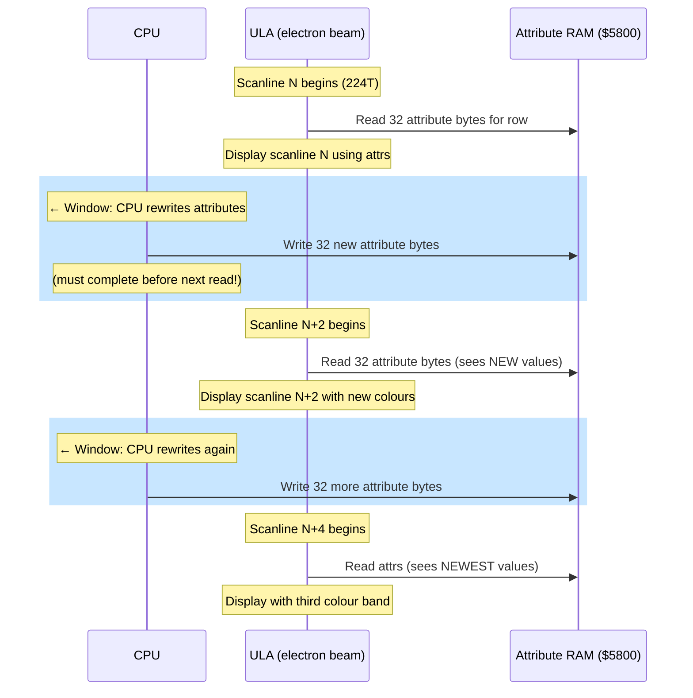

# Capítulo 8: Multicolor --- Rompiendo la Cuadrícula de Atributos

> *"El multicolor será conquistado."*
> --- DenisGrachev, Hype, 2019

---

Todo programador de ZX Spectrum conoce la regla. Dos colores por celda de 8x8. Tinta y papel. Eso es lo que te da la ULA, y es todo lo que te da. Si tu personaje tiene un sombrero rojo y un abrigo azul y los dos colores caen dentro de la misma celda de atributos, uno de ellos pierde. El resultado --- bordes chillones, sprites descoloridos, personajes que cambian de color al caminar frente al escenario --- es el conflicto de atributos, y es la restricción visual definitoria de la plataforma.

El conflicto de atributos es tan fundamental para la identidad del Spectrum que muchos programadores simplemente lo aceptan. Diseñan alrededor de él. Eligen sus paletas para minimizarlo. Restringen los tamaños de sprites o evitan ciertas combinaciones de colores. Durante treinta años, la cuadrícula de 8x8 ha sido un hecho de la vida.

Pero la ULA no sabe esto.

La ULA lee bytes de atributos mientras dibuja la pantalla, una línea de escaneo a la vez. No lee los 768 bytes de atributos de una vez. Lee cada fila de 32 atributos exactamente cuando los necesita, ocho líneas de escaneo después lee la misma fila de nuevo para la siguiente línea de píxeles dentro de esa fila de caracteres, y así sucesivamente. El atributo para cualquier celda dada se lee ocho veces por fotograma --- una vez por cada fila de píxeles en esa celda.

El truco es obvio una vez que lo ves: si cambias el byte de atributo entre lecturas, la ULA aplicará un color diferente a diferentes filas de píxeles dentro de la misma celda. En lugar de dos colores para las ocho filas, obtienes dos colores por *grupo de filas*. La cuadrícula de 8x8 no se rompe porque el hardware fue rediseñado. Se rompe porque reescribiste los datos más rápido de lo que el hardware podía consumirlos.

Esto es mMulticolor. Se conoce al menos desde principios de la década de 2000, cuando la revista rusa de ZX Black Crow publicó un algoritmo y código de ejemplo en su quinto número. Pero durante años, multicolor siguió siendo una curiosidad --- impresionante en demos, impráctico en juegos, porque la CPU gastaba tantos T-states cambiando atributos que no quedaba nada para la lógica del juego.

> **La carrera:** A 224 T-states por línea de escaneo, escribir 32 bytes mediante `LD (HL),A : INC L` cuesta 352T — más de una línea de escaneo. Esta es la razón por la que la resolución de 8x2 (cambiar cada 2 líneas de escaneo) es el límite práctico con reescritura de atributos por CPU, y por la que LDPUSH fusiona la salida de píxeles y atributos para evitar una pasada de atributos separada.

Entonces DenisGrachev descubrió cómo hacer juegos con ello.

---

## La Perspectiva de la ULA

Para entender multicolor, necesitas ver la pantalla desde el punto de vista de la ULA.

La ULA dibuja 192 líneas de escaneo visibles por fotograma, de arriba a abajo. Cada línea de escaneo toma 224 T-states (en Pentagon). Para cada línea de escaneo, la ULA lee 32 bytes de píxeles y 32 bytes de atributos de la memoria. Los bytes de píxeles determinan qué puntos son tinta y cuáles son papel. Los bytes de atributos determinan qué colores son realmente "tinta" y "papel".

Dentro de una fila de caracteres (8 líneas de píxeles), la ULA lee los mismos 32 bytes de atributos para cada línea de escaneo. No los almacena en caché --- los lee frescos cada vez. Esto significa que tienes una ventana de oportunidad entre la lectura de atributos de una línea de escaneo y la siguiente para cambiar los datos de atributos.

El enfoque multicolor "tradicional" explota esto directamente. Después de un HALT (que sincroniza la CPU con la interrupción de fotograma), cuentas T-states para saber exactamente cuándo la ULA leerá cada fila de atributos. Luego, en el hueco entre lecturas, sobrescribes los bytes de atributos con nuevos valores. Cuando la ULA los lee para la siguiente línea de escaneo, ve los nuevos colores.

La limitación es brutal: contar T-states con precisión, cambiar 32 bytes entre líneas de escaneo, luego esperar la siguiente oportunidad. La CPU gasta casi todo su tiempo en esta contabilidad. En un motor multicolor tradicional típico, puedes cambiar atributos cada 2 o 4 líneas de escaneo, dando una resolución de color de 8x2 o 8x4. Pero el presupuesto de ciclos consumido por el propio código de cambio de atributos no deja casi nada para lógica de juego, renderizado de sprites o sonido.

Por eso el multicolor se quedó en las demos. Las demos pueden permitirse gastar el 100% de la CPU en efectos visuales. Los juegos no.

---

## La Idea LDPUSH

En enero de 2019, DenisGrachev publicó un artículo en Hype titulado "El Multicolor Será Conquistado" (Mul'tikolor budet pobezhdon). El título era una declaración de intenciones. Había estado desarrollando Old Tower, un juego para el ZX Spectrum con multicolor 8x2 --- atributos cambiando cada dos filas de píxeles --- y quería explicar cómo había resuelto el problema de presupuesto de ciclos que hacía al multicolor impráctico en juegos.

La idea clave es una de esas que parecen inevitables en retrospectiva: el código que emite datos de píxeles *es* el búfer de pantalla.

El multicolor tradicional separa código y datos. Tienes un búfer de bytes de atributos en algún lugar de la memoria, y código de renderizado que los copia a la pantalla en el momento preciso. La técnica de DenisGrachev fusiona ambos. El "búfer" es una secuencia de instrucciones Z80 --- específicamente, `LD DE,nn` seguido de `PUSH DE` --- y ejecutar esas instrucciones escribe los datos de pantalla directamente en la memoria de video a través del puntero de pila.

Así es como funciona.

### LD DE,nn / PUSH DE

The instruction `LD DE,nn` loads a 16-bit immediate value into register pair DE. It takes 10 T-states and is 3 bytes long: the opcode byte `$11`, followed by two data bytes (the value to load, low byte first). The instruction `PUSH DE` decrements SP by 1, writes the high byte of DE, decrements SP by 1 again, then writes the low byte. The result: SP ends up 2 lower, with the high byte at the higher address and the low byte at the lower address. It takes 11 T-states.

Juntas, `LD DE,nn : PUSH DE` cuestan 21 T-states, tienen 4 bytes de largo, y escriben 2 bytes de datos en la pantalla. Los "datos" son el operando inmediato de la instrucción LD. Para cambiar lo que se dibuja, no reescribes un búfer de pantalla --- parcheas los bytes de operando dentro de las propias instrucciones LD.

```z80 id:ch08_ld_de_nn_push_de
; One LDPUSH pair: writes 2 bytes to screen memory
    ld   de,$AA55       ; 10 T  load pixel data
    push de             ; 11 T  write to (SP), SP = SP - 2
                        ; ---
                        ; 21 T total, 2 bytes output
```

Una línea de escaneo de datos de píxeles tiene 32 bytes de ancho. Pero no puedes llenar los 32 bytes solo con PUSH, porque PUSH escribe hacia abajo (SP decrementa) y necesitas que los datos aparezcan de izquierda a derecha en la pantalla. La disposición de memoria de pantalla del Spectrum maneja esto: dentro de una sola línea de escaneo, los bytes consecutivos están en direcciones ascendentes. PUSH escribe en direcciones descendentes. Así que los datos salen al revés --- el último byte empujado aparece en la dirección más baja, que es el byte más a la izquierda en la pantalla.

Esto significa que construyes tu secuencia LDPUSH en orden de visualización inverso. El primer `LD DE,nn : PUSH DE` en el código escribe los dos bytes más a la derecha de la línea de escaneo. El último escribe los dos bytes más a la izquierda. Cuando se ejecutan, los pushes llenan la línea de escaneo de derecha a izquierda.

### ¿Cuánto cabe en una línea de escaneo?

DenisGrachev no llena los 32 bytes. El motor GLUF (que impulsa Old Tower y otros juegos) usa un área de juego de 24 caracteres de ancho, con un borde a cada lado. Eso son 24 bytes por línea de escaneo en el área de juego.

A 4 bytes de código por 2 bytes de salida, necesitas 48 bytes de código para llenar 24 bytes de pantalla. Pero hay un byte adicional para la configuración inicial `LD SP,nn` y para el cambio de atributos entre grupos de líneas de escaneo. DenisGrachev reporta 51 bytes por línea de escaneo de código generado.

La belleza de este enfoque: no hay un paso de renderizado separado. Las instrucciones que pueblan la pantalla SON el código ejecutable. Cuando necesitas actualizar un tile o sprite, parchas los operandos inmediatos de las instrucciones LD. Cuando el código de pantalla se ejecuta, emite los datos parcheados. El código es datos. Los datos son código.

### El puntero de pila como cursor

Durante la ejecución, SP apunta al borde derecho de la línea de escaneo actual en la memoria de pantalla. Cada PUSH escribe 2 bytes y decrementa SP en 2, moviendo el "cursor de escritura" hacia la izquierda a través de la línea de escaneo. Al final de la salida de una línea de escaneo, SP apunta al borde izquierdo. El código entonces ajusta SP al borde derecho de la siguiente línea de escaneo y repite.

La restricción fundamental: las interrupciones deben estar deshabilitadas mientras SP está secuestrado. Si una interrupción se disparara, la CPU empujaría la dirección de retorno en la memoria de pantalla, corrompiendo la visualización. Esto significa que el código de renderizado multicolor se ejecuta con `DI` y rehabilita las interrupciones con `EI` solo después de que SP se restaura a la pila real. Todo el paso de renderizado --- las 192 líneas de escaneo visibles --- sucede en un bloque ininterrumpible.

> **Multicolor y contención (48K/128K Spectrum).** La técnica LDPUSH escribe directamente en la memoria de pantalla vía SP, por lo que cada PUSH accede a direcciones en memoria contendida ($4000--$5AFF). En un Spectrum estándar de 48K o 128K, la ULA inserta estados de espera durante el período de visualización activa, añadiendo ~1 T por PUSH. Más críticamente, la carrera del haz con precisión de ciclo --- alinear cambios de atributos a líneas de escaneo específicas --- se vuelve poco fiable porque los retrasos de contención desplazan la temporización en cantidades variables según la fase del reloj de píxeles de la ULA. El motor GLUF de DenisGrachev fue desarrollado y probado en Pentagon, donde la contención no existe. **En máquinas no-Pentagon**, el enfoque Ringo de pantalla dual (cambiar páginas vía puerto $7FFD entre grupos de líneas de escaneo) es más robusto: no requiere temporización exacta de ciclos porque el cambio de página surte efecto en el siguiente límite de línea de escaneo independientemente de cuándo se ejecute la instrucción OUT. Trata el multicolor LDPUSH como una técnica orientada a Pentagon a menos que puedas verificar la temporización en tu hardware objetivo. Ver Capítulo 15.2 para el modelo de contención.

---

## El Motor GLUF: Multicolor en un Juego Real

Old Tower fue una prueba de concepto. GLUF (el framework de juegos de DenisGrachev) fue el motor de producción. Aquí están los números:

| Parámetro | Valor |
|-----------|-------|
| Resolución multicolor | 8x2 (atributos cambian cada 2 filas de píxeles) |
| Área de juego | 24x16 caracteres (192x128 píxeles) |
| Búfer | Doble búfer (dos conjuntos de código de pantalla) |
| Tamaño de sprite | 16x16 píxeles |
| Tamaño de tile | 16x16 píxeles |
| Sonido | 25 Hz (cada dos fotogramas) |
| Ciclos por fotograma | ~70.000 (casi todo el presupuesto del Pentagon) |

La resolución 8x2 significa que el motor cambia atributos cuatro veces por fila de caracteres en lugar de una. Cada fila de caracteres tiene 8 líneas de escaneo de alto; cambiar atributos cada 2 líneas de escaneo da cuatro bandas de color distintas dentro de una sola celda de caracteres. Un carácter que normalmente estaría limitado a tinta sobre papel de repente tiene hasta ocho colores (dos por banda, cuatro bandas). En la práctica, el efecto es sorprendente --- los sprites y tiles muestran mucho más detalle de color del que la arquitectura del Spectrum fue diseñada para permitir.

### Doble búfer

GLUF mantiene dos conjuntos completos de código de pantalla LDPUSH. Mientras un conjunto se ejecuta (dibujando el fotograma actual), el otro está siendo parcheado con nuevos datos de tiles y sprites para el siguiente fotograma. Esto elimina el parpadeo que resultaría de modificar el código de pantalla mientras se está ejecutando.

El costo es memoria. Cada conjunto de código de pantalla cubre el área de juego de 24x16 caracteres a 51 bytes por línea de escaneo por 128 líneas de escaneo: aproximadamente 6.500 bytes por búfer. Dos búferes consumen alrededor de 13.000 bytes. En un Spectrum 128K con memoria paginada, esto es manejable pero significativo --- significa una planificación cuidadosa de memoria para el resto de los activos del juego.

### La arquitectura de dos fotogramas

Aquí es donde la ingeniería se pone brutal. GLUF no renderiza un fotograma completo cada 1/50 de segundo. Usa una arquitectura de dos fotogramas:

**Fotograma 1:** Cambiar atributos para el efecto multicolor, luego renderizar tantos tiles como sea posible en el búfer de código de pantalla. Los cambios de atributos son la parte crítica en tiempo --- deben suceder en el momento preciso relativo al haz del raster.

**Fotograma 2:** Terminar de renderizar los tiles restantes, luego superponer sprites en el búfer de código de pantalla.

La división es necesaria porque la carga de trabajo simplemente no cabe en un fotograma. Renderizar tiles en el búfer LDPUSH significa parchar bytes de operandos dentro del código de pantalla --- para cada píxel de tile, calculas qué instrucción LD afecta y escribes el nuevo valor en el offset de byte correcto. Esto no es una copia de bloque simple. La estructura entrelazada del código de pantalla (opcode-dato-dato-opcode-dato-dato...) significa que el renderizado de tiles involucra escrituras dispersas, no secuenciales.

El presupuesto total de renderizado es aproximadamente 70.000 T-states por fotograma --- casi todo el presupuesto del Pentagon de 71.680. Lo que queda es apenas suficiente para lógica de juego, manejo de entrada y la actualización periódica de sonido.

El sonido funciona a 25 Hz en lugar de 50 Hz. Cada dos fotogramas, el motor omite la actualización de sonido por completo para recuperar esos T-states para el renderizado. El jugador no nota la tasa de actualización reducida a la mitad para efectos de sonido simples. Para música, la tasa de 25 Hz significa que cada nota dura el doble de fotogramas, lo que requiere que el motor de música esté escrito específicamente para esta restricción.

### Lo que ve el jugador

El jugador no ve nada de esto. Ve un juego de desplazamiento lateral con más color del que un Spectrum debería tener. Los sprites se mueven sobre el escenario sin el habitual conflicto de atributos. Los tiles muestran sombreado, textura y detalle multicolor que serían imposibles con atributos estándar de 8x8. El juego se siente como si perteneciera a una plataforma más capaz.

Este es el punto que el trabajo de DenisGrachev demuestra contundentemente: multicolor no es un truco de demo. Es una técnica de motor de juegos. La ingeniería es extrema --- doble búfer, renderizado de dos fotogramas, sonido a 25 Hz --- pero el resultado es un juego jugable con visuales que genuinamente rompen los límites percibidos del Spectrum.


---

## Ringo: Un Tipo Diferente de Multicolor

En diciembre de 2022, DenisGrachev publicó un segundo artículo en Hype: "Ringo Render 64x48." Donde GLUF extendía la cuadrícula de atributos a 8x2, Ringo la descartó por completo y construyó algo más cercano a un framebuffer de píxeles chunky con color por píxel.

El enfoque es conceptualmente simple y técnicamente astuto.

### El patrón 11110000b

Llena cada byte de píxel en la memoria de pantalla con el valor `$F0` --- binario `11110000`. Los cuatro píxeles izquierdos de cada byte están encendidos (color de tinta), y los cuatro derechos están apagados (color de papel). Ahora, si cambias el atributo para esa celda, la mitad izquierda muestra el color de tinta y la mitad derecha muestra el color de papel. Una sola celda de 8 píxeles de ancho muestra dos colores distintos, uno al lado del otro.

Con atributos estándar de 8x8, esto te da una cuadrícula de 64x24 de "píxeles" coloreados independientemente, cada uno de 4 píxeles reales de ancho y 8 píxeles reales de alto. No está mal, pero no es revolucionario.

### Cambio de dos pantallas

El truco que hace funcionar a Ringo: el ZX Spectrum 128K tiene dos búferes de pantalla. La Pantalla 0 vive en `$4000`, la Pantalla 1 en `$C000` (en banco 7). Un solo `OUT` al puerto `$7FFD` cambia qué pantalla muestra la ULA.

Ringo prepara ambas pantallas con el patrón `11110000b` pero con *diferentes* atributos en cada pantalla. Luego cambia entre las dos pantallas cada 4 líneas de escaneo. El efecto: dentro de cada fila de caracteres de 8 píxeles de alto, las 4 líneas de escaneo superiores muestran los atributos de la Pantalla 0, y las 4 inferiores muestran los de la Pantalla 1. Cada mitad puede especificar colores de tinta y papel independientes.

Combinado con el patrón de píxeles `11110000b`, esto da:

- 2 columnas de color por celda de caracteres (4 píxeles izquierdos = tinta, 4 derechos = papel)
- 2 filas de color por celda de caracteres (4 líneas de escaneo superiores de Pantalla 0, 4 inferiores de Pantalla 1)
- Total: 4 sub-celdas coloreadas independientemente por celda de caracteres de 8x8

Sobre la pantalla completa: 64 columnas x 48 filas = **3.072 píxeles coloreados independientemente**, cada uno de 4x4 píxeles reales de tamaño. La resolución efectiva es 64x48 con color completo por píxel de la paleta de 15 colores del Spectrum.


Este es un enfoque fundamentalmente diferente del multicolor 8x2 de GLUF. GLUF cambia atributos en sincronía con el haz, requiriendo temporización precisa y consumiendo presupuestos masivos de ciclos. Ringo usa cambio de pantalla dual por hardware, que requiere solo una sola instrucción `OUT` cada 4 líneas de escaneo. La sobrecarga de CPU para el cambio de pantalla en sí es mínima.

### Dónde van los T-states

El cambio de pantalla barato significa que más T-states están disponibles para lógica de juego. Pero renderizar en dos pantallas simultáneamente no es gratis. Cada actualización de tile y sprite debe escribirse en ambas Pantalla 0 y Pantalla 1, porque el jugador ve un compuesto de ambas.

Los sprites de Ringo son de 12x10 "píxeles" en la cuadrícula de 64x48, lo que significa 12 bytes de atributos de ancho y 10 filas de atributos de alto (divididos entre las dos pantallas). Cada sprite ocupa 120 bytes de datos. El renderizado de sprites usa macros de ciclo fijo --- secuencias de instrucciones con tiempo de ejecución conocido y constante, crítico para mantener la sincronización con el cambio de pantalla.

El renderizado de tiles es más complejo. DenisGrachev pre-genera código de renderizado de tiles en páginas de memoria, usando patrones `pop af : or (hl)`:

```z80 id:ch08_where_the_t_states_go
; Tile rendering fragment (conceptual)
    pop  af             ; 10 T  load tile data from stack-based source
    or   (hl)           ;  7 T  combine with existing screen data
    ld   (hl),a         ;  7 T  write back
    inc  l              ;  4 T  next attribute column
                        ; ---
                        ; 28 T per attribute byte
```

El `pop af` es un truco de pila: los datos del tile están organizados como una tabla en formato de pila en memoria. SP apunta a los datos del tile, y POP lee dos bytes a la vez. El `or (hl)` combina el color del tile con lo que ya está en pantalla, permitiendo tiles transparentes y fondos en capas.

### Desplazamiento horizontal

Ringo implementa desplazamiento horizontal con desplazamiento de medio carácter. Dado que cada "píxel" en la cuadrícula de 64x48 tiene 4 píxeles reales de ancho, desplazarse un "píxel" significa cambiar el patrón `11110000b` por 4 bits. Pero el patrón es fijo --- no puedes cambiarlo fácilmente sin corromper el truco de color.

En su lugar, DenisGrachev desplaza moviendo los datos de atributos. Un desplazamiento de un píxel mueve todos los atributos una columna a la izquierda o derecha y dibuja la nueva columna en el borde. Debido a que los atributos son lo único que cambia (el patrón de píxeles se mantiene fijo en `$F0`), el desplazamiento es solo una copia de bloque de bytes de atributos. Para la cuadrícula de 64x48, esto es 48 bytes por desplazamiento de columna (un byte por fila), mucho más barato que el desplazamiento a nivel de píxel.

Para desplazamiento sub-"píxel" --- movimiento suave dentro de una columna de 4 píxeles de ancho --- DenisGrachev alterna entre `$F0` y `$E0` (o patrones desplazados similares) en los datos de píxeles. Esto requiere más contabilidad pero logra un desplazamiento de medio carácter, dando la ilusión de una resolución horizontal de 128 columnas.

---

## Multicolor Tradicional: El Enfoque por Interrupciones

Antes de pasar a lo práctico, vale la pena entender el enfoque "clásico" que GLUF y Ringo desplazaron. El multicolor tradicional es conceptualmente el más simple: cambiar atributos en el momento preciso, y la ULA mostrará diferentes colores en diferentes líneas de escaneo.

La técnica funciona así:

1. Ejecutar `HALT` para sincronizarse con la interrupción de fotograma. Después del HALT, la CPU está en una posición de T-state conocida relativa al inicio de la visualización.

2. Contar T-states desde el HALT. La ULA lee cada fila de 32 atributos en un punto conocido de cada línea de escaneo. Rellenando con `NOP`s u otras instrucciones de longitud conocida, puedes posicionar tu código en el momento exacto.

3. En el T-state preciso cuando la ULA ha terminado de leer atributos para la línea de escaneo actual (pero antes de leerlos para la siguiente), sobrescribir los 32 bytes de atributos con nuevos valores.

4. Esperar a que la ULA lea los nuevos valores, luego sobrescribir de nuevo para el siguiente cambio.

La temporización es brutal. Cada línea de escaneo toma 224 T-states en Pentagon. La ULA lee 32 bytes de atributos al inicio de cada línea de escaneo, y la CPU debe cambiar los 32 bytes en el hueco antes de la siguiente lectura. Con `LD (HL),A : INC L` a 11 T-states por byte, escribir 32 bytes toma 352 T-states --- más de una línea de escaneo completa. No puedes cambiar cada línea de escaneo. En el mejor caso, puedes cambiar cada dos líneas de escaneo (resolución 8x2) si usas el método de salida más rápido posible (basado en PUSH), e incluso entonces los márgenes de temporización son razor-thin.

<!-- figure: ch08_multicolor_beam_racing -->



> **The race:** At 224 T-states per scanline, writing 32 bytes via `LD (HL),A : INC L` costs 352T — more than one scanline. This is why 8×2 resolution (change every 2 scanlines) is the practical limit with CPU-based attribute rewriting, and why LDPUSH merges pixel and attribute output to avoid a separate attribute pass.

El resultado práctico: el multicolor tradicional consume el 80--90% de la CPU en gestión de atributos. En una demo, donde el multicolor *es* el efecto, esto es aceptable. En un juego, es letal. No quedan T-states para lógica de juego, detección de colisiones o sonido.

La técnica LDPUSH de DenisGrachev resuelve esto fusionando la salida de atributos con la salida de píxeles. El mismo código que escribe datos de píxeles también escribe atributos, y ambos están incrustados en instrucciones ejecutables. No hay una fase separada de "gestión de atributos" consumiendo el presupuesto. El paso de renderizado maneja todo.

---

## Barra lateral: Black Crow #05 --- Multicolor Temprano

La técnica de cambiar atributos entre líneas de escaneo fue documentada tan temprano como 2001 en Black Crow #05, una revista de la escena ZX Spectrum rusa distribuida en imágenes de disco TRD. El artículo presentaba el algoritmo básico --- sincronizar con el raster, contar T-states, cambiar atributos --- junto con código de ejemplo funcional.

Black Crow es significativo como marcador histórico. Para 2001, la demoscene del ZX Spectrum había evolucionado mucho más allá de la vida comercial de la plataforma, y los programadores estaban catalogando sistemáticamente trucos que llevaban el hardware más allá de sus especificaciones de diseño. Multicolor fue una de muchas técnicas compartidas a través del ecosistema de revistas de la escena: Spectrum Expert, ZX Format, Born Dead, Black Crow, y más tarde la plataforma en línea Hype.

La contribución de DenisGrachev, casi dos décadas después, no fue inventar multicolor sino resolver sus problemas prácticos para el desarrollo de juegos. Los artículos de revistas documentaban lo que era posible. DenisGrachev mostró lo que era *utilizable*.

---

## La Paleta del Spectrum y Multicolor

Una breve nota sobre la mecánica del color, porque el impacto visual del multicolor depende enteramente de la paleta.

El ZX Spectrum tiene 15 colores: 8 colores base (negro, azul, rojo, magenta, verde, cyan, amarillo, blanco) y 7 variantes BRIGHT (negro brillante es lo mismo que negro, así que solo 7 adicionales). Cada byte de atributo especifica un color de tinta (3 bits), un color de papel (3 bits), una bandera BRIGHT (1 bit, se aplica tanto a tinta como a papel simultáneamente), y una bandera FLASH (1 bit).

Con multicolor 8x2, cada celda de caracteres obtiene cuatro filas de atributos en lugar de una. Cada fila especifica colores de tinta y papel independientes. Eso son hasta ocho colores por celda (dos por fila, cuatro filas) --- aunque en la práctica, la restricción de BRIGHT (se aplica tanto a tinta como a papel) limita las combinaciones efectivas.

Con el enfoque 64x48 de Ringo, cada sub-celda es completamente independiente. La paleta de 15 colores está disponible en cada una de las 3.072 posiciones. El resultado está más cerca de lo que los ordenadores domésticos de 8 bits con hardware más capaz --- el MSX2, el Amstrad CPC --- podían lograr nativamente. En el Spectrum, se logra enteramente por software, explotando la relación temporal entre la CPU y la ULA.

---

## Práctico: Una Pantalla de Juego Multicolor

Construyamos un renderizador multicolor simplificado. El objetivo: un área de juego de 24 caracteres de ancho con resolución de color 8x2 y un sprite en movimiento encima. Esto no igualará el conjunto completo de características de GLUF, pero demostrará la técnica LDPUSH central y el enfoque de renderizado de dos fotogramas.

### Paso 1: El búfer de código de pantalla

Primero, necesitamos un bloque de memoria lleno de pares de instrucciones LDPUSH. Para cada línea de escaneo en el área de juego de 24 caracteres, necesitamos 12 pares de `LD DE,nn : PUSH DE` (cada par emite 2 bytes, 12 pares emiten 24 bytes = el ancho completo del área de juego).

```z80 id:ch08_step_1_the_display_code
; Structure of one scanline's display code (conceptual)
; SP is pre-set to the right edge of this scanline in screen memory

    ld   de,$0000       ; 10 T  rightmost 2 bytes (will be patched)
    push de             ; 11 T
    ld   de,$0000       ; 10 T  next 2 bytes leftward
    push de             ; 11 T
    ld   de,$0000       ; 10 T
    push de             ; 11 T
    ; ... 12 pairs total ...
    ld   de,$0000       ; 10 T  leftmost 2 bytes
    push de             ; 11 T
    ; --- 252 T per scanline (12 x 21) ---

    ; Then: adjust SP for the next scanline
    ; Then: change attributes (every 2nd scanline)
```

El código de pantalla total para 128 líneas de escaneo (16 filas de caracteres x 8 líneas de escaneo cada una) a aproximadamente 51 bytes por línea de escaneo es alrededor de 6.500 bytes.

### Paso 2: Cambios de atributos dentro del código de pantalla

Cada dos líneas de escaneo, el código de pantalla debe incluir escrituras de atributos. Entre las secuencias LDPUSH para las líneas de escaneo N y N+2, insertar código que sobrescriba los 32 bytes de atributos para la fila de caracteres actual:

```z80 id:ch08_step_2_attribute_changes
; After outputting scanline N...
; Attribute change for the next 2-scanline band

    ld   sp,attr_row_end       ; point SP at end of attribute row
    ld   de,attr_data_0        ; 10 T  rightmost 2 attribute bytes
    push de                    ; 11 T
    ld   de,attr_data_1        ; 10 T
    push de                    ; 11 T
    ; ... 16 pairs for 32 attribute bytes ...

    ld   sp,next_scanline_end  ; point SP at next scanline's right edge
    ; Continue with pixel LDPUSH pairs for scanlines N+2, N+3
```

Los cambios de atributos están incrustados directamente en el flujo de código de pantalla. Se ejecutan en el momento exacto porque están *posicionados* en el punto exacto de la secuencia de instrucciones. No se requiere conteo de T-states. Sin relleno de NOP. La estructura del código garantiza la temporización.

### Paso 3: Renderizado de tiles via parcheo de operandos

Para dibujar un tile en el área de juego, debes parchar los bytes de operando de las instrucciones LD en el búfer de código de pantalla. Un tile de 16x16 píxeles cubre 2 bytes de ancho y 16 líneas de escaneo de alto. En el código de pantalla, esos 2 bytes son el operando de una instrucción LD DE específica. Para actualizar el tile:

```z80 id:ch08_step_3_tile_rendering_via
; Patch one scanline of a 16x16 tile into the display buffer
; IX points to the LD DE instruction for this position in the buffer
; HL points to the tile's pixel data for this scanline

    ld   a,(hl)             ;  7 T  read tile byte 0
    ld   (ix+1),a           ; 19 T  patch into LD DE operand (low byte)
    inc  hl                 ;  6 T
    ld   a,(hl)             ;  7 T  read tile byte 1
    ld   (ix+2),a           ; 19 T  patch into LD DE operand (high byte)
    inc  hl                 ;  6 T
    ; advance IX to the next scanline's LD DE instruction
    ; (stride depends on display code structure)
```

A 19 T-states por escritura indexada IX, esto no es barato. Para un tile completo de 16x16 (16 líneas de escaneo x 2 bytes x 2 parches por byte): aproximadamente 1.200 T-states por tile. En un área de juego de 24x16 caracteres con tiles de 2 caracteres de ancho, hay hasta 192 tiles. Incluso con actualizaciones parciales (solo redibujando tiles que cambiaron), el renderizado de tiles domina el presupuesto.

Por eso GLUF divide el renderizado en dos fotogramas. El Fotograma 1 maneja los cambios de atributos críticos en tiempo y renderiza tantos tiles como sea posible. El Fotograma 2 termina tiles y compone sprites encima.

### Paso 4: Superposición de sprites

Los sprites se renderizan sobre los tiles usando la misma técnica de parcheo de operandos, pero con un paso adicional: guardar los bytes de operando originales antes de sobrescribirlos, para que el sprite pueda borrarse en el siguiente fotograma restaurando los datos guardados.

```z80 id:ch08_step_4_sprite_overlay
; Sprite rendering: save background, patch sprite data
    ld   a,(ix+1)           ; read current (background) byte
    ld   (save_buffer),a    ; save for later restoration
    ld   a,(sprite_data)    ; load sprite pixel
    ld   (ix+1),a           ; patch into display code
```

El mecanismo de guardar/restaurar es el equivalente multicolor del renderizado de sprites con rectángulos sucios. Guardas lo que había, dibujas el sprite, lo muestras, luego restauras los bytes guardados para borrar el sprite antes de dibujarlo en su nueva posición.

### Paso 5: El bucle principal

```z80 id:ch08_step_5_the_main_loop
main_loop:
    halt                    ; synchronise with frame

    ; --- Frame 1: attributes + tiles ---
    di
    ld   (restore_sp+1),sp  ; save real SP
    call execute_display     ; run the LDPUSH display code
restore_sp:
    ld   sp,$0000           ; restore SP
    ei

    call update_tiles        ; patch changed tiles into buffer B
    call read_input          ; handle player input
    call update_game_logic   ; move entities, check collisions

    halt                    ; synchronise with next frame

    ; --- Frame 2: remaining tiles + sprites ---
    di
    ld   (restore_sp2+1),sp
    call execute_display     ; display the current frame
restore_sp2:
    ld   sp,$0000
    ei

    call finish_tiles        ; patch any remaining tiles
    call erase_old_sprite    ; restore saved bytes
    call render_sprite       ; patch sprite into new position
    call update_sound        ; sound at 25 Hz (every other frame pair)

    jr   main_loop
```

Este esqueleto captura el ritmo esencial: dos fotogramas por fotograma lógico de juego, código de pantalla ejecutándose con interrupciones deshabilitadas, renderizado de tiles y sprites ocurriendo entre los pasos de visualización. El entrelazado de renderizado y lógica de juego dentro de la estructura de dos fotogramas es el corazón de ingeniería de un motor de juego multicolor.

---

## Lo Que Significa el Trabajo de DenisGrachev

DenisGrachev's achievement was not inventing multicolor --- the technique was known. It was solving the engineering problem of fitting multicolor rendering, tile engines, sprite overlay, double buffering, sound, and game logic into the same frame budget. The two-frame architecture, the merged code-as-data display buffer, and the 25 Hz sound compromise are game engine decisions, not demo tricks. Ringo pushed further by trading colour resolution (64x48 vs GLUF's 192x128 pixel grid) for a cheaper rendering path via dual-screen switching.

---

## Resumen

- **El conflicto de atributos** (dos colores por celda de 8x8) es la restricción visual definitoria del Spectrum. La ULA lee atributos por línea de escaneo, no por fotograma --- si los cambias entre lecturas, obtienes más colores por celda.
- La **técnica LDPUSH** fusiona datos de pantalla con código ejecutable: secuencias `LD DE,nn : PUSH DE` escriben datos de píxeles en la memoria de pantalla cuando se ejecutan, y los operandos inmediatos sirven como el búfer de pantalla. Parchar los operandos cambia lo que se dibuja.
- **GLUF** logra multicolor 8x2 en un área de juego de 24x16 caracteres con código de pantalla de doble búfer, sprites y tiles de 16x16, y una arquitectura de dos fotogramas que divide el renderizado en 2/50 de segundo.
- **Ringo** usa el patrón de píxeles `11110000b` con cambio de pantalla dual cada 4 líneas de escaneo para lograr una cuadrícula de 64x48 con color por píxel --- una compensación fundamentalmente diferente que favorece la independencia de color sobre la resolución espacial.
- **El multicolor tradicional** (cambios de atributos por interrupciones) es conceptualmente más simple pero consume el 80--90% de la CPU, haciéndolo impráctico para juegos.
- La revista **Black Crow #05** documentó multicolor tan temprano como 2001. La contribución de DenisGrachev fue hacerlo práctico para el desarrollo de juegos.
- El trabajo de DenisGrachev demuestra que las técnicas de la demoscene son herramientas de ingeniería, no solo trucos de demo. La distinción entre "posible en una demo" y "utilizable en un juego" es el desafío de ingeniería.

---

## Inténtalo Tú Mismo

1. **Construye el búfer de pantalla.** Escribe un programa que genere un bloque de pares `LD DE,nn : PUSH DE` en memoria, apunte SP a la memoria de pantalla, y ejecute el bloque. Deberías ver un patrón en pantalla correspondiente a los valores inmediatos que elegiste. Cambia los valores y re-ejecuta para ver la pantalla actualizarse.

2. **Añade cambios de atributos.** Extiende tu búfer de pantalla para incluir escrituras de atributos cada 2 líneas de escaneo. Llena bandas alternas con diferentes colores. Deberías ver franjas de color horizontales dentro de una sola fila de caracteres --- prueba de que el efecto multicolor está funcionando.

3. **Parchea un tile.** Escribe una rutina que tome un tile de píxeles de 16x16 y lo parchee en el búfer de pantalla en una posición especificada modificando los bytes de operando de LD. Dibuja varios tiles para llenar el área de juego.

4. **Mueve un sprite.** Implementa el parcheo de fondo guardar/restaurar: antes de dibujar el sprite, guarda los bytes de operando que sobrescribirá. Después de mostrar el fotograma, restaura los bytes guardados. Mueve el sprite un carácter por fotograma y verifica que se mueve limpiamente sin dejar rastros.

5. **Mide el presupuesto.** Usa la arnés de temporización de color de borde del Capítulo 1 para medir cuánto del fotograma consume tu código de pantalla. En Pentagon, la franja roja debería casi llenar el borde --- GLUF usa ~70.000 de los 71.680 T-states disponibles. Mira cuánto espacio queda para lógica de juego.

---

> **Fuentes:** DenisGrachev, "Multicolor Will Be Conquered" (Hype, 2019); DenisGrachev, "Ringo Render 64x48" (Hype, 2022); Black Crow #05 (ZXArt, 2001). Motores de juego: Old Tower, GLUF, Ringo por DenisGrachev.
