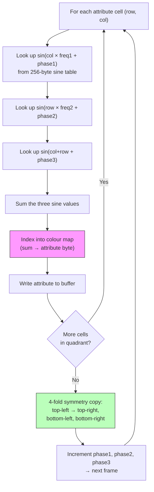

# Capítulo 9: Túneles de Atributos y Chaos Zoomers

> *"Esta es una demo MUY CON ERRORES. Es LA cosa más difícil que he hecho nunca en una demo -- sin broma."*
> -- Introspec, file_id.diz para la versión de party de Eager (to live), 3BM Open Air 2015

---

En el verano de 2015, Introspec se sentó a construir algo que nunca había intentado antes. La demo que emergió -- Eager (to live), publicada bajo el sello Life on Mars en 3BM Open Air -- ganó el primer lugar en la compo de demos ZX Spectrum. Duró dos minutos, en bucle, y cada fotograma se renderizó a 50Hz con verdaderos tambores digitales mezclados en la salida del chip AY. La pieza central visual era un túnel que parecía perforar la pantalla, colores ondulando hacia afuera en ondas orgánicas. Cuando la gente lo vio, muchos asumieron que involucraba manipulación pesada de píxeles. De hecho, el túnel nunca tocó un solo píxel. Todo el efecto vivía en la memoria de atributos.

Este capítulo es un making-of. Trabajaremos a través de los dos efectos visuales centrales de Eager -- el túnel de atributos y el chaos zoomer -- trazando el razonamiento creativo junto al código. En el camino, encontraremos un motor de scripts que insinúa la arquitectura de sincronización cubierta en el Capítulo 12, y un argumento filosófico sobre la precalculación que dividió la escena ZX durante años. Pero comenzamos donde Introspec comenzó: mirando 768 bytes y dándose cuenta de que eran suficientes.

---

## La Cuadrícula de Atributos como Framebuffer

Todo programador de ZX Spectrum conoce el área de atributos en `$5800`--`$5AFF`. Cada uno de los 768 bytes controla los colores de tinta y papel para un bloque de 8x8 píxeles, dando una cuadrícula de 32x24. En desarrollo de juegos, los atributos son la fuente de dolores de cabeza por conflicto de atributos. En el Capítulo 8, vimos cómo los motores multicolor reescriben atributos en sincronía con el haz del raster para combatir la cuadrícula de 8x8. El túnel de atributos hace lo opuesto: abraza la cuadrícula.

La idea es desarmantemente simple. Si llenas la memoria de píxeles con un patrón fijo -- digamos, franjas alternas de tinta/papel o un tablero de ajedrez -- entonces el byte de atributo solo determina lo que el espectador ve en cada celda de 8x8. Cambia los colores de tinta y papel, y el contenido visual de esa celda cambia completamente. Ahora tienes 32x24 "píxeles" de color, cada uno un byte de atributo. Escribir un fotograma completo significa escribir 768 bytes. Sin entrelazado de direcciones de pantalla. Sin manipulación de bits. Sin trazado de píxeles. Solo una copia de bloque lineal en la RAM de atributos.

A 32x24, la resolución es terrible por cualquier estándar normal. Pero Introspec no estaba construyendo un efecto normal. Estaba construyendo un túnel.

Piensa en cómo se ve un túnel desde la perspectiva del espectador. La "boca" del túnel -- el centro de la pantalla -- es donde se dirige la mirada. Las paredes retroceden hacia los bordes. Cerca del centro, los detalles individuales son pequeños y difuminados por la profundidad. Cerca de los bordes, las paredes están cerca y puedes ver textura. Esto mapea bellamente sobre una pantalla de resolución variable: resolución gruesa en el centro (donde el túnel está lejos y el detalle no importa) y resolución más fina en los bordes (donde sí importa).

Introspec llevó esto más lejos con renderizado pseudo-chunky. En el centro de la pantalla, varias celdas de atributos comparten el mismo color, creando "píxeles" más grandes. Hacia los bordes, cada celda de 8x8 obtiene su propio valor. El ojo acepta el centro pixelado porque ahí es donde está la boca del túnel -- la profundidad naturalmente destruye el detalle allí. La visión periférica capta la resolución más fina en los bordes, creando una impresión de mayor fidelidad de la que los datos realmente contienen.

Esta es la primera lección de Eager: la cuadrícula de atributos no es una limitación alrededor de la cual trabajar. Es un framebuffer con el cual trabajar.

---

## Plasma: El Motor de Color

Los colores del túnel no vienen de una textura almacenada mapeada sobre un tubo. Vienen de un cálculo de plasma -- el clásico enfoque de suma de senos que ha sido un elemento básico de la demoscene desde los días del Amiga, aquí adaptado para la paleta de atributos del Spectrum.

La idea básica: para cada posición en la cuadrícula de 32x24, sumar varias ondas sinusoidales con diferentes frecuencias y fases. El resultado, después de limitar al rango de colores disponible, determina el byte de atributo. Varía las fases a lo largo del tiempo y el plasma se anima, creando ese flujo orgánico y ondulante.

En el Z80, esto significa consultas de tabla. Una tabla de senos de 256 bytes, alineada a página para poder indexarla con un solo registro, proporciona la función base. Para cada celda, consultas `sin(x * freq1 + fase1) + sin(y * freq2 + fase2) + ...` donde las multiplicaciones por frecuencia son realmente solo sumas al índice (multiplicar por 2 = consultar cada otra entrada, multiplicar por 3 = sumar el índice a sí mismo dos veces). El valor acumulado indexa un mapa de colores que produce un byte de atributo.

La forma del túnel es implícita, no explícita. No hay cálculo de distancia al centro, no hay tabla de ángulos, no hay transformación a coordenadas polares. En su lugar, los parámetros de frecuencia y fase del plasma están organizados de modo que el patrón de color resultante naturalmente forma anillos concéntricos cuando se ve en pantalla. Los anillos emergen de la interferencia de las ondas sinusoidales, igual que los patrones Moiré emergen de cuadrículas superpuestas. Ajusta los parámetros y los anillos se contraen hacia el centro, creando la ilusión de profundidad -- de mirar dentro de un túnel.

<!-- figure: ch09_tunnel_plasma_computation -->



> **Key insight:** There is no distance-from-centre calculation, no angle table, no polar coordinate transform. The tunnel shape emerges from sine wave interference — concentric rings appear naturally from overlapping frequencies. Only one quarter (16×12) is computed; the rest is mirrored.

Esto es más barato que un túnel geométrico verdadero (que requeriría consultas de distancia y ángulo por píxel) y produce un resultado visualmente rico. La compensación es menos precisión geométrica, pero a resolución 32x24, la precisión geométrica nunca estuvo sobre la mesa de todos modos.


---

## Simetría de Cuatro Pliegues: Divide y Vencerás

Incluso a 32x24, calcular plasma para las 768 celdas cada fotograma es costoso en un Z80 a 3,5MHz. Introspec redujo la carga de trabajo por un factor de cuatro con una optimización clásica: explotar la simetría natural del túnel.

Un túnel visto de frente es simétrico respecto a los ejes horizontal y vertical. Si calculas un cuarto de la pantalla -- el bloque superior izquierdo de 16x12 -- puedes copiarlo a los otros tres cuartos mediante espejo. Superior izquierdo a superior derecho es un reflejo horizontal. Superior izquierdo a inferior izquierdo es un reflejo vertical. Superior izquierdo a inferior derecho son ambos.

The copy routine is tight. In Introspec's implementation, HL points to the source byte in the top-left quarter, and the three destination addresses (top-right, bottom-left, bottom-right) are maintained in a combination of absolute addresses and register pair BC:

```z80 id:ch09_four_fold_symmetry_divide_and
    ld a,(hl)      ; read source byte from top-left quarter
    ld (nn),a      ; write to upper-right quarter (mirrored)
    ld (mm),a      ; write to lower-left quarter (mirrored)
    ld (bc),a      ; write to lower-right quarter (mirrored)
    ldi            ; copy source to its own destination AND advance HL, DE
```

Las instrucciones `ld (nn),a` y `ld (mm),a` usan direccionamiento absoluto -- las direcciones destino están incrustadas directamente en el código, parcheadas via auto-modificación o generación de código para cada posición de celda. La instrucción `ldi` al final hace doble trabajo: copia el byte de (HL) a (DE) para la propia posición del cuarto superior izquierdo en el búfer de atributos, y auto-incrementa tanto HL como DE mientras decrementa BC. Esto significa que el contador del bucle, el avance del puntero fuente, y una de las cuatro escrituras están todas plegadas en una sola instrucción de dos bytes.

El costo total: menos de 15 T-states por byte para la copia de cuatro vías. Para 192 bytes fuente (un cuarto del área de atributos de 768 bytes), eso es aproximadamente 2.880 T-states para llenar toda la pantalla. A 3,5MHz con un presupuesto de fotograma de ~70.000 T-states, esto deja la gran mayoría del fotograma para el cálculo de plasma, el motor de música y la reproducción de tambores digitales que hicieron distintivo a Eager.

Las direcciones `(nn)` y `(mm)` son valores literales de dos bytes incorporados en instrucciones `LD (addr),A`, parcheados via auto-modificación o generación de código para cada posición de celda. Esta es práctica estándar de la demoscene: la falta de caché de instrucciones del Z80 significa que el código auto-modificable se ejecuta de manera confiable.

---

## El Chaos Zoomer

El segundo efecto visual importante en Eager es el chaos zoomer. Donde el túnel es suave y orgánico, el zoomer es irregular y fractal -- un campo de datos de atributos haciendo zoom hacia o desde el espectador, con nuevo detalle emergiendo en los bordes a medida que el zoom progresa.

El "caos" viene del resultado visual, no del algoritmo. El efecto hace zoom en una región de datos de atributos, magnificando el centro mientras los bordes se desplazan hacia adentro. Debido a que los datos fuente tienen patrones a múltiples escalas, el zoom revela una estructura auto-similar que el ojo lee como fractal.

La implementación se basa en secuencias desenrolladas de `ld hl,nn : ldi`. Cada `ld hl,nn` carga una nueva dirección fuente -- la posición en el búfer fuente a muestrear para esta celda de salida particular. El siguiente `ldi` copia de (HL) a (DE), avanzando DE a la siguiente posición de salida. Las direcciones fuente están organizadas de modo que las celdas cerca del centro de la pantalla muestrean posiciones cercanas en los datos fuente (magnificación), mientras que las celdas cerca de los bordes muestrean posiciones muy espaciadas (compresión). Varía el mapeo a lo largo del tiempo y el zoom se anima.

```z80 id:ch09_the_chaos_zoomer
    ; Unrolled chaos zoomer fragment
    ld hl,src_addr_0    ; source for output cell 0
    ldi                 ; copy to output, advance DE
    ld hl,src_addr_1    ; source for output cell 1
    ldi
    ld hl,src_addr_2    ; source for output cell 2
    ldi
    ; ... repeated for all 768 cells (or one quarter, with symmetry)
```

The key optimisation: since `ldi` auto-increments DE, you never need to calculate or load the destination address. The output is always written sequentially into attribute RAM. Only the source addresses vary, and they are embedded directly in the instruction stream as immediate operands. This makes the zoomer a long sequence of `ld hl,nn : ldi` pairs -- conceptually simple, but each pair is just 5 bytes (3 for `ld hl,nn` + 2 for `ldi`) and 26 T-states. For a full quarter-screen of 192 cells, that is roughly 5,000 T-states of pure copying, plus the four-way symmetry copy on top.

La complicación es que las direcciones fuente cambian cada fotograma a medida que el zoom progresa. Actualizar 192 direcciones de dos bytes incrustadas en el código costaría casi tanto como la copia misma. Aquí es donde entra la generación de código.

---

## Generación de Código: Processing Escribe Z80

Introspec no escribió el código desenrollado del zoomer a mano. Las secuencias de direcciones son diferentes para cada nivel de zoom, y calcularlas en tiempo de ejecución consumiría el presupuesto del fotograma. En su lugar, escribió el generador de código en Processing, el entorno de codificación creativa basado en Java. Un sketch de Processing calculaba, para cada fotograma y cada celda de salida, qué celda fuente debería muestrearse, y luego producía un archivo fuente `.a80` completo conteniendo la secuencia desenrollada de `ld hl,nn : ldi` con todas las direcciones llenas. sjasmplus compilaba este código fuente generado junto con el código del motor escrito a mano.

El pipeline: Processing calcula el mapeo de zoom, escribe código fuente `.a80`, el ensamblador lo compila, y en tiempo de ejecución el motor de scripts selecciona qué fotograma pre-generado ejecutar. El Z80 no calcula el mapeo. Simplemente lo reproduce.

Esto intercambia memoria por velocidad -- el código pre-generado para todos los fotogramas de zoom ocupa RAM sustancial, de ahí el requisito de 128K -- pero el costo en tiempo de ejecución por fotograma es mínimo.

---

## La Cuestión del Zapilator

La escena ZX tiene una relación larga y ocasionalmente acalorada con la precalculación. La demoscene rusa acuñó el término *zapilator* -- aproximadamente, "precalculador" -- para demos que dependen fuertemente de datos pre-generados en lugar de cómputo en tiempo real. La palabra lleva un ligero tufillo de desaprobación. Si el PC hace todo el trabajo interesante, ¿qué está haciendo realmente el Spectrum? ¿Es una demo o una presentación de diapositivas?

La respuesta de Introspec es característicamente matizada. El arte, argumenta, no está en el cómputo en sí mismo sino en *diseñar qué precalcular*. Elegir el mapeo de zoom correcto, la interpolación correcta, la forma correcta de descomponer el problema para que el código pre-generado quepa en memoria y la reproducción funcione a 50Hz -- esto es ingeniería. El script de Processing no se escribe solo. La estructura del código Z80 que hace la reproducción eficiente no emerge automáticamente. La creatividad vive en la arquitectura, no en si el bucle interno contiene un `add` o un `ldi`.

Tiene razón. La calidad visual del chaos zoomer depende de los datos fuente, la función de mapeo, la curva de zoom, la paleta de colores y la interacción con la música. Todas estas son decisiones artísticas. El hecho de que los cálculos de direcciones ocurran en tiempo de compilación en lugar de en tiempo de ejecución es un detalle de implementación -- uno que permite una calidad visual imposible con cómputo en tiempo real a 3,5MHz. Las restricciones de la máquina -- su memoria, su conjunto de instrucciones, su temporización -- moldearon cada decisión. Que el moldeo ocurriera parcialmente en Processing y parcialmente en ensamblador Z80 no disminuye el resultado.

Para los propósitos de este libro, la conclusión es práctica: la generación de código es una técnica legítima y poderosa. Si tu efecto requiere cálculos que exceden el presupuesto de fotograma del Z80, considera moverlos al tiempo de compilación. El lenguaje de macros de tu ensamblador, un script Lua dentro de sjasmplus, o un programa externo en Python o Processing pueden todos servir como generadores de código. El Z80 hace lo que mejor sabe hacer: copiar datos a máxima velocidad.

---

## Un Vistazo al Motor de Scripts

Eager contiene más que el túnel y el zoomer. Funciona durante dos minutos, con múltiples variaciones visuales, transiciones y la reproducción de tambores digitales que le da a la demo su pulso rítmico. Coordinando todo esto hay un motor de scripts -- un tema que exploraremos en profundidad en el Capítulo 12 cuando discutamos la sincronización musical. Pero un breve esquema aquí prepara esa discusión.

El motor de Introspec usa dos niveles de scripting. El **script externo** controla la secuencia de efectos: reproducir el túnel durante N fotogramas, transicionar al zoomer, volver al túnel con diferentes parámetros, y así sucesivamente. El **script interno** controla variaciones dentro de un solo efecto: cambiar las frecuencias del plasma, desplazar la paleta de colores, ajustar la velocidad del zoom.

Un comando crítico en el lenguaje de scripting es lo que Introspec llama **kWORK**: "genera N fotogramas, luego muéstralos independientemente." Esta es la clave de la generación asíncrona de fotogramas de Eager. El motor pre-renderiza varios fotogramas del efecto actual en búferes de memoria. Luego, mientras esos fotogramas se están mostrando (uno por refresco de pantalla), el motor puede hacer otro trabajo -- como reproducir una muestra de tambor digital a través del chip AY.

Esta arquitectura asíncrona es lo que hizo a Eager tan difícil de construir. Cuando ocurre un golpe de tambor, la CPU es consumida por la reproducción de muestras digitales. La generación de fotogramas se detiene. El efecto visual sobrevive con fotogramas pre-renderizados hasta que el tambor termina y la generación se reanuda. Durante golpes de tambor rápidos, el generador se queda atrás; entre golpes, se pone al día. "Mi cerebro no se está adaptando bien al código asíncrono," escribió Introspec en el file_id.diz de la versión de party. El agotamiento honesto en esa nota captura la realidad de entrelazar una rutina de audio crítica en temporización con un pipeline de generación de fotogramas en una máquina con un solo hilo y sin sistema operativo.

Volveremos a esta arquitectura en el Capítulo 12, donde también examinaremos la técnica de tambor digital de n1k-o y los fotogramas de atributos con doble búfer que hacen funcionar todo el sistema.

---

## El Making Of: Cronología e Inspiración

Eager fue desarrollado entre junio y agosto de 2015. Introspec ha dicho que la inspiración inicial vino de ver el efecto twister en **Bomb** de Atebit -- un truco visual que explotaba la manipulación de atributos para crear la ilusión de una columna tridimensional giratoria. "¿Qué más podrías hacer solo con atributos?" fue la pregunta que inició el proyecto.

La música vino de n1k-o (de Skrju), cuyo track le dio a la demo su estructura rítmica. La técnica híbrida de tambor -- muestra digital para el ataque transitorio, envolvente AY para la caída -- fue la innovación de n1k-o, e impulsó toda la decisión arquitectónica de construir un motor de generación asíncrona de fotogramas. Sin los tambores, Eager podría haber sido una demo más simple. Con ellos, se convirtió en lo que Introspec llamó "lo más difícil que he hecho en una demo."

The development was compressed into roughly ten weeks. The party version, submitted to 3BM Open Air 2015, still had bugs -- the file_id.diz carried a note thanking diver of 4D+TBK "for the cool tip" and apologising for the instability. The final version fixed the timing issues across Spectrum models (128K, +2, +2A/B, +3, Pentagon -- all at 3.5MHz only, no turbo). That cross-pollination -- a scener from one group passing a technical insight to a coder from another -- is how the ZX demoscene evolves.

---

## Práctico: Construyendo un Túnel de Atributos Simplificado

Construyamos una versión simplificada del túnel de atributos de Eager. Implementaremos:

1. Un patrón de píxeles fijo en la memoria de bitmap (para que los atributos tengan algo que colorear).
2. Un cálculo de plasma sobre la cuadrícula de atributos de 32x24.
3. Simetría de cuatro pliegues para reducir el cálculo a un cuarto.
4. Animación incrementando la fase del plasma en cada fotograma.

Esto no igualará la sofisticación visual de Eager -- estamos omitiendo los píxeles pseudo-chunky de tamaño variable, el zoomer generado por código y la arquitectura asíncrona. Pero demostrará el principio central: la cuadrícula de atributos como tu framebuffer.

### Paso 1: Llenar la Memoria de Píxeles con un Patrón

Necesitamos un patrón de píxeles fijo para que los colores de tinta y papel sean ambos visibles. Un tablero de ajedrez simple funciona:

```z80 id:ch09_step_1_fill_pixel_memory_with
; Fill bitmap memory ($4000-$57FF) with checkerboard pattern
    ld hl,$4000
    ld de,$4001
    ld bc,$17FF          ; 6143 bytes
    ld a,$55             ; 01010101 binary -- alternating pixels
    ld (hl),a
    ldir
```

Cada celda de 8x8 ahora mostrará píxeles alternos de tinta y papel. Cuando cambiemos el atributo, el tablero de ajedrez revelará ambos colores.

### Paso 2: Tabla de Senos

Alinear a página una tabla de senos de 256 bytes para indexación rápida. Puede generarse en tiempo de ensamblado usando el scripting Lua de sjasmplus, o precalcularse e incluirse como datos binarios:

```lua id:ch09_step_2_sine_table
    ALIGN 256
sin_table:
    LUA ALLPASS
    for i = 0, 255 do
        -- Sine scaled to 0..63 (6-bit unsigned)
        sj.add_byte(math.floor(math.sin(i * math.pi / 128) * 31 + 32))
    end
    ENDLUA
```

### Paso 3: Plasma para Un Cuarto

Calcular el valor de plasma para cada celda en el cuarto superior izquierdo de 16x12. El resultado es un índice en una tabla de colores que produce el byte de atributo:

```z80 id:ch09_step_3_plasma_for_one_quarter
; Calculate plasma for top-left quarter (16 columns x 12 rows)
; Input: frame_phase is incremented each frame
; Output: attr_buffer filled with 192 attribute bytes

calc_plasma:
    ld iy,attr_buffer
    ld h,sin_table / 256     ; H = high byte of sine table page
    ld b,12                  ; 12 rows (half of 24)
.row_loop:
    ld c,16                  ; 16 columns (half of 32)
.col_loop:
    ; Plasma = sin(x*2 + phase1) + sin(y*3 + phase2) + sin(x+y + phase3)

    ; Term 1: sin(x*2 + phase1)
    ld a,c
    add a,a                  ; x * 2
    add a,(ix+0)             ; + phase1 (self-modifying or IX-indexed)
    ld l,a
    ld a,(hl)                ; sin_table[x*2 + phase1]
    ld d,a                   ; accumulate in D

    ; Term 2: sin(y*3 + phase2)
    ld a,b
    add a,a
    add a,b                  ; y * 3
    add a,(ix+1)             ; + phase2
    ld l,a
    ld a,(hl)                ; sin_table[y*3 + phase2]
    add a,d
    ld d,a

    ; Term 3: sin((x+y) + phase3)
    ld a,c
    add a,b                  ; x + y
    add a,(ix+2)             ; + phase3
    ld l,a
    ld a,(hl)                ; sin_table[x+y + phase3]
    add a,d                  ; total plasma value

    ; Map to attribute byte
    rrca
    rrca
    rrca                     ; shift to get ink bits in position
    and %00000111            ; 8 ink colours
    or  %00111000            ; white paper (bits 3-5 = 7)
    ld (iy+0),a              ; store in buffer
    inc iy

    dec c
    jr nz,.col_loop
    djnz .row_loop
    ret
```

Esto está intencionalmente simplificado. Una versión de producción usaría código auto-modificable para incorporar los valores de fase (7 T-states por carga versus 19 para indexado IX) y una tabla de consulta de colores de 256 bytes en lugar de la cadena de `rrca`.

### Paso 4: Copia de Cuatro Vías

El enfoque simplificado copia fila por fila, reflejando horizontalmente para la mitad derecha e indexando desde abajo para la mitad inferior. Pero la técnica de producción es la copia de un solo paso de Introspec que vimos antes -- escribe los cuatro cuadrantes simultáneamente desde un byte fuente, usando instrucciones `ld (nn),a` auto-modificables con direcciones pre-parcheadas. El código práctico para ese patrón está en el directorio de ejemplos del capítulo como `tunnel_4way.a80`.

### Paso 5: Bucle Principal

```z80 id:ch09_step_5_main_loop
main_loop:
    halt                     ; wait for vsync

    call calc_plasma         ; calculate one quarter
    call copy_four_way       ; mirror to full screen

    ; Advance plasma phases
    ld hl,phase1
    inc (hl)
    inc (hl)                 ; phase1 += 2
    ld hl,phase2
    inc (hl)                 ; phase2 += 1
    ld hl,phase3
    dec (hl)                 ; phase3 -= 1 (counter-rotating)

    jr main_loop
```

Los diferentes incrementos de fase hacen que los términos del plasma roten a diferentes velocidades. Experimenta con estos valores -- incluso pequeños cambios producen texturas visuales dramáticamente diferentes.


### Idea Clave

La cuadrícula de atributos ES tu framebuffer para este efecto. Nunca tocas la memoria de píxeles después del llenado inicial con el tablero de ajedrez. Toda la animación consiste en escribir 768 bytes por fotograma a `$5800`--`$5AFF`. El entrelazado de direcciones de pantalla del Z80, que hace la manipulación de píxeles tan dolorosa, es completamente irrelevante. El área de atributos es lineal. La copia es rápida. El resultado visual, a 50Hz, es suave y sorprendentemente convincente.

Esta es la lección que Introspec extrajo de construir Eager, y se aplica mucho más allá de los túneles. Cada vez que el sistema de color del ZX Spectrum te frustre, considera invertir el problema. En lugar de luchar contra la cuadrícula de atributos, úsala. Esos 768 bytes son el búfer de animación de pantalla completa más barato de la máquina.

---

## Fuentes

- Introspec, "Making of Eager," Hype, 2015 (hype.retroscene.org/blog/demo/261.html)
- Introspec, file_id.diz de la versión de party de Eager (to live), 3BM Open Air 2015
- Introspec, "Код мёртв" (Code is Dead), Hype, 2015
- Introspec, "За дизайн" (For Design), Hype, 2015

> **Siguiente:** El Capítulo 10 nos lleva al dotfield scroller de Illusion y la animación de color de cuatro fases de Eager -- donde dos fotogramas normales y dos fotogramas invertidos crean la ilusión de una paleta que el Spectrum no tiene.
