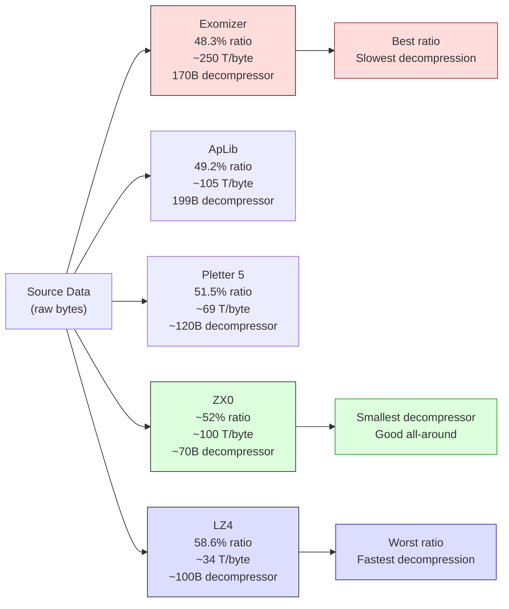

# Capítulo 14: Compresión --- Más datos en menos espacio

El ZX Spectrum 128K tiene 128 kilobytes de RAM. Eso suena generoso hasta que empiezas a restar: la pantalla toma 6.912 bytes (6.144 píxeles + 768 atributos), las variables del sistema reclaman su parte, el reproductor de música AY y sus datos de patrones quieren un banco o dos, tu código ocupa otros cuantos miles de bytes, y la pila necesita espacio para respirar. Para cuando te sientas a almacenar el contenido real de tu demo --- los gráficos, los fotogramas de animación, las tablas de consulta precalculadas --- estás luchando por cada byte.

Una sola imagen de pantalla completa en el Spectrum son 6.912 bytes. Una intro de 4K puede contener aproximadamente 0,6 de una. Una demo de 48K podría teóricamente contener siete pantallas sin nada más. Pero las demos no son presentaciones de diapositivas. Tienen música. Tienen código. Tienen efectos que demandan tablas de datos precalculados. La pregunta no es si comprimir --- es qué compresor usar, y cuándo.

Este capítulo está construido alrededor de un benchmark. En 2017, Introspec (spke, Life on Mars) publicó "Data Compression for Modern Z80 Coding" en Hype --- una comparación meticulosa de diez herramientas de compresión probadas contra un corpus cuidadosamente diseñado. Ese artículo, con sus 22.000 vistas y cientos de comentarios, se convirtió en la referencia que los programadores de ZX consultan al elegir un compresor. Recorreremos sus resultados, entenderemos las compensaciones, y aprenderemos a elegir la herramienta correcta para cada trabajo.

---

## El problema de la memoria

Seamos concretos sobre las restricciones. Considera Break Space de Thesuper (Chaos Constructions 2016, 2do lugar) --- una demo con 19 escenas ejecutándose en un ZX Spectrum 128K. Una de esas escenas, el Magen Fractal de psndcj, muestra 122 fotogramas de animación. Cada fotograma es una pantalla completa de 6.912 bytes. Sin comprimir, eso son 843.264 bytes --- más de seis veces la RAM total de la máquina.

psndcj comprimió los 122 fotogramas en 10.512 bytes. Eso es el 1,25% del tamaño original. Toda la animación, cada fotograma, cabe en menos espacio que dos pantallas sin comprimir.

Otra escena en Break Space, la animación Mondrian, empaqueta 256 fotogramas dibujados a mano --- cada cuadrado cortado por separado, comprimido individualmente --- en 3 kilobytes.

Estos no son ejercicios teóricos. Son técnicas de producción de una demo que compitió en una de las fiestas más prestigiosas de la escena. La compresión no es una optimización que aplicas al final. Es una decisión arquitectónica fundamental que determina lo que tu demo puede contener.

### La compresión como amplificador de ancho de banda

Introspec articuló la idea que eleva la compresión de un truco de almacenamiento a una técnica de rendimiento: **la compresión actúa como un método para aumentar el ancho de banda efectivo de memoria**.

Supón que un efecto necesita 2 KB de datos por fotograma. Almacénalo comprimido a 800 bytes y descomprime con LZ4 a 34 T-states por byte de salida. La descompresión cuesta 69.632 T-states --- casi exactamente un fotograma. Pero puedes solaparla con el tiempo de borde, hacer doble búfer un fotograma por adelantado, e intercalar con el renderizado del efecto. El resultado: más datos fluyendo a través del sistema que lo que el bus podría entregar desde almacenamiento sin comprimir. El descompresor es un amplificador de datos.

---

## El benchmark

Introspec no simplemente ejecutó cada compresor en unos pocos archivos y miró los resultados a ojo. Diseñó un corpus y midió sistemáticamente.

### El corpus

Los datos de prueba totalizaron 1.233.995 bytes en cinco categorías:

- **Corpus Calgary** --- el benchmark académico estándar de compresión (texto, binario, mixto)
- **Corpus Canterbury** --- un estándar académico más moderno
- **30 gráficos de ZX Spectrum** --- pantallas de carga, imágenes multicolor, pantallas de juego
- **24 archivos de música** --- patrones PT3, volcados de registros AY, datos de muestras
- **Datos ZX misceláneos** --- mapas de baldosas, tablas de consulta, datos mixtos de demo

Esta mezcla importa. Un compresor que sobresale en texto en inglés puede tener dificultades con gráficos de ZX, donde largas series de ceros en el área de píxeles alternan con datos de atributos casi aleatorios. Probar con datos reales del Spectrum --- los datos que realmente comprimirás --- es esencial.

### Los resultados

Diez herramientas. Medidas en tamaño total comprimido (menor es mejor), velocidad de descompresión en T-states por byte de salida (menor es más rápido), y tamaño del código del descompresor en bytes (menor es mejor para producciones de sizecoding).

| Herramienta | Comprimido (bytes) | Tasa | Velocidad (T/byte) | Tamaño del descompresor | Notas |
|------|-------------------|-------|-----------------|-------------------|-------|
| **Exomizer** | 596.161 | 48,3% | ~250 | ~170 bytes | Mejor tasa de compresión |
| **ApLib** | 606.833 | 49,2% | ~105 | 199 bytes | Buen equilibrio |
| PuCrunch | 616.855 | 50,0% | --- | --- | Alternativa LZ compleja |
| Hrust 1 | 613.602 | 49,7% | --- | --- | Desempaquetador de pila reubicable |
| **Pletter 5** | 635.797 | 51,5% | ~69 | ~120 bytes | Rápido + compresión decente |
| MegaLZ | 636.910 | 51,6% | ~130 | ~110 bytes | Revivido por Introspec en 2019 |
| **ZX7** | 653.879 | 53,0% | ~107 | **69 bytes** | Descompresor diminuto |
| **ZX0** | --- | ~52% | ~100 | **~70 bytes** | Sucesor de ZX7 |
| **LZ4** | 722.522 | 58,6% | **~34** | ~100 bytes | Descompresión más rápida |
| Hrum | --- | ~52% | --- | --- | Declarado obsoleto |

Solo Exomizer rompió la barrera de los 600.000 bytes en todo el corpus. Pero la velocidad de descompresión de Exomizer --- aproximadamente 250 T-states por byte de salida --- lo hace impráctico para cualquier cosa que necesite descomprimir durante la reproducción.

### El triángulo de compensaciones

Cada compresor hace una compensación entre tres cualidades:

1. **Tasa de compresión** --- cuánto se reduce el dato comprimido
2. **Velocidad de descompresión** --- cuántos T-states por byte de salida
3. **Tamaño del código del descompresor** --- cuántos bytes ocupa la rutina de descompresión

No puedes tener las tres. Exomizer gana en tasa pero es lento para descomprimir y tiene un descompresor grande. LZ4 es el más rápido para descomprimir pero desperdicia 10 puntos porcentuales de tasa de compresión. ZX7 tiene un descompresor de 69 bytes pero comprime menos agresivamente que Exomizer.

El genio de Introspec fue mapear estas compensaciones en una frontera de Pareto --- una curva donde ninguna herramienta puede mejorar en una dimensión sin perder en otra. Si un compresor está dominado en los tres ejes por otra herramienta, es obsoleto. Si está en la frontera, es la elección correcta para algún caso de uso.

<!-- figure: ch14_compression_tradeoff -->



> **El compromiso:** Menor tamaño comprimido = descompresión más lenta. Ningún compresor gana en los tres ejes (ratio, velocidad, tamaño del descompresor). Elige según tu caso de uso: Exomizer para cargas únicas, LZ4 para streaming en tiempo real, ZX0 para intros de sizecoding.

Sus recomendaciones prácticas son nítidas:

- **Máxima compresión, velocidad irrelevante:** Exomizer. Usar para descompresión única al momento de carga --- pantallas de carga, datos de nivel, cualquier cosa que desempaques una vez en un búfer y uses repetidamente.
- **Buena compresión, velocidad moderada (~105 T/byte):** ApLib. Una elección sólida de propósito general cuando necesitas una tasa decente y puedes permitirte ~105 T-states por byte.
- **Descompresión rápida (~69 T/byte):** Pletter 5. Cuando necesitas descomprimir durante el juego o entre escenas y no puedes permitirte el lento desempaquetado de Exomizer.
- **Descompresión más rápida (~34 T/byte):** LZ4. La única opción para streaming en tiempo real --- descomprimir datos mientras los reproduces. A 34 T-states por byte de salida, LZ4 puede descomprimir más de 2.000 bytes por fotograma. Eso es una tubería de datos de 2 KB/fotograma.
- **Descompresor más pequeño (69--70 bytes):** ZX7 o ZX0. Cuando el propio descompresor debe ser diminuto --- en intros de 256 bytes, 512 bytes o 1K donde cada byte de código cuenta.

Deja que estos números guíen tus decisiones. No hay un compresor universalmente "mejor". Solo hay el mejor compresor para tus restricciones específicas.

---

## Cómo funciona la compresión LZ

Todos los compresores en la tabla anterior pertenecen a la familia Lempel-Ziv. Entender la idea central te ayuda a predecir qué datos se comprimen bien y cuáles no.

La compresión LZ reemplaza secuencias de bytes repetidas con retro-referencias. Una coincidencia dice: "copia N bytes desde la posición P bytes atrás en el flujo ya decodificado." El flujo comprimido alterna entre **literales** (bytes crudos sin coincidencia útil) y **coincidencias** (pares de desplazamiento + longitud que referencian la salida anterior).


Las diferencias entre compresores se reducen a la codificación: cuántos bits para el desplazamiento, cuántos para la longitud, cómo señalar literal vs coincidencia. Exomizer usa códigos sofisticados de longitud variable a nivel de bit que comprimen ajustadamente pero requieren una extracción de bits cuidadosa para decodificar --- de ahí los ~250 T-states por byte. LZ4 usa tokens alineados a byte que el Z80 procesa con desplazamientos y máscaras simples --- de ahí ~34 T-states por byte al coste de 10 puntos porcentuales de tasa. ZX0 usa banderas de un solo bit (0 = literal, 1 = coincidencia) con códigos intercalados Elias para longitudes, alcanzando un punto dulce entre tamaño y velocidad.

Los datos del ZX Spectrum se comprimen bien porque tienen estructura: grandes áreas de bytes idénticos (fondos negros, atributos en blanco), patrones repetidos (baldosas, fuentes, UI), y datos de píxeles correlacionados a intervalos regulares. La música también se comprime bien --- los patrones PT3 están llenos de secuencias de notas repetidas y filas vacías. Lo que se comprime mal: datos aleatorios, datos ya comprimidos, y archivos muy cortos donde la sobrecarga de codificación excede los ahorros.

---

## ZX0 --- La elección del programador de sizecoding

ZX0, creado por Einar Saukas, es el sucesor espiritual de ZX7 y se ha convertido en el compresor predeterminado para el desarrollo moderno de ZX Spectrum. Merece atención especial.

### Por qué existe ZX0

ZX7 ya era notable: un descompresor de 69 bytes que lograba tasas de compresión respetables. Pero Saukas vio espacio para mejorar. ZX0 usa un algoritmo de análisis óptimo --- no solo encuentra buenas coincidencias, encuentra la *mejor secuencia posible* de coincidencias y literales para todo el archivo. El resultado son tasas de compresión cercanas a compresores mucho más grandes, con un descompresor que se mantiene en el rango de 70 bytes.

### El descompresor

El descompresor Z80 para ZX0 es ensamblador optimizado a mano, diseñado específicamente para el conjunto de instrucciones del Z80. Explota el registro de banderas del Z80, sus instrucciones de transferencia de bloques, y la temporización exacta de los saltos condicionales para exprimir máxima funcionalidad en mínimos bytes. Aquí está el tipo de código del que hablamos:

```z80 id:ch14_the_decompressor
; ZX0 decompressor — standard version
; HL = source (compressed data)
; DE = destination (output buffer)
; Uses: AF, BC, DE, HL
dzx0_standard:
        ld      bc, $ffff       ; initial offset = -1
        push    bc
        inc     bc              ; BC = 0 (literal length counter)
        ld      a, $80          ; bit buffer: only flag bit set
dzx0s_literals:
        call    dzx0s_elias     ; read literal length
        ldir                    ; copy literals
        add     a, a            ; read flag bit
        jr      c, dzx0s_new_offset
        call    dzx0s_elias     ; read match length
        ex      (sp), hl        ; retrieve offset from stack
        push    hl              ; put it back
        add     hl, de          ; calculate match address
        ldir                    ; copy match
        add     a, a            ; read flag bit
        jr      nc, dzx0s_literals
dzx0s_new_offset:
        ; ... offset decoding continues ...
```

Cada instrucción cumple doble función. El acumulador sirve tanto como búfer de bits como registro de trabajo. La pila guarda el último desplazamiento usado para coincidencias repetidas. La instrucción LDIR maneja tanto la copia de literales como la copia de coincidencias, manteniendo el código pequeño.

Con aproximadamente 70 bytes, todo el descompresor cabe en menos espacio que una sola fila de caracteres del ZX Spectrum. Para una intro de 256 bytes, eso deja 186 bytes para todo lo demás --- el efecto, la animación, la música. Para una intro de 4K, 70 bytes son una sobrecarga insignificante. Por eso ZX0 se ha vuelto ubicuo.

### Cuándo usar ZX0

- **Intros de 256 bytes a 1K:** El descompresor diminuto es esencial. Cada byte ahorrado en el descompresor es un byte disponible para contenido.
- **Intros de 4K:** ZX0 puede descomprimir 4.096 bytes en 15--30 KB de código y datos. Megademica de SerzhSoft (1er lugar, Revision 2019) usó exactamente esta estrategia para meter lo que los críticos llamaron "una demo new-school completa" en una intro de 4K.
- **Desarrollo general de demos y juegos:** Cuando necesitas un compresor sólido todo-terreno con una huella pequeña. ZX0 no es el descompresor más rápido, pero es suficientemente rápido para descompresión única al momento de carga, y su tasa es competitiva con herramientas que tienen descompresores mucho más grandes.
- **RED REDUX** (2025) usó la variante más nueva ZX2 (también de Saukas) para lograr la hazaña notable de incluir música Protracker en una intro de 256 bytes.

ZX0 no es la elección correcta para streaming en tiempo real (usa LZ4) o para máxima compresión a cualquier coste (usa Exomizer). Pero para la gran mayoría de proyectos de ZX Spectrum, es el valor predeterminado correcto.

---

## RLE y codificación delta

No todo necesita un compresor LZ completo. Dos técnicas más simples manejan tipos de datos específicos más efectivamente.

### RLE: Codificación por longitud de series

El esquema más simple: reemplazar una serie de bytes idénticos con un conteo y un valor. El descompresor es trivial:

```z80 id:ch14_rle_run_length_encoding
; Minimal RLE decompressor — HL = source, DE = destination
rle_decompress:
        ld      a, (hl)         ; read count
        inc     hl
        or      a
        ret     z               ; count = 0 means end
        ld      b, a
        ld      a, (hl)         ; read value
        inc     hl
.fill:  ld      (de), a
        inc     de
        djnz    .fill
        jr      rle_decompress
```

Solo 12 bytes de código del descompresor. RLE comprime maravillosamente cuando los datos contienen series largas --- pantallas en blanco, fondos de color sólido, rellenos de atributos. Comprime terriblemente en arte de píxeles complejo. La ventaja sobre LZ: para intros de sizecoding donde incluso los 70 bytes de ZX0 se sienten caros, un esquema RLE de 12 bytes libera espacio precioso.

RLE también se beneficia de la **transposición de datos**: si tus datos son un bloque 2D (ej., 32×24 atributos) donde las columnas son más uniformes que las filas, transponer a orden columna-principal crea series más largas. El coste es una pasada de des-transposición después de la descompresión (~13 T-states/byte). Si el total (descompresor de 12 bytes + código de des-transposición + datos comprimidos) supera a ZX0 (descompresor de 70 bytes + datos comprimidos) depende de tus datos --- mide ambos.

> **Recuadro: El RLE Auto-Modificable de Ped7g --- 9 Bytes que se Reescriben a Sí Mismos**
>
> Para intros de 256 bytes, incluso 12 bytes se siente caro. Ped7g (Peter Helcmanovsky, mantenedor de sjasmplus) contribuyó un desempaquetador RLE auto-modificable que comprime el decodificador en sí a **9 bytes de código central** --- y el mecanismo de salida está integrado en el flujo de datos.
>
> El truco: los datos RLE residen en memoria *antes* del código del desempaquetador. El flujo de datos termina con los bytes `$18, $00`, que el desempaquetador escribe en el búfer de destino en una posición calculada de modo que los bytes sobrescriben la instrucción `ld (hl),c`. La secuencia de bytes `$18, $23` se ensambla como `jr +$23`, que salta hacia adelante más allá del desempaquetador hasta el código principal de la intro. Los datos literalmente reescriben el código para terminarse a sí mismo.
>
> Aquí está la mini-intro completa funcional --- un binario de 120 bytes que llena la pantalla con franjas de colores usando solo el RLE auto-modificable:
>
> ```z80 id:ch14_ped7g_rle_mini_intro
> ; Ped7g's self-modifying RLE mini-intro
> ; Assemble with sjasmplus: sjasmplus rle_intro.a80
> ;
> ; The RLE data is a stream of (value, count) pairs read via POP BC.
> ; SP walks through the data as a read pointer.
> ; The db $18,$00 at the end of the data stream overwrites ld (hl),c
> ; to become jr +$23, exiting the depack loop into intro_start.
> ;
> ; Contributed by Ped7g (Peter Helcmanovsky) — sjasmplus maintainer
> ; and ZX Spectrum Next contributor. Used with permission.
>
>     DEVICE ZXSPECTRUM48, $8000
>
> target  EQU $4000
>     ORG $5B00              ; loading address → print buffer
>
> intro_data:
>     dw  target             ; initial HL value (POP HL)
> ; RLE pairs: value, count (count=0 means 256 iterations)
>     .(4*3) db $AA, 0, $00, 0    ; alternating stripe pattern
>     db  $43, 32*2, $44, 32*4, $45, 32*3, $46, 32*2, $47, 32*2
>     db  $46, 32*2, $45, 32*3, $44, 32*4, $43, 32*2
>     db  $18, $00           ; data that will overwrite ld (hl),c
>                            ; creating jr rle_loop_inner+$25
> rle_start:
>     ei                     ; simulate post-LOAD BASIC environment
>     ld  sp, intro_data
>     pop hl                 ; HL = target address
> rle_loop_outer:
>     pop bc                 ; C = value, B = repeat count
> rle_loop_inner:
>     ld  (hl), c            ; ← THIS instruction gets overwritten
>     inc hl                 ;   by the $18,$00 data to become
>     djnz rle_loop_inner    ;   jr +$23, jumping to intro_start
>     jr  rle_loop_outer
> ; 31 bytes of space — fill with helper code
>     ds  $1F
> intro_start:
>     assert $ == rle_loop_inner + 2 + $23
>     inc a
>     and 7
>     out (254), a           ; cycle border colours
>     jr  intro_start
>
>     SAVESNA "rle_intro.sna", rle_start
>     SAVEBIN "rle_intro.bin", intro_data, $ - intro_data
> ```
>
> 
>
> **Análisis del conteo de bytes.** El bucle de desempaquetado tiene 9 bytes: `pop bc` (1) + `ld (hl),c` (1) + `inc hl` (1) + `djnz` (2) + `jr` (2) + `pop hl` (1) + `ld sp,nn` (3) = 9 de núcleo + 6 de configuración = **15 bytes en total** para un decodificador RLE autónomo con salida integrada. Compara con el RLE mínimo de 12 bytes de la sección anterior, que aún necesita configuración externa y una verificación de terminación.
>
> **Seguridad de interrupciones.** SP se usa como puntero de datos, así que las interrupciones corromperán la pila. El `ei` al inicio es intencional --- en una intro de 256 bytes cargada desde BASIC, las interrupciones ya están habilitadas. La interrupción ocasional escribe en datos ya consumidos detrás del puntero SP, así que el desempaquetado se completa correctamente. Para el código de la intro en sí, SP se ha movido más allá de los datos y la pila funciona normalmente. Pero no combines esta técnica con IM2 o música dirigida por interrupciones.
>
> **Variantes avanzadas.** Ped7g nota varias estrategias de salida alternativas: (1) si el área de destino se extiende detrás del código de desempaquetado, los datos RLE pueden sobrescribir el desplazamiento de `jr rle_loop_outer` para saltar más lejos; (2) el truco `jp $C3C3` --- coloca valores `$C3` en los datos con conteos exactos para que DJNZ termine cuando `jp $C3C3` se ensamble en memoria, y alinea la intro para que la dirección $C3C3 sea el código de continuación. Como dice Ped7g: "puedes inventar muchas cosas así --- siempre depende de la situación específica."
>
> **Crédito:** Contribuido por Ped7g (Peter Helcmanovsky) --- mantenedor de sjasmplus y colaborador del ZX Spectrum Next. Usado con permiso.

### Codificación delta: almacenar lo que cambió

La codificación delta almacena diferencias entre valores consecutivos en lugar de valores absolutos. ¿Dos fotogramas de animación que son 90% idénticos? Almacena solo los bytes que cambiaron --- una lista de pares (posición, nuevo_valor). Si solo difieren 691 bytes de 6.912, el delta es 2.073 bytes (3 bytes por cambio) en lugar de un fotograma completo. Aplica LZ encima del flujo delta y se comprime aún más --- el flujo de diferencias tiene más ceros y pequeños valores repetidos que los datos crudos del fotograma.

El Magen Fractal de Break Space explota esto: 122 fotogramas a 6.912 bytes cada uno, comprimidos a 10.512 bytes en total, porque cada fotograma difiere del anterior en una cantidad pequeña. Delta + LZ es la cadena estándar para animaciones de múltiples fotogramas, mapas de baldosas con desplazamiento, y animaciones de sprites donde la figura cambia de pose pero el fondo permanece fijo.

---

## Preparación de Datos Pre-Compresión

La codificación delta no es el único truco. El compresor solo ve el flujo de bytes que le proporcionas. Si reestructuras los datos antes de la compresión, el mismo algoritmo LZ puede lograr ratios drásticamente diferentes. Este es el arte de la preparación pre-compresión --- y a menudo es más valioso que cambiar de empaquetador.

### Entropía: el suelo teórico

La entropía de Shannon mide los bits mínimos por byte necesarios para representar tus datos, asumiendo un codificador ideal. Un flujo de bytes completamente aleatorio tiene una entropía de 8,0 bits/byte --- incompresible. Un archivo de bytes idénticos tiene entropía 0,0. Los datos reales del Spectrum caen en algún punto intermedio. Una tabla de seno sin procesar podría tener una entropía de 6,75 bits/byte. Aplica codificación delta, y baja a 2,85. Aplica la segunda derivada, y cae a 1,49 --- una reducción del 78%. Ese es el margen teórico con el que el compresor tiene que trabajar.

No necesitas computar la entropía a mano. La fórmula es lo suficientemente simple para un script de Python:

```python
import math
from collections import Counter

def entropy(data: bytes) -> float:
    """Shannon entropy in bits per byte. Lower = more compressible."""
    counts = Counter(data)
    n = len(data)
    return -sum(c/n * math.log2(c/n) for c in counts.values())
```

Ejecuta esto en tus datos sin procesar, luego en datos codificados con delta, luego en datos transpuestos. La transformación que dé la menor entropía se comprimirá mejor, independientemente del empaquetador que uses.

### La segunda derivada: datos sinusoidales y cuadráticos

La codificación delta almacena las primeras diferencias: `d[i] = data[i] - data[i-1]`. Para una rampa lineal (0, 3, 6, 9...), el flujo delta es constante (3, 3, 3...) --- perfecto para compresión. Pero las ondas sinusoidales y las curvas suaves producen un flujo delta que a su vez varía suavemente. La segunda derivada (delta del delta) captura esto:

| Tipo de datos | Entropía sin procesar | 1ª derivada | 2ª derivada |
|---|---|---|---|
| Tabla de seno (256B) | 6,75 | 2,85 | **1,49** |
| Rampa lineal | 7,00 | 0,00 | 0,00 |
| Curva cuadrática | 6,80 | 3,20 | **0,00** |
| Bytes aleatorios | 8,00 | 8,00 | 8,00 |

La segunda derivada de una función cuadrática es una constante. Esto no es cálculo abstracto --- es la diferencia entre 6,80 y 0,00 bits por byte. Una tabla de consulta cuadrática de 256 bytes, codificada con segunda derivada, se comprime a casi nada.

Aquí está la perspicacia creativa: la decadencia sinusoidal y la decadencia cuadrática son a menudo visualmente indistinguibles en un efecto de demo. Si estás animando una partícula que desacelera, la audiencia no puede distinguir si usaste `sin(t)` o `at² + bt + c`. Pero el compresor sí: la versión cuadrática tiene una primera derivada perfectamente lineal y una segunda derivada constante. Si tu animación puede tolerar una aproximación cuadrática, ahorras bytes no cambiando de compresor, sino cambiando de curvas.

### Transposición: columna-principal para datos tabulares

Los datos de la demoscene a menudo son tabulares --- tablas de vértices 3D (X, Y, Z por vértice), fotogramas clave de animación (ángulo, radio, velocidad por fotograma), paletas de colores (R, G, B por entrada). Cuando se almacenan en orden fila-principal (X₀ Y₀ Z₀ X₁ Y₁ Z₁...), los bytes consecutivos son de diferentes columnas con diferentes propiedades estadísticas. La codificación delta empeora esto:

```
Row-major:  128 64 200 129 63 201 130 62 202 ...
Delta:        64 136  57 190 138  57 190 138 ...  (wild jumps between columns)
```

Transpón a columna-principal (X₀ X₁ X₂... Y₀ Y₁ Y₂... Z₀ Z₁ Z₂...) y ahora los bytes consecutivos son de la misma columna. La codificación delta ahora ve progresiones suaves:

```
Column-major: 128 129 130 131 ... 64 63 62 61 ... 200 201 202 203 ...
Delta:          1   1   1   1 ...  -1  -1  -1 ...    1   1   1   1 ...  (trivial)
```

Los números son contundentes. Una tabla de vértices de 768 bytes (256 vértices × 3 columnas):

| Disposición | Entropía (sin procesar) | Entropía (delta) |
|---|---|---|
| Fila-principal (X,Y,Z entrelazados) | 7,52 | 7,66 (¡peor!) |
| Columna-principal, stride 3 | 7,52 | **2,58** |

La codificación delta en datos fila-principal *aumentó* la entropía. El mismo delta en datos transpuestos la redujo un 65%. El compresor no sabe que tus datos son tabulares --- tienes que decírselo, reordenando.

La regla: si tus datos tienen columnas con diferentes patrones, **siempre transpón antes de comprimir**. El stride (número de columnas) no necesita adivinarse --- prueba algunos divisores de la longitud de datos y elige el que dé la menor entropía delta.

En el Spectrum, el descompresor simplemente escribe bytes secuencialmente. La transposición ocurre en tus herramientas de compilación, no en tiempo de ejecución. Coste en tiempo de ejecución: cero.

### Entrelazado de planos: máscaras y píxeles

Los sprites con máscaras son un caso especial de transposición. Almacenados como máscara-píxel-máscara-píxel por fila, los bytes consecutivos alternan entre dos distribuciones completamente diferentes (las máscaras son mayormente $FF o $00; los píxeles tienen valores diversos). Separa todos los bytes de máscara de todos los bytes de píxeles:

```
Before: FF 3C FF 18 FF 00 ...  (mask, pixel, mask, pixel)
After:  FF FF FF ... 3C 18 00 ...  (all masks, then all pixels)
```

El bloque de máscaras se comprime a casi nada (series largas de $FF). El bloque de píxeles se comprime normalmente. El ratio combinado mejora un 10--20% respecto al almacenamiento entrelazado, dependiendo de la complejidad del sprite.

### Detección de patrones: cuándo no comprimir

A veces los datos tienen estructura que un generador puede reproducir más económicamente que un descompresor. Si tus datos son periódicos con período *P*, almacenar un período más un pequeño bucle de reproducción ocupa *P* + ~10 bytes. Si *P* es pequeño en relación al total de datos, esto supera a cualquier compresor.

Las tablas de seno son el caso canónico. Una tabla de seno de 256 bytes se comprime a ~140 bytes con ZX0. Pero un generador de seno compatible con el Spectrum (usando la calculadora ROM o un kernel CORDIC) produce los mismos 256 bytes desde menos de 30 bytes de código. Para precisión de calidad demo, incluso una simple aproximación cuadrática por cuarto de onda es suficiente.

El árbol de decisión: (1) ¿Puedes generarlo a partir de una fórmula en menos bytes que el tamaño comprimido? Genera. (2) ¿Son los datos periódicos? Almacena un período + bucle. (3) ¿Son los datos tabulares? Transpón + delta + LZ. (4) ¿Son los datos fotogramas secuenciales? Delta + LZ. (5) ¿Ninguno de los anteriores? Simplemente comprímelo.

### Transformaciones prácticas para datos comunes de demo

| Tipo de datos | Mejor pre-transformación | Por qué |
|---|---|---|
| Tablas de seno/coseno | 2ª derivada, o generar en tiempo de ejecución | Aceleración suave → 2ª derivada constante |
| Tablas de vértices 3D | Transponer (stride = campos por vértice) + delta | Separa ejes; trayectorias suaves por eje |
| Animación precalculada | Delta entre fotogramas + LZ | Alta redundancia entre fotogramas |
| Volcados de registros AY | Transponer (stride = 14, uno por registro) + delta | Cada registro varía suavemente entre fotogramas |
| Rampas de color / gradientes | 1ª derivada | Progresión lineal o casi lineal |
| Mapas de tiles | Transponer (stride = ancho del mapa) + delta | Localidad espacial: tiles adyacentes son similares |
| Datos de fuente bitmap | Separar planos de bits, o almacenar como 1 bit + RLE | Muchos bytes cero en descendentes |
| Posiciones de partículas | Ordenar por un eje, luego codificar delta cada eje | El orden clasificado maximiza la compresión delta |

La perspicacia clave: **cada byte que ahorras con una pre-transformación gratuita es un byte que no necesitas que un empaquetador más caro ahorre**. Transponer + delta + Pletter 5 (descompresor rápido) a menudo supera a Exomizer sin procesar (descompresor lento) en datos estructurados. Obtienes un mejor ratio *y* descompresión más rápida.

---

## La cadena de producción práctica

Entender los algoritmos de compresión es útil. Integrarlos en tu cadena de compilación es esencial.

### De activo a binario

La cadena: activo fuente (PNG) --> conversor (png2scr) --> compresor (zx0) --> ensamblador (sjasmplus) --> archivo .tap. El compresor se ejecuta en tu máquina de desarrollo, no en el Spectrum. Para ZX0: `zx0 screen.scr screen.zx0`. Incluye el resultado con la directiva INCBIN de sjasmplus:

```z80 id:ch14_from_asset_to_binary
compressed_screen:
    incbin "assets/screen.zx0"
```

En tiempo de ejecución, descomprime con una simple llamada:

```z80 id:ch14_from_asset_to_binary_2
    ld   hl, compressed_screen    ; source: compressed data
    ld   de, $4000                ; destination: screen memory
    call dzx0_standard            ; decompress
```

### Integración con Makefile

El paso de compresión pertenece a tu Makefile, no a tu cabeza:

```makefile
%.zx0: %.scr
	zx0 $< $@

demo.tap: main.asm assets/screen.zx0
	sjasmplus main.asm --raw=demo.bin
	bin2tap demo.bin demo.tap
```

Cambia un PNG fuente, ejecuta `make`, y el binario comprimido se regenera automáticamente. Sin pasos manuales, sin recompresión olvidada.

### Ejemplo: pantalla de carga con ZX0

Un ejemplo mínimo completo --- descomprimir una pantalla de carga a la memoria de vídeo y esperar a que se pulse una tecla:

```z80 id:ch14_example_loading_screen_with
; loading_screen.asm — assemble with sjasmplus
        org  $8000
start:
        ld   hl, compressed_screen
        ld   de, $4000
        call dzx0_standard

.wait:  xor  a
        in   a, ($fe)
        cpl
        and  $1f
        jr   z, .wait
        ret

        include "dzx0_standard.asm"

compressed_screen:
        incbin "screen.zx0"

        display "Total: ", /d, $ - start, " bytes"
```


Usa la directiva DISPLAY de sjasmplus para imprimir información de tamaño durante el ensamblaje. Siempre sabe exactamente qué tan grandes son tus datos comprimidos --- la diferencia entre ZX0 y Exomizer en una sola pantalla de carga puede ser 400 bytes, y a lo largo de 8 escenas eso se acumula.

### Eligiendo el compresor correcto

Pregunta en orden: (1) ¿Intro de sizecoding? ZX0/ZX7 --- el descompresor de 69--70 bytes es innegociable. (2) ¿Streaming en tiempo real? LZ4 --- nada más es suficientemente rápido. (3) ¿Carga única? Exomizer --- máxima tasa, velocidad irrelevante. (4) ¿Necesitas un equilibrio? ApLib o Pletter 5, ambos en la frontera de Pareto. (5) ¿Datos llenos de series idénticas? RLE personalizado. (6) ¿Fotogramas de animación secuenciales? Codificación delta primero, luego LZ.

---

## El renacimiento de MegaLZ

En 2017, Introspec declaró MegaLZ "moralmente obsoleto." Dos años después, él mismo lo resucitó.

La idea: el *formato* de compresión y la *implementación del descompresor* son problemas separables. El formato de MegaLZ era bueno --- el primer compresor del Spectrum en usar un analizador óptimo (LVD, 2005), con códigos gamma de Elias y una ventana ligeramente más grande que Pletter 5. Lo que era malo era el descompresor Z80. Introspec escribió dos nuevos:

- **Compacto:** 92 bytes, ~98 T-states por byte
- **Rápido:** 234 bytes, ~63 T-states por byte --- más rápido que tres LDIRs consecutivos

Con estos descompresores, MegaLZ "supera cómodamente a Pletter 5 y ZX7" en la métrica combinada de tasa más velocidad. La lección: no asumas que un compresor está muerto. El formato es la parte difícil. El descompresor es código Z80, y el código Z80 siempre se puede reescribir.

---

## Lo que los números significan en la práctica

**Intro de 4K:** 4.096 bytes en total. Descompresor ZX0: ~70 bytes. Motor + música + efectos: ~2.400 bytes. Eso deja ~1.626 bytes para datos comprimidos, que se descomprimen a ~3.127 bytes de activos crudos. Megademica de SerzhSoft (1er lugar, Revision 2019) comprimió efectos de túnel, transiciones, música AY, y cambios rápidos de escena en exactamente 4.096 bytes. Fue nominada para Outstanding Technical Achievement en los Meteoriks.

**Streaming en tiempo real:** Necesitas 2 KB de datos por fotograma a 50 fps. LZ4 a 34 T/byte descomprime 2.048 bytes en 69.632 T-states --- casi exactamente un fotograma (69.888 T-states en 48K). Ajustado pero factible con descompresión superpuesta en tiempo de borde. ApLib necesitaría 215.040 T-states para los mismos datos --- más de tres fotogramas. Exomizer más de siete. Para streaming, LZ4 es la única opción.

**Demo multi-escena de 128K:** Ocho escenas, cada una con una pantalla de carga de 6.912 bytes. Exomizer comprime cada una a ~3.338 bytes; ZX0 a ~3.594 bytes. La diferencia: 256 bytes por pantalla, 2.048 bytes en 8 escenas. Cuando la descompresión sucede durante las transiciones de escena, la lenta descompresión de Exomizer es invisible. Los 2 KB de ahorro no lo son.

**Intro de 256 bytes:** El descompresor de 70 bytes de ZX0 deja 186 bytes para todo. Más comúnmente a este tamaño, te saltas LZ y generas datos proceduralmente con generadores LFSR y llamadas a la calculadora de la ROM. Pero cuando necesitas datos específicos no algorítmicos --- una rampa de color, un fragmento de bitmap --- ZX0 sigue siendo la herramienta.

---

## Resumen: La hoja de referencia del compresor

| Tu situación | Usa esto | Por qué |
|---|---|---|
| Carga única, máxima tasa | Exomizer | 48,3% tasa, velocidad irrelevante |
| Propósito general, buen equilibrio | ApLib | 49,2% tasa, ~105 T/byte |
| Necesitas velocidad + tasa decente | Pletter 5 | 51,5% tasa, ~69 T/byte |
| Streaming en tiempo real | LZ4 | ~34 T/byte, 2+ KB por fotograma |
| Intro de sizecoding (256b--1K) | ZX0 / ZX7 | Descompresor de 69--70 bytes |
| Intro de 4K | ZX0 | Descompresor diminuto + buena tasa |
| Series de bytes idénticos | RLE (personalizado) | Descompresor bajo 30 bytes |
| Fotogramas de animación secuenciales | Delta + LZ | Explotar redundancia inter-fotograma |

Los números son la respuesta. No opiniones, no folklore, no "escuché que Exomizer es el mejor." Introspec probó diez compresores en 1,2 megabytes de datos reales del Spectrum y publicó los resultados. Usa sus números. Elige el compresor que encaje con tus restricciones. Luego pasa a la parte difícil --- hacer algo que valga la pena comprimir.

---

## Inténtalo tú mismo

1. **Comprime una pantalla de carga.** Toma cualquier archivo .scr de ZX Spectrum (busca uno en zxart.ee o crea el tuyo en Multipaint). Comprímelo con ZX0 y Exomizer. Compara los tamaños. Luego escribe el cargador mínimo mostrado en este capítulo para descomprimir y mostrarlo. Mide la descompresión usando temporización por color de borde del Capítulo 1.

2. **Mide el límite de streaming.** Escribe un bucle ajustado que descomprime datos con el descompresor estándar de ZX0 y mide cuántos bytes puede descomprimir por fotograma. Compara con el descompresor de LZ4. Verifica los números de la tabla del benchmark contra tus propias mediciones.

3. **Construye un compresor delta.** Toma dos pantallas de ZX Spectrum que difieran ligeramente (guarda una pantalla de juego, mueve un sprite, guarda de nuevo). Escribe una herramienta simple (en Python o tu lenguaje preferido) que produzca un flujo delta: una lista de pares (offset, nuevo_valor) para los bytes que difieren. Compara el tamaño del flujo delta con el tamaño de la segunda pantalla completa. Luego comprime el flujo delta con ZX0 y compara de nuevo.

4. **Integra compresión en un Makefile.** Configura un proyecto con un Makefile que automáticamente comprima activos como paso de compilación. Cambia un PNG fuente, ejecuta `make`, y verifica que el binario comprimido se regenera y el archivo .tap final se actualiza. Este es el flujo de trabajo que usarás para cada proyecto a partir de ahora.

5. **Transponer y medir.** Crea un archivo de 768 bytes con 256 tripletas (X, Y, Z) donde X es una onda sinusoidal, Y es un coseno, y Z es una rampa lineal. Mide la entropía del archivo sin procesar. Luego transpónlo (todos los valores X, luego todos los Y, luego todos los Z) y mide de nuevo. Aplica codificación delta a ambas versiones y compara. Deberías ver la versión transpuesta+delta caer por debajo de 3 bits/byte, mientras que la versión sin procesar+delta se mantiene por encima de 7. Comprime ambas con ZX0 y compara los tamaños reales --- los números de entropía predicen al ganador.

6. **La sustitución cuadrática.** Genera una tabla de seno de 256 bytes y una aproximación cuadrática de 256 bytes (ajusta `ax² + bx + c` a un cuarto de onda, espeja para el ciclo completo). Grafica ambas --- deberían ser visualmente idénticas. Ahora computa la segunda derivada de cada una. La segunda derivada del seno tiene una entropía de ~1,5 bits/byte; la del cuadrático es exactamente 0. Comprime ambas con ZX0. La versión cuadrática es más pequeña, y la animación se ve igual.

> **Fuentes:** Introspec "Data Compression for Modern Z80 Coding" (Hype, 2017); Introspec "Compression on the Spectrum: MegaLZ" (Hype, 2019); Break Space NFO (Thesuper, 2016); Einar Saukas, ZX0 (github.com/einar-saukas/ZX0); Ped7g (Peter Helcmanovsky), desempaquetador RLE auto-modificable (contribuido con permiso, 2026)
