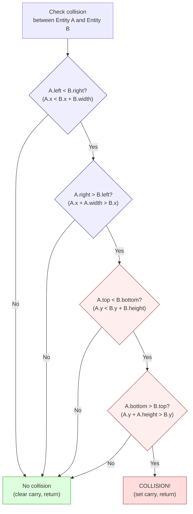

# Capítulo 19: Colisiones, física e IA enemiga

> "Todo juego es una mentira. La física es falsa. La inteligencia es una tabla de consulta. El jugador nunca se da cuenta porque las mentiras se cuentan a 50 fotogramas por segundo."

En el Capítulo 18, construimos un bucle de juego, un sistema de entidades que rastrea dieciséis objetos, y un manejador de entrada. Pero ahora mismo nuestro jugador atraviesa paredes, flota sobre el suelo, y los enemigos se quedan quietos. Un juego sin colisiones es un salvapantallas. Un juego sin física es un rompecabezas deslizante. Un juego sin IA es un arenero sin nada que te empuje de vuelta.

Este capítulo añade los tres sistemas que convierten una demo técnica en un juego: detección de colisiones, física e IA enemiga. Los tres comparten una filosofía de diseño: fíngelo lo suficientemente bien, lo suficientemente rápido, y nadie notará la diferencia. Nos basamos en la estructura de entidades del Capítulo 18 -- el registro de 16 bytes con posiciones X/Y en punto fijo 8.8, velocidad en dx/dy, tipo, estado y banderas.

---

## Parte 1: Detección de colisiones

### AABB: La única forma que necesitas

Cajas delimitadoras alineadas con los ejes (Axis-Aligned Bounding Boxes). Cada entidad obtiene un rectángulo definido por su posición y dimensiones: borde izquierdo, borde derecho, borde superior, borde inferior. Dos rectángulos se solapan si y solo si las cuatro condiciones siguientes son verdaderas:

1. El borde izquierdo de A es menor que el borde derecho de B
2. El borde derecho de A es mayor que el borde izquierdo de B
3. El borde superior de A es menor que el borde inferior de B
4. El borde inferior de A es mayor que el borde superior de B

Si alguna de estas condiciones falla, las cajas no se solapan. Esta es la **salida anticipada** que hace AABB rápido: en promedio, la mayoría de pares de entidades *no* están colisionando, así que la mayoría de comprobaciones se abortan después de una o dos comparaciones en lugar de hacer las cuatro.

<!-- figure: ch19_aabb_collision -->


> **La salida anticipada ahorra ciclos:** La mayoría de los pares de entidades están lejos entre sí. La primera prueba de solapamiento en X los rechaza en ~91 T-states. Solo los pares que pasan las cuatro pruebas (peor caso: ~270 T-states) son colisiones reales. Prueba el solapamiento horizontal primero en juegos de desplazamiento lateral -- las entidades están más separadas en X que en Y.


En el Z80, almacenamos las posiciones de las entidades como valores de punto fijo 8.8, pero para la detección de colisiones solo necesitamos la parte entera -- el byte alto de cada coordenada. Precisión a nivel de píxel es más que suficiente. Aquí tienes una rutina completa de colisión AABB:

```z80 id:ch19_aabb_the_only_shape_you_need_2
; check_aabb -- Test whether two entities overlap
;
; Input:  IX = pointer to entity A
;         IY = pointer to entity B
; Output: Carry set if collision, clear if no collision
;
; Entity structure offsets (from Chapter 18):
;   +0  x_frac    (low byte of 8.8 X position)
;   +1  x_int     (high byte -- the pixel X coordinate)
;   +2  y_frac
;   +3  y_int
;   +4  type
;   +5  state
;   +6  anim_frame
;   +7  dx_frac
;   +8  dx_int
;   +9  dy_frac
;   +10 dy_int
;   +11 health
;   +12 flags
;   +13 width     (bounding box width in pixels)
;   +14 height    (bounding box height in pixels)
;   +15 (reserved)
;
; Cost: 91-270 T-states (Pentagon), depending on early exit
; Average case (no collision): ~120 T-states

check_aabb:
    ; --- Test 1: A.left < B.right ---
    ; A.left  = A.x_int
    ; B.right = B.x_int + B.width
    ld   a, (iy+1)        ; 19T  B.x_int
    add  a, (iy+13)       ; 19T  + B.width = B.right
    ld   b, a             ; 4T   B = B.right (save for test 2)
    ld   a, (ix+1)        ; 19T  A.x_int = A.left
    cp   b                ; 4T   A.left - B.right
    jr   nc, .no_collision ; 12/7T  if A.left >= B.right, no collision
                           ; --- early exit: 91T (taken, incl. .no_collision) ---

    ; --- Test 2: A.right > B.left ---
    ; A.right = A.x_int + A.width
    ; B.left  = B.x_int
    add  a, (ix+13)       ; 19T  A.x_int + A.width = A.right
    ld   b, (iy+1)        ; 19T  B.x_int = B.left
    cp   b                ; 4T   A.right - B.left (we need A.right > B.left)
    jr   c, .no_collision  ; 12/7T  if A.right < B.left, no collision
    jr   z, .no_collision  ; 12/7T  if A.right = B.left, touching but not overlapping

    ; --- Test 3: A.top < B.bottom ---
    ld   a, (iy+3)        ; 19T  B.y_int
    add  a, (iy+14)       ; 19T  + B.height = B.bottom
    ld   b, a             ; 4T
    ld   a, (ix+3)        ; 19T  A.y_int = A.top
    cp   b                ; 4T   A.top - B.bottom
    jr   nc, .no_collision ; 12/7T  if A.top >= B.bottom, no collision

    ; --- Test 4: A.bottom > B.top ---
    add  a, (ix+14)       ; 19T  A.y_int + A.height = A.bottom
    ld   b, (iy+3)        ; 19T  B.y_int = B.top
    cp   b                ; 4T   A.bottom - B.top
    jr   c, .no_collision  ; 12/7T
    jr   z, .no_collision  ; 12/7T

    ; All four tests passed -- collision detected
    scf                    ; 4T   set carry flag
    ret                    ; 10T

.no_collision:
    or   a                 ; 4T   clear carry flag
    ret                    ; 10T
```


El direccionamiento indexado con IX/IY es cómodo pero costoso -- 19 T-states por acceso frente a 7 para `ld a, (hl)`. Para un juego con 8 enemigos y 7 balas, es aceptable. Peor caso (las cuatro pruebas pasan, colisión detectada): aproximadamente 270 T-states. Mejor caso (la primera prueba falla): aproximadamente 91 T-states. Para 8 enemigos comprobados contra el jugador, el caso promedio es alrededor de 8 x 120 = 960 T-states -- 1.3% del presupuesto de fotograma del Pentagon. Las colisiones son baratas.

**Advertencia de desbordamiento:** Las instrucciones `ADD A, (ix+13)` calculan `x + width` en un registro de 8 bits. Si una entidad está posicionada en X=240 con width=24, el resultado envuelve a 8, produciendo comparaciones incorrectas. Asegúrate de que las posiciones de las entidades estén limitadas para que `x + width` e `y + height` nunca excedan 255 -- típicamente limitando el área de juego para dejar un margen en los bordes derecho e inferior. Alternativamente, promueve la comparación a aritmética de 16 bits a costa de instrucciones adicionales.

### Ordenar las pruebas para el rechazo más rápido

El orden importa. En un juego de desplazamiento lateral, las entidades lejanas horizontalmente son el caso común. Probar primero el solapamiento horizontal rechaza estos después de dos comparaciones. Puedes ir más lejos con un pre-rechazo rápido:

```z80 id:ch19_ordering_the_tests_for
; Quick X-distance rejection before calling check_aabb
; If the horizontal distance between entities exceeds
; MAX_WIDTH (the widest entity), they cannot collide.

    ld   a, (ix+1)        ; 19T  A.x_int
    sub  (iy+1)           ; 19T  - B.x_int
    jr   nc, .pos_dx      ; 12/7T
    neg                   ; 8T   absolute value
.pos_dx:
    cp   MAX_WIDTH        ; 7T   widest possible entity
    jr   nc, .skip        ; 12/7T  too far apart, skip AABB check
    call check_aabb       ; only test close pairs
.skip:
```

Este pre-rechazo cuesta unos 60 T-states, ahorrando los 82+ T-states de la comprobación AABB completa. En un nivel con desplazamiento, típicamente solo 2-3 enemigos están lo suficientemente cerca como para necesitar la prueba completa.

### Colisiones con baldosas: El mapa de baldosas como superficie de colisión

En un juego de plataformas, el jugador colisiona con el mundo -- suelos, paredes, techos, pinchos. Usamos el propio mapa de baldosas como tabla de consulta: convertimos la posición en píxeles a un índice de baldosa, buscamos el tipo de baldosa, y ramificamos según el resultado. Una búsqueda en un arreglo reemplaza docenas de comprobaciones de rectángulos.

Asumimos un mapa de baldosas de 32x24 con baldosas de 8x8 píxeles (la cuadrícula de caracteres natural del Spectrum):

```z80 id:ch19_tile_collisions_the_tilemap
; tile_at -- Look up the tile type at a pixel position
;
; Input:  B = pixel X, C = pixel Y
; Output: A = tile type (0=empty, 1=solid, 2=hazard, 3=ladder, etc.)
;
; Map is 32 columns wide, stored row-major at 'tilemap'
; Cost: ~182 T-states (Pentagon)

tile_at:
    ld   a, c             ; 4T   pixel Y
    srl  a                ; 8T   /2
    srl  a                ; 8T   /4
    srl  a                ; 8T   /8 = tile row
    ld   l, a             ; 4T

    ; Multiply row by 32 (shift left 5)
    ld   h, 0             ; 7T
    add  hl, hl           ; 11T  *2
    add  hl, hl           ; 11T  *4
    add  hl, hl           ; 11T  *8
    add  hl, hl           ; 11T  *16
    add  hl, hl           ; 11T  *32

    ld   a, b             ; 4T   pixel X
    srl  a                ; 8T   /2
    srl  a                ; 8T   /4
    srl  a                ; 8T   /8 = tile column
    ld   e, a             ; 4T
    ld   d, 0             ; 7T
    add  hl, de           ; 11T  row*32 + column = tile index

    ld   de, tilemap      ; 10T
    add  hl, de           ; 11T  absolute address

    ld   a, (hl)          ; 7T   tile type
    ret                    ; 10T
```

Ahora comprobamos las esquinas y bordes de la entidad contra el mapa de baldosas:

```z80 id:ch19_tile_collisions_the_tilemap_2
; check_player_tiles -- Check player against tilemap
;
; Input: IX = player entity
; Output: Updates player position/velocity based on tile collisions
;
; We check up to 6 points around the player's bounding box,
; but bail out as soon as we find a solid tile.

check_player_tiles:
    ; --- Check below (feet) ---
    ; Bottom-left corner of player
    ld   b, (ix+1)        ; 19T  x_int
    ld   a, (ix+3)        ; 19T  y_int
    add  a, (ix+14)       ; 19T  + height = bottom edge
    ld   c, a             ; 4T
    call tile_at           ; 17T+body
    cp   TILE_SOLID        ; 7T
    jr   z, .on_ground     ; 12/7T

    ; Bottom-right corner
    ld   a, (ix+1)        ; 19T  x_int
    add  a, (ix+13)       ; 19T  + width
    dec  a                ; 4T   -1 (rightmost pixel of entity)
    ld   b, a
    ld   a, (ix+3)
    add  a, (ix+14)
    ld   c, a
    call tile_at
    cp   TILE_SOLID
    jr   z, .on_ground

    ; Not standing on solid ground -- apply gravity
    jr   .in_air

.on_ground:
    ; Snap Y to top of tile, clear vertical velocity
    ld   a, c              ; bottom edge Y
    and  %11111000         ; align to tile boundary (clear low 3 bits)
    sub  (ix+14)           ; subtract height to get top-left Y
    ld   (ix+3), a         ; snap y_int
    xor  a
    ld   (ix+9), a         ; dy_frac = 0
    ld   (ix+10), a        ; dy_int = 0
    set  0, (ix+12)        ; set "on_ground" flag in flags byte
    jr   .check_walls

.in_air:
    res  0, (ix+12)        ; clear "on_ground" flag

.check_walls:
    ; --- Check right (wall) ---
    ld   a, (ix+1)
    add  a, (ix+13)        ; right edge
    ld   b, a
    ld   a, (ix+3)
    add  a, 4              ; check midpoint vertically
    ld   c, a
    call tile_at
    cp   TILE_SOLID
    jr   nz, .check_left

    ; Push out left: snap X to left edge of tile
    ld   a, b
    and  %11111000
    dec  a
    sub  (ix+13)
    inc  a
    ld   (ix+1), a
    xor  a
    ld   (ix+7), a         ; dx_frac = 0
    ld   (ix+8), a         ; dx_int = 0

.check_left:
    ; --- Check left (wall) ---
    ld   b, (ix+1)         ; left edge
    ld   a, (ix+3)
    add  a, 4
    ld   c, a
    call tile_at
    cp   TILE_SOLID
    jr   nz, .check_ceiling

    ; Push out right: snap X to right edge of tile + 1
    ld   a, b
    and  %11111000
    add  a, 8
    ld   (ix+1), a
    xor  a
    ld   (ix+7), a
    ld   (ix+8), a

.check_ceiling:
    ; --- Check above (head) ---
    ld   b, (ix+1)
    ld   c, (ix+3)         ; top edge
    call tile_at
    cp   TILE_SOLID
    ret  nz

    ; Hit ceiling: push down, zero vertical velocity
    ld   a, c
    and  %11111000
    add  a, 8              ; bottom of ceiling tile
    ld   (ix+3), a
    xor  a
    ld   (ix+9), a
    ld   (ix+10), a
    ret
```

La idea clave: las búsquedas de punto en baldosa son accesos O(1) a un arreglo. Cada llamada a `tile_at` cuesta ~182 T-states. Todo el sistema de colisión con baldosas (comprobando pies, cabeza, izquierda y derecha) cuesta aproximadamente 800-1,200 T-states por entidad, independientemente del tamaño del mapa.

### Respuesta de colisión deslizante

Cuando el jugador golpea una pared mientras se mueve diagonalmente, debería *deslizarse*, no detenerse en seco. Resuelve las colisiones en cada eje independientemente:

1. Aplica la velocidad horizontal. Comprueba las colisiones horizontales con baldosas. Si está bloqueado, empuja hacia fuera y anula la velocidad horizontal.
2. Aplica la velocidad vertical. Comprueba las colisiones verticales con baldosas. Si está bloqueado, empuja hacia fuera y anula la velocidad vertical.

Esto es exactamente lo que hace `check_player_tiles` -- cada eje se maneja por separado. El movimiento diagonal contra una pared se convierte naturalmente en deslizamiento. La mayoría de los juegos de plataformas aplican X primero (controlado por el jugador), luego Y (gravedad). Experimenta con ambos órdenes y siente la diferencia.

---

## Parte 2: Física

Lo que estamos construyendo no es una simulación de cuerpo rígido -- es un pequeño conjunto de reglas que producen la *sensación* de peso e inercia. Tres operaciones cubren el 90% de lo que un juego de plataformas necesita: gravedad, salto y fricción.

### Gravedad: Caer de forma convincente

Cada fotograma, añade una constante a la velocidad vertical de la entidad:

```z80 id:ch19_gravity_falling_convincingly
; apply_gravity -- Add gravity to an entity's vertical velocity
;
; Input:  IX = entity pointer
; Output: dy updated (8.8 fixed-point, positive = downward)
;
; GRAVITY_FRAC and GRAVITY_INT define the gravity constant
; in 8.8 fixed-point. A good starting value: 0.25 per frame
; = $0040 (INT=0, FRAC=64, i.e. 64/256 = 0.25 pixels/frame^2)
;
; Cost: ~50 T-states (Pentagon)

GRAVITY_FRAC equ 40h     ; 0.25 pixels/frame^2 (fractional part)
GRAVITY_INT  equ 00h     ; (integer part)
MAX_FALL_INT equ 04h     ; terminal velocity: 4 pixels/frame

apply_gravity:
    ; Skip if entity is on the ground
    bit  0, (ix+12)       ; 20T  check on_ground flag
    ret  nz               ; 11/5T  on ground -- no gravity

    ; dy += gravity (16-bit fixed-point add)
    ld   a, (ix+9)        ; 19T  dy_frac
    add  a, GRAVITY_FRAC  ; 7T
    ld   (ix+9), a        ; 19T

    ld   a, (ix+10)       ; 19T  dy_int
    adc  a, GRAVITY_INT   ; 7T   add with carry from frac
    ld   (ix+10), a       ; 19T

    ; Clamp to terminal velocity
    cp   MAX_FALL_INT     ; 7T
    ret  c                ; 11/5T  below terminal velocity, done
    ld   (ix+10), MAX_FALL_INT ; 19T  clamp integer part
    xor  a                ; 4T
    ld   (ix+9), a        ; 19T  zero fractional part (exact clamp)
    ret                    ; 10T
```

La representación de punto fijo del Capítulo 4 está haciendo el trabajo pesado aquí. La gravedad es 0.25 píxeles por fotograma al cuadrado -- un valor que sería imposible de representar con aritmética entera. En punto fijo 8.8, es simplemente `$0040`. Cada fotograma, `dy` crece en 0.25. Después de 4 fotogramas, la entidad está cayendo a 1 píxel por fotograma. Después de 16 fotogramas, está cayendo a 4 píxeles por fotograma (velocidad terminal). La curva de aceleración se siente natural porque *es* natural -- la aceleración constante es simplemente la velocidad incrementándose linealmente.

La limitación de velocidad terminal evita que las entidades caigan tan rápido que atraviesen los suelos (el problema del "túnel"). Una velocidad máxima de caída de 4 píxeles por fotograma significa que la entidad nunca puede moverse más de la mitad de la altura de una baldosa en un fotograma, así que las comprobaciones de colisión con baldosas siempre la detectarán.

### Por qué el punto fijo importa aquí

Sin punto fijo, la gravedad es 0 o 1 píxel por fotograma -- flotar o piedra, nada intermedio. El punto fijo 8.8 te da 256 valores entre cada entero. $0040 (0.25) produce un arco suave. $0080 (0.5) se siente pesado. $0020 (0.125) se siente como un salto lunar. Ajustar estas constantes es donde tu juego encuentra su carácter. Si los fundamentos de punto fijo están borrosos, revisita el Capítulo 4.

### Salto: El impulso anti-gravedad

Saltar es la operación física más simple del juego: establece la velocidad vertical a un gran valor negativo (hacia arriba). La gravedad la desacelerará, la llevará a cero en el ápice, y la tirará de vuelta hacia abajo. El arco del salto es una parábola natural -- no se necesita ningún cálculo explícito de arco.

```z80 id:ch19_jump_the_anti_gravity_impulse
; try_jump -- Initiate a jump if the player is on the ground
;
; Input:  IX = player entity
; Output: dy set to -jump_force if on ground
;
; JUMP_FORCE defines the initial upward velocity in 8.8 fixed-point.
; A good starting value: -3.5 pixels/frame = $FC80
;   (INT = $FC = -4 signed, FRAC = $80 = +0.5, so -4 + 0.5 = -3.5)
;
; Cost: ~50 T-states (Pentagon)

JUMP_FRAC equ 80h        ; fractional part of jump force
JUMP_INT  equ 0FCh       ; integer part (-4 signed + 0.5 frac = -3.5)

try_jump:
    ; Must be on ground to jump
    bit  0, (ix+12)       ; 20T  on_ground flag
    ret  z                ; 11/5T  in air -- cannot jump

    ; Set upward velocity
    ld   (ix+9), JUMP_FRAC  ; 19T  dy_frac
    ld   (ix+10), JUMP_INT  ; 19T  dy_int = -3.5 (upward)

    ; Clear on_ground flag
    res  0, (ix+12)       ; 23T

    ; (Optional: play jump sound effect here)
    ret                    ; 10T
```

Con gravedad en 0.25/fotograma^2 y fuerza de salto en -3.5/fotograma, el jugador sube durante 14 fotogramas hasta un pico de unos 24 píxeles (~3 baldosas), luego cae durante otros 14 fotogramas. Tiempo total en el aire: 28 fotogramas, algo más de medio segundo. Responsivo pero no nervioso.

### Saltos de altura variable

Si el jugador suelta el botón de salto mientras asciende, corta la velocidad ascendente a la mitad. Un toque produce un salto corto, mantener pulsado produce un salto completo.

```z80 id:ch19_variable_height_jumps
; check_jump_release -- Cut jump short if button released
;
; Input:  IX = player entity
; Output: dy halved if ascending and jump button not held
;
; Cost: ~40 T-states (Pentagon)

check_jump_release:
    ; Only relevant while ascending
    bit  7, (ix+10)       ; 20T  check sign of dy_int
    ret  z                ; 11/5T  not ascending (dy >= 0), skip

    ; Check if jump button is still held
    ; (assume A contains current input state from input handler)
    bit  4, a             ; 8T   bit 4 = fire/jump
    ret  nz               ; 11/5T  still held, do nothing

    ; Button released -- halve upward velocity
    ; Arithmetic right shift of 16-bit dy (preserves sign)
    ld   a, (ix+10)       ; 19T  dy_int
    sra  a                ; 8T   shift right arithmetic (sign-extending)
    ld   (ix+10), a       ; 19T
    ld   a, (ix+9)        ; 19T  dy_frac
    rra                   ; 4T   rotate right through carry (carry from SRA above)
    ld   (ix+9), a        ; 19T
    ret                    ; 10T
```

Esto es un desplazamiento aritmético a la derecha de 16 bits: `SRA` preserva el signo en el byte alto, `RRA` recoge el acarreo en el byte bajo. La velocidad ascendente se reduce a la mitad, el arco se aplana. Cuarenta T-states para un salto con sensación vastamente mejor.

### Fricción: Desacelerar en el suelo

Cuando el jugador suelta las teclas de dirección, debería desacelerar, no detenerse en seco. La operación es un simple desplazamiento a la derecha de la velocidad horizontal.

```z80 id:ch19_friction_slowing_down_on_the
; apply_friction -- Decelerate horizontal movement
;
; Input:  IX = entity pointer
; Output: dx decayed toward zero
;
; Friction is applied as a right shift (divide by power of 2).
; SRA by 1 = divide by 2 (heavy friction, like rough ground)
; SRA by 1 every other frame = divide by ~1.4 (lighter friction)
;
; Cost: ~55 T-states (Pentagon)

apply_friction:
    ; Only apply friction on the ground
    bit  0, (ix+12)       ; 20T  on_ground flag
    ret  z                ; 11/5T  in air -- no ground friction

    ; 16-bit arithmetic right shift of dx (signed)
    ld   a, (ix+8)        ; 19T  dx_int
    sra  a                ; 8T   shift right, sign-extending
    ld   (ix+8), a        ; 19T
    ld   a, (ix+7)        ; 19T  dx_frac
    rra                   ; 4T   rotate right through carry
    ld   (ix+7), a        ; 19T
    ret                    ; 10T
```

Desplazar a la derecha por 1 divide la velocidad entre 2 cada fotograma -- el jugador se detiene en unos pocos fotogramas. Para hielo, aplica la fricción con menos frecuencia:

```z80 id:ch19_friction_slowing_down_on_the_2
; apply_friction_ice -- Light friction, every other frame
;
    ld   a, (frame_counter)
    and  1
    ret  nz               ; skip odd frames
    jr   apply_friction   ; apply on even frames only
```

Varía la fricción según el tipo de superficie -- busca la baldosa bajo los pies de la entidad y ramifica:

```z80 id:ch19_friction_slowing_down_on_the_3
    ; Determine surface type
    ld   b, (ix+1)        ; player X
    ld   a, (ix+3)        ; player Y
    add  a, (ix+14)       ; + height (feet position)
    inc  a                ; one pixel below feet
    ld   c, a
    call tile_at
    cp   TILE_ICE
    jr   z, .ice_friction
    ; Default: heavy friction
    call apply_friction
    jr   .done
.ice_friction:
    call apply_friction_ice
.done:
```

### Aplicar velocidad a la posición

El paso final: mover la entidad según su velocidad mediante suma de punto fijo de 16 bits en cada eje:

```z80 id:ch19_applying_velocity_to_position
; move_entity -- Apply velocity to position
;
; Input:  IX = entity pointer
; Output: X and Y positions updated by dx and dy
;
; Cost: ~80 T-states (Pentagon)

move_entity:
    ; X position += dx (16-bit fixed-point add)
    ld   a, (ix+0)        ; 19T  x_frac
    add  a, (ix+7)        ; 19T  + dx_frac
    ld   (ix+0), a        ; 19T

    ld   a, (ix+1)        ; 19T  x_int
    adc  a, (ix+8)        ; 19T  + dx_int (with carry)
    ld   (ix+1), a        ; 19T

    ; Y position += dy (16-bit fixed-point add)
    ld   a, (ix+2)        ; 19T  y_frac
    add  a, (ix+9)        ; 19T  + dy_frac
    ld   (ix+2), a        ; 19T

    ld   a, (ix+3)        ; 19T  y_int
    adc  a, (ix+10)       ; 19T  + dy_int (with carry)
    ld   (ix+3), a        ; 19T
    ret                    ; 10T
```

### El bucle de física

Juntándolo todo, la actualización de física por fotograma para una entidad se ve así:

```z80 id:ch19_the_physics_loop
; update_physics -- Full physics update for one entity
;
; Input:  IX = entity pointer
; Call order matters: gravity first, then move, then collide

update_entity_physics:
    call apply_gravity         ; accumulate downward velocity
    call apply_friction        ; decay horizontal velocity
    call move_entity           ; apply velocity to position
    call check_player_tiles    ; resolve tile collisions
    ret
```

El orden es deliberado: fuerzas primero, luego mover, luego colisionar. Este es el estándar para juegos de plataformas. Coste total por entidad: aproximadamente 1,000-1,500 T-states (dominado por las búsquedas de colisión con baldosas a ~182T cada una). Para 16 entidades: 16,000-24,000 T-states, alrededor del 25-33% del presupuesto de fotograma del Pentagon. En la práctica, solo el jugador y los enemigos afectados por la gravedad necesitan comprobaciones completas de colisión con baldosas -- las balas y los efectos pueden usar pruebas de límites más simples.

---

## Parte 3: IA enemiga

No tienes los T-states para búsqueda de caminos ni árboles de decisión. Lo que tienes es una tabla de saltos y un byte de estado. Eso es suficiente.

### La máquina de estados finita

Cada enemigo tiene un byte de `estado` (desplazamiento +5 en nuestra estructura de entidad) que selecciona qué rutina de comportamiento se ejecuta este fotograma:

| Estado | Nombre   | Comportamiento |
|--------|----------|----------------|
| 0      | PATROL   | Caminar de un lado a otro entre dos puntos |
| 1      | CHASE    | Moverse hacia el jugador |
| 2      | ATTACK   | Disparar un proyectil o cargar |
| 3      | RETREAT  | Alejarse del jugador |
| 4      | DEATH    | Reproducir animación de muerte, luego desactivar |

Las transiciones son condiciones simples: comprobaciones de proximidad, temporizadores de enfriamiento, umbrales de salud. Cada una es una comparación o una prueba de bit -- nunca nada costoso.

### La tabla JP

El núcleo del despachador de IA es una **tabla de saltos** indexada por el byte de estado. Despacho O(1) independientemente de cuántos estados tengas:

```z80 id:ch19_the_jp_table
; ai_dispatch -- Run the AI for one enemy entity
;
; Input:  IX = enemy entity pointer
; Output: Entity state/position/velocity updated
;
; The state byte (ix+5) indexes into a table of handler addresses.
; Each handler is responsible for:
;   1. Executing this frame's behaviour
;   2. Checking transition conditions
;   3. Setting (ix+5) to the new state if transitioning
;
; Cost: ~45 T-states dispatch overhead + handler cost

; State constants
ST_PATROL  equ 0
ST_CHASE   equ 1
ST_ATTACK  equ 2
ST_RETREAT equ 3
ST_DEATH   equ 4

ai_dispatch:
    ld   a, (ix+5)        ; 19T  load state byte
    add  a, a             ; 4T   *2 (each table entry is 2 bytes)
    ld   e, a             ; 4T
    ld   d, 0             ; 7T
    ld   hl, ai_state_table ; 10T
    add  hl, de           ; 11T  HL = table + state*2
    ld   e, (hl)          ; 7T   low byte of handler address
    inc  hl               ; 6T
    ld   d, (hl)          ; 7T   high byte of handler address
    ex   de, hl           ; 4T   HL = handler address
    jp   (hl)             ; 4T   jump to handler
                           ;      (handler returns via RET)

ai_state_table:
    dw   ai_patrol         ; state 0
    dw   ai_chase          ; state 1
    dw   ai_attack         ; state 2
    dw   ai_retreat        ; state 3
    dw   ai_death          ; state 4
```

La instrucción `jp (hl)` cuesta solo 4 T-states -- toda la sobrecarga de despacho es de unos 45 T-states independientemente de la cantidad de estados. Nota: `jp (hl)` salta a la dirección *en* HL, no a la dirección apuntada por HL. Los paréntesis son una peculiaridad de la notación de Zilog.

### Patrulla: La caminata tonta

El comportamiento de IA más simple: caminar en una dirección hasta llegar a un límite, luego dar la vuelta.

```z80 id:ch19_patrol_the_dumb_walk
; ai_patrol -- Walk back and forth between two points
;
; Input:  IX = enemy entity
; Output: Position updated, state may transition to CHASE
;
; The enemy walks at a constant speed (PATROL_SPEED).
; Direction is stored in bit 1 of the flags byte:
;   bit 1 = 0: moving right
;   bit 1 = 1: moving left
;
; Patrol boundaries are defined per-enemy type (hardcoded
; or stored in a level table). Here we use a simple range
; check against the initial spawn position +/- PATROL_RANGE.
;
; Cost: ~120 T-states (Pentagon)

PATROL_SPEED equ 1        ; 1 pixel per frame
PATROL_RANGE equ 32       ; 32 pixels from centre point

ai_patrol:
    ; --- Move in current direction ---
    bit  1, (ix+12)       ; 20T  check direction flag
    jr   nz, .move_left   ; 12/7T

.move_right:
    ld   a, (ix+1)        ; 19T  x_int
    add  a, PATROL_SPEED  ; 7T
    ld   (ix+1), a        ; 19T
    ; Check right boundary
    cp   PATROL_RIGHT_LIMIT ; 7T  (or use spawn_x + PATROL_RANGE)
    jr   c, .check_player ; 12/7T  not at edge yet
    ; Hit right edge -- turn left
    set  1, (ix+12)       ; 23T  set direction = left
    jr   .check_player    ; 12T

.move_left:
    ld   a, (ix+1)        ; 19T  x_int
    sub  PATROL_SPEED     ; 7T
    ld   (ix+1), a        ; 19T
    ; Check left boundary
    cp   PATROL_LEFT_LIMIT ; 7T
    jr   nc, .check_player ; 12/7T
    ; Hit left edge -- turn right
    res  1, (ix+12)       ; 23T

.check_player:
    ; --- Detection: is the player nearby? ---
    ; Simple range check: |player.x - enemy.x| < DETECT_RANGE
    ld   a, (player_x)    ; 13T  player x_int (cached in RAM)
    sub  (ix+1)           ; 19T  delta X
    jr   nc, .pos_dx      ; 12/7T
    neg                   ; 8T   absolute value
.pos_dx:
    cp   DETECT_RANGE     ; 7T   e.g., 48 pixels
    ret  nc               ; 11/5T  too far -- stay in PATROL

    ; Player detected -- transition to CHASE
    ld   (ix+5), ST_CHASE ; 19T  set state = CHASE
    ret                    ; 10T
```

Un enemigo patrullando cuesta unos 120 T-states por fotograma. Eso es trivial. Ocho enemigos patrullando cuestan menos de 1,000 T-states -- apenas un destello en el presupuesto de fotograma.

### Persecución: El seguidor implacable

El comportamiento de persecución es simple: calcula el signo de la distancia horizontal entre el enemigo y el jugador, y muévete en esa dirección.

```z80 id:ch19_chase_the_relentless_follower
; ai_chase -- Move toward the player
;
; Input:  IX = enemy entity
; Output: Position updated, state may transition to ATTACK or RETREAT
;
; Cost: ~100 T-states (Pentagon)

CHASE_SPEED equ 2         ; faster than patrol

ai_chase:
    ; --- Move toward player ---
    ld   a, (player_x)    ; 13T
    sub  (ix+1)           ; 19T  dx = player.x - enemy.x
    jr   z, .vertical     ; 12/7T  same column -- skip horizontal

    ; Sign of dx determines direction
    jr   c, .chase_left   ; 12/7T  player is to the left (dx negative)

.chase_right:
    ld   a, (ix+1)        ; 19T
    add  a, CHASE_SPEED   ; 7T
    ld   (ix+1), a        ; 19T
    res  1, (ix+12)       ; 23T  face right
    jr   .check_attack    ; 12T

.chase_left:
    ld   a, (ix+1)        ; 19T
    sub  CHASE_SPEED      ; 7T
    ld   (ix+1), a        ; 19T
    set  1, (ix+12)       ; 23T  face left

.vertical:
.check_attack:
    ; --- Close enough to attack? ---
    ld   a, (player_x)
    sub  (ix+1)
    jr   nc, .pos_atk
    neg
.pos_atk:
    cp   ATTACK_RANGE     ; 7T   e.g., 16 pixels
    jr   nc, .check_retreat ; 12/7T  not close enough

    ; In attack range -- transition to ATTACK
    ld   (ix+5), ST_ATTACK
    ret

.check_retreat:
    ; --- Low health? Retreat. ---
    ld   a, (ix+11)       ; 19T  health
    cp   RETREAT_THRESHOLD ; 7T   e.g., 2 out of 8
    ret  nc               ; 11/5T  health OK -- stay in CHASE

    ; Health critical -- retreat
    ld   (ix+5), ST_RETREAT
    ret
```

La técnica del signo de dx: resta, comprueba el acarreo. Acarreo activado significa que el jugador está a la izquierda. Dos instrucciones, sin trigonometría, sin búsqueda de caminos.

### Ataque: Disparar y enfriar

El estado ATTACK dispara un proyectil, luego espera un temporizador de enfriamiento. Reutilizamos el campo `anim_frame` (desplazamiento +6) como cuenta regresiva.

```z80 id:ch19_attack_fire_and_cooldown
; ai_attack -- Fire projectile, then cool down
;
; Input:  IX = enemy entity
; Output: May spawn a bullet, transitions back to CHASE when ready
;
; Cost: ~60 T-states (cooldown tick) or ~150 T-states (fire + spawn)

ATTACK_COOLDOWN equ 30    ; 30 frames between shots (0.6 seconds)

ai_attack:
    ; --- Cooldown timer ---
    ld   a, (ix+6)        ; 19T  anim_frame used as cooldown
    or   a                ; 4T
    jr   z, .fire         ; 12/7T  timer expired -- fire

    ; Decrement cooldown
    dec  (ix+6)           ; 23T
    ret                    ; 10T  wait

.fire:
    ; --- Spawn a bullet ---
    ; Find a free slot in the entity pool (bullet type)
    call find_free_entity  ; returns IY = free entity, or Z flag if none
    ret  z                 ; no free slots -- skip this shot

    ; Configure the bullet entity
    ld   a, (ix+1)
    ld   (iy+1), a         ; bullet X = enemy X
    ld   a, (ix+3)
    add  a, 4
    ld   (iy+3), a         ; bullet Y = enemy Y + 4 (mid-body)
    ld   (iy+4), TYPE_BULLET ; entity type
    ld   (iy+5), 0         ; state = 0 (active)

    ; Bullet direction: toward the player
    ld   a, (player_x)
    sub  (ix+1)
    jr   c, .bullet_left

.bullet_right:
    ld   (iy+8), BULLET_SPEED  ; dx_int = positive
    jr   .fire_done

.bullet_left:
    ld   a, 0
    sub  BULLET_SPEED
    ld   (iy+8), a         ; dx_int = negative (two's complement)

.fire_done:
    ; Set cooldown and return to CHASE
    ld   (ix+6), ATTACK_COOLDOWN  ; reset cooldown timer
    ld   (ix+5), ST_CHASE         ; back to chase state
    ret
```

La rutina `find_free_entity` (del Capítulo 18) busca una ranura inactiva. Si el pool está lleno, el disparo se descarta.

### Retirada: La persecución inversa

El espejo de la persecución -- calcula el signo de dx, muévete en la dirección opuesta:

```z80 id:ch19_retreat_the_reverse_chase
; ai_retreat -- Move away from the player
;
; Input:  IX = enemy entity
; Output: Position updated, transitions to PATROL if far enough away
;
; Cost: ~100 T-states (Pentagon)

RETREAT_DISTANCE equ 64   ; flee until 64 pixels away

ai_retreat:
    ; --- Move away from player ---
    ld   a, (player_x)
    sub  (ix+1)           ; dx = player.x - enemy.x
    jr   c, .flee_right   ; player is left, so flee right

.flee_left:
    ld   a, (ix+1)
    sub  CHASE_SPEED
    ld   (ix+1), a
    set  1, (ix+12)       ; face left (fleeing)
    jr   .check_safe

.flee_right:
    ld   a, (ix+1)
    add  a, CHASE_SPEED
    ld   (ix+1), a
    res  1, (ix+12)       ; face right (fleeing)

.check_safe:
    ; --- Far enough away? Return to patrol ---
    ld   a, (player_x)
    sub  (ix+1)
    jr   nc, .pos_ret
    neg
.pos_ret:
    cp   RETREAT_DISTANCE
    ret  c                ; not far enough -- keep fleeing

    ; Safe distance reached -- return to PATROL
    ld   (ix+5), ST_PATROL
    ret
```

### Muerte: Animar y eliminar

La salud llega a cero, el estado se convierte en DEATH. El manejador reproduce una animación, luego desactiva la entidad.

```z80 id:ch19_death_animate_and_remove
; ai_death -- Play death animation, then deactivate
;
; Input:  IX = enemy entity
; Output: Entity deactivated after animation completes
;
; Uses anim_frame as a countdown. When it reaches 0,
; the entity is marked inactive.
;
; Cost: ~40 T-states per frame

DEATH_FRAMES equ 8        ; 8 frames of death animation

ai_death:
    ld   a, (ix+6)        ; 19T  anim_frame (countdown)
    or   a                ; 4T
    jr   z, .deactivate   ; 12/7T

    dec  (ix+6)           ; 23T  count down
    ret                    ; 10T

.deactivate:
    res  7, (ix+12)       ; 23T  clear "active" flag (bit 7 of flags)
    ret                    ; 10T
```

Una vez que el bit 7 se borra, la entidad desaparece del renderizado y su ranura queda disponible para su reutilización.

### Optimización: Actualizar la IA cada 2 o 3 fotogramas

**Los jugadores no pueden notar la diferencia entre IA a 50 Hz e IA a 25 Hz.** La pantalla y la entrada del jugador corren a 50 fps, pero las decisiones enemigas a 25 fps (cada segundo fotograma) o 16.7 fps (cada tercer fotograma) son indistinguibles. La velocidad lleva a la entidad suavemente entre ticks de IA.

```z80 id:ch19_optimisation_update_ai_every
; update_all_ai -- Update enemy AI on alternate frames
;
; Input:  frame_counter = current frame number
; Output: All enemies updated (on even frames only)

update_all_ai:
    ld   a, (frame_counter) ; 13T
    and  1                  ; 7T   check bit 0
    ret  nz                 ; 11/5T  odd frame -- skip AI entirely

    ; Even frame -- run AI for all active enemies
    ld   ix, entity_array + ENTITY_SIZE  ; skip player (entity 0)
    ld   b, MAX_ENEMIES    ; 8 enemies
.loop:
    push bc                ; 11T  save counter

    ; Check if entity is active
    bit  7, (ix+12)        ; 20T
    call nz, ai_dispatch   ; 17T + handler (only if active)

    ; Advance to next entity
    ld   de, ENTITY_SIZE   ; 10T  16 bytes per entity
    add  ix, de            ; 15T

    pop  bc                ; 10T
    djnz .loop             ; 13/8T
    ret
```

Esto reduce a la mitad el coste de la IA. Para actualización cada 3 fotogramas, usa una comprobación de módulo 3:

```z80 id:ch19_optimisation_update_ai_every_2
    ld   a, (frame_counter)
    ld   b, 3
    ; A mod 3: subtract 3 repeatedly
.mod3:
    sub  b
    jr   nc, .mod3
    add  a, b              ; restore: A = frame_counter mod 3
    or   a
    ret  nz                ; skip unless remainder is 0
```

La idea clave: la física se ejecuta cada fotograma para un movimiento suave. La IA se ejecuta cada segundo o tercer fotograma para las decisiones. El jugador ve movimiento fluido con reacciones ligeramente retardadas, y el resultado se siente natural.

---

## Parte 4: Práctica -- Cuatro tipos de enemigos

Cuatro tipos de enemigos, cada uno con comportamiento distinto, conectados al sistema de entidades del Capítulo 18.

**1. El Caminante** -- patrulla una plataforma, da la vuelta en los bordes. Detecta al jugador por proximidad. Comportamiento de persecución: seguir a nivel del suelo. Daño: solo por contacto (sin proyectiles). Salud: 1 golpe.

| Estado | Comportamiento | Transición |
|--------|----------------|------------|
| PATROL | Caminar izquierda/derecha dentro del rango | Jugador a menos de 48px: CHASE |
| CHASE | Moverse hacia el jugador a velocidad 2x | A menos de 16px: ATTACK |
| ATTACK | Pausar, embestir hacia delante | Enfriamiento expira: CHASE |
| DEATH | Parpadear 8 fotogramas, desactivar | -- |

**2. El Tirador** -- se queda quieto (o patrulla lentamente), dispara proyectiles cuando el jugador está al alcance. Mantiene la distancia.

| Estado | Comportamiento | Transición |
|--------|----------------|------------|
| PATROL | Caminata lenta o estacionario | Jugador a menos de 64px: ATTACK |
| ATTACK | Disparar bala, enfriamiento 30 fotogramas | Jugador fuera de alcance: PATROL |
| RETREAT | Alejarse si el jugador está muy cerca | Distancia > 32px: ATTACK |
| DEATH | Animación de explosión, desactivar | -- |

**3. El Volador** -- se mueve verticalmente en un patrón senoidal (o simple arriba/abajo), se lanza hacia el jugador cuando está alineado.

```z80 id:ch19_part_4_practical_four_enemy
; ai_patrol_swooper -- Vertical sine wave patrol
;
; Input:  IX = swooper entity
; Output: Position updated with vertical oscillation
;
; Uses anim_frame as the sine table index, incrementing each AI tick
;
; Cost: ~80 T-states (Pentagon)

ai_patrol_swooper:
    ; Vertical oscillation
    ld   a, (ix+6)        ; 19T  anim_frame = sine index
    inc  (ix+6)           ; 23T  advance for next frame
    ld   h, sine_table >> 8 ; 7T  sine table base (page-aligned, per Ch.4)
    ld   l, a             ; 4T   index
    ld   a, (hl)          ; 7T   signed sine value (-128..+127)
    sra  a                ; 8T   /2 (reduce amplitude)
    sra  a                ; 8T   /4
    add  a, (ix+3)        ; 19T  base Y + oscillation
    ld   (ix+3), a        ; 19T

    ; Check for dive: is player directly below?
    ld   a, (player_x)
    sub  (ix+1)
    jr   nc, .pos
    neg
.pos:
    cp   8                ; within 8 pixels horizontally?
    ret  nc               ; not aligned -- stay patrolling

    ; Player below and aligned -- switch to dive (CHASE)
    ld   (ix+5), ST_CHASE
    ret
```

El Volador usa la tabla de seno del Capítulo 4 para la oscilación vertical. Cuando el jugador pasa por debajo, se lanza en picado.

**4. El Emboscador** -- se queda inactivo hasta que el jugador está muy cerca, luego se activa agresivamente.

```z80 id:ch19_part_4_practical_four_enemy_2
; ai_patrol_ambusher -- Dormant until player is adjacent
;
; Input:  IX = ambusher entity
; Output: Activates if player within 16 pixels
;
; Cost: ~50 T-states (Pentagon)

AMBUSH_RANGE equ 16

ai_patrol_ambusher:
    ; Check proximity (Manhattan distance for cheapness)
    ld   a, (player_x)
    sub  (ix+1)
    jr   nc, .px
    neg
.px:
    ld   b, a              ; |dx|

    ld   a, (player_y)
    sub  (ix+3)
    jr   nc, .py
    neg
.py:
    add  a, b              ; Manhattan distance = |dx| + |dy|
    cp   AMBUSH_RANGE
    ret  nc                ; too far -- stay dormant

    ; Player is close -- activate!
    ld   (ix+5), ST_CHASE  ; go straight to aggressive chase
    ; (Could also play an activation sound/animation here)
    ret
```

La distancia Manhattan (|dx| + |dy|) cuesta unos 30 T-states frente a ~200 para la euclidiana. Para comprobaciones de proximidad, es suficiente.

### Integrándolo en el bucle de juego

La actualización completa por fotograma, basándose en el Capítulo 18:

```z80 id:ch19_wiring_it_into_the_game_loop
game_frame:
    halt                       ; wait for VBlank

    ; --- Input ---
    call read_input            ; Chapter 18

    ; --- Player physics ---
    ld   ix, entity_array      ; player is entity 0
    call handle_player_input   ; set dx from keys, try_jump from fire
    call update_entity_physics ; gravity + friction + move + tile collide

    ; --- Enemy AI (every 2nd frame) ---
    call update_all_ai

    ; --- Enemy physics (every frame) ---
    call update_all_enemy_physics

    ; --- Entity-vs-entity collisions ---
    call check_all_collisions

    ; --- Render ---
    call render_entities       ; Chapter 16 sprites
    call update_music          ; Chapter 11 AY

    jr   game_frame
```

La rutina `check_all_collisions` prueba jugador contra enemigos y balas contra entidades:

```z80 id:ch19_wiring_it_into_the_game_loop_2
; check_all_collisions -- Test player vs enemies, bullets vs enemies
;
; Cost: ~2,000-3,000 T-states depending on active entity count

check_all_collisions:
    ld   ix, entity_array       ; player entity
    ld   iy, entity_array + ENTITY_SIZE
    ld   b, MAX_ENEMIES + MAX_BULLETS  ; 8 enemies + 7 bullets

.loop:
    push bc

    ; Skip inactive entities
    bit  7, (iy+12)
    jr   z, .next

    ; Is this an enemy? Check player vs enemy
    ld   a, (iy+4)              ; entity type
    cp   TYPE_BULLET
    jr   z, .check_bullet

    ; Enemy: test against player
    call check_aabb
    jr   nc, .next              ; no collision
    call handle_player_hit      ; damage player, knockback, etc.
    jr   .next

.check_bullet:
    ; Bullet: check against all enemies (or just nearby ones)
    ; For simplicity, check bullet source -- don't hit the shooter
    ; This is handled by a "source" field or by checking type
    call check_bullet_collisions

.next:
    ld   de, ENTITY_SIZE
    add  iy, de
    pop  bc
    djnz .loop
    ret
```

### Notas sobre Agon Light 2

El mismo código de física e IA se ejecuta sin cambios en el Agon -- aritmética Z80 pura sin dependencias de hardware. El presupuesto de ~368,000 T-states del Agon significa que puedes permitirte más entidades (32 o 64), IA por fotograma (sin necesidad de saltar fotogramas), más puntos de comprobación de colisiones, y máquinas de estados más ricas. Mantén las constantes de física idénticas entre plataformas para que el juego se *sienta* igual. El VDP del Agon proporciona colisión de sprites por hardware para comprobaciones de bala contra enemigos, pero la colisión con baldosas sigue siendo una búsqueda en el mapa de baldosas del Z80.

---

## Guía de ajuste

Los números en este capítulo son puntos de partida, no mandamientos. Aquí tienes una tabla de referencia para ajustar la sensación de tu juego de plataformas:

| Parámetro | Valor | Efecto |
|-----------|-------|--------|
| GRAVITY_FRAC | $20 (0.125) | Flotante, como en la luna |
| GRAVITY_FRAC | $40 (0.25) | Sensación estándar de plataformas |
| GRAVITY_FRAC | $60 (0.375) | Pesado, caída rápida |
| JUMP_INT | $FD (-3) | Salto bajo (~2 baldosas) |
| JUMP_INT:FRAC | $FC:$80 (-3.5) | Salto medio (~3 baldosas) |
| JUMP_INT | $FB (-5) | Salto alto (~5 baldosas) |
| PATROL_SPEED | 1 | Lento, predecible |
| CHASE_SPEED | 2 | Iguala la velocidad del jugador |
| CHASE_SPEED | 3 | Más rápido que el jugador -- obliga a saltar |
| DETECT_RANGE | 32 | Rango corto, el enemigo es "tonto" |
| DETECT_RANGE | 64 | Rango medio, equilibrado |
| DETECT_RANGE | 128 | Rango largo, el enemigo es agresivo |
| ATTACK_COOLDOWN | 15 | Fuego rápido (2 disparos/segundo a 25 Hz IA) |
| ATTACK_COOLDOWN | 30 | Cadencia de fuego moderada |
| ATTACK_COOLDOWN | 60 | Lento, deliberado |
| Desplazamiento de fricción | >>1 cada fotograma | Se detiene en ~3 fotogramas (pegajoso) |
| Desplazamiento de fricción | >>1 cada 2 fotogramas | Se detiene en ~6 fotogramas (suave) |
| Desplazamiento de fricción | >>1 cada 4 fotogramas | Se detiene en ~12 fotogramas (hielo) |

Prueba constantemente. Cambia un número, juega treinta segundos, siente la diferencia. El ajuste de física no es ingeniería -- es artesanía. Los números deberían estar en un bloque de constantes al principio de tu fichero fuente, claramente etiquetados, fáciles de modificar.

---

## Resumen

- La **colisión AABB** usa cuatro comparaciones con salida anticipada. La mayoría de los pares se rechazan después de una o dos pruebas. Coste: 91-270 T-states por par en el Z80 (el direccionamiento indexado IX/IY domina). Ordena las pruebas para rechazar el caso de no-colisión más común primero (usualmente horizontal). Cuidado con el desbordamiento de 8 bits al calcular `x + width` cerca de los bordes de la pantalla.
- La **colisión con baldosas** convierte coordenadas de píxeles a un índice de baldosa mediante desplazamiento a la derecha y búsqueda. O(1) por punto comprobado, independientemente del tamaño del mapa. Comprueba las cuatro esquinas y los puntos medios de los bordes de la caja delimitadora de la entidad.
- La **respuesta de colisión deslizante** resuelve las colisiones en cada eje independientemente. Aplica la velocidad X luego comprueba las colisiones X; aplica la velocidad Y luego comprueba las colisiones Y. El movimiento diagonal contra una pared se convierte naturalmente en deslizamiento.
- La **gravedad** es una suma de punto fijo a la velocidad vertical cada fotograma: `dy += gravity`. Con formato 8.8, valores sub-píxel como 0.25 píxeles/fotograma^2 producen curvas de aceleración suaves y de sensación natural.
- El **salto** establece la velocidad vertical a un valor negativo. La gravedad la desacelera, produciendo un arco parabólico sin cálculo explícito de curva. Los saltos de altura variable cortan la velocidad a la mitad cuando se suelta el botón.
- La **fricción** es un desplazamiento a la derecha de la velocidad horizontal: `dx >>= 1`. Varía la frecuencia de aplicación para diferentes tipos de superficie (cada fotograma = suelo rugoso, cada 4 fotogramas = hielo).
- La **IA enemiga** usa una máquina de estados finita con despacho por tabla JP. Cinco estados (Patrulla, Persecución, Ataque, Retirada, Muerte) cubren la mayoría de los comportamientos de enemigos de plataformas. Coste de despacho: ~45 T-states independientemente de la cantidad de estados.
- La **persecución** usa el signo de `player.x - enemy.x` para la dirección. Dos instrucciones, cero trigonometría.
- **Actualizar la IA cada segundo o tercer fotograma** para reducir a la mitad o un tercio el coste de CPU. La física se ejecuta cada fotograma para un movimiento suave; las decisiones de IA pueden retrasarse 1-2 fotogramas sin que el jugador lo note.
- **Cuatro tipos de enemigos** (Caminante, Tirador, Volador, Emboscador) demuestran cómo el mismo marco de máquina de estados produce comportamientos variados cambiando unas pocas constantes y uno o dos manejadores de estado.
- **Coste total** para un juego de 16 entidades (física + colisiones + IA): aproximadamente 15,000-20,000 T-states por fotograma en el Spectrum (alrededor del 25-28% del presupuesto del Pentagon), dejando espacio para renderizado y sonido.

---

## Inténtalo tú mismo

1. **Construye la prueba AABB.** Coloca dos entidades en pantalla. Mueve una con el teclado. Cambia el color del borde cuando colisionen. Verifica el comportamiento de salida anticipada colocando las entidades lejos y midiendo los T-states con el arnés de temporización de color de borde del Capítulo 1.

2. **Implementa la colisión con baldosas.** Crea un mapa de baldosas simple con bloques sólidos y espacio vacío. Mueve al jugador con la entrada de teclado y la gravedad. Verifica que el jugador aterrice en las plataformas, no pueda atravesar paredes, y se deslice a lo largo de las superficies cuando se mueva diagonalmente.

3. **Ajusta la física.** Usando la guía de ajuste anterior, ajusta la gravedad y la fuerza de salto para crear tres sensaciones diferentes: flotante (luna), estándar (tipo Mario), y pesado (tipo Castlevania). Juega con cada una durante un minuto y observa cómo las constantes cambian la experiencia.

4. **Construye los cuatro tipos de enemigos.** Empieza con el Caminante (solo patrulla + persecución), luego añade el Tirador (proyectiles), el Volador (movimiento de onda senoidal), y el Emboscador (activación dormida). Prueba cada uno individualmente antes de combinarlos en un nivel.

5. **Perfila el presupuesto de fotograma.** Con las 16 entidades activas, usa el perfilador de borde multicolor (Capítulo 1) para visualizar cuánto del fotograma se gasta en física (rojo), IA (azul), colisiones (verde) y renderizado (amarillo). Ajusta la frecuencia de actualización de la IA y mide la diferencia.
