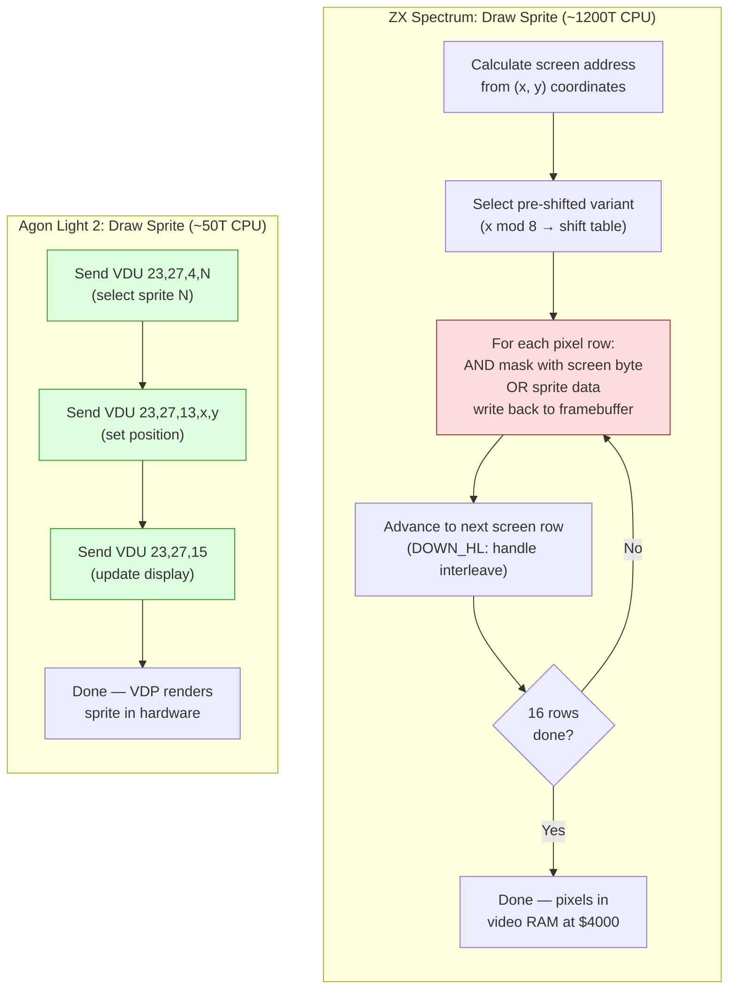

# Capítulo 22: Portabilidad --- Agon Light 2

> "El mismo conjunto de instrucciones, una máquina completamente diferente."

Has construido el juego. Cinco niveles, cuatro tipos de enemigos, una pelea contra un jefe, música AY con efectos de sonido, una pantalla de carga y un sistema de menú --- todo funcionando en un ZX Spectrum 128K a 3,5 MHz, en 128 kilobytes de memoria con bancos, renderizando a través de una ULA que no ha cambiado desde 1982. Cada byte está contabilizado. Cada ciclo está ganado.

Ahora vas a portarlo a una máquina que tiene el mismo conjunto de instrucciones de CPU, cinco veces la velocidad de reloj, cuatro veces la memoria, sprites por hardware, desplazamiento de mapas de baldosas por hardware, una tarjeta SD para la carga y un espacio de direcciones plano de 24 bits sin conmutación de bancos.

Esto debería ser fácil.

No es fácil. Es *diferente* en formas que te sorprenderán, y las sorpresas te enseñan cosas sobre ambas máquinas que no aprenderías de ninguna otra manera.

---

## El Mismo ISA, Un Mundo Diferente

El Agon Light 2 ejecuta un Zilog eZ80 a 18,432 MHz con 512 KB de RAM plana. El eZ80 es un descendiente directo del Z80 --- ejecuta el conjunto completo de instrucciones del Z80, usa los mismos nombres de registros, las mismas banderas, los mismos mnemónicos. Si escribes `LD A,(HL)` en un Spectrum y `LD A,(HL)` en un Agon, el código de operación es idéntico. El comportamiento es idéntico. Un programador de Z80 puede sentarse frente a un Agon y empezar a escribir código inmediatamente.

Pero el Agon no es un Spectrum rápido. Es una arquitectura fundamentalmente diferente con una cara familiar. Las diferencias se dividen en tres categorías:

**Lo que el eZ80 añade.** Registros de 24 bits, direccionamiento de 24 bits, un espacio de direcciones de 16 MB (del cual 512 KB está poblado), nuevas instrucciones para aritmética de 24 bits, y un sistema de modos (ADL vs compatible con Z80) que controla el ancho de los registros y la generación de direcciones.

**Lo que el VDP reemplaza.** La ULA del Spectrum --- el chip que lee la memoria de vídeo y pinta la pantalla --- es reemplazada por un procesador completamente separado. El VDP del Agon es un microcontrolador ESP32 que ejecuta la biblioteca de gráficos FabGL. Maneja la salida de pantalla, sprites, mapas de baldosas y audio. La CPU eZ80 se comunica con el VDP a través de un enlace serial de alta velocidad, enviando secuencias de comandos. No hay memoria de vídeo compartida. No escribes píxeles en una dirección; envías comandos a un coprocesador.

**Lo que desaparece.** La memoria con bancos, la memoria contendida, la cuadrícula de atributos, el diseño de pantalla entrelazado, el búfer de fotograma de 6.912 bytes, el borde como herramienta de temporización, el acceso directo al búfer de fotograma, la sincronización de raster con precisión de ciclo. Todo desaparecido.

Para portar nuestro juego del Spectrum, necesitamos entender qué se transfiere directamente, qué necesita reescribirse y qué necesita repensarse desde cero.

---

## La Arquitectura de un Vistazo

Antes de entrar en el código, presentemos las dos máquinas lado a lado.

| Característica | ZX Spectrum 128K | Agon Light 2 |
|---------|-----------------|---------------|
| CPU | Z80A | eZ80 (compatible con Z80 + extensiones ADL) |
| Reloj | 3,5 MHz (7 MHz en clones turbo) | 18,432 MHz |
| RAM | 128 KB (8 x 16 KB bancos, conmutados por puerto $7FFD) | 512 KB plana (direccionamiento de 24 bits) |
| Espacio de direcciones | 16 bits (64 KB visibles a la vez) | 24 bits (16 MB, 512 KB poblados) |
| Vídeo | ULA: 256x192, color por atributos 8x8, mapeado directamente en memoria | VDP (ESP32 + FabGL): múltiples modos, hasta 640x480, sprites, mapas de baldosas |
| Acceso al búfer de fotograma | Directo: escribir en $4000--$5AFF | Indirecto: enviar comandos VDP por serial |
| Sprites | Solo por software | Por hardware: hasta 256, gestionados por VDP |
| Desplazamiento | Solo por software (desplazar todo el búfer de fotograma) | Desplazamiento de mapa de baldosas por hardware vía VDP |
| Sonido | AY-3-8910 (3 canales + ruido) | Audio VDP (síntesis ESP32, múltiples formas de onda, ADSR) |
| Almacenamiento | Cinta / DivMMC (esxDOS) | Tarjeta SD (FAT32, API de archivos MOS) |
| SO | Ninguno (bare metal) / esxDOS para E/S de archivos | MOS (Machine Operating System) |
| Presupuesto de fotograma | ~71.680 T-states (Pentagon) | ~368.640 T-states (a 50 Hz) |

La relación de presupuesto de fotograma es aproximadamente 5:1. Pero esto subestima la diferencia real, porque muchas operaciones que consumen T-states de CPU en el Spectrum --- renderizado de sprites, desplazamiento de pantalla, gestión del búfer de fotograma --- se descargan al VDP en el Agon. La CPU eZ80 dedica sus ciclos a la lógica del juego, no a mover píxeles.

<!-- figure: ch22_spectrum_vs_agon_sprite -->



> **The architectural shift:** On the Spectrum, the CPU _is_ the rendering engine — every pixel is placed by Z80 instructions. On the Agon, the CPU is a _command sequencer_ — it tells the VDP what to draw, and the ESP32 coprocessor handles the actual rendering. The CPU cost drops from ~1,200T to ~50T per sprite, but you now manage an asynchronous command pipeline with serial latency.

---

## Modo ADL vs Modo Compatible con Z80

Este es el concepto arquitectónico más importante para cualquier programador de Z80 que se acerque al eZ80. Si te equivocas, tu código se colgará de formas difíciles de depurar. Si aciertas, desbloqueas todo el poder del chip.

El eZ80 tiene dos modos de operación:

**Modo compatible con Z80 (modo Z80).** Los registros tienen 16 bits de ancho. Las direcciones son de 16 bits. El registro MBASE proporciona los 8 bits superiores de cada dirección, colocando efectivamente tu ventana de 64 KB en algún lugar del espacio de direcciones de 16 MB. El código se comporta exactamente como un Z80 estándar --- `LD HL,$4000` carga un valor de 16 bits, `JP (HL)` salta a una dirección de 16 bits (con MBASE antepuesto), `PUSH HL` empuja 2 bytes a la pila.

**Modo ADL (Address Data Long).** Los registros tienen 24 bits de ancho. Las direcciones son de 24 bits. `LD HL,$040000` carga un valor de 24 bits, `JP (HL)` salta a una dirección completa de 24 bits, `PUSH HL` empuja 3 bytes a la pila. Este es el modo nativo del eZ80.

MOS arranca el Agon en modo ADL. Tu aplicación empieza en modo ADL. La mayoría del software de Agon se ejecuta enteramente en modo ADL. Pero el modo compatible con Z80 existe, y entender la interacción entre ambos es crítico.

### Por Qué Podrías Usar el Modo Z80

Si estás portando código Z80 del Spectrum, podrías pensar: "simplemente cambio al modo Z80 y ejecuto mi código existente." Esto funciona, hasta cierto punto. Tus cálculos de direcciones de 16 bits, tus bucles `DJNZ`, tus copias de bloques `LDIR` --- todos se comportan idénticamente en modo Z80. MBASE se configura para que las direcciones de 16 bits se mapeen a la región correcta de la memoria del Agon.

El problema es *interactuar con todo lo demás*. Las llamadas a la API de MOS esperan modo ADL. Los comandos VDP se envían a través de rutinas MOS que asumen marcos de pila de 24 bits. Si estás en modo Z80 y llamas a una rutina MOS, el marco de pila será incorrecto --- MOS empuja 3 bytes por dirección de retorno, tu código en modo Z80 empujó 2. El resultado es corrupción de pila y un cuelgue.

### El Mecanismo de Cambio de Modo

El eZ80 proporciona prefijos especiales para cambiar de modo dentro de una sola instrucción:

| Prefijo | Efecto |
|--------|--------|
| `.SIS` (sufijo) | Ejecutar la siguiente instrucción en modo Z80 (registros cortos, direcciones cortas) |
| `.LIS` | Ejecutar en: Registros largos, Direcciones cortas |
| `.SIL` | Ejecutar en: Registros cortos, Direcciones largas |
| `.LIL` | Ejecutar en modo ADL (registros largos, direcciones largas) |

Y para llamadas y saltos:

| Instrucción | Desde modo | A modo |
|-------------|-----------|---------|
| `CALL.IS addr` | ADL | Z80 |
| `CALL.IL addr` | Z80 | ADL |

El sufijo `.IS` significa "Instruction Short" --- la instrucción de llamada en sí usa convenciones cortas (16 bits) para la dirección de retorno. `.IL` significa "Instruction Long" --- la llamada empuja una dirección de retorno de 24 bits.

Aquí está el patrón práctico para llamar a MOS desde código en modo Z80:

```z80 id:ch22_the_mode_switching_mechanism
; In Z80-compatible mode, calling a MOS API function
; We need to switch to ADL mode for the call

    ; Method: use RST.LIL $08 (MOS API entry point)
    ; .LIL means "long instruction, long mode" ---
    ; pushes a 24-bit return address and enters ADL mode
    RST.LIL $08        ; call MOS API in ADL mode
    DB      mos_func   ; MOS function number follows
    ; MOS returns to us in Z80 mode (matching our caller)
```

MOS proporciona RST $08 como un punto de entrada unificado de la API. El sufijo `.LIL` maneja la transición de modo limpiamente. Después de la llamada, la ejecución vuelve a tu código en modo Z80 con el estado de pila correcto.

### La Regla Práctica

Para portar, el enfoque más limpio es: **ejecuta tu lógica de juego en modo ADL y traduce tu código Z80 para usar convenciones de 24 bits desde el principio.** No intentes ejecutar en modo Z80 y cambiar de ida y vuelta para cada llamada MOS. La sobrecarga del cambio de modo y el riesgo de desajustes de pila no valen la pena.

Esto significa que tu port no será una copia byte a byte del código del Spectrum. Será una *traducción*. Los algoritmos son los mismos. La lógica es la misma. El uso de registros es mayormente el mismo. Pero cada dirección tiene 24 bits de ancho, cada push a la pila son 3 bytes, y cada carga de dirección inmediata lleva un byte extra.

### La Trampa de MBASE

Si usas el modo Z80, MBASE determina los 8 bits superiores de cada dirección de memoria. Al arrancar, MOS establece MBASE a $00, lo que significa que las direcciones de modo Z80 $0000--$FFFF se mapean a las direcciones físicas $000000--$00FFFF. Si tu código o datos viven por encima de $00FFFF (por encima de los primeros 64 KB), el código en modo Z80 no puede alcanzarlos sin cambiar MBASE.

Esta es una trampa para portadores del Spectrum que piensan "tengo 512 KB, pondré mis datos de nivel en $080000." En modo Z80, esa dirección no existe. Debes usar modo ADL para acceder a ella o configurar MBASE a $08 (haciendo que las direcciones $0000--$FFFF se mapeen a $080000--$08FFFF). Pero cambiar MBASE afecta a *todos* los accesos a memoria, incluyendo las búsquedas de instrucciones --- así que tu código será mejor que esté en esa región también, o saltarás a basura.

El consejo es simple: permanece en modo ADL. Usa el espacio de direcciones de 24 bits de forma nativa.

---

## Lo Que Se Transfiere Directamente

No todo cambia. Una cantidad sorprendente de la lógica de juego de tu Spectrum se porta con modificaciones mínimas.

### Lógica de Juego y Sistema de Entidades

El sistema de entidades del Capítulo 18 --- los arrays de estructuras que contienen X, Y, tipo, estado, fotograma de animación, velocidad, salud y banderas --- se transfiere casi textualmente. La estructura del bucle principal (HALT, entrada, actualización, renderizado, repetir) es idéntica en concepto, aunque el mecanismo específico de HALT e interrupciones difiere.

Aquí está el bucle de actualización de entidades en el Spectrum:

```z80 id:ch22_game_logic_and_entity_system
; Spectrum: Update all entities
; IX points to entity array, B = entity count
update_entities:
    ld   ix,entities
    ld   b,MAX_ENTITIES
.loop:
    ld   a,(ix+ENT_FLAGS)
    bit  0,a               ; bit 0 = active?
    jr   z,.skip

    call update_entity      ; process this entity

.skip:
    ld   de,ENT_SIZE        ; size of one entity struct
    add  ix,de              ; advance to next entity
    djnz .loop
    ret
```

Y en el Agon:

```z80 id:ch22_game_logic_and_entity_system_2
; Agon (ADL mode): Update all entities
; IX points to entity array, B = entity count
update_entities:
    ld   ix,entities        ; 24-bit address, loaded as 3 bytes
    ld   b,MAX_ENTITIES
.loop:
    ld   a,(ix+ENT_FLAGS)
    bit  0,a
    jr   z,.skip

    call update_entity

.skip:
    ld   de,ENT_SIZE        ; DE is now 24-bit; ENT_SIZE may differ
    add  ix,de              ; 24-bit add
    djnz .loop
    ret
```

La lógica es idéntica. Las instrucciones son idénticas. La diferencia es que IX, DE y el contador de programa tienen todos 24 bits de ancho. El ensamblador maneja la codificación --- `LD IX,entities` emite un inmediato de 24 bits en lugar de uno de 16 bits. La estructura de entidad en sí podría ser idéntica, o podrías ampliar los campos de posición a 24 bits para mapas de nivel más grandes. Eso es una decisión de diseño, no una restricción del portado.

### Detección de Colisiones AABB

El código de colisiones del Capítulo 19 se transfiere directamente. Las comprobaciones AABB usan comparaciones de 8 bits o 16 bits --- las mismas instrucciones CP, SUB y salto condicional funcionan idénticamente en ambas máquinas.

```z80 id:ch22_aabb_collision_detection
; AABB collision check: identical on both platforms
; A = entity1.x, B = entity1.x + width
; C = entity2.x, D = entity2.x + width
check_overlap_x:
    ld   a,(ix+ENT_X)
    cp   (iy+ENT_X2)       ; entity1.x < entity2.x+width?
    ret  nc                 ; no overlap
    ld   a,(ix+ENT_X2)
    cp   (iy+ENT_X)        ; entity1.x+width > entity2.x?
    ret  c                  ; no overlap
    ; overlap on X axis confirmed
```

### Aritmética de Punto Fijo

Todos los cálculos de punto fijo 8.8 --- gravedad, velocidad, fricción, aceleración --- se portan sin cambios. Los patrones de desplazamiento y suma, las adiciones de 16 bits, la fricción por desplazamiento a la derecha:

```z80 id:ch22_fixed_point_arithmetic
; Apply gravity: velocity_y += gravity
; Works identically on both platforms
    ld   a,(ix+ENT_VY_LO)
    add  a,GRAVITY_LO
    ld   (ix+ENT_VY_LO),a
    ld   a,(ix+ENT_VY_HI)
    adc  a,GRAVITY_HI
    ld   (ix+ENT_VY_HI),a
```

La aritmética a nivel de byte no se preocupa de si los registros son nominalmente de 16 o 24 bits de ancho. El acumulador siempre es de 8 bits. La propagación del acarreo funciona de la misma manera.

### Máquina de Estados

La máquina de estados del juego (título, menú, juego, pausa, game over) usa una tabla de saltos indexada por número de estado. En el Spectrum:

```z80 id:ch22_state_machine
; Spectrum: dispatch game state
    ld   a,(game_state)
    add  a,a               ; multiply by 2 (16-bit pointers)
    ld   e,a
    ld   d,0
    ld   hl,state_table
    add  hl,de
    ld   a,(hl)
    inc  hl
    ld   h,(hl)
    ld   l,a
    jp   (hl)

state_table:
    dw   state_title
    dw   state_menu
    dw   state_game
    dw   state_pause
    dw   state_gameover
```

En el Agon, la tabla de punteros almacena direcciones de 24 bits:

```z80 id:ch22_state_machine_2
; Agon (ADL mode): dispatch game state
    ld   a,(game_state)
    ld   l,a
    ld   h,0               ; HL = state index
    ld   e,l
    ld   d,h               ; DE = copy of state index
    add  hl,hl             ; HL = state * 2
    add  hl,de             ; HL = state * 3 (24-bit pointers)
    ld   de,state_table
    add  hl,de
    ld   hl,(hl)           ; load 24-bit pointer
    jp   (hl)

state_table:
    dl   state_title       ; DL = define long (24-bit)
    dl   state_menu
    dl   state_game
    dl   state_pause
    dl   state_gameover
```

El cambio: los punteros son de 3 bytes en lugar de 2, así que la multiplicación del índice cambia de `*2` a `*3`, y la tabla usa `DL` (define long) en lugar de `DW` (define word). La lógica es por lo demás idéntica.

---

## Lo Que Necesita Reescribirse

### Renderizado: Del Búfer de Fotograma a Comandos VDP

Este es el cambio individual más grande en el portado. En el Spectrum, renderizar significa escribir bytes en direcciones de memoria de vídeo. Toda la cadena de renderizado --- dibujo de sprites, limpieza de pantalla, pintado de baldosas, desplazamiento --- es código de CPU que manipula la memoria en $4000--$5AFF.

En el Agon, renderizar significa enviar secuencias de comandos VDP. El VDP entiende un protocolo basado en flujos de bytes VDU (el mismo sistema de comandos VDU usado por BBC BASIC, extendido con comandos específicos de Agon). Envías una secuencia de bytes al VDP a través de MOS, y el ESP32 los procesa.

#### Sprites

En el Spectrum (del Capítulo 16), dibujar un sprite enmascarado de 16x16 cuesta aproximadamente 1.200 T-states de tiempo de CPU --- leyendo bytes de máscara, haciendo AND con la pantalla, haciendo OR con los datos del sprite, escribiendo de vuelta. Haces esto para cada sprite, cada fotograma.

En el Agon, subes el bitmap del sprite *una vez*, y luego lo mueves enviando una actualización de posición:

```z80 id:ch22_rendering_from_framebuffer_to
; Agon: Create and position a hardware sprite
; Step 1: Upload sprite bitmap (done once at init)
;   VDU 23, 27, 4, spriteNum   ; select sprite
;   VDU 23, 27, 0, w, h        ; set dimensions
;   followed by pixel data

; Step 2: Move sprite (done every frame)
; VDU 23, 27, 4, spriteNum     ; select sprite
; VDU 23, 27, 13, x.lo, x.hi, y.lo, y.hi  ; set position

move_sprite:
    ; Send VDU command to move sprite
    ld   a,23
    rst  $10                ; MOS: output byte to VDP
    ld   a,27
    rst  $10
    ld   a,4               ; command: select sprite
    rst  $10
    ld   a,(sprite_num)
    rst  $10

    ld   a,23
    rst  $10
    ld   a,27
    rst  $10
    ld   a,13              ; command: move sprite to
    rst  $10

    ld   a,(sprite_x)      ; X low byte
    rst  $10
    ld   a,(sprite_x+1)    ; X high byte
    rst  $10
    ld   a,(sprite_y)      ; Y low byte
    rst  $10
    ld   a,(sprite_y+1)    ; Y high byte
    rst  $10

    ; VDU 23, 27, 15        ; show sprite (update display)
    ld   a,23
    rst  $10
    ld   a,27
    rst  $10
    ld   a,15
    rst  $10
    ret
```

Cada `RST $10` envía un byte al VDP a través de MOS. El costo total de CPU de mover un sprite es aproximadamente 13 bytes enviados x ~30 T-states por llamada RST = ~390 T-states. Compara eso con los ~1.200 T-states del Spectrum para un dibujo completo de sprite enmascarado. Y la versión del Agon no necesita guardar/restaurar el fondo --- el VDP compone los sprites sobre el fondo automáticamente.

La contrapartida: latencia. El VDP procesa comandos de forma asíncrona. Entre enviar el comando "mover sprite" y que el sprite realmente aparezca en la nueva posición, hay un retardo de transferencia serial y un retardo de procesamiento del VDP. Para animación fluida, necesitas enviar todas las actualizaciones de sprites pronto en el fotograma y confiar en que el VDP las procesará antes del siguiente refresco de pantalla.

#### Desplazamiento de Mapas de Baldosas

En el Spectrum, el desplazamiento horizontal significa desplazar cada byte de la memoria de vídeo a izquierda o derecha --- una cadena de instrucciones `RLC` o `RRC` a lo largo de cientos de bytes, consumiendo una fracción sustancial del presupuesto de fotograma (calculamos el costo en el Capítulo 17). El desplazamiento vertical requiere copiar líneas de escaneo con conocimiento del diseño de memoria entrelazado.

En el Agon, el VDP soporta mapas de baldosas por hardware:

```z80 id:ch22_rendering_from_framebuffer_to_2
; Agon: Set up a tilemap (done once)
; VDU 23, 27, 20, tileWidth, tileHeight
; VDU 23, 27, 21, mapWidth.lo, mapWidth.hi, mapHeight.lo, mapHeight.hi

; Scroll the tilemap (every frame)
; VDU 23, 27, 24, offsetX.lo, offsetX.hi, offsetY.lo, offsetY.hi

scroll_tilemap:
    ld   a,23
    rst  $10
    ld   a,27
    rst  $10
    ld   a,24              ; command: set scroll offset
    rst  $10

    ld   hl,(scroll_x)
    ld   a,l
    rst  $10               ; offsetX low
    ld   a,h
    rst  $10               ; offsetX high
    ld   hl,(scroll_y)
    ld   a,l
    rst  $10               ; offsetY low
    ld   a,h
    rst  $10               ; offsetY high
    ret
```

Ocho bytes enviados. Quizás 240 T-states de tiempo de CPU. En el Spectrum, un desplazamiento horizontal de píxel de pantalla completa cuesta decenas de miles de T-states. El Agon lo hace por hardware por casi nada.

Pero primero debes configurar el mapa de baldosas: subir las definiciones de baldosas, definir las dimensiones del mapa, poblar el mapa con índices de baldosa. Este es un costo único al cargar el nivel, no un costo por fotograma. En el Spectrum, tus datos de baldosas viven en RAM con bancos y se renderizan en el búfer de fotograma por tu propio código. En el Agon, los datos de baldosas viven en la memoria del VDP y se renderizan por el ESP32. Tu rol cambia de "programador de motor gráfico" a "secuenciador de comandos VDP."

#### Diseño de Pantalla

Toda la pesadilla del diseño de pantalla entrelazado del Spectrum --- el direccionamiento dividido, las rutinas DOWN_HL, los cálculos cuidadosos para convertir coordenadas (x, y) a direcciones de memoria --- desaparece. El VDP del Agon trabaja en coordenadas de pantalla. Dices "dibujar en (100, 50)" y el VDP se encarga del resto.

Esto significa que la rutina DOWN_HL del Capítulo 2, las tablas de consulta de direcciones de pantalla, los cálculos de direcciones de atributos --- nada de eso se porta. Simplemente se elimina. La operación equivalente en el Agon es "enviar un par de coordenadas al VDP."

---

## Lo Que Necesita Repensarse

Algunos patrones del Spectrum están tan profundamente incrustados en la arquitectura del juego que no puedes simplemente reescribir la capa de renderizado. El *diseño* necesita cambiar.

### Arquitectura de Memoria

En el Spectrum, planificaste cuidadosamente qué datos van en qué banco:

- Bancos 0--3: datos de nivel, conjuntos de baldosas, gráficos de sprites
- Bancos 4--6: patrones musicales, efectos de sonido, tablas de consulta
- Banco 7: pantalla sombra para doble búfer

Cada conmutación de banco cuesta una escritura de puerto y limita qué código puede ver qué datos. La arquitectura del juego está moldeada por la ventana de 16 KB hacia un espacio de 128 KB.

En el Agon, todos los 512 KB son visibles simultáneamente. No hay conmutación de bancos. No hay truco de pantalla sombra (el VDP maneja el doble búfer internamente). Puedes tener tu juego entero --- los cinco niveles, todos los conjuntos de baldosas, todos los sprites, toda la música --- residente en memoria a la vez. Las transiciones de nivel no requieren carga desde cinta o disco; simplemente apuntas a una región diferente de RAM.

This simplifies development, but it also removes a constraint that forced good architecture. On the Spectrum, you were forced to think about data locality, about what needed to be co-resident, about load sequences. On the Agon, you can be sloppy. Do not be sloppy. The Agon has 512 KB, not infinity. A well-organized memory map is still a virtue.

Distribución de memoria típica del Agon para el juego portado:

```text
$000000 - $00FFFF   MOS and system (reserved)
$040000 - $04FFFF   Game code (~64 KB)
$050000 - $06FFFF   Level data, all 5 levels (~128 KB)
$070000 - $07FFFF   Music and SFX data (~64 KB)
$080000 - $0FFFFF   Free / working buffers
```

Todo es direccionable con un solo `LD HL,$070000` --- sin conmutación de bancos, sin escrituras de puerto.

### Carga

En el Spectrum, la carga desde cinta es un proceso de minutos con una firma de audio distintiva. Incluso con DivMMC y esxDOS, el acceso a archivos es una secuencia de llamadas RST $08:

```z80 id:ch22_loading
; Spectrum + esxDOS: load a file
    ld   a,'*'             ; current drive
    ld   ix,filename
    ld   b,$01             ; read-only
    rst  $08               ; esxDOS call
    DB   $9A               ; F_OPEN
    ; A = file handle

    ld   ix,buffer
    ld   bc,size
    rst  $08
    DB   $9D               ; F_READ
    ; Data loaded

    rst  $08
    DB   $9B               ; F_CLOSE
```

En el Agon, MOS proporciona una API de archivos que lee directamente desde la tarjeta SD:

```z80 id:ch22_loading_2
; Agon: load a file using MOS API
    ld   hl,filename       ; 24-bit pointer to filename string
    ld   de,buffer         ; 24-bit pointer to destination
    ld   bc,size           ; 24-bit max size
    ld   a,mos_fopen       ; MOS file open function
    rst  $08               ; MOS API call
    ; A = file handle

    ld   a,mos_fread       ; MOS file read function
    rst  $08
    ; Data loaded

    ld   a,mos_fclose
    rst  $08
```

El patrón es similar --- abrir, leer, cerrar --- pero el Agon lee de FAT32 en una tarjeta SD, que es lo suficientemente rápido como para cargar datos de nivel entre escenas sin un retraso visible. No se necesitan pantallas de carga. No se necesitan rutinas de carga de cinta. No se necesita optimización de carga por bloques.

### Sonido

El AY-3-8910 del Spectrum se programa escribiendo directamente en registros de hardware a través de puertos de E/S. Cada nota, cada cambio de envolvente, cada ráfaga de ruido es un valor de registro específico escrito en un momento específico.

El audio del Agon es manejado por el VDP. Envías comandos de sonido a través del mismo enlace serial usado para gráficos:

```z80 id:ch22_sound
; Agon: play a note
; VDU 23, 0, 197, channel, volume, freq.lo, freq.hi, duration.lo, duration.hi

play_note:
    ld   a,23
    rst  $10
    xor  a                 ; 0
    rst  $10
    ld   a,197             ; sound command
    rst  $10
    ld   a,(channel)
    rst  $10
    ld   a,(volume)
    rst  $10
    ld   hl,(frequency)
    ld   a,l
    rst  $10
    ld   a,h
    rst  $10
    ld   hl,(duration)
    ld   a,l
    rst  $10
    ld   a,h
    rst  $10
    ret
```

El sistema de sonido del Agon soporta múltiples formas de onda (seno, cuadrada, triángulo, sierra, ruido) y envolventes ADSR por canal --- características que el AY no tiene. Pero el modelo de programación es completamente diferente. No puedes escribir valores de registro crudos; envías comandos de nota de alto nivel. Tu reproductor de música AY --- el manejador de interrupciones IM2 que lee datos de patrón y actualiza 14 registros AY cada fotograma --- no se porta en absoluto. Necesitas un nuevo controlador de música que traduzca tus datos de patrón a comandos de sonido VDP.

Un enfoque: escribir una capa de abstracción delgada que ambas plataformas compartan.

```z80 id:ch22_sound_2
; Abstract sound interface
; Spectrum implementation:
sound_play_note:
    ; A = channel, B = note, C = instrument
    ; ... look up AY register values, write to ports $FFFD/$BFFD
    ret

; Agon implementation:
sound_play_note:
    ; A = channel, B = note, C = instrument
    ; ... convert to VDP sound command, send via RST $10
    ret
```

La misma firma de llamada. Internos diferentes. El código del juego llama a `sound_play_note` sin saber en qué plataforma se está ejecutando.

### Entrada

El Spectrum lee el estado del teclado sondeando el puerto $FE con direcciones de semifila en el acumulador. El joystick Kempston se lee del puerto $1F. Estas son lecturas crudas de puertos de E/S con patrones de bits específicos.

El Agon lee el estado del teclado a través de MOS:

```z80 id:ch22_input
; Spectrum: read keyboard
    ld   a,$FD             ; half-row: Q W E R T
    in   a,($FE)
    bit  0,a               ; bit 0 = Q
    ; ...

; Agon: read keyboard via MOS
    ld   a,mos_getkey      ; MOS: get key state
    rst  $08
    ; A = key code, or 0 if no key pressed
```

El Spectrum te da una máscara de bits de teclas presionadas simultáneamente, ideal para entrada de juego (puedes detectar múltiples teclas a la vez). La API de teclado de MOS del Agon está basada en eventos: te da la tecla más reciente presionada. Para entrada de juego con detección simultánea de teclas, típicamente usas el mapa de teclado de MOS --- una región de memoria actualizada por MOS que refleja el estado de todas las teclas:

```z80 id:ch22_input_2
; Agon: read simultaneous keys from keyboard map
    ld   a,(mos_keymap+KEY_LEFT)   ; 1 if left arrow held, 0 if not
    or   a
    jr   z,.no_left
    ; move player left
.no_left:
    ld   a,(mos_keymap+KEY_RIGHT)
    or   a
    jr   z,.no_right
    ; move player right
.no_right:
```

Esto es funcionalmente equivalente al enfoque de máscara de bits del Spectrum, solo que organizado de forma diferente. El portado es sencillo: reemplaza lecturas de puerto con lecturas de memoria del mapa de teclado.

---

## eZ80 a 18 MHz: Lo Que Sigue Importando y Lo Que No

El eZ80 es aproximadamente cinco veces más rápido que el Z80A en velocidad de reloj bruta. Pero muchas instrucciones del eZ80 también se ejecutan en menos ciclos de reloj que sus equivalentes del Z80 --- las instrucciones de registro de un solo byte a menudo se completan en 1 ciclo en lugar de 4. La aceleración efectiva para código típico está entre 5x y 20x dependiendo de la mezcla de instrucciones.

Esto cambia el cálculo de optimización dramáticamente.

### Lo Que Sigue Importando: Eficiencia del Bucle Interno

Incluso a 18 MHz con 368.000 T-states por fotograma, el bucle interno sigue importando para operaciones intensivas de CPU. Si estás haciendo comprobaciones de colisión contra un mapa de baldosas, iterando sobre 200 entidades, o procesando máquinas de estados de IA para docenas de enemigos, el costo por iteración de tu bucle caliente se acumula.

Las técnicas de optimización básicas del Z80 --- mantener valores en registros en lugar de memoria, usar `INC L` en lugar de `INC HL` donde sea posible, evitar instrucciones indexadas IX/IY para caminos calientes (llevan una penalización de prefijo de 2 ciclos en eZ80, igual que llevan una penalización de 4 T-states en Z80) --- siguen produciendo mejoras medibles.

```z80 id:ch22_what_still_matters_inner_loop
; Tight entity scan: same optimization principles on both platforms
; Prefer: register-to-register ops, direct addressing, DJNZ
; Avoid: IX-indexed loads in hot inner loops when possible

scan_entities_fast:
    ld   hl,entity_flags    ; pointer to flags array
    ld   b,MAX_ENTITIES
.loop:
    ld   a,(hl)
    bit  0,a
    call nz,process_entity
    inc  hl                 ; next entity flag (assume 1-byte stride)
    djnz .loop
    ret
```

Este patrón --- acceso mínimo a memoria, uso ajustado de registros, control de bucle con `DJNZ` --- es óptimo tanto en el Z80 a 3,5 MHz como en el eZ80 a 18 MHz. El buen código es buen código.

### Lo Que Se Vuelve Irrelevante: Trucos de Conservación de Memoria

En el Spectrum, la presión de memoria impulsa gran parte de la ingeniería. Los sprites pre-desplazados almacenan 4 u 8 copias de cada sprite, consumiendo 4x--8x la memoria, como un compromiso velocidad/memoria. La compresión es obligatoria para meter datos de demo en 128 KB. Las tablas de consulta se dimensionan cuidadosamente para equilibrar precisión contra costo de memoria. La conmutación de bancos añade complejidad arquitectónica con el único propósito de direccionar más de 64 KB a la vez.

En el Agon, con 512 KB de RAM plana y almacenamiento en tarjeta SD para cualquier cosa que no necesite estar residente, estas técnicas de conservación son innecesarias. Puedes almacenar 8 copias pre-desplazadas de cada sprite sin preocuparte por la memoria. Puedes mantener todas las tablas de consulta a máxima precisión. Puedes mantener los cinco niveles en RAM simultáneamente.

Esto no significa que debas desperdiciar memoria. Pero significa que las decisiones de optimización impulsadas por la escasez de memoria --- "debería usar una tabla de seno de 256 bytes o una de 128?" --- se vuelven irrelevantes. Usa 256. Usa 1.024 si la precisión ayuda.

### Lo Que Se Vuelve Irrelevante: Código Auto-Modificable

En el Spectrum, el código auto-modificable (SMC) es una técnica de optimización estándar. Escribes instrucciones que parchean sus propios operandos inmediatos para evitar búsquedas en memoria:

```z80 id:ch22_what_becomes_irrelevant_self
; Spectrum: self-modifying code for speed
    ld   a,0               ; operand patched at runtime
    ; ... (the $00 after LD A is overwritten with the real value)
```

En el eZ80, el SMC sigue funcionando (el eZ80 no tiene una caché de instrucciones que lo invalidaría), pero la motivación es más débil. El costo extra de una carga de memoria es menor relativo al presupuesto total del fotograma. Más importante, MOS mapea algunas regiones de memoria como solo lectura, y ciertas versiones de firmware del Agon pueden restringir la ejecución de código modificado dependiendo de la región de memoria. El SMC no está prohibido en el Agon, pero rara vez es necesario y puede causar problemas sutiles.

### Lo Que Se Vuelve Irrelevante: Trucos de Pila para Renderizado

En el Spectrum, abusar del puntero de pila para llenados rápidos de pantalla (DI, configurar SP a la dirección de pantalla, PUSH datos repetidamente) es un truco clásico porque PUSH escribe 2 bytes en 11 T-states --- más rápido que cualquier otro mecanismo de escritura. En el Agon, no estás escribiendo en un búfer de fotograma en absoluto. El VDP maneja el renderizado. Los trucos de pila para la pantalla no tienen sentido.

---

## La Tabla Comparativa

Aquí está la comparación lado a lado del mismo juego en ambas plataformas. Estos números son representativos del plataformas construido en los Capítulos 21--22.

| Métrica | ZX Spectrum 128K | Agon Light 2 |
|--------|-----------------|---------------|
| **Tamaño del código de juego** | ~12 KB | ~14 KB |
| **Código de renderizado** | ~5 KB (motor de sprites, desplazamiento, gestión de pantalla) | ~2 KB (secuencias de comandos VDP) |
| **Código total** | ~17 KB | ~16 KB |
| **Datos de nivel (los 5)** | ~40 KB (comprimidos, cargados por nivel) | ~60 KB (sin comprimir, todos residentes) |
| **Gráficos de sprites/baldosas** | ~20 KB (empaquetados, 1bpp + máscaras) | ~80 KB (8bpp RGBA, subidos al VDP) |
| **Música + SFX** | ~16 KB (PT3 + tablas SFX) | ~20 KB (formato convertido + datos de forma de onda) |
| **Datos totales** | ~76 KB (cabe en 128 KB con bancos) | ~160 KB (cabe en 512 KB fácilmente) |
| **Compresión necesaria** | Sí, obligatoria | No, opcional |
| **Costo de dibujo de sprite** | ~1.200 T/sprite (software) | ~400 T/sprite (comandos VDP) |
| **Costo de desplazamiento por fotograma** | ~15.000--30.000 T (desplazamiento por software) | ~240 T (comando de desplazamiento VDP) |
| **Presupuesto de fotograma** | ~71.680 T | ~368.640 T |
| **fps alcanzables** | 25--50 (depende del conteo de entidades) | 60 (limitado por VDP, no por CPU) |
| **Complejidad de desarrollo** | Alta (bancos de memoria, diseño de pantalla, motor de renderizado) | Media (protocolo VDP, API MOS, modo ADL) |
| **Resultado visual** | Sprites monocromos o de 2 colores por celda, color por atributos, 256x192 | Sprites a todo color, desplazamiento suave, 320x240 o superior |

La diferencia en tamaño de código es instructiva. En el Spectrum, el *motor de renderizado* es una fracción sustancial del código base. En el Agon, los comandos VDP reemplazan la mayor parte de ese código. Pero el juego del Spectrum es más pequeño en datos totales porque todo está comprimido y empaquetado ajustadamente. La versión del Agon usa más memoria para recursos más ricos (sprites de 8 bits por píxel en lugar de 1 bit por píxel con máscaras).

La comparación del presupuesto de fotograma es el número más llamativo. El juego del Agon está *inactivo de CPU la mayor parte del fotograma*. Después de procesar la lógica del juego, enviar actualizaciones de sprites y manejar la entrada, el eZ80 no tiene nada que hacer hasta el siguiente fotograma. En el Spectrum, estás luchando por cada ciclo para meter todo en el presupuesto.

---

## El Proceso de Portado: Paso a Paso

Aquí está la secuencia práctica para portar el juego del Capítulo 21 al Agon.

### Paso 1: Configurar el Proyecto del Agon

Crea un nuevo proyecto con la cadena de herramientas del Agon. Necesitarás:

- Un ensamblador eZ80 (ez80asm o las herramientas Zilog ZDS)
- El archivo de cabecera de la API MOS (mos_api.inc) que define los números de función y constantes
- Una forma de transferir el binario al Agon (tarjeta SD o carga serial)

Tu punto de entrada es diferente del Spectrum. En lugar de `ORG $8000` con un JP directo a tu dirección de inicio, el Agon carga ejecutables en $040000 y MOS pasa el control a esa dirección:

```z80 id:ch22_step_1_set_up_the_agon
; Agon: application entry point
    .ASSUME ADL=1          ; we are in ADL mode
    ORG  $040000

    JP   main              ; standard entry

main:
    ; Your game starts here
    ; ... initialize VDP, load assets, enter game loop
```

### Paso 2: Reemplazar la Capa de Renderizado

Este es el grueso del trabajo. Elimina el código de renderizado del Spectrum y reemplázalo con secuencias de comandos VDP:

1. **Sube los bitmaps de sprites al VDP.** Convierte tus datos de sprites de 1bpp al formato de bitmap del VDP (típicamente 8bpp RGBA). Envía los datos de píxeles usando los comandos de definición de sprites VDU 23,27.

2. **Sube el conjunto de baldosas al VDP.** Convierte tus baldosas de 8x8 del formato de atributos del Spectrum al formato de baldosas del VDP. Define las dimensiones del mapa de baldosas y rellénalo con índices de baldosa para el nivel actual.

3. **Reemplaza la rutina de dibujo de sprites** con comandos de posición de sprite VDU 23,27 (como se mostró antes).

4. **Reemplaza la rutina de desplazamiento** con comandos de desplazamiento de offset del mapa de baldosas VDU 23,27.

5. **Elimina el código de cálculo de dirección de pantalla**, la rutina DOWN_HL, las rutinas de dirección de atributos, y todas las escrituras directas al búfer de fotograma.

### Paso 3: Traducir la Lógica del Juego

Recorre el código de lógica del juego (actualización de entidades, detección de colisiones, física, IA, máquina de estados) y ajusta para modo ADL:

- Cambia todos los `DW` (define word) a `DL` (define long) para tablas de direcciones.
- Cambia la aritmética de punteros de 16 bits a 24 bits donde se involucren direcciones.
- Verifica que los pares `PUSH`/`POP` estén balanceados --- cada push es ahora 3 bytes, no 2.
- Comprueba que los conteos de copia en bloque `LDIR` y `LDDR` sean correctos (BC es de 24 bits en modo ADL; si tu conteo cabe en 16 bits, el byte superior debe ser cero).

### Paso 4: Reescribir el Sonido

Escribe un nuevo controlador de música que lea tus datos de patrón y emita comandos de sonido VDP en lugar de escrituras de registros AY. El formato de datos de patrón puede permanecer igual; solo cambia la etapa de salida.

### Paso 5: Reescribir la Entrada

Reemplaza las lecturas de puerto con lecturas del mapa de teclado de MOS. El enfoque del mapa de teclado es simple y proporciona detección simultánea de teclas.

### Paso 6: Reescribir la Carga

Reemplaza las operaciones de archivos de esxDOS con llamadas a la API de archivos de MOS. El patrón es similar; solo cambian los números de función y la convención de llamada.

### Paso 7: Probar y Ajustar

Ejecuta el juego. Verifica posiciones de sprites, cajas de colisión, velocidad de desplazamiento, temporización de sonido. El procesamiento asíncrono del VDP significa que las actualizaciones visuales pueden llegar un fotograma más tarde de lo esperado --- ajusta la temporización de tu juego si es necesario.

---

## Lo Que Cada Plataforma Te Obliga a Hacer Mejor

The Spectrum teaches cycle-level efficiency and creative constraint-solving: you learn to count T-states, exploit memory layout, and invent techniques like multicolour and attribute-only effects that exist only because of the hardware's limitations. The Agon teaches system architecture: managing an asynchronous coprocessor, structuring command pipelines, and building asset conversion tools for larger data volumes. The Spectrum makes you a better optimiser; the Agon makes you a better system designer. Both skills transfer.

---

## Una Nota sobre las Instrucciones del eZ80

El eZ80 añade varias instrucciones que los programadores de Z80 apreciarán. Las más útiles para desarrollo de juegos:

**LEA (Load Effective Address).** Calcula una dirección a partir de un registro base más un desplazamiento de 8 bits con signo, sin modificar el registro base:

```z80 id:ch22_a_note_on_ez80_instructions
; eZ80: LEA IX, IY + offset
; Compute IX = IY + displacement without changing IY
    LEA  IX,IY+ENT_SIZE    ; IX points to next entity
```

En el Z80, esto requiere `PUSH IY` / `POP IX` / `LD DE,ENT_SIZE` / `ADD IX,DE` --- cuatro instrucciones y más de 40 T-states. LEA lo hace en una instrucción.

**TST (Test Immediate).** Hace AND del acumulador con un valor inmediato y establece las banderas, sin modificar A:

```z80 id:ch22_a_note_on_ez80_instructions_2
; eZ80: TST A, mask
; Test bits without destroying A
    TST  A,$80             ; test sign bit
    jr   nz,.negative      ; branch if bit 7 set, A unchanged
```

En el Z80, necesitarías `BIT 7,A` (que no funciona con máscaras arbitrarias) o `PUSH AF` / `AND mask` / `POP AF` (costoso).

**MLT (Multiply).** Multiplicación sin signo de 8x8, resultado en un par de registros de 16 bits:

```z80 id:ch22_a_note_on_ez80_instructions_3
; eZ80: MLT BC
; B * C -> BC (16-bit result)
    ld   b,sprite_width
    ld   c,frame_number
    mlt  bc                ; BC = B * C
```

En el Z80, la multiplicación requiere un bucle o una tabla de consulta. MLT es una sola instrucción. Para lógica de juego --- calcular desplazamientos de sprites, índices de mapa de baldosas, posiciones de fotograma de animación --- esto es una simplificación sustancial.

---

## Resumen

- El Agon Light 2 ejecuta el mismo conjunto de instrucciones Z80 que el Spectrum, pero con direccionamiento de 24 bits (modo ADL), 512 KB de RAM plana, sprites y mapas de baldosas por hardware vía el coprocesador VDP, y un presupuesto de fotograma ~5x mayor.
- **El modo ADL** es el modo nativo. Ejecuta tu juego en modo ADL. Evita el modo compatible con Z80 para cualquier cosa que no sea ejecutar código legado que no se pueda convertir. El cambio de modo mediante los sufijos `.LIL`/`.SIS` está disponible pero añade complejidad y riesgo.
- **La lógica de juego se porta directamente**: sistemas de entidades, detección de colisiones, física de punto fijo, máquinas de estados e IA se transfieren con cambios mínimos (principalmente ampliar punteros de 16 bits a 24 bits).
- **El renderizado debe reescribirse**: el acceso directo al búfer de fotograma del Spectrum se reemplaza por secuencias de comandos VDP para sprites, mapas de baldosas y desplazamiento. El costo de renderizado de CPU baja dramáticamente, pero ahora gestionas una cadena de comandos asíncrona.
- **El sonido debe reescribirse**: las escrituras de registros AY se reemplazan por comandos de sonido VDP. Los datos de patrón pueden permanecer iguales; solo cambia el controlador de salida.
- **La arquitectura de memoria se simplifica**: sin bancos, sin trucos de pantalla sombra, sin compresión obligada por la escasez. Todos los recursos pueden estar residentes simultáneamente.
- **Trucos del Spectrum que se vuelven irrelevantes en el Agon**: código auto-modificable para velocidad, renderizado por puntero de pila, copias de sprites pre-desplazadas para compromisos memoria/velocidad, cálculos de dirección de pantalla entrelazada, efectos visuales basados en atributos.
- **Trucos del Spectrum que siguen importando en el Agon**: bucles internos ajustados, código eficiente en registros, distribución de estructuras orientada a datos, tablas de consulta precalculadas.
- **Cada plataforma enseña habilidades diferentes**: el Spectrum enseña eficiencia a nivel de ciclo y resolución creativa de restricciones; el Agon enseña arquitectura de sistemas, comunicación con coprocesadores y gestión de cadenas de datos.
- **El eZ80 añade instrucciones útiles**: LEA para cálculo de direcciones, MLT para multiplicación por hardware, TST para prueba de bits no destructiva --- todas simplificaciones que eliminan patrones de múltiples instrucciones del Z80.

---

> **Fuentes:** Zilog eZ80 CPU User Manual (UM0077); Agon Light 2 Official Documentation, The Byte Attic; Dean Belfield, "Agon Light --- Programming Guide" (breakintoprogram.co.uk); FabGL Library Documentation (fabgl.com); Agon MOS API Documentation (github.com/AgonConsole8/agon-docs); Capítulos 15--21 de este libro.
