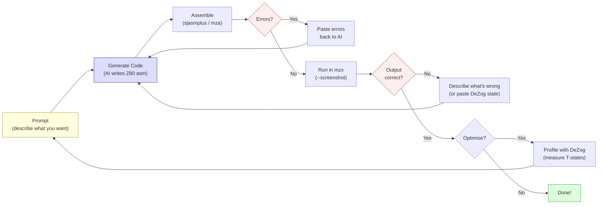

# Capítulo 23: Desarrollo de Z80 Asistido por IA

> "Z80 they still don't know."
> -- Introspec (spke), Life on Mars, 2024

Este libro fue parcialmente escrito con asistencia de IA. El capítulo que estás leyendo fue redactado por Claude Code. El ensamblador utilizado para compilar los ejemplos -- `mza` de MinZ -- fue construido con asistencia de IA. La demo complementaria "Antique Toy" que este libro documenta fue codificada en un bucle de retroalimentación entre un humano y un agente de IA. Si eso te incomoda, bien. Esa incomodidad vale la pena examinarla.

Este es el capítulo más autoconsciente del libro. Vamos a mirar honestamente lo que la asistencia de IA significa para el desarrollo Z80 en 2026 -- dónde genuinamente ayuda, dónde falla con confianza, y dónde la respuesta es un frustrante "depende." Haremos esto con ejemplos reales, código real y casos de fallo reales, porque la demoscene nunca ha tenido paciencia con el hype.

---

## 23.1 El Paralelo Histórico: HiSoft C en ZX Spectrum

Antes de hablar sobre IA, hablemos de otro intento de traer herramientas de nivel superior al ZX Spectrum.

En 1998, *Spectrum Expert* #02 -- el mismo número donde Dark y STS publicaron su método de punto medio 3D (Capítulo 5) -- reseñó el compilador HiSoft C para ZX Spectrum. El veredicto fue mixto. El compilador producía código que se ejecutaba "10--15 veces más rápido que BASIC." Soportaba 33 palabras reservadas, ofrecía una stdio.lib que proporcionaba gráficos al nivel de BASIC, e incluía `gam128.h` para acceso a bancos de memoria 128K.

Pero no tenía soporte de punto flotante.

Piensa en eso por un momento. Un compilador de C. En una máquina donde el punto flotante ya es manejado por la calculadora RST $28 de la ROM, allí esperando en 16K de código gratuito. Y el compilador no podía usarlo.

La conclusión del reseñador de *Spectrum Expert* fue precisa: "útil para trabajo donde la velocidad es crítica y no se necesita float." Una herramienta con fortalezas claras y límites duros, evaluada honestamente.

HiSoft Pascal HP4D contaba una historia similar. El compilador ocupaba 12K, dejando aproximadamente 21K para programas. Soportaba tipos reales y funciones trigonométricas -- SIN, COS, SQRT -- y era "adecuado para procesamiento de datos y matemáticas computacionales." Pero 21K para tu programa, en una máquina donde una sola pantalla sin comprimir ocupa 6.912 bytes, significa que estás escribiendo programas pequeños o nada.

Los lenguajes de nivel superior en hardware con restricciones siempre han sido un compromiso. Aceleran ciertas tareas enormemente. Hacen otras tareas imposibles. La pregunta nunca fue "es HiSoft C bueno o malo?" sino "para qué es bueno, y qué deberías seguir escribiendo en ensamblador?"

El desarrollo de Z80 asistido por IA es el mismo tipo de compromiso. Forma diferente, misma pregunta.

---

## 23.2 El Bucle de Retroalimentación con Claude Code

Así es como funciona realmente el desarrollo de Z80 asistido por IA en la práctica. No es magia. Es un bucle.

### El Bucle

```text
prompt --> code --> assemble --> error? --> fix --> assemble --> run --> wrong? --> fix --> run --> correct
  ^                                                                                                |
  +------------------------------------------------------------------------------------------------+
```

<!-- figure: ch23_ai_feedback_loop -->



Describes lo que quieres. La IA genera ensamblador Z80. Lo ensamblas. Falla -- sintaxis incorrecta, formato de etiqueta incorrecto, dialecto de ensamblador incorrecto. Pegas el error de vuelta. La IA lo corrige. Ensamblas de nuevo. Esta vez compila. Lo ejecutas en el emulador. La salida es incorrecta -- la pantalla se llena de basura, el borde es del color equivocado, no aparece nada en absoluto. Describes lo que ves. La IA ajusta. Ejecutas de nuevo.

Este bucle no es fundamentalmente diferente de cómo trabaja un programador humano, excepto por un detalle crítico: la IA genera su primer intento mucho más rápido y comete algunas clases de errores de manera mucho más predecible.

### Un Ejemplo Concreto

Supón que le pides a Claude Code que escriba una rutina que llene el área de atributos del ZX Spectrum con un patrón de franjas diagonales. Aquí hay un primer intento plausible:

```z80 id:ch23_a_concrete_example
; Fill attributes with diagonal stripes
; Pattern: alternating INK colours along diagonals
    ORG $8000

fill_diagonal:
    ld   hl, $5800          ; attribute memory start
    ld   b, 24              ; 24 rows

.row_loop:
    ld   c, 32              ; 32 columns per row
    ld   a, 24
    sub  b                  ; A = row index (0-23)

.col_loop:
    push af
    add  a, c               ; A = row + column
    and  7                  ; clamp to 0-7 (INK colours)
    or   $40                ; set BRIGHT bit
    ld   (hl), a            ; write attribute
    inc  hl
    pop  af
    dec  c
    jr   nz, .col_loop

    djnz .row_loop
    ret
```

Este es código razonable. Se ensambla. Se ejecuta. Pero hay problemas. El contador de columna `C` cuenta hacia abajo desde 32, no hacia arriba desde 0, así que la diagonal va en la dirección equivocada. El `or $40` establece el bit 6 (BRIGHT), lo cual es correcto, pero el efecto visual tiene las diagonales yendo de arriba-derecha a abajo-izquierda en lugar de la más natural arriba-izquierda a abajo-derecha. Y el PUSH/POP AF en el bucle interno cuesta 22 T-states por byte de atributo -- sobrecarga innecesaria si reestructuras el cálculo.

Nada de esto es *incorrecto* en el sentido de que el código se cuelga. Es *incorrecto* en el sentido de que un programador de Z80 no escribiría el código de esta manera. Un humano que ha llenado atributos cientos de veces calcularía el índice diagonal de forma diferente, evitaría el PUSH/POP, y acertaría la dirección en el primer intento porque el patrón de fila + columna es instintivo.

Aquí está la versión a la que llegas después de dos iteraciones:

```z80 id:ch23_a_concrete_example_2
fill_diagonal:
    ld   hl, $5800
    ld   d, 0               ; row index

.row_loop:
    ld   e, 0               ; column index
    ld   b, 32

.col_loop:
    ld   a, d
    add  a, e               ; diagonal = row + col
    and  7
    or   $40                ; BRIGHT + INK colour
    ld   (hl), a
    inc  hl
    inc  e
    djnz .col_loop

    inc  d
    ld   a, d
    cp   24
    jr   nz, .row_loop
    ret
```

Más limpio. Sin PUSH/POP. Las diagonales van en la dirección correcta. El bucle interno cuesta 4 + 4 + 7 + 4 + 7 + 7 + 6 + 4 + 13 = 56 T-states por byte -- no brillante, pero funcional para una rutina de llenado que se ejecuta una vez.

El optimizador peephole de MinZ conoce 35+ patrones como "reemplazar `LD A,0` con `XOR A`." Pero ¿cómo *encuentras* tales patrones? ¿Y cómo sabes cuáles son realmente seguros?

El punto no es que la IA escribió código malo. El punto es que el *bucle* -- prompt, generar, ensamblar, probar, corregir, probar de nuevo -- es el flujo de trabajo real. La asistencia de IA no elimina la necesidad de entender Z80. Desplaza el cuello de botella de escribir código a evaluar código.

### Lo Que Hace el Bucle Rápido

El bucle es más rápido con IA que sin ella para categorías específicas de trabajo:

**Código repetitivo.** La directiva ORG, el bucle HALT, el arnés de temporización de color de borde del Capítulo 1, el esqueleto de llenado de atributos, la subrutina de escritura de registros AY, la configuración de LDIR, la configuración del modo de interrupción. Cada proyecto Z80 empieza con las mismas 30-50 líneas. La IA las genera correctamente e instantáneamente. Un humano las teclea de memoria. La IA es más rápida.

**Iteración sobre un patrón conocido.** "Ahora haz que la diagonal vaya en la otra dirección." "Añade un contador de fotogramas para que se anime." "Haz que los colores ciclen entre BRIGHT y no BRIGHT." Cada iteración es un delta pequeño sobre código existente. La IA aplica el delta más rápido que la edición manual, y los cambios generalmente son correctos.

**Generación de arneses de prueba.** "Escribe un test que llene la memoria en $C000 con valores 0-255, llame a la rutina de multiplicación en $8000, y compruebe los resultados contra una tabla." La IA genera este tipo de código de andamiaje rápida y fiablemente. La estructura de un test -- configurar entradas, llamar a la rutina, comparar salidas -- está bien dentro de la competencia de la IA.

**Documentación y comentarios.** "Añade conteos de ciclos a cada instrucción en este bucle interno." La IA conoce las tablas de temporización del Z80 y las aplica correctamente en casos directos. Este es un trabajo humano tedioso que las máquinas manejan bien.

### Lo Que Hace el Bucle Lento

**Algoritmos novedosos.** Cuando pides algo que la IA no ha visto -- una nueva estrategia de desenrollado, un truco que explota el comportamiento de las banderas del Z80 de una manera específica, un esquema de generación de código adaptado a tu distribución de datos exacta -- la IA genera código de aspecto plausible que a menudo es sutilmente incorrecto. Peor aún, es incorrecto de maneras que compilan y se ejecutan pero producen resultados incorrectos. Pasas más tiempo depurando código generado por IA del que habrías pasado escribiéndolo tú mismo.

**Conteo de ciclos bajo presión.** La IA puede contar ciclos para instrucciones aisladas. Pero cuando necesitas saber el costo exacto de una rutina que abarca memoria contendida y no contendida, involucra saltos condicionales con diferentes costos tomado/no-tomado, y debe caber en un presupuesto de 2.340 T-states (una línea de escaneo menos algunas instrucciones), las estimaciones de la IA no son fiables. Te dirá "aproximadamente 2.200 T-states" cuando el costo real depende de probabilidades de salto y alineación de memoria. Aquí es donde DeZog se vuelve esencial.

**Diseño creativo de efectos.** "Diseña un efecto visual que se vea bien y quepa en 8.000 T-states" es una pregunta que la IA no puede responder. Puede implementar un efecto que describas. No puede inventar uno. El núcleo creativo del trabajo de demoscene -- encontrar un esquema de computación que produzca visuales atractivos dentro de un presupuesto ajustado -- sigue siendo enteramente humano.

---

## 23.3 Integración con DeZog: La Otra Mitad del Bucle

Si la IA genera el código, DeZog te dice si funciona.

DeZog es una extensión de VS Code que proporciona una interfaz de depuración para Z80. Se conecta a emuladores (ZEsarUX, CSpect, MAME) o su propio simulador Z80 interno y te da puntos de interrupción, inspección de memoria, observadores de registros, pilas de llamadas y vistas de desensamblado -- la experiencia de depuración estándar que los desarrolladores modernos esperan, aplicada al código Z80.

### El Flujo de Trabajo IA + DeZog

El flujo de trabajo más productivo para el desarrollo Z80 asistido por IA combina Claude Code con DeZog en un bucle ajustado:

1. **Claude Code genera una rutina** -- digamos, una multiplicación de 8x8.
2. **La ensamblas** con `mza` y la cargas en el emulador conectado a DeZog.
3. **Estableces un punto de interrupción** en el punto de entrada y avanzas paso a paso.
4. **Observas los registros** en cada paso. Contiene A el valor intermedio correcto después del primer `ADD A,B`? Se activa la bandera de acarreo cuando debería?
5. **Detectas una divergencia** -- el byte alto del resultado es incorrecto. Tomas una captura de pantalla del estado de los registros o copias los valores.
6. **Pegas la divergencia de vuelta a Claude Code** -- "Después de 6 iteraciones del bucle de desplazamiento, A = $3C pero debería ser $78. Aquí están los valores de los registros en el punto de interrupción."
7. **Claude Code identifica el error** -- generalmente un desplazamiento faltante, una elección de registro incorrecta, o un error de uno en el conteo del bucle.
8. **Corriges, reensamblas, vuelves a probar.**

Este flujo de trabajo es poderoso porque le da a la IA lo que le falta: la verdad de base. La IA es buena razonando sobre la estructura del código pero mala simulando mentalmente la ejecución del Z80 durante muchas iteraciones. DeZog proporciona el estado de ejecución real. La IA razona sobre la brecha entre el estado esperado y el real. Juntos, convergen hacia código correcto más rápido que cualquiera por separado.

### Inspección de Memoria para Código con Muchos Datos

Para rutinas que manipulan memoria -- llenados de pantalla, generación de tablas, operaciones de búfer -- la vista de memoria de DeZog es indispensable. Puedes establecer un punto de interrupción después de tu rutina de generación de tabla de senos e inspeccionar los 256 bytes en la dirección de la tabla. Son simétricos? Alcanzan el pico en el valor correcto? Cruzan cero en la posición correcta?

Esto es especialmente valioso para tablas de consulta generadas por IA. Claude Code puede generar una rutina que calcule una tabla de seno de 256 bytes usando la aproximación parabólica del Capítulo 4. La rutina generalmente *casi* funcionará -- la forma es correcta, el rango es correcto, pero podría haber un error de uno en el índice que desplaza toda la tabla una posición, o un error de signo que invierte un cuadrante. DeZog te permite ver la tabla directamente y compararla con valores conocidos como buenos.

### Lo Que DeZog No Puede Hacer (Todavía)

DeZog actualmente no se integra con agentes de IA programáticamente. Tú, el humano, eres el puente -- leyendo valores de registros, pegándolos en el prompt, aplicando correcciones. Un agente de IA que pudiera establecer puntos de interrupción e iterar autónomamente cerraría el bucle para problemas bien definidos. Para trabajo creativo y arquitectónico, el humano permanece en el bucle.

---

## 23.4 Cuándo la IA Ayuda y Cuándo No

Seamos específicos. No "la IA es buena en algunas cosas" -- categorías específicas con evaluaciones específicas.

### La IA Ayuda: Alta Confianza

**Codificación de instrucciones y conteo de ciclos.** La IA tiene memorizado el conjunto de instrucciones del Z80: códigos de operación, conteo de bytes, costos en T-states. `DJNZ` tomado = 13T, no tomado = 8T. `LDIR` por byte = 21T excepto el último = 16T. Los acierta consistentemente, con la salvedad de que a veces confunde la temporización de Pentagon con la de memoria contendida del 48K.

**Código repetitivo y andamiaje.** Directivas ORG, bucles HALT, escrituras de registros AY, rutinas de limpieza de pantalla, configuración de interrupciones. Patrones vistos miles de veces. Generados correctamente, ahorra tecleo.

**Traducción de dialectos y explicación de código.** Convertir entre sintaxis de sjasmplus, mza y z80asm. Explicar qué hace un bloque de ensamblador Z80 -- trazar la lógica, identificar patrones. Leer Z80 es más fácil que escribirlo, y la IA lee bien.

### La IA Ayuda: Confianza Media

**Algoritmos estándar.** Multiplicación por desplazamiento y suma, división con restauración, línea de Bresenham, desplazamiento basado en LDIR. La IA genera implementaciones funcionales de estos, pero generalmente son versiones de libro de texto -- correctas pero no optimizadas. Un humano expremiría un 5-15% más de velocidad a través de trucos de asignación de registros, explotación de banderas y desenrollado que la IA no piensa en aplicar.

**Distribución de memoria y direccionamiento.** "Configura una tabla alineada a 256 bytes en $xx00" o "calcula la dirección de atributo para la posición de pantalla (fila, col)." La IA entiende el diseño de pantalla del Spectrum y genera cálculos de dirección correctos, aunque ocasionalmente se equivoca en el cruce de límite de tercios en el entrelazado de memoria de píxeles.

**Código auto-modificable simple.** Parchear un operando inmediato, cambiar un destino de salto, intercambiar una instrucción. La IA entiende el concepto y genera ejemplos correctos para casos simples. La auto-modificación compleja -- donde el comportamiento del código modificado depende de múltiples parches interactuando -- no es fiable.

### La IA No Ayuda: Baja Confianza

**Optimización novedosa de bucles internos.** Esta es la grande. Cuando necesitas ahorrar 3 T-states en un bucle interno que se ejecuta 6.144 veces por fotograma -- cuando 3 T-states es la diferencia entre 50 fps y 48 fps -- la IA no puede encontrar la optimización de manera fiable. Sugerirá enfoques estándar (desenrollado, tabla de consulta, sustitución de registros) pero no descubrirá el truco *específico* que esta distribución de datos *específica* y asignación de registros permiten.

El bucle interno del rotozoomer `ld a,(hl) : inc l : dec h : add a : add a : add (hl)` de Introspec de su análisis de Illusion (Capítulo 7) son 95 T-states para 4 pares de píxeles chunky. La genialidad está en la elección de usar `inc l` en lugar de `inc hl` (ahorrando 2 T-states, 6 para el par) y en explotar el hecho de que `add a` (una duplicación) son 4T mientras que `sla a` (un desplazamiento, que hace lo mismo) son 8T. Estos son el tipo de micro-decisiones que se acumulan para marcar la diferencia entre una demo que funciona y una demo que no. La IA no toma estas decisiones bien, porque requieren entender el contexto *global* de presión de registros, alineación de memoria y presupuesto de fotograma simultáneamente.

**Temporización de memoria contendida.** El patrón de retardo en los Spectrums originales (6, 5, 4, 3, 2, 1, 0, 0 T-states extra por período de 8 T-states) interactúa con la temporización de instrucciones de formas que la IA no puede predecir fiablemente. Introspec documentó esto en "GO WEST" (Hype, 2015). La IA conoce los hechos pero no puede aplicarlos para calcular el tiempo de ejecución real de rutinas mixtas contendidas/no contendidas.

**Trucos basados en banderas y juicio estético.** La IA sabe que `ADD A,A` establece el acarreo desde el bit 7 -- usable tanto como condición de salto como multiplicación -- pero no combina espontáneamente tales hechos en optimizaciones novedosas. Y no puede tomar decisiones creativas: qué colores funcionan para un plasma, cómo debería sentirse un túnel, si un scroller debería rebotar u ondular en forma de seno.

---

## 23.5 Caso de Estudio: Construyendo MinZ

MinZ es un lenguaje de programación para sistemas Z80 y eZ80, construido por Alice con asistencia sustancial de IA durante el curso de 2024-2026. Compila código moderno y legible a ensamblador Z80 eficiente. El proyecto es real, de código abierto, y en la versión 0.18.0 al momento de escribir esto.

MinZ es relevante para este capítulo por dos razones. Primero, es un caso de estudio de desarrollo asistido por IA de herramientas dirigidas al Z80. Segundo, es en sí mismo un ejemplo del patrón HiSoft C -- un lenguaje de nivel superior en hardware con restricciones, con fortalezas y limitaciones familiares.

### Qué es MinZ

MinZ provides typed variables (`u8`, `u16`, `i8`, `i16`, `bool`), functions with multiple returns, control flow (`if/else`, `while`, `for i in 0..n`), structs, arrays, and a standard library covering maths, graphics, input, sound, and memory operations. It compiles to Z80 assembly via its own assembler (`mza`), runs on its own emulator (`mzx`), and targets ZX Spectrum, CP/M, MSX, and Agon Light 2.

The toolchain includes four standalone tools:

- **mza** — Z80 assembler with macros, multiple output formats (.sna, .tap, .com, .rom, .bin), and multi-platform targets
- **mzx** — ZX Spectrum emulator with headless CLI mode, automated screenshots, keystroke injection, and frame-precise capture
- **mzd** — Z80 disassembler with IDA-like recursive descent analysis, cross-references, T-state counting, and reassemblable output
- **MinZ compiler** — compiles MinZ source to Z80 assembly via mza

Un programa MinZ se ve así:

```minz
import stdlib.graphics.screen;
import stdlib.input.keyboard;
import stdlib.time.delay;

fun main() -> void {
    clear_screen();
    draw_circle(128, 96, 50);

    loop {
        wait_frame();
        let dx = get_key_dx();
        // Move sprite based on input...
    }
}
```

This compiles to Z80 assembly, assembles to a binary, and runs on real or emulated hardware. The self-contained toolchain -- compiler, assembler, emulator, disassembler -- means no external dependencies.

### Dónde la IA Ayudó a Construir MinZ

**El compilador mismo.** El compilador de MinZ está escrito en Go (~90.000 líneas). La mayor parte de la generación de código -- traducir la representación intermedia de MinZ a ensamblador Z80 -- fue escrita en un bucle asistido por IA. El patrón: describir la semántica de una característica del lenguaje, generar el generador de código, probar contra el emulador, corregir discrepancias. Para características estándar como expresiones aritméticas, llamadas a funciones y flujo de control, este bucle convergió rápidamente. Claude Code generó generadores de código correctos para `if/else` y bucles `while` en el primer o segundo intento.

**El ensamblador.** `mza`, el ensamblador Z80 de MinZ, fue construido con asistencia de IA. Soporta el conjunto completo de instrucciones Z80, macros, múltiples formatos de salida y ensamblaje de dos pasadas. La tabla de codificación de instrucciones -- que mapea mnemónicos a códigos de operación, manejando todos los patrones irregulares de bytes de prefijo del Z80 (CB, DD, ED, FD) -- fue generada por la IA y verificada contra la hoja de datos del Z80. Este es exactamente el tipo de código sistemático orientado a tablas que la IA maneja bien.

**The emulator.** `mzx` achieves 100% Z80 instruction coverage, including all undocumented opcodes (ED prefix NOPs, DDCB/FDCB indexed bit operations). The AI generated the initial implementation for each instruction from the Z80 manual; the test suite (also AI-generated) caught edge cases -- flag behaviour on overflow, the half-carry flag on DAA, interrupt timing. But mzx's most useful feature -- built entirely through the AI feedback loop -- is its headless CLI mode:

```text
mzx --run program.bin@8000 --frames 100 --screenshot output.png
mzx --load code.bin@8000,data.bin@C000 --set PC=8000,SP=FFFF,EI,IM=1
mzx --model 128k --tap demo.tap --exec 'LOAD ""' --frames 500
mzx --run effect.bin@8000 --frames DI:HALT --dump-keyframes ./frames/
mzx --model pentagon --trd disk.trd --type "RUN\n" --screenshot grab.png
```

The `--run` flag loads a binary at a given address and starts execution -- no ROM, no BASIC, no loading screen. The `--frames DI:HALT` trigger captures the screenshot at the exact moment the code signals "frame complete" by disabling interrupts before a HALT. The `--dump-keyframes` flag saves only frames where the screen changed -- an automated visual regression test. The `--exec` and `--type` flags inject BASIC commands and keystrokes, allowing fully automated testing of programs that expect user interaction.

This book's screenshot pipeline uses mzx directly. Every code example screenshot in these pages was generated by:

```text
sjasmplus --nologo --raw=build/example.bin example.a80
mzx --run build/example.bin@8000 --frames 50 --screenshot build/ch09_plasma.png
```

Twenty-one examples, zero manual intervention, reproducible with `make screenshots`.

**The disassembler.** `mzd` performs recursive descent analysis -- the same technique used by IDA Pro. Given a binary, it traces all execution paths from entry points, separates code from data, detects strings, generates cross-references, and auto-labels jump targets:

```text
mzd illusion.bin --org $6000 --analyze --target spectrum --cycles --labels
```

The `--cycles` flag adds T-state counts to every instruction -- automating the exact work that Introspec did by hand in his 2017 teardown of X-Trade's Illusion. The `--target spectrum` flag annotates system calls (RST $10 for character output, port $FE for border/keyboard). The `-R` flag produces reassemblable output, closing the disassemble-modify-reassemble loop.

The AI built both `mzd`'s instruction decoder (systematic table-driven work) and its analysis engine (recursive descent, control flow graph construction). The platform-specific ABI knowledge (which ZX Spectrum ROM calls do what) was partly AI-generated, partly pulled from existing documentation.

**La biblioteca estándar y el optimizador peephole.** Diez módulos stdlib (matemáticas, gráficos, entrada, sonido, etc.) y más de 35 patrones peephole ("reemplazar `LD A,0` con `XOR A`"). Ambos fueron generados por IA y refinados por humanos. La IA conoce el conjunto de instrucciones lo suficientemente bien como para sugerir simplificaciones válidas; el humano verifica la corrección semántica.

### Dónde la IA No Ayudó a Construir MinZ

**True Self-Modifying Code (TSMC).** La característica más distintiva de MinZ es TSMC -- el compilador puede emitir código que reescribe sus propias instrucciones en tiempo de ejecución para rendimiento. Un parche de un solo byte del código de operación (7-20 T-states) reemplaza una secuencia de salto condicional (44+ T-states). El *concepto* de TSMC fue invención de Alice, no de la IA. La IA no podría haber propuesto "y si el código compilado parcheara sus propios códigos de operación para cambiar comportamiento en tiempo de ejecución?" porque la idea requiere entender tanto el modelo de compilación como la codificación de instrucciones del Z80 a un nivel que la IA no alcanza sin ser provocada.

**El parser.** MinZ originalmente usaba tree-sitter para el análisis sintáctico pero encontró problemas de falta de memoria en archivos grandes. El reemplazo -- un parser recursivo descendente escrito a mano en Go -- fue diseñado por Alice, con consulta de IA (GPT-4, o4-mini, y Claude fueron todos consultados para consejos arquitectónicos). Los colegas IA coincidieron en que un parser escrito a mano era el enfoque correcto y sugirieron mantener el corpus de pruebas de tree-sitter. Pero el diseño real de la gramática del parser -- cómo la sintaxis de MinZ se mapea a nodos AST -- fue trabajo humano. La IA podía generar código de parser para reglas gramaticales individuales pero no podía diseñar la gramática en sí.

**Asignación de registros para el generador de código.** Decidir qué variables viven en qué registros Z80, cuándo volcar a memoria, y cómo manejar el archivo de registros irregular del Z80 (solo ciertos registros pueden usarse con ciertas instrucciones) es un problema de satisfacción de restricciones que la IA maneja pobremente. Genera código que funciona pero desperdicia registros, usa almacenamientos en memoria innecesarios, y pierde oportunidades de mantener valores calientes en registros a través de bloques básicos.

### El Veredicto de MinZ

MinZ could not exist without AI assistance. The sheer volume of systematic code -- the instruction encoder, the emulator, the disassembler's analysis engine, the standard library, the peephole patterns -- would have taken one developer years to write manually. With AI assistance, MinZ went from concept to a four-tool ecosystem in roughly 18 months.

But MinZ's *interesting* features -- TSMC, the zero-cost lambda-to-function transform, the UFCS method dispatch, mzx's `DI:HALT` trigger, mzd's platform-aware ABI annotations -- are human inventions. The AI implemented them, but did not conceive them.

Esto se mapea precisamente al patrón HiSoft C. La herramienta acelera el trabajo rutinario enormemente. El trabajo creativo sigue siendo humano. El compromiso es real y vale la pena hacerlo.

---

## 23.5b Sidebar: The Other AI — Brute-Force Superoptimisation

MinZ's peephole optimiser knows 35+ patterns like "replace `LD A,0` with `XOR A`." But how do you *find* such patterns? And how do you know which ones are actually safe?

Consider `LD A, 0` → `XOR A`. Both set A to zero. Both take fewer bytes in the XOR form (1 byte vs 2). But `XOR A` clears the carry flag and sets the zero flag; `LD A, 0` preserves all flags. If the code after this instruction tests carry, the "optimisation" is a bug. A human expert knows this. A neural-network-based AI *usually* knows this but sometimes forgets. A brute-force superoptimiser *proves* it by testing every possible input state.

**z80-optimizer** (by oisee, 2025) takes the brute-force approach to its logical conclusion. It enumerates every pair of Z80 instructions — all 406 opcodes × 406 opcodes = 164,836 pairs — and for each pair, tests whether a shorter replacement produces identical output across all possible register and flag states. No heuristics. No training data. No neural networks. Just exhaustive enumeration with full state equivalence verification.

The results: **602,008 provably correct optimisation rules** from a single run on an Apple M2 (34.7 billion comparisons in 3 hours 16 minutes). Some highlights:

| Original sequence | Replacement | Savings |
|---|---|---|
| `SLA A : RR A` | `OR A` | 3 bytes, 12T |
| `LD A, 0 : NEG` | `SUB A` | 2 bytes |
| `LD A, B : ADD A, 0` | `LD A, B : OR A` | 0 bytes, 4T |
| `SCF : RR A` | `SCF : RRA` | 1 byte, 4T |

The rules cluster into **83 unique transformation patterns** — families of replacements that share the same structural logic. For instance, the "load-then-test" family: `LD A, r : ADD A, 0` → `LD A, r : OR A` applies to all register sources because the optimisation exploits flag behaviour, not register identity.

What makes z80-optimizer interesting for this chapter is not the specific rules — any experienced Z80 coder knows most of the common ones. It is the *methodology*. This is AI in the original sense: a machine that finds knowledge through search, not through learned patterns. The 602,008 rules include thousands that no human has catalogued, because they involve obscure opcode pairs that nobody writes deliberately but that compilers and code generators *do* produce.

The obvious next step — length-3 sequences — requires GPU brute force (406³ = 67 million triples × all input states). Beyond that, stochastic search (STOKE-style) can explore the space of longer replacements without exhaustive enumeration.

For practical Z80 development, z80-optimizer complements the AI feedback loop from this chapter: Claude Code generates correct-but-unoptimised code, then z80-optimizer can mechanically verify whether any instruction pairs have shorter equivalents. One AI writes the code; the other AI proves how to shrink it.

**Source:** `github.com/oisee/z80-optimizer` (MIT license)

---

## 23.6 Opinión Honesta: "Z80 They Still Don't Know"

El escepticismo de Introspec sobre las capacidades de la IA con Z80 no es tecnofobia genérica. Viene de décadas de experiencia llevando el Z80 a sus límites absolutos. Cuando dice "Z80 they still don't know," quiere decir algo específico.

Considera el bucle interno del rotozoomer de su análisis de Illusion. El efecto recorre una textura en ángulo, produciendo píxeles chunky 2x2 rotados y escalados. El bucle interno es:

```z80 id:ch23_honest_take_z80_they_still
    ld   a, (hl)    ; 7T   read texture byte
    inc  l          ; 4T   next column (no carry needed: 256-aligned!)
    dec  h          ; 4T   previous row
    add  a,a        ; 4T   double (same as SLA A but 4T not 8T)
    add  a,a        ; 4T   quadruple
    add  a,(hl)     ; 7T   combine with second texture sample
                    ; --- 30T per pixel pair
```

La idea clave es `inc l` en lugar de `inc hl`. Esto ahorra 2 T-states pero solo funciona porque la textura está alineada a un límite de 256 bytes, así que incrementar solo L nunca necesita propagar acarreo a H. La IA usaría `inc hl` -- la elección segura y general -- y perdería 2 T-states por iteración. A lo largo de 3.072 pares de píxeles por fotograma, eso son 6.144 T-states -- casi el 10% del presupuesto de fotograma en un Spectrum 48K.

Esto es lo que significa "Z80 they still don't know." No que la IA no pueda escribir ensamblador Z80 -- puede. No que se equivoque en las instrucciones -- generalmente no lo hace. Sino que no entiende el *contexto* en el que cada elección de instrucción importa. No piensa en presupuestos. No ve que `inc l` es seguro aquí por la restricción de alineación tres capas de abstracción más arriba. No sabe que 2 T-states por iteración, multiplicados por miles de iteraciones, son la diferencia entre caber en un fotograma y necesitar dos.

### Lo Que la IA Se Equivoca, Específicamente

Probamos Claude Code en varias tareas Z80 del dominio de la demoscene. Aquí hay resultados representativos.

**Tarea: Escribir una rutina DOWN_HL.** DOWN_HL mueve el puntero de pantalla en HL una fila de píxeles hacia abajo en la memoria de vídeo entrelazada del Spectrum. Es la primitiva gráfica más comúnmente usada en la plataforma. Introspec escribió un artículo definitivo sobre ella (Hype, 2020).

El primer intento de la IA:

```z80 id:ch23_what_the_ai_gets_wrong
down_hl:
    inc  h              ; 4T   move down one pixel row
    ld   a, h           ; 4T
    and  7              ; 7T
    ret  nz             ; 11T/5T  still within the character row
    ld   a, l           ; 4T
    add  a, 32          ; 7T   next character row
    ld   l, a           ; 4T
    ret  c              ; 11T/5T  if carry, crossed into next third
    ld   a, h           ; 4T
    sub  8              ; 7T
    ld   h, a           ; 4T
    ret                 ; 10T
```

This is actually correct -- it handles all three screen thirds properly, including the boundary transitions. The AI can get standard routines like DOWN_HL right because the pattern is well-documented and appears in many Z80 references. The routine works: `inc h` advances the pixel row, `add a, 32` advances the character row when needed, the carry from the L addition correctly detects third boundaries, and `sub 8` undoes the spurious TT increment for the common case.

But "correct" is not the same as "good." Introspec's article presents a version by RST7 using a dual-counter approach that handles all boundaries in 2,343 T-states for a full-screen traverse. The naive approach above -- the standard textbook version -- costs 5,922 T-states. The gap between "works" and "works well" is a factor of 2.5x, and the AI does not bridge that gap. It produces the first version any competent programmer would write, not the version an expert would optimise toward.

**Tarea: Generar un llenado de pantalla desenrollado.** Cuando se le pidió generar un llenado de pantalla basado en PUSH desenrollado (la técnica del Capítulo 3), la IA produjo código correcto -- pares PUSH escribiendo dos bytes a la vez, DI/EI para proteger la manipulación del puntero de pila. Pero no pensó en organizar los datos en orden inverso (PUSH escribe primero el byte alto, en direcciones más bajas), lo que significa que el patrón de llenado estaba al revés. Un humano que ha escrito llenados PUSH antes tiene esto en cuenta automáticamente.

**Tarea: Optimizar un bucle interno dado.** Dado un bucle interno funcional y pidiendo hacerlo más rápido, la IA sugirió optimizaciones estándar: desenrollado, tablas de consulta, sustitución de registros. Son válidas. Pero no encontró la optimización no obvia -- la que reorganiza la distribución de memoria para permitir `inc l` en lugar de `inc hl`, o usa la bandera de acarreo de una suma como condición de salto en lugar de una comparación separada. La optimización no obvia requiere entender el contexto *completo* de la rutina, y la ventana de contexto de la IA, aunque grande, no captura la estructura *espacial* y *temporal* de un programa Z80 como lo hace el modelo mental de un experto humano.

### Dónde Introspec Tiene Razón

Las optimizaciones más profundas del Z80 no tratan sobre conocer instrucciones. Tratan sobre entender la interacción entre la distribución de memoria, la asignación de registros, la codificación de instrucciones, las restricciones de temporización y la salida visual -- simultáneamente. Esta interacción es lo que Introspec quiere decir con "evolucionar un esquema de computación" (Capítulo 1). Un esquema de computación es un diseño holístico donde cada decisión afecta a todas las demás. La IA opera sobre el código localmente. El experto opera sobre el esquema globalmente.

La IA no conoce el Z80 en el sentido en que Introspec conoce el Z80. Ha memorizado el conjunto de instrucciones pero no ha interiorizado la máquina.

### Dónde Introspec No Tiene Completamente Razón

Pero "Z80 they still don't know" implica que la IA es inútil para el trabajo con Z80, y eso tampoco es cierto.

La IA no está intentando reemplazar a Introspec. Está intentando ayudar a Alice -- una programadora que entiende Z80 lo suficientemente bien como para evaluar la salida de la IA pero no tiene décadas de experiencia en optimización de bucles internos. Para Alice, la salida de la IA es un punto de partida que es mejor que una pantalla en blanco. No necesita que la IA encuentre el truco del `inc l`. Necesita que genere el primer 80% de la rutina para poder dedicar su tiempo al último 20%.

La demoscene siempre ha tratado sobre el último 20%. La IA no cambia eso. Cambia la rapidez con que pasas por el primer 80%.

---

## 23.7 La Demo "Antique Toy": IA en la Práctica

La demo complementaria de este libro -- "Antique Toy" -- es un experimento deliberado: construir una demo de ZX Spectrum con asistencia de IA y documentar lo que sucede.

El nombre es un guiño a *Eager* de Introspec (2015, 1er lugar en 3BM openair). Estamos implementando efectos inspirados en Eager -- el túnel de atributos con simetría de 4 ejes, el chaos zoomer, animación de color de 4 fases -- más el motor 3D de punto medio de Dark de *Spectrum Expert* #02.

**Lo que ha funcionado:** Prototipado de efectos -- Claude Code genera primeros borradores funcionales lo suficientemente rápido como para probar ideas que de otra forma no valdrían el tiempo de tecleo. "Qué pasa si el túnel usa simetría de 8 ejes en lugar de 4?" toma 15 minutos con código generado por IA en lugar de 2 horas manualmente. Herramientas -- el sistema de compilación, la cadena de recursos, las reglas del Makefile y los arneses de prueba fueron todos generados por IA y funcionan fiablemente. Revisión de código -- alimentar a la IA con una rutina y preguntar "qué está mal?" captura errores obvios (errores de uno, DI/EI olvidados, números de puerto incorrectos) antes de que cuesten horas de depuración.

**Lo que no ha funcionado:** El motor 3D de punto medio de Dark. El procesador virtual con códigos de operación empaquetados de 2 bits y números de punto de 6 bits fue decodificado incorrectamente. La instrucción de promedio calculaba `(A+B)/2` usando `ADD A,B : SRA A`, que desborda para coordenadas con signo. Tres sesiones de depuración, más largo que escribirlo desde cero. La integración de música falló similarmente -- la IA generó un reproductor que entraba en conflicto con el uso de registros sombra del código de efecto (EXX, EX AF,AF'). Tanto el reproductor como el efecto usaban BC sombra para propósitos diferentes, y el EXX en el manejador de interrupciones intercambiaba valores obsoletos. Esta clase de error -- conflictos de registros a nivel de sistema a través de límites de interrupción -- requiere entender la arquitectura completa del sistema, no solo rutinas individuales.

**La evaluación honesta:** "Antique Toy" no está terminada. Los efectos funcionan individualmente. La integración está en progreso. Pero la asistencia de IA hizo el proyecto *factible* para un desarrollador en solitario trabajando noches y fines de semana. La pregunta correcta no es "iguala la IA a un equipo humano dedicado?" sino "la asistencia de IA permite que más personas hagan demos?" La respuesta, provisionalmente, es sí.

---

## 23.8 El Bucle de Retroalimentación en la Práctica

Un ejemplo concreto del proyecto "Antique Toy": implementar simetría de 4 ejes para el efecto de túnel copiando el cuadrante superior izquierdo de 16x12 atributos a los otros tres cuadrantes con espejo.

El prompt fue específico: "Escribe una rutina Z80 que copie el cuadrante superior izquierdo de 16x12 del área de atributos del ZX Spectrum ($5800) a los otros tres cuadrantes con el espejo apropiado." Claude Code generó 47 líneas que se ensamblaron en el primer intento.

Las pruebas revelaron que el cuadrante superior derecho estaba desplazado una columna. DeZog mostró el problema: después de que el bucle espejo decrementara DE 16 veces, el cálculo de avance de fila olvidó que DE ya se había movido hacia atrás. El código avanzaba DE por 32 (un ancho de fila) en lugar de los 48 necesarios (32 para la fila + 16 para compensar el recorrido en espejo). Pegar los valores de registros en Claude Code -- "Después de la fila 1, DE = $581F (debería ser $582F)" -- produjo la corrección inmediatamente. El cuadrante inferior derecho tenía el mismo error compuesto. Una iteración más lo corrigió.

Total: tres iteraciones, aproximadamente 25 minutos. Estimación manual para un programador Z80 experimentado: 40-60 minutos. Para un principiante: 2-3 horas. La IA ahorró tiempo en la generación inicial. La depuración tomó el mismo tiempo independientemente de quién escribió el código.

---

## 23.9 Construyendo Tu Propio Flujo de Trabajo Asistido por IA

La configuración práctica: VS Code con la extensión Z80 Macro Assembler y Z80 Assembly Meter. Claude Code (o cualquier LLM capaz de generar código). Un ensamblador (`mza` o sjasmplus). DeZog conectado a un emulador. Un Makefile.

El flujo de trabajo: **Empieza con la IA** -- describe lo que quieres con detalles (máquina objetivo, direcciones de memoria, sintaxis de ensamblador). **Ensambla inmediatamente** -- no leas cuidadosamente el código de la IA; ensámblalo, pega los errores de vuelta. **Prueba con colores de borde** -- envuelve las rutinas generadas por IA en el arnés de temporización del Capítulo 1. **Depura con DeZog** -- establece puntos de interrupción, encuentra la primera divergencia de registros, repórtala a la IA. **Itera** -- generalmente 2-5 rondas para complejidad moderada; más de 5 significa que la IA está fallando y deberías escribirlo tú mismo. **Optimiza tú mismo** -- una vez correcto, perfila y aplica las técnicas de los Capítulos 1-14.

### Ingeniería de Prompts para Z80

**Buen prompt:** "Escribe una rutina Z80 para ZX Spectrum 128K (temporización Pentagon) que copie 16 bytes desde la dirección en HL a la memoria de pantalla en (DE), con la dirección de pantalla siguiendo el patrón de entrelazado del Spectrum. Después de cada byte, avanza DE a la siguiente fila de píxeles usando el método estándar down_hl. Usa sintaxis mza. Incluye conteos de ciclos."

**Mal prompt:** "Escribe una rutina de sprites para el Spectrum."

El buen prompt especifica máquina, ensamblador, direcciones, comportamiento y formato de salida. El mal prompt deja todo ambiguo, y la IA llenará los vacíos con suposiciones incorrectas.

Para prompts de optimización, da un objetivo concreto: "Esta rutina toma ~3.200 T-states. La necesito por debajo de 2.400. No cambies la interfaz (HL = origen, DE = destino, B = altura). Temporización Pentagon." Un objetivo de rendimiento y una restricción de interfaz obligan a la IA a buscar optimizaciones reales en lugar de reestructurar la convención de llamada.

---

## 23.10 El Panorama General

AI assistance does not change the abstraction level of the output -- the Z80 still executes the same instructions at the same speeds. What it changes is the speed of the input: how fast you go from idea to working (if unoptimised) code. The demoscene's experts will still write better inner loops than any AI, but AI-assisted tooling lowers the entry barrier enough that more people can start making demos and learn the deep tricks for themselves.

---

## Resumen

- **El desarrollo de Z80 asistido por IA sigue un bucle de retroalimentación:** prompt, generar, ensamblar, probar, depurar, iterar. La IA genera el primer borrador rápido; el humano evalúa y refina. El bucle típicamente toma 2-5 iteraciones para una rutina de complejidad moderada.

- **La IA es fiable para** codificación de instrucciones, conteo de ciclos, código repetitivo, traducción de dialectos y explicación de código. Es moderadamente fiable para algoritmos estándar y código auto-modificable simple. No es fiable para optimización novedosa, temporización de memoria contendida, diseño creativo de efectos y trucos profundos basados en banderas.

- **La integración con DeZog** cierra la brecha entre la salida de la IA y el código correcto. El humano lee estados de registros del depurador y alimenta las divergencias de vuelta a la IA, que razona sobre la discrepancia. La integración programática IA-depurador aún no existe pero es el siguiente paso obvio.

- **El caso de estudio MinZ** muestra el patrón claramente: la asistencia de IA hizo posible que un solo desarrollador construyera una cadena de herramientas completa de lenguaje (compilador, ensamblador, emulador, biblioteca estándar) en 18 meses. El trabajo rutinario -- codificación de instrucciones, generación de pruebas, funciones de biblioteca estándar -- fue generado por IA. El trabajo creativo -- TSMC, abstracciones de costo cero, diseño de gramática -- fue humano.

- **El escepticismo de Introspec es válido:** la IA no entiende el Z80 como lo hace un experto. No piensa en presupuestos, no ve restricciones transversales, no encuentra optimizaciones no obvias. El trabajo más profundo de la demoscene sigue más allá del alcance de la IA.

- **El paralelo histórico se mantiene:** HiSoft C era "10-15x más rápido que BASIC" pero no tenía floats. El desarrollo de Z80 asistido por IA es dramáticamente más rápido para andamiaje e iteración pero no puede igualar a los expertos humanos en optimización de bucles internos. Las herramientas de nivel superior en hardware con restricciones siempre han sido un compromiso. La pregunta no es "bueno o malo?" sino "bueno *para qué*?"

- **El flujo de trabajo práctico** combina Claude Code para generación de código, DeZog para depuración, `mza` o sjasmplus para ensamblaje, y un Makefile para automatización de compilación. Empieza con IA, ensambla inmediatamente, prueba con colores de borde, depura con DeZog, optimiza tú mismo.

- **El efecto general** es positivo: la asistencia de IA baja la barrera de entrada al desarrollo Z80 sin bajar el techo. Más personas pueden empezar; los expertos siguen siendo necesarios para el trabajo profundo. Esto es bueno para la demoscene.

---

## Pruébalo Tú Mismo

1. **La prueba de código repetitivo.** Pide a tu asistente de IA que genere una plantilla de arranque de ZX Spectrum 128K: ORG en $8000, deshabilitar interrupciones, configurar IM1, bucle HALT con arnés de temporización de color de borde. Ensambla y ejecútalo. Cuántas iteraciones tomó?

2. **La prueba de optimización.** Escribe (o genera con IA) un bucle funcional de llenado de atributos. Mide su costo con temporización de color de borde. Luego pide a la IA que lo haga más rápido. Mide de nuevo. Ahora optimízalo tú mismo usando técnicas de los Capítulos 1-3. Compara las tres versiones: original, optimizada por IA, optimizada por humano.

3. **El desafío DOWN_HL.** Pide a la IA que escriba una rutina DOWN_HL. Pruébala en las 192 filas de píxeles. Maneja correctamente las transiciones de límite de tercio? Compara con el análisis de Introspec (Hype, 2020). Esta es una prueba de fuego para la competencia de IA con Z80.

4. **The MinZ experiment.** Install the MinZ toolchain (`mza`, `mzx`, `mzd`). Assemble a screen fill with `mza`, run it headless with `mzx --run fill.bin@8000 --frames 5 --screenshot fill.png`, then disassemble a demo binary with `mzd demo.bin --analyze --cycles --target spectrum`. Compare the AI-built disassembler's T-state counts to your own hand-counted totals from Chapter 1.

5. **The automated pipeline.** Write an effect, assemble it, and add it to a `Makefile` that runs `mzx --screenshot` for every binary. Run `mzx --dump-keyframes` to see exactly which frames produce visible changes. This is the same pipeline that generated every screenshot in this book.

6. **Build something.** Pick an effect from an earlier chapter. Use AI assistance to write the first draft. Iterate until it works. Profile it. Optimise the inner loop by hand. Document each step. You have just experienced the workflow this entire chapter describes.

---

*Este es el último capítulo técnico. Lo que sigue son los apéndices -- tablas de referencia, guías de configuración, y la referencia de instrucciones a la que recurrirás cada vez que escribas ensamblador Z80.*

> **Sources:** HiSoft C review (Spectrum Expert #02, 1998); Introspec "Technical Analysis of Illusion" (Hype, 2017); Introspec "DOWN_HL" (Hype, 2020); Introspec "GO WEST Parts 1-2" (Hype, 2015); z80-optimizer (oisee, 2025, `github.com/oisee/z80-optimizer`)
