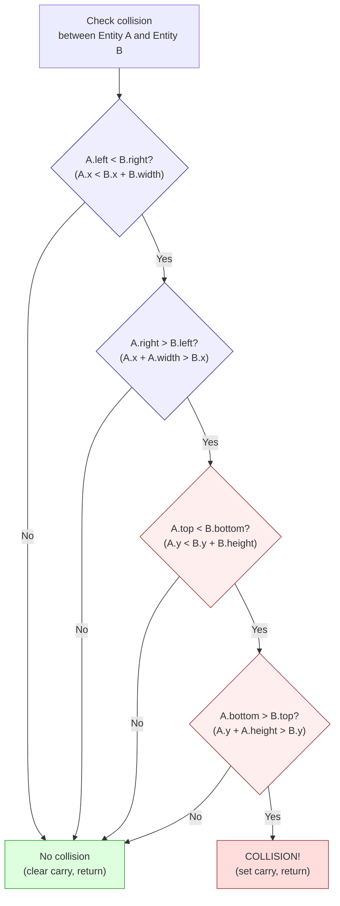

# Глава 19: Столкновения, физика и ИИ врагов

> "Каждая игра --- это ложь. Физика подделана. Интеллект --- это поиск по таблице. Игрок не замечает, потому что ложь рассказывается со скоростью 50 кадров в секунду."

В Главе 18 мы построили игровой цикл, систему сущностей, отслеживающую шестнадцать объектов, и обработчик ввода. Но прямо сейчас наш игрок проходит сквозь стены, парит над землёй, а враги стоят на месте. Игра без столкновений --- это заставка. Игра без физики --- это головоломка со сдвигом. Игра без ИИ --- это песочница, в которой нечему сопротивляться.

Эта глава добавляет три системы, превращающие техническое демо в игру: обнаружение столкновений, физику и ИИ врагов. Все три разделяют философию проектирования: подделай достаточно хорошо, достаточно быстро, и никто не заметит разницы. Мы опираемся на структуру сущности из Главы 18 --- 16-байтную запись с позициями X/Y в формате 8.8 с фиксированной точкой, скоростью в dx/dy, типом, состоянием и флагами.

---

## Часть 1: Обнаружение столкновений

### AABB: единственная форма, которая тебе нужна

Ограничивающие прямоугольники, выровненные по осям. Каждая сущность получает прямоугольник, определённый её позицией и размерами: левый край, правый край, верхний край, нижний край. Два прямоугольника перекрываются тогда и только тогда, когда все четыре условия истинны:

1. Левый край A меньше правого края B
2. Правый край A больше левого края B
3. Верхний край A меньше нижнего края B
4. Нижний край A больше верхнего края B

Если хоть одно из этих условий не выполняется, прямоугольники не перекрываются. Это **ранний выход**, который делает AABB быстрым: в среднем большинство пар сущностей *не* сталкиваются, поэтому большинство проверок завершаются после одного-двух сравнений, а не выполняют все четыре.

<!-- figure: ch19_aabb_collision -->



> **Ранний выход экономит такты:** Большинство пар сущностей находятся далеко друг от друга. Первый тест на пересечение по X отклоняет их за ~91 такт (T-state). Только пары, прошедшие все четыре теста (худший случай: ~270 тактов), являются реальными столкновениями. В сайд-скроллерах проверяй горизонтальное пересечение первым — сущности более разбросаны по X, чем по Y.


На Z80 мы храним позиции сущностей как значения 8.8 с фиксированной точкой, но для обнаружения столкновений нам нужна только целая часть --- старший байт каждой координаты. Попиксельной точности более чем достаточно. Вот полная процедура AABB-столкновения:

```z80 id:ch19_aabb_the_only_shape_you_need_2
; check_aabb -- Test whether two entities overlap
;
; Input:  IX = pointer to entity A
;         IY = pointer to entity B
; Output: Carry set if collision, clear if no collision
;
; Entity structure offsets (from Chapter 18):
;   +0  x_frac    (low byte of 8.8 X position)
;   +1  x_int     (high byte -- the pixel X coordinate)
;   +2  y_frac
;   +3  y_int
;   +4  type
;   +5  state
;   +6  anim_frame
;   +7  dx_frac
;   +8  dx_int
;   +9  dy_frac
;   +10 dy_int
;   +11 health
;   +12 flags
;   +13 width     (bounding box width in pixels)
;   +14 height    (bounding box height in pixels)
;   +15 (reserved)
;
; Cost: 91-270 T-states (Pentagon), depending on early exit
; Average case (no collision): ~120 T-states

check_aabb:
    ; --- Test 1: A.left < B.right ---
    ; A.left  = A.x_int
    ; B.right = B.x_int + B.width
    ld   a, (iy+1)        ; 19T  B.x_int
    add  a, (iy+13)       ; 19T  + B.width = B.right
    ld   b, a             ; 4T   B = B.right (save for test 2)
    ld   a, (ix+1)        ; 19T  A.x_int = A.left
    cp   b                ; 4T   A.left - B.right
    jr   nc, .no_collision ; 12/7T  if A.left >= B.right, no collision
                           ; --- early exit: 91T (taken, incl. .no_collision) ---

    ; --- Test 2: A.right > B.left ---
    ; A.right = A.x_int + A.width
    ; B.left  = B.x_int
    add  a, (ix+13)       ; 19T  A.x_int + A.width = A.right
    ld   b, (iy+1)        ; 19T  B.x_int = B.left
    cp   b                ; 4T   A.right - B.left (we need A.right > B.left)
    jr   c, .no_collision  ; 12/7T  if A.right < B.left, no collision
    jr   z, .no_collision  ; 12/7T  if A.right = B.left, touching but not overlapping

    ; --- Test 3: A.top < B.bottom ---
    ld   a, (iy+3)        ; 19T  B.y_int
    add  a, (iy+14)       ; 19T  + B.height = B.bottom
    ld   b, a             ; 4T
    ld   a, (ix+3)        ; 19T  A.y_int = A.top
    cp   b                ; 4T   A.top - B.bottom
    jr   nc, .no_collision ; 12/7T  if A.top >= B.bottom, no collision

    ; --- Test 4: A.bottom > B.top ---
    add  a, (ix+14)       ; 19T  A.y_int + A.height = A.bottom
    ld   b, (iy+3)        ; 19T  B.y_int = B.top
    cp   b                ; 4T   A.bottom - B.top
    jr   c, .no_collision  ; 12/7T
    jr   z, .no_collision  ; 12/7T

    ; All four tests passed -- collision detected
    scf                    ; 4T   set carry flag
    ret                    ; 10T

.no_collision:
    or   a                 ; 4T   clear carry flag
    ret                    ; 10T
```


IX/IY-индексированная адресация удобна, но дорога — 19 тактов на обращение против 7 для `ld a, (hl)`. Для игры с 8 врагами и 7 пулями это приемлемо. Худший случай (все четыре теста пройдены, столкновение обнаружено): примерно 270 тактов. Лучший случай (первый тест провален): примерно 91 такт. Для 8 врагов, проверяемых против игрока, средний случай — примерно 8 x 120 = 960 тактов — 1.3% бюджета кадра Pentagon. Столкновения дёшевы.

**Внимание, переполнение:** Инструкции `ADD A, (ix+13)` вычисляют `x + width` в 8-битном регистре. Если сущность расположена на X=240 с шириной 24, результат переполняется до 8, что приводит к некорректным сравнениям. Убедись, что позиции сущностей ограничены так, чтобы `x + width` и `y + height` никогда не превышали 255 — обычно достаточно ограничить игровую область, оставив запас у правого и нижнего краёв. Как вариант, можно перейти к 16-битной арифметике сравнения за счёт дополнительных инструкций.

### Порядок тестов для быстрейшего отклонения

Порядок имеет значение. В боковом скроллере сущности, далёкие друг от друга по горизонтали --- типичный случай. Тестирование горизонтального перекрытия первым отклоняет их после двух сравнений. Можно пойти дальше с быстрым предварительным отклонением:

```z80 id:ch19_ordering_the_tests_for
; Quick X-distance rejection before calling check_aabb
; If the horizontal distance between entities exceeds
; MAX_WIDTH (the widest entity), they cannot collide.

    ld   a, (ix+1)        ; 19T  A.x_int
    sub  (iy+1)           ; 19T  - B.x_int
    jr   nc, .pos_dx      ; 12/7T
    neg                   ; 8T   absolute value
.pos_dx:
    cp   MAX_WIDTH        ; 7T   widest possible entity
    jr   nc, .skip        ; 12/7T  too far apart, skip AABB check
    call check_aabb       ; only test close pairs
.skip:
```

Это предварительное отклонение стоит около 60 тактов, экономя 82+ такта полной AABB-проверки. На скроллящемся уровне обычно лишь 2--3 врага достаточно близки, чтобы потребовать полного теста.

### Столкновения с тайлами: тайлмэп как поверхность столкновений

В платформере игрок сталкивается с миром --- полами, стенами, потолками, шипами. Мы используем сам тайлмэп как таблицу подстановки: преобразуем пиксельную позицию в индекс тайла, ищем тип тайла, ветвимся по результату. Один поиск в массиве заменяет десятки проверок прямоугольников.

Предположим тайлмэп 32x24 с тайлами 8x8 пикселей (естественная знакосетка Spectrum):

```z80 id:ch19_tile_collisions_the_tilemap
; tile_at -- Look up the tile type at a pixel position
;
; Input:  B = pixel X, C = pixel Y
; Output: A = tile type (0=empty, 1=solid, 2=hazard, 3=ladder, etc.)
;
; Map is 32 columns wide, stored row-major at 'tilemap'
; Cost: ~182 T-states (Pentagon)

tile_at:
    ld   a, c             ; 4T   pixel Y
    srl  a                ; 8T   /2
    srl  a                ; 8T   /4
    srl  a                ; 8T   /8 = tile row
    ld   l, a             ; 4T

    ; Multiply row by 32 (shift left 5)
    ld   h, 0             ; 7T
    add  hl, hl           ; 11T  *2
    add  hl, hl           ; 11T  *4
    add  hl, hl           ; 11T  *8
    add  hl, hl           ; 11T  *16
    add  hl, hl           ; 11T  *32

    ld   a, b             ; 4T   pixel X
    srl  a                ; 8T   /2
    srl  a                ; 8T   /4
    srl  a                ; 8T   /8 = tile column
    ld   e, a             ; 4T
    ld   d, 0             ; 7T
    add  hl, de           ; 11T  row*32 + column = tile index

    ld   de, tilemap      ; 10T
    add  hl, de           ; 11T  absolute address

    ld   a, (hl)          ; 7T   tile type
    ret                    ; 10T
```

Теперь проверяем углы и рёбра сущности против тайлмэпа:

```z80 id:ch19_tile_collisions_the_tilemap_2
; check_player_tiles -- Check player against tilemap
;
; Input: IX = player entity
; Output: Updates player position/velocity based on tile collisions
;
; We check up to 6 points around the player's bounding box,
; but bail out as soon as we find a solid tile.

check_player_tiles:
    ; --- Check below (feet) ---
    ; Bottom-left corner of player
    ld   b, (ix+1)        ; 19T  x_int
    ld   a, (ix+3)        ; 19T  y_int
    add  a, (ix+14)       ; 19T  + height = bottom edge
    ld   c, a             ; 4T
    call tile_at           ; 17T+body
    cp   TILE_SOLID        ; 7T
    jr   z, .on_ground     ; 12/7T

    ; Bottom-right corner
    ld   a, (ix+1)        ; 19T  x_int
    add  a, (ix+13)       ; 19T  + width
    dec  a                ; 4T   -1 (rightmost pixel of entity)
    ld   b, a
    ld   a, (ix+3)
    add  a, (ix+14)
    ld   c, a
    call tile_at
    cp   TILE_SOLID
    jr   z, .on_ground

    ; Not standing on solid ground -- apply gravity
    jr   .in_air

.on_ground:
    ; Snap Y to top of tile, clear vertical velocity
    ld   a, c              ; bottom edge Y
    and  %11111000         ; align to tile boundary (clear low 3 bits)
    sub  (ix+14)           ; subtract height to get top-left Y
    ld   (ix+3), a         ; snap y_int
    xor  a
    ld   (ix+9), a         ; dy_frac = 0
    ld   (ix+10), a        ; dy_int = 0
    set  0, (ix+12)        ; set "on_ground" flag in flags byte
    jr   .check_walls

.in_air:
    res  0, (ix+12)        ; clear "on_ground" flag

.check_walls:
    ; --- Check right (wall) ---
    ld   a, (ix+1)
    add  a, (ix+13)        ; right edge
    ld   b, a
    ld   a, (ix+3)
    add  a, 4              ; check midpoint vertically
    ld   c, a
    call tile_at
    cp   TILE_SOLID
    jr   nz, .check_left

    ; Push out left: snap X to left edge of tile
    ld   a, b
    and  %11111000
    dec  a
    sub  (ix+13)
    inc  a
    ld   (ix+1), a
    xor  a
    ld   (ix+7), a         ; dx_frac = 0
    ld   (ix+8), a         ; dx_int = 0

.check_left:
    ; --- Check left (wall) ---
    ld   b, (ix+1)         ; left edge
    ld   a, (ix+3)
    add  a, 4
    ld   c, a
    call tile_at
    cp   TILE_SOLID
    jr   nz, .check_ceiling

    ; Push out right: snap X to right edge of tile + 1
    ld   a, b
    and  %11111000
    add  a, 8
    ld   (ix+1), a
    xor  a
    ld   (ix+7), a
    ld   (ix+8), a

.check_ceiling:
    ; --- Check above (head) ---
    ld   b, (ix+1)
    ld   c, (ix+3)         ; top edge
    call tile_at
    cp   TILE_SOLID
    ret  nz

    ; Hit ceiling: push down, zero vertical velocity
    ld   a, c
    and  %11111000
    add  a, 8              ; bottom of ceiling tile
    ld   (ix+3), a
    xor  a
    ld   (ix+9), a
    ld   (ix+10), a
    ret
```

Ключевое понимание: поиск точки в тайле — это O(1) обращение к массиву. Каждый вызов `tile_at` стоит ~182 такта (T-state). Вся система столкновений с тайлами (проверка ног, головы, левого и правого краёв) стоит примерно 800–1 200 тактов на сущность, независимо от размера карты.

### Скользящая реакция на столкновение

Когда игрок врезается в стену, двигаясь по диагонали, он должен *скользить*, а не останавливаться. Разрешай столкновения по каждой оси независимо:

1. Применить горизонтальную скорость. Проверить горизонтальные столкновения с тайлами. Если заблокировано --- вытолкнуть и обнулить горизонтальную скорость.
2. Применить вертикальную скорость. Проверить вертикальные столкновения с тайлами. Если заблокировано --- вытолкнуть и обнулить вертикальную скорость.

Именно это и делает `check_player_tiles` --- каждая ось обрабатывается отдельно. Диагональное движение вдоль стены естественно превращается в скольжение. Большинство платформеров применяют сначала X (управляемый игроком), затем Y (гравитация). Поэкспериментируй с обоими порядками и почувствуй разницу.

---

## Часть 2: Физика

То, что мы строим --- не симуляция твёрдого тела, а небольшой набор правил, создающих *ощущение* веса и инерции. Три операции покрывают 90% того, что нужно платформеру: гравитация, прыжок и трение.

### Гравитация: убедительное падение

Каждый кадр добавляем константу к вертикальной скорости сущности:

```z80 id:ch19_gravity_falling_convincingly
; apply_gravity -- Add gravity to an entity's vertical velocity
;
; Input:  IX = entity pointer
; Output: dy updated (8.8 fixed-point, positive = downward)
;
; GRAVITY_FRAC and GRAVITY_INT define the gravity constant
; in 8.8 fixed-point. A good starting value: 0.25 per frame
; = $0040 (INT=0, FRAC=64, i.e. 64/256 = 0.25 pixels/frame^2)
;
; Cost: ~50 T-states (Pentagon)

GRAVITY_FRAC equ 40h     ; 0.25 pixels/frame^2 (fractional part)
GRAVITY_INT  equ 00h     ; (integer part)
MAX_FALL_INT equ 04h     ; terminal velocity: 4 pixels/frame

apply_gravity:
    ; Skip if entity is on the ground
    bit  0, (ix+12)       ; 20T  check on_ground flag
    ret  nz               ; 11/5T  on ground -- no gravity

    ; dy += gravity (16-bit fixed-point add)
    ld   a, (ix+9)        ; 19T  dy_frac
    add  a, GRAVITY_FRAC  ; 7T
    ld   (ix+9), a        ; 19T

    ld   a, (ix+10)       ; 19T  dy_int
    adc  a, GRAVITY_INT   ; 7T   add with carry from frac
    ld   (ix+10), a       ; 19T

    ; Clamp to terminal velocity
    cp   MAX_FALL_INT     ; 7T
    ret  c                ; 11/5T  below terminal velocity, done
    ld   (ix+10), MAX_FALL_INT ; 19T  clamp integer part
    xor  a                ; 4T
    ld   (ix+9), a        ; 19T  zero fractional part (exact clamp)
    ret                    ; 10T
```

Представление с фиксированной точкой из Главы 4 делает здесь тяжёлую работу. Гравитация --- 0.25 пикселя на кадр в квадрате, значение, которое было бы невозможно представить целочисленной арифметикой. В формате 8.8 это просто `$0040`. Каждый кадр `dy` растёт на 0.25. Через 4 кадра сущность падает со скоростью 1 пиксель за кадр. Через 16 кадров --- 4 пикселя за кадр (предельная скорость). Кривая ускорения выглядит естественно, потому что она *является* естественной --- постоянное ускорение --- это просто линейное приращение скорости.

Ограничение предельной скорости предотвращает падение сущностей настолько быстро, что они проскакивают сквозь полы (проблема "туннелирования"). Максимальная скорость падения 4 пикселя за кадр означает, что сущность никогда не сдвинется больше чем на половину высоты тайла за один кадр, так что проверки столкновений с тайлами всегда её поймают.

### Почему фиксированная точка важна здесь

Без фиксированной точки гравитация --- это либо 0, либо 1 пиксель за кадр: пух или камень, ничего между ними. Фиксированная точка 8.8 даёт 256 значений между каждым целым числом. $0040 (0.25) создаёт плавную дугу. $0080 (0.5) ощущается тяжело. $0020 (0.125) ощущается как прыжок на Луне. Настройка этих констант --- это то, где твоя игра обретает характер. Если основы фиксированной точки расплывчаты, перечитай Главу 4.

### Прыжок: антигравитационный импульс

Прыжок --- простейшая операция физики в игре: установить вертикальную скорость в большое отрицательное значение (вверх). Гравитация замедлит её, доведёт до нуля в верхней точке и потянет обратно вниз. Дуга прыжка --- естественная парабола, никакого явного расчёта дуги не нужно.

```z80 id:ch19_jump_the_anti_gravity_impulse
; try_jump -- Initiate a jump if the player is on the ground
;
; Input:  IX = player entity
; Output: dy set to -jump_force if on ground
;
; JUMP_FORCE defines the initial upward velocity in 8.8 fixed-point.
; A good starting value: -3.5 pixels/frame = $FC80
;   (INT = $FC = -4 signed, FRAC = $80 = +0.5, so -4 + 0.5 = -3.5)
;
; Cost: ~50 T-states (Pentagon)

JUMP_FRAC equ 80h        ; fractional part of jump force
JUMP_INT  equ 0FCh       ; integer part (-4 signed + 0.5 frac = -3.5)

try_jump:
    ; Must be on ground to jump
    bit  0, (ix+12)       ; 20T  on_ground flag
    ret  z                ; 11/5T  in air -- cannot jump

    ; Set upward velocity
    ld   (ix+9), JUMP_FRAC  ; 19T  dy_frac
    ld   (ix+10), JUMP_INT  ; 19T  dy_int = -3.5 (upward)

    ; Clear on_ground flag
    res  0, (ix+12)       ; 23T

    ; (Optional: play jump sound effect here)
    ret                    ; 10T
```

При гравитации 0.25/кадр^2 и силе прыжка -3.5/кадр игрок поднимается 14 кадров до пика примерно в 24 пикселя (~3 тайла), затем падает ещё 14 кадров. Общее время в воздухе: 28 кадров, чуть больше полсекунды. Отзывчиво, но не дёргано.

### Прыжки переменной высоты

Если игрок отпускает кнопку прыжка во время подъёма, урежь скорость подъёма вдвое. Короткое нажатие даёт короткий прыжок, удержание --- полный.

```z80 id:ch19_variable_height_jumps
; check_jump_release -- Cut jump short if button released
;
; Input:  IX = player entity
; Output: dy halved if ascending and jump button not held
;
; Cost: ~40 T-states (Pentagon)

check_jump_release:
    ; Only relevant while ascending
    bit  7, (ix+10)       ; 20T  check sign of dy_int
    ret  z                ; 11/5T  not ascending (dy >= 0), skip

    ; Check if jump button is still held
    ; (assume A contains current input state from input handler)
    bit  4, a             ; 8T   bit 4 = fire/jump
    ret  nz               ; 11/5T  still held, do nothing

    ; Button released -- halve upward velocity
    ; Arithmetic right shift of 16-bit dy (preserves sign)
    ld   a, (ix+10)       ; 19T  dy_int
    sra  a                ; 8T   shift right arithmetic (sign-extending)
    ld   (ix+10), a       ; 19T
    ld   a, (ix+9)        ; 19T  dy_frac
    rra                   ; 4T   rotate right through carry (carry from SRA above)
    ld   (ix+9), a        ; 19T
    ret                    ; 10T
```

Это 16-битный арифметический сдвиг вправо: `SRA` сохраняет знак в старшем байте, `RRA` подхватывает перенос в младшем байте. Скорость подъёма уменьшается вдвое, дуга выравнивается. Сорок тактов за значительно лучше ощущающийся прыжок.

### Трение: замедление на земле

Когда игрок отпускает клавиши направления, он должен замедляться, а не останавливаться мгновенно. Операция --- один сдвиг вправо горизонтальной скорости.

```z80 id:ch19_friction_slowing_down_on_the
; apply_friction -- Decelerate horizontal movement
;
; Input:  IX = entity pointer
; Output: dx decayed toward zero
;
; Friction is applied as a right shift (divide by power of 2).
; SRA by 1 = divide by 2 (heavy friction, like rough ground)
; SRA by 1 every other frame = divide by ~1.4 (lighter friction)
;
; Cost: ~55 T-states (Pentagon)

apply_friction:
    ; Only apply friction on the ground
    bit  0, (ix+12)       ; 20T  on_ground flag
    ret  z                ; 11/5T  in air -- no ground friction

    ; 16-bit arithmetic right shift of dx (signed)
    ld   a, (ix+8)        ; 19T  dx_int
    sra  a                ; 8T   shift right, sign-extending
    ld   (ix+8), a        ; 19T
    ld   a, (ix+7)        ; 19T  dx_frac
    rra                   ; 4T   rotate right through carry
    ld   (ix+7), a        ; 19T
    ret                    ; 10T
```

Сдвиг вправо на 1 делит скорость на 2 каждый кадр --- игрок останавливается за несколько кадров. Для льда применяй трение реже:

```z80 id:ch19_friction_slowing_down_on_the_2
; apply_friction_ice -- Light friction, every other frame
;
    ld   a, (frame_counter)
    and  1
    ret  nz               ; skip odd frames
    jr   apply_friction   ; apply on even frames only
```

Варьируй трение по типу поверхности --- ищи тайл под ногами сущности и ветвись:

```z80 id:ch19_friction_slowing_down_on_the_3
    ; Determine surface type
    ld   b, (ix+1)        ; player X
    ld   a, (ix+3)        ; player Y
    add  a, (ix+14)       ; + height (feet position)
    inc  a                ; one pixel below feet
    ld   c, a
    call tile_at
    cp   TILE_ICE
    jr   z, .ice_friction
    ; Default: heavy friction
    call apply_friction
    jr   .done
.ice_friction:
    call apply_friction_ice
.done:
```

### Применение скорости к позиции

Заключительный шаг: перемещаем сущность на её скорость через 16-битное сложение с фиксированной точкой по каждой оси:

```z80 id:ch19_applying_velocity_to_position
; move_entity -- Apply velocity to position
;
; Input:  IX = entity pointer
; Output: X and Y positions updated by dx and dy
;
; Cost: ~80 T-states (Pentagon)

move_entity:
    ; X position += dx (16-bit fixed-point add)
    ld   a, (ix+0)        ; 19T  x_frac
    add  a, (ix+7)        ; 19T  + dx_frac
    ld   (ix+0), a        ; 19T

    ld   a, (ix+1)        ; 19T  x_int
    adc  a, (ix+8)        ; 19T  + dx_int (with carry)
    ld   (ix+1), a        ; 19T

    ; Y position += dy (16-bit fixed-point add)
    ld   a, (ix+2)        ; 19T  y_frac
    add  a, (ix+9)        ; 19T  + dy_frac
    ld   (ix+2), a        ; 19T

    ld   a, (ix+3)        ; 19T  y_int
    adc  a, (ix+10)       ; 19T  + dy_int (with carry)
    ld   (ix+3), a        ; 19T
    ret                    ; 10T
```

### Цикл физики

Собирая всё вместе, покадровое обновление физики для одной сущности выглядит так:

```z80 id:ch19_the_physics_loop
; update_physics -- Full physics update for one entity
;
; Input:  IX = entity pointer
; Call order matters: gravity first, then move, then collide

update_entity_physics:
    call apply_gravity         ; accumulate downward velocity
    call apply_friction        ; decay horizontal velocity
    call move_entity           ; apply velocity to position
    call check_player_tiles    ; resolve tile collisions
    ret
```

Порядок намеренный: сначала силы, затем движение, затем столкновения. Это стандарт для платформеров. Общая стоимость на сущность: примерно 1 000–1 500 тактов (основная часть приходится на проверки столкновений с тайлами по ~182 такта каждая). Для 16 сущностей: 16 000–24 000 тактов, около 25–33% бюджета кадра Pentagon. На практике полная проверка столкновений с тайлами нужна только игроку и врагам, подверженным гравитации — пули и эффекты могут обойтись более простой проверкой границ.

---

## Часть 3: ИИ врагов

У тебя нет тактов для поиска пути или деревьев решений. Но есть таблица переходов и байт состояния. Этого достаточно.

### Конечный автомат

Каждый враг имеет байт `state` (смещение +5 в нашей структуре сущности), который выбирает, какая процедура поведения выполняется в этом кадре:

| Состояние | Имя    | Поведение |
|-------|---------|-----------|
| 0     | PATROL  | Ходит туда-сюда между двумя точками |
| 1     | CHASE   | Двигается к игроку |
| 2     | ATTACK  | Стреляет снарядом или атакует |
| 3     | RETREAT | Двигается от игрока |
| 4     | DEATH   | Проигрывает анимацию смерти, затем деактивируется |

Переходы --- простые условия: проверки близости, таймеры перезарядки, пороги здоровья. Каждый --- сравнение или проверка бита, никогда ничего дорогого.

### Таблица JP

Ядро диспетчера ИИ --- **таблица переходов**, индексируемая байтом состояния. Диспатч за O(1) независимо от количества состояний:

```z80 id:ch19_the_jp_table
; ai_dispatch -- Run the AI for one enemy entity
;
; Input:  IX = enemy entity pointer
; Output: Entity state/position/velocity updated
;
; The state byte (ix+5) indexes into a table of handler addresses.
; Each handler is responsible for:
;   1. Executing this frame's behaviour
;   2. Checking transition conditions
;   3. Setting (ix+5) to the new state if transitioning
;
; Cost: ~45 T-states dispatch overhead + handler cost

; State constants
ST_PATROL  equ 0
ST_CHASE   equ 1
ST_ATTACK  equ 2
ST_RETREAT equ 3
ST_DEATH   equ 4

ai_dispatch:
    ld   a, (ix+5)        ; 19T  load state byte
    add  a, a             ; 4T   *2 (each table entry is 2 bytes)
    ld   e, a             ; 4T
    ld   d, 0             ; 7T
    ld   hl, ai_state_table ; 10T
    add  hl, de           ; 11T  HL = table + state*2
    ld   e, (hl)          ; 7T   low byte of handler address
    inc  hl               ; 6T
    ld   d, (hl)          ; 7T   high byte of handler address
    ex   de, hl           ; 4T   HL = handler address
    jp   (hl)             ; 4T   jump to handler
                           ;      (handler returns via RET)

ai_state_table:
    dw   ai_patrol         ; state 0
    dw   ai_chase          ; state 1
    dw   ai_attack         ; state 2
    dw   ai_retreat        ; state 3
    dw   ai_death          ; state 4
```

Инструкция `jp (hl)` стоит всего 4 такта --- общие накладные расходы на диспатч около 45 тактов, независимо от количества состояний. Примечание: `jp (hl)` переходит по адресу, *находящемуся* в HL, а не по адресу, на который указывает HL. Скобки --- особенность нотации Zilog.

### Patrol: тупой обход

Простейшее поведение ИИ: идти в одном направлении, пока не достигнешь границы, затем развернуться.

```z80 id:ch19_patrol_the_dumb_walk
; ai_patrol -- Walk back and forth between two points
;
; Input:  IX = enemy entity
; Output: Position updated, state may transition to CHASE
;
; The enemy walks at a constant speed (PATROL_SPEED).
; Direction is stored in bit 1 of the flags byte:
;   bit 1 = 0: moving right
;   bit 1 = 1: moving left
;
; Patrol boundaries are defined per-enemy type (hardcoded
; or stored in a level table). Here we use a simple range
; check against the initial spawn position +/- PATROL_RANGE.
;
; Cost: ~120 T-states (Pentagon)

PATROL_SPEED equ 1        ; 1 pixel per frame
PATROL_RANGE equ 32       ; 32 pixels from centre point

ai_patrol:
    ; --- Move in current direction ---
    bit  1, (ix+12)       ; 20T  check direction flag
    jr   nz, .move_left   ; 12/7T

.move_right:
    ld   a, (ix+1)        ; 19T  x_int
    add  a, PATROL_SPEED  ; 7T
    ld   (ix+1), a        ; 19T
    ; Check right boundary
    cp   PATROL_RIGHT_LIMIT ; 7T  (or use spawn_x + PATROL_RANGE)
    jr   c, .check_player ; 12/7T  not at edge yet
    ; Hit right edge -- turn left
    set  1, (ix+12)       ; 23T  set direction = left
    jr   .check_player    ; 12T

.move_left:
    ld   a, (ix+1)        ; 19T  x_int
    sub  PATROL_SPEED     ; 7T
    ld   (ix+1), a        ; 19T
    ; Check left boundary
    cp   PATROL_LEFT_LIMIT ; 7T
    jr   nc, .check_player ; 12/7T
    ; Hit left edge -- turn right
    res  1, (ix+12)       ; 23T

.check_player:
    ; --- Detection: is the player nearby? ---
    ; Simple range check: |player.x - enemy.x| < DETECT_RANGE
    ld   a, (player_x)    ; 13T  player x_int (cached in RAM)
    sub  (ix+1)           ; 19T  delta X
    jr   nc, .pos_dx      ; 12/7T
    neg                   ; 8T   absolute value
.pos_dx:
    cp   DETECT_RANGE     ; 7T   e.g., 48 pixels
    ret  nc               ; 11/5T  too far -- stay in PATROL

    ; Player detected -- transition to CHASE
    ld   (ix+5), ST_CHASE ; 19T  set state = CHASE
    ret                    ; 10T
```

Патрулирующий враг стоит около 120 тактов за кадр. Это ничтожно. Восемь патрулирующих врагов стоят менее 1 000 тактов --- едва заметная точка в бюджете кадра.

### Chase: неотступный преследователь

Поведение преследования просто: вычислить знак горизонтального расстояния между врагом и игроком и двигаться в этом направлении.

```z80 id:ch19_chase_the_relentless_follower
; ai_chase -- Move toward the player
;
; Input:  IX = enemy entity
; Output: Position updated, state may transition to ATTACK or RETREAT
;
; Cost: ~100 T-states (Pentagon)

CHASE_SPEED equ 2         ; faster than patrol

ai_chase:
    ; --- Move toward player ---
    ld   a, (player_x)    ; 13T
    sub  (ix+1)           ; 19T  dx = player.x - enemy.x
    jr   z, .vertical     ; 12/7T  same column -- skip horizontal

    ; Sign of dx determines direction
    jr   c, .chase_left   ; 12/7T  player is to the left (dx negative)

.chase_right:
    ld   a, (ix+1)        ; 19T
    add  a, CHASE_SPEED   ; 7T
    ld   (ix+1), a        ; 19T
    res  1, (ix+12)       ; 23T  face right
    jr   .check_attack    ; 12T

.chase_left:
    ld   a, (ix+1)        ; 19T
    sub  CHASE_SPEED      ; 7T
    ld   (ix+1), a        ; 19T
    set  1, (ix+12)       ; 23T  face left

.vertical:
.check_attack:
    ; --- Close enough to attack? ---
    ld   a, (player_x)
    sub  (ix+1)
    jr   nc, .pos_atk
    neg
.pos_atk:
    cp   ATTACK_RANGE     ; 7T   e.g., 16 pixels
    jr   nc, .check_retreat ; 12/7T  not close enough

    ; In attack range -- transition to ATTACK
    ld   (ix+5), ST_ATTACK
    ret

.check_retreat:
    ; --- Low health? Retreat. ---
    ld   a, (ix+11)       ; 19T  health
    cp   RETREAT_THRESHOLD ; 7T   e.g., 2 out of 8
    ret  nc               ; 11/5T  health OK -- stay in CHASE

    ; Health critical -- retreat
    ld   (ix+5), ST_RETREAT
    ret
```

Техника определения знака dx: вычитание, проверка переноса. Перенос установлен --- значит игрок слева. Две инструкции, никакой тригонометрии, никакого поиска пути.

### Attack: выстрел и перезарядка

Состояние ATTACK выпускает снаряд, затем ждёт таймер перезарядки. Мы переиспользуем поле `anim_frame` (смещение +6) как обратный отсчёт.

```z80 id:ch19_attack_fire_and_cooldown
; ai_attack -- Fire projectile, then cool down
;
; Input:  IX = enemy entity
; Output: May spawn a bullet, transitions back to CHASE when ready
;
; Cost: ~60 T-states (cooldown tick) or ~150 T-states (fire + spawn)

ATTACK_COOLDOWN equ 30    ; 30 frames between shots (0.6 seconds)

ai_attack:
    ; --- Cooldown timer ---
    ld   a, (ix+6)        ; 19T  anim_frame used as cooldown
    or   a                ; 4T
    jr   z, .fire         ; 12/7T  timer expired -- fire

    ; Decrement cooldown
    dec  (ix+6)           ; 23T
    ret                    ; 10T  wait

.fire:
    ; --- Spawn a bullet ---
    ; Find a free slot in the entity pool (bullet type)
    call find_free_entity  ; returns IY = free entity, or Z flag if none
    ret  z                 ; no free slots -- skip this shot

    ; Configure the bullet entity
    ld   a, (ix+1)
    ld   (iy+1), a         ; bullet X = enemy X
    ld   a, (ix+3)
    add  a, 4
    ld   (iy+3), a         ; bullet Y = enemy Y + 4 (mid-body)
    ld   (iy+4), TYPE_BULLET ; entity type
    ld   (iy+5), 0         ; state = 0 (active)

    ; Bullet direction: toward the player
    ld   a, (player_x)
    sub  (ix+1)
    jr   c, .bullet_left

.bullet_right:
    ld   (iy+8), BULLET_SPEED  ; dx_int = positive
    jr   .fire_done

.bullet_left:
    ld   a, 0
    sub  BULLET_SPEED
    ld   (iy+8), a         ; dx_int = negative (two's complement)

.fire_done:
    ; Set cooldown and return to CHASE
    ld   (ix+6), ATTACK_COOLDOWN  ; reset cooldown timer
    ld   (ix+5), ST_CHASE         ; back to chase state
    ret
```

Процедура `find_free_entity` (из Главы 18) сканирует неактивный слот. Если пул полон, выстрел пропускается.

### Retreat: обратное преследование

Зеркало chase --- вычислить знак dx, двигаться в другую сторону:

```z80 id:ch19_retreat_the_reverse_chase
; ai_retreat -- Move away from the player
;
; Input:  IX = enemy entity
; Output: Position updated, transitions to PATROL if far enough away
;
; Cost: ~100 T-states (Pentagon)

RETREAT_DISTANCE equ 64   ; flee until 64 pixels away

ai_retreat:
    ; --- Move away from player ---
    ld   a, (player_x)
    sub  (ix+1)           ; dx = player.x - enemy.x
    jr   c, .flee_right   ; player is left, so flee right

.flee_left:
    ld   a, (ix+1)
    sub  CHASE_SPEED
    ld   (ix+1), a
    set  1, (ix+12)       ; face left (fleeing)
    jr   .check_safe

.flee_right:
    ld   a, (ix+1)
    add  a, CHASE_SPEED
    ld   (ix+1), a
    res  1, (ix+12)       ; face right (fleeing)

.check_safe:
    ; --- Far enough away? Return to patrol ---
    ld   a, (player_x)
    sub  (ix+1)
    jr   nc, .pos_ret
    neg
.pos_ret:
    cp   RETREAT_DISTANCE
    ret  c                ; not far enough -- keep fleeing

    ; Safe distance reached -- return to PATROL
    ld   (ix+5), ST_PATROL
    ret
```

### Death: анимация и удаление

Здоровье достигает нуля, состояние становится DEATH. Обработчик проигрывает анимацию, затем деактивирует сущность.

```z80 id:ch19_death_animate_and_remove
; ai_death -- Play death animation, then deactivate
;
; Input:  IX = enemy entity
; Output: Entity deactivated after animation completes
;
; Uses anim_frame as a countdown. When it reaches 0,
; the entity is marked inactive.
;
; Cost: ~40 T-states per frame

DEATH_FRAMES equ 8        ; 8 frames of death animation

ai_death:
    ld   a, (ix+6)        ; 19T  anim_frame (countdown)
    or   a                ; 4T
    jr   z, .deactivate   ; 12/7T

    dec  (ix+6)           ; 23T  count down
    ret                    ; 10T

.deactivate:
    res  7, (ix+12)       ; 23T  clear "active" flag (bit 7 of flags)
    ret                    ; 10T
```

Как только бит 7 очищен, сущность исчезает из рендеринга и её слот становится доступным для переиспользования.

### Оптимизация: обновление ИИ каждый 2-й или 3-й кадр

**Игроки не отличают ИИ на 50 Гц от ИИ на 25 Гц.** Экран и ввод игрока работают на 50 fps, но решения врагов на 25 fps (каждый 2-й кадр) или 16.7 fps (каждый 3-й) неотличимы. Скорость переносит сущность плавно между тиками ИИ.

```z80 id:ch19_optimisation_update_ai_every
; update_all_ai -- Update enemy AI on alternate frames
;
; Input:  frame_counter = current frame number
; Output: All enemies updated (on even frames only)

update_all_ai:
    ld   a, (frame_counter) ; 13T
    and  1                  ; 7T   check bit 0
    ret  nz                 ; 11/5T  odd frame -- skip AI entirely

    ; Even frame -- run AI for all active enemies
    ld   ix, entity_array + ENTITY_SIZE  ; skip player (entity 0)
    ld   b, MAX_ENEMIES    ; 8 enemies
.loop:
    push bc                ; 11T  save counter

    ; Check if entity is active
    bit  7, (ix+12)        ; 20T
    call nz, ai_dispatch   ; 17T + handler (only if active)

    ; Advance to next entity
    ld   de, ENTITY_SIZE   ; 10T  16 bytes per entity
    add  ix, de            ; 15T

    pop  bc                ; 10T
    djnz .loop             ; 13/8T
    ret
```

Это уменьшает стоимость ИИ вдвое. Для обновления каждый 3-й кадр используй проверку модуля 3:

```z80 id:ch19_optimisation_update_ai_every_2
    ld   a, (frame_counter)
    ld   b, 3
    ; A mod 3: subtract 3 repeatedly
.mod3:
    sub  b
    jr   nc, .mod3
    add  a, b              ; restore: A = frame_counter mod 3
    or   a
    ret  nz                ; skip unless remainder is 0
```

Ключевое понимание: физика работает каждый кадр для плавного движения. ИИ работает каждый 2-й или 3-й кадр для решений. Игрок видит плавное движение с чуть задержанными реакциями, и результат ощущается естественно.

---

## Часть 4: Практика --- четыре типа врагов

Четыре типа врагов, каждый с отдельным поведением, подключенные к системе сущностей из Главы 18.

**1. Walker** --- патрулирует платформу, разворачивается у краёв. Обнаруживает игрока по близости. Поведение преследования: следовать на уровне земли. Урон: только контактный (без снарядов). Здоровье: 1 попадание.

| Состояние | Поведение | Переход |
|-------|-----------|------------|
| PATROL | Ходит влево/вправо в пределах диапазона | Игрок в 48 пикселях: CHASE |
| CHASE | Двигается к игроку на 2x скорости | В 16 пикселях: ATTACK |
| ATTACK | Пауза, бросок вперёд | Кулдаун истёк: CHASE |
| DEATH | Мигание 8 кадров, деактивация | -- |

**2. Shooter** --- стоит на месте (или медленно патрулирует), стреляет снарядами, когда игрок в зоне досягаемости. Держит дистанцию.

| Состояние | Поведение | Переход |
|-------|-----------|------------|
| PATROL | Медленное движение или неподвижность | Игрок в 64 пикселях: ATTACK |
| ATTACK | Выстрел пулей, кулдаун 30 кадров | Игрок вне зоны: PATROL |
| RETREAT | Отступление, если игрок слишком близко | Дистанция > 32 пикс.: ATTACK |
| DEATH | Анимация взрыва, деактивация | -- |

**3. Swooper** --- движется вертикально по синусоиде (или простой вверх/вниз), пикирует к игроку при совмещении.

```z80 id:ch19_part_4_practical_four_enemy
; ai_patrol_swooper -- Vertical sine wave patrol
;
; Input:  IX = swooper entity
; Output: Position updated with vertical oscillation
;
; Uses anim_frame as the sine table index, incrementing each AI tick
;
; Cost: ~80 T-states (Pentagon)

ai_patrol_swooper:
    ; Vertical oscillation
    ld   a, (ix+6)        ; 19T  anim_frame = sine index
    inc  (ix+6)           ; 23T  advance for next frame
    ld   h, sine_table >> 8 ; 7T  sine table base (page-aligned, per Ch.4)
    ld   l, a             ; 4T   index
    ld   a, (hl)          ; 7T   signed sine value (-128..+127)
    sra  a                ; 8T   /2 (reduce amplitude)
    sra  a                ; 8T   /4
    add  a, (ix+3)        ; 19T  base Y + oscillation
    ld   (ix+3), a        ; 19T

    ; Check for dive: is player directly below?
    ld   a, (player_x)
    sub  (ix+1)
    jr   nc, .pos
    neg
.pos:
    cp   8                ; within 8 pixels horizontally?
    ret  nc               ; not aligned -- stay patrolling

    ; Player below and aligned -- switch to dive (CHASE)
    ld   (ix+5), ST_CHASE
    ret
```

Swooper использует таблицу синусов из Главы 4 для вертикальных колебаний. Когда игрок проходит снизу, враг пикирует.

**4. Ambusher** --- сидит в засаде, пока игрок не окажется очень близко, затем агрессивно активируется.

```z80 id:ch19_part_4_practical_four_enemy_2
; ai_patrol_ambusher -- Dormant until player is adjacent
;
; Input:  IX = ambusher entity
; Output: Activates if player within 16 pixels
;
; Cost: ~50 T-states (Pentagon)

AMBUSH_RANGE equ 16

ai_patrol_ambusher:
    ; Check proximity (Manhattan distance for cheapness)
    ld   a, (player_x)
    sub  (ix+1)
    jr   nc, .px
    neg
.px:
    ld   b, a              ; |dx|

    ld   a, (player_y)
    sub  (ix+3)
    jr   nc, .py
    neg
.py:
    add  a, b              ; Manhattan distance = |dx| + |dy|
    cp   AMBUSH_RANGE
    ret  nc                ; too far -- stay dormant

    ; Player is close -- activate!
    ld   (ix+5), ST_CHASE  ; go straight to aggressive chase
    ; (Could also play an activation sound/animation here)
    ret
```

Манхэттенское расстояние (|dx| + |dy|) стоит около 30 тактов против ~200 для евклидова. Для проверок близости этого достаточно.

### Подключение к игровому циклу

Полное покадровое обновление, построенное на Главе 18:

```z80 id:ch19_wiring_it_into_the_game_loop
game_frame:
    halt                       ; wait for VBlank

    ; --- Input ---
    call read_input            ; Chapter 18

    ; --- Player physics ---
    ld   ix, entity_array      ; player is entity 0
    call handle_player_input   ; set dx from keys, try_jump from fire
    call update_entity_physics ; gravity + friction + move + tile collide

    ; --- Enemy AI (every 2nd frame) ---
    call update_all_ai

    ; --- Enemy physics (every frame) ---
    call update_all_enemy_physics

    ; --- Entity-vs-entity collisions ---
    call check_all_collisions

    ; --- Render ---
    call render_entities       ; Chapter 16 sprites
    call update_music          ; Chapter 11 AY

    jr   game_frame
```

Процедура `check_all_collisions` проверяет столкновения игрока с врагами и пуль с сущностями:

```z80 id:ch19_wiring_it_into_the_game_loop_2
; check_all_collisions -- Test player vs enemies, bullets vs enemies
;
; Cost: ~2,000-3,000 T-states depending on active entity count

check_all_collisions:
    ld   ix, entity_array       ; player entity
    ld   iy, entity_array + ENTITY_SIZE
    ld   b, MAX_ENEMIES + MAX_BULLETS  ; 8 enemies + 7 bullets

.loop:
    push bc

    ; Skip inactive entities
    bit  7, (iy+12)
    jr   z, .next

    ; Is this an enemy? Check player vs enemy
    ld   a, (iy+4)              ; entity type
    cp   TYPE_BULLET
    jr   z, .check_bullet

    ; Enemy: test against player
    call check_aabb
    jr   nc, .next              ; no collision
    call handle_player_hit      ; damage player, knockback, etc.
    jr   .next

.check_bullet:
    ; Bullet: check against all enemies (or just nearby ones)
    ; For simplicity, check bullet source -- don't hit the shooter
    ; This is handled by a "source" field or by checking type
    call check_bullet_collisions

.next:
    ld   de, ENTITY_SIZE
    add  iy, de
    pop  bc
    djnz .loop
    ret
```

### Заметки по Agon Light 2

Тот же код физики и ИИ работает на Agon без изменений --- чистая Z80-арифметика без аппаратных зависимостей. Бюджет Agon в ~368 000 тактов означает, что ты можешь позволить себе больше сущностей (32 или 64), ИИ каждый кадр (без пропуска каждого 2-го кадра), больше точек проверки столкновений и более богатые конечные автоматы. Сохраняй физические константы идентичными между платформами, чтобы игра *ощущалась* одинаково. VDP Agon предоставляет аппаратное обнаружение столкновений спрайтов для проверок пуля-против-врага, но столкновения с тайлами остаются поиском по тайлмэпу на Z80.

---

## Руководство по настройке

Числа в этой главе --- отправные точки, а не заповеди. Вот справочная таблица для настройки ощущений твоего платформера:

| Параметр | Значение | Эффект |
|-----------|-------|--------|
| GRAVITY_FRAC | $20 (0.125) | Воздушный, лунный |
| GRAVITY_FRAC | $40 (0.25) | Стандартное ощущение платформера |
| GRAVITY_FRAC | $60 (0.375) | Тяжёлый, быстро падающий |
| JUMP_INT | $FD (-3) | Низкий прыжок (~2 тайла) |
| JUMP_INT:FRAC | $FC:$80 (-3.5) | Средний прыжок (~3 тайла) |
| JUMP_INT | $FB (-5) | Высокий прыжок (~5 тайлов) |
| PATROL_SPEED | 1 | Медленный, предсказуемый |
| CHASE_SPEED | 2 | Совпадает со скоростью ходьбы игрока |
| CHASE_SPEED | 3 | Быстрее игрока --- вынуждает прыгать |
| DETECT_RANGE | 32 | Короткая дальность, враг "тупой" |
| DETECT_RANGE | 64 | Средняя дальность, сбалансировано |
| DETECT_RANGE | 128 | Большая дальность, агрессивный враг |
| ATTACK_COOLDOWN | 15 | Быстрая стрельба (2 выстрела/сек при 25 Гц ИИ) |
| ATTACK_COOLDOWN | 30 | Умеренная скорострельность |
| ATTACK_COOLDOWN | 60 | Медленная, выверенная |
| Сдвиг трения | >>1 каждый кадр | Остановка за ~3 кадра (липкое) |
| Сдвиг трения | >>1 каждые 2 кадра | Остановка за ~6 кадров (гладкое) |
| Сдвиг трения | >>1 каждые 4 кадра | Остановка за ~12 кадров (лёд) |

Тестируй постоянно. Меняй одно число, играй тридцать секунд, почувствуй разницу. Настройка физики --- это не инженерия, а ремесло. Числа должны быть в блоке констант в начале исходного файла, ясно подписаны, легко изменяемы.

---

## Итого

- **AABB-столкновение** использует четыре сравнения с ранним выходом. Большинство пар отклоняются после одного-двух тестов. Стоимость: 91–270 тактов на пару на Z80 (доминирует IX/IY-индексированная адресация). Располагай тесты так, чтобы отклонять наиболее частый случай отсутствия столкновения первым (обычно горизонтальный). Следи за 8-битным переполнением при вычислении `x + width` вблизи краёв экрана.
- **Столкновение с тайлами** преобразует пиксельные координаты в индекс тайла через сдвиг вправо и поиск. O(1) на проверяемую точку, независимо от размера карты. Проверяй четыре угла и серединные точки рёбер ограничивающего прямоугольника сущности.
- **Скользящая реакция на столкновение** разрешает столкновения по каждой оси независимо. Примени горизонтальную скорость, затем проверь горизонтальные столкновения; примени вертикальную скорость, затем проверь вертикальные. Диагональное движение вдоль стены естественно становится скольжением.
- **Гравитация** — это сложение с фиксированной точкой к вертикальной скорости каждый кадр: `dy += gravity`. В формате 8.8 субпиксельные значения вроде 0.25 пикселя/кадр^2 создают плавные, естественные кривые ускорения.
- **Прыжок** устанавливает вертикальную скорость в отрицательное значение. Гравитация замедляет её, создавая параболическую дугу без явного расчёта кривой. Прыжки переменной высоты урезают скорость вдвое при отпускании кнопки.
- **Трение** — это сдвиг вправо горизонтальной скорости: `dx >>= 1`. Варьируй частоту применения для разных типов поверхностей (каждый кадр = грубая земля, каждый 4-й кадр = лёд).
- **ИИ врагов** использует конечный автомат с диспатчем через JP-таблицу. Пять состояний (Patrol, Chase, Attack, Retreat, Death) покрывают большинство поведений врагов в платформере. Стоимость диспатча: ~45 тактов, независимо от количества состояний.
- **Chase** использует знак `player.x - enemy.x` для определения направления. Две инструкции, ноль тригонометрии.
- **Обновляй ИИ каждый 2-й или 3-й кадр**, чтобы уменьшить стоимость CPU вдвое или втрое. Физика работает каждый кадр для плавного движения; решения ИИ могут отставать на 1–2 кадра без того, чтобы игрок это заметил.
- **Четыре типа врагов** (Walker, Shooter, Swooper, Ambusher) демонстрируют, как один и тот же каркас конечного автомата создаёт разнообразное поведение через изменение нескольких констант и одного-двух обработчиков состояний.
- **Общая стоимость** для игры с 16 сущностями (физика + столкновения + ИИ): примерно 15 000–20 000 тактов на кадр на Spectrum (около 25–28% бюджета кадра Pentagon), оставляя достаточно места для рендеринга и звука.

---

## Попробуй сам

1. **Собери AABB-тест.** Размести две сущности на экране. Двигай одну клавиатурой. Меняй цвет бордюра при столкновении. Проверь поведение раннего выхода, разместив сущности далеко друг от друга и измерив такты тестовой обвязкой цвета бордюра из Главы 1.

2. **Реализуй столкновения с тайлами.** Создай простой тайлмэп с твёрдыми блоками и пустым пространством. Двигай игрока клавиатурным вводом и гравитацией. Проверь, что игрок приземляется на платформы, не может проходить сквозь стены и скользит вдоль поверхностей при диагональном движении.

3. **Настрой физику.** Используя таблицу настройки выше, отрегулируй гравитацию и силу прыжка для создания трёх разных ощущений: воздушный (Луна), стандартный (Mario-подобный) и тяжёлый (Castlevania-подобный). Поиграй в каждый минуту и отметь, как константы меняют ощущения.

4. **Построй все четыре типа врагов.** Начни с Walker (patrol + chase), затем добавь Shooter (снаряды), Swooper (движение по синусоиде) и Ambusher (активация из засады). Протестируй каждого отдельно, прежде чем комбинировать их на одном уровне.

5. **Профилируй бюджет кадра.** Со всеми 16 активными сущностями используй многоцветный профилировщик бордюром (Глава 1), чтобы визуализировать, сколько кадра тратится на физику (красный), ИИ (синий), столкновения (зелёный) и рендеринг (жёлтый). Измени частоту обновления ИИ и измерь разницу.

---

> **Источники:** Dark "Программирование алгоритмов" (Spectrum Expert #01, 1997) --- основы арифметики с фиксированной точкой; фольклор разработки игр и платформенные знания Z80; техника таблицы переходов --- стандартная практика Z80, документированная в сообществе разработчиков ZX Spectrum
