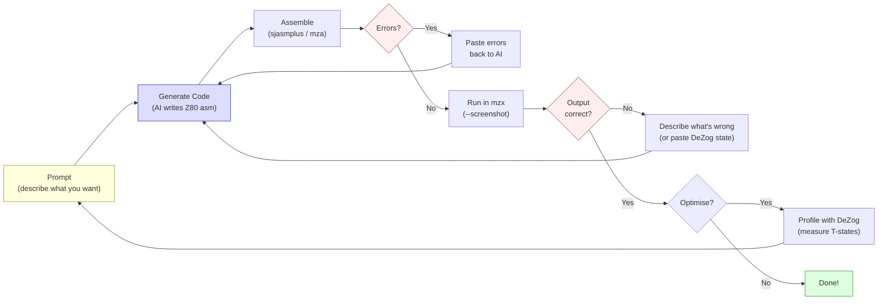

# Розділ 23: Розробка Z80 з допомогою ШІ

> "Z80 they still don't know."
> -- Introspec (spke), Life on Mars, 2024

Ця книга частково написана з допомогою ШІ. Розділ, який ти читаєш, був підготовлений Claude Code. Асемблер, що використовувався для збирання прикладів -- `mza` від MinZ -- був створений з допомогою ШІ. Компаньйон-демо "Antique Toy", яке документує ця книга, було написане в циклі зворотного зв'язку між людиною та ШІ-агентом. Якщо це тебе непокоїть -- добре. Цей дискомфорт вартий розгляду.

Це найбільш самосвідомий розділ книги. Ми чесно подивимося на те, що означає допомога ШІ для розробки під Z80 у 2026 році -- де вона справді допомагає, де впевнено помиляється, і де відповідь -- фруструвальне "залежить від ситуації." Ми зробимо це з реальними прикладами, реальним кодом і реальними випадками невдач, бо демосцена ніколи не мала терпіння до хайпу.

---

## 23.1 Історична паралель: HiSoft C на ZX Spectrum

Перш ніж говорити про ШІ, поговоримо про іншу спробу принести інструменти вищого рівня на ZX Spectrum.

У 1998 році *Spectrum Expert* #02 -- той самий випуск, де Dark та STS опублікували свій метод середньої точки для 3D (Розділ 5) -- рецензував компілятор HiSoft C для ZX Spectrum. Вердикт був неоднозначним. Компілятор створював код, що працював "у 10--15 разів швидше за BASIC." Він підтримував 33 зарезервованих ключових слова, пропонував stdio.lib із графічними можливостями на рівні BASIC та включав `gam128.h` для доступу до банків пам'яті 128K.

Але він не мав підтримки чисел з рухомою комою.

Задумайся над цим на мить. Компілятор C. На машині, де операції з рухомою комою вже обробляються калькулятором ROM через RST $28, який сидить там у 16K безкоштовного коду. А компілятор не міг його використати.

Висновок рецензента *Spectrum Expert* був точним: "корисний для критичної до швидкості роботи, де не потрібна рухома кома." Інструмент із чіткими сильними сторонами та жорсткими обмеженнями, оцінений чесно.

HiSoft Pascal HP4D розповідав подібну історію. Компілятор займав 12K, залишаючи приблизно 21K для програм. Він підтримував дійсні типи та тригонометричні функції -- SIN, COS, SQRT -- і був "придатний для обробки даних та обчислювальної математики." Але 21K для твоєї програми, на машині, де один нестиснений екран займає 6 912 байтів, означає, що ти пишеш маленькі програми або нічого.

Мови вищого рівня на обмеженому залізі завжди були компромісом. Вони неймовірно прискорюють певні задачі. Інші задачі роблять неможливими. Питання ніколи не було "чи HiSoft C гарний чи поганий?", а "для чого він гарний, *і що* варто все ще писати на асемблері?"

Розробка Z80 з допомогою ШІ -- той самий тип компромісу. Інша форма, те саме питання.

---

## 23.2 Цикл зворотного зв'язку Claude Code

Ось як розробка Z80 з допомогою ШІ насправді працює на практиці. Це не магія. Це цикл.

### Цикл

```text
prompt --> code --> assemble --> error? --> fix --> assemble --> run --> wrong? --> fix --> run --> correct
  ^                                                                                                |
  +------------------------------------------------------------------------------------------------+
```

<!-- figure: ch23_ai_feedback_loop -->



Ти описуєш, що хочеш. ШІ генерує асемблер Z80. Ти збираєш його. Він не компілюється -- неправильний синтаксис, неправильний формат міток, неправильний діалект асемблера. Ти вставляєш помилку назад. ШІ виправляє. Ти збираєш знову. Цього разу компілюється. Ти запускаєш в емуляторі. Вивід неправильний -- екран заповнюється сміттям, бордюр не того кольору, нічого не з'являється взагалі. Ти описуєш, що бачиш. ШІ коригує. Ти запускаєш знову.

Цей цикл принципово не відрізняється від того, як працює програміст-людина, за винятком однієї критичної деталі: ШІ генерує першу спробу значно швидше і робить певні класи помилок значно передбачуваніше.

### Конкретний приклад

Припустімо, ти просиш Claude Code написати процедуру, що заповнює область атрибутів ZX Spectrum діагональним смугастим візерунком. Ось правдоподібна перша спроба:

```z80 id:ch23_a_concrete_example
; Fill attributes with diagonal stripes
; Pattern: alternating INK colours along diagonals
    ORG $8000

fill_diagonal:
    ld   hl, $5800          ; attribute memory start
    ld   b, 24              ; 24 rows

.row_loop:
    ld   c, 32              ; 32 columns per row
    ld   a, 24
    sub  b                  ; A = row index (0-23)

.col_loop:
    push af
    add  a, c               ; A = row + column
    and  7                  ; clamp to 0-7 (INK colours)
    or   $40                ; set BRIGHT bit
    ld   (hl), a            ; write attribute
    inc  hl
    pop  af
    dec  c
    jr   nz, .col_loop

    djnz .row_loop
    ret
```

Це розумний код. Він збирається. Він працює. Але є проблеми. Лічильник стовпців `C` рахує вниз від 32, а не вгору від 0, тому діагональ йде в неправильному напрямку. `or $40` встановлює біт 6 (BRIGHT), що правильно, але візуальний ефект має діагоналі, що йдуть зверху-справа вниз-вліво замість більш природного зверху-зліва вниз-вправо. І PUSH/POP AF у внутрішньому циклі коштує 22 T-state на байт атрибута -- непотрібні накладні витрати, якщо перебудувати обчислення.

Нічого з цього не *помилково* в тому сенсі, що код падає. Це *помилково* в тому сенсі, що програміст Z80 не написав би код так. Людина, яка заповнювала атрибути сотні разів, обчислила б індекс діагоналі інакше, уникла б PUSH/POP і отримала б правильний напрямок з першої спроби, бо патерн row + column -- друга натура.

Ось версія, до якої ти приходиш після двох ітерацій:

```z80 id:ch23_a_concrete_example_2
fill_diagonal:
    ld   hl, $5800
    ld   d, 0               ; row index

.row_loop:
    ld   e, 0               ; column index
    ld   b, 32

.col_loop:
    ld   a, d
    add  a, e               ; diagonal = row + col
    and  7
    or   $40                ; BRIGHT + INK colour
    ld   (hl), a
    inc  hl
    inc  e
    djnz .col_loop

    inc  d
    ld   a, d
    cp   24
    jr   nz, .row_loop
    ret
```

Чистіше. Без PUSH/POP. Діагоналі йдуть у правильному напрямку. Внутрішній цикл коштує 4 + 4 + 7 + 4 + 7 + 7 + 6 + 4 + 13 = 56 T-state на байт -- не блискуче, але функціонально для процедури заливки, що запускається один раз.


Суть не в тому, що ШІ написав поганий код. Суть у тому, що *цикл* -- запит, генерація, збирання, тестування, виправлення, повторне тестування -- і є фактичний робочий процес. Допомога ШІ не усуває потребу розуміти Z80. Вона зміщує вузьке місце з *написання* коду на *оцінювання* коду.

### Що робить цикл швидким

Цикл швидший з ШІ, ніж без нього, для конкретних категорій роботи:

**Шаблонний код.** Директива ORG, цикл HALT, тестова обв'язка кольором бордюру з Розділу 1, каркас заповнення атрибутів, підпрограма запису регістрів AY, налаштування LDIR, налаштування режиму переривань. Кожен проект Z80 починається з тих самих 30-50 рядків. ШІ генерує їх правильно і миттєво. Людина набирає з пам'яті. ШІ швидший.

**Ітерація над відомим патерном.** "Тепер зроби діагональ в іншому напрямку." "Додай лічильник кадрів, щоб воно анімувалося." "Зроби так, щоб кольори циклічно перемикалися між BRIGHT і не-BRIGHT." Кожна ітерація -- невелика зміна існуючого коду. ШІ застосовує зміну швидше за ручне редагування, і зміни зазвичай правильні.

**Генерація тестових обв'язок.** "Напиши тест, що заповнює пам'ять за адресою $C000 значеннями 0-255, викликає процедуру множення за адресою $8000 і перевіряє результати за таблицею." ШІ генерує такий тип обв'язкового коду швидко і надійно. Структура тесту -- налаштувати вхідні дані, викликати процедуру, порівняти виходи -- цілком у компетенції ШІ.

**Документація та коментарі.** "Додай підрахунок тактів до кожної інструкції у цьому внутрішньому циклі." ШІ знає таблиці тактів Z80 і застосовує їх правильно в нескладних випадках. Це нудна людська робота, яку машини виконують добре.

### Що робить цикл повільним

**Нові алгоритми.** Коли ти просиш щось, чого ШІ не бачив -- нову стратегію розгортки, трюк, що використовує поведінку прапорців Z80 специфічним чином, схему генерації коду, пристосовану до твоєї точної розкладки даних -- ШІ генерує код, що виглядає правдоподібно, але часто містить неочевидні помилки. Гірше: він помиляється так, що код компілюється та запускається, але дає неправильні результати. Ти витрачаєш більше часу на налагодження згенерованого ШІ коду, ніж витратив би на його самостійне написання.

**Підрахунок тактів під тиском.** ШІ може рахувати такти для ізольованих інструкцій. Але коли тобі потрібно знати точну вартість процедури, що простягається через спірну та неспірну пам'ять, включає умовні переходи з різною вартістю прийнятого/неприйнятого шляху і мусить вміститися в бюджет 2 340 T-state (один рядок розгортки мінус кілька інструкцій), оцінки ШІ ненадійні. Він скаже тобі "приблизно 2 200 T-state", коли фактична вартість залежить від ймовірностей переходів та вирівнювання пам'яті. Ось де DeZog стає незамінним.

**Творчий дизайн ефектів.** "Спроектуй візуальний ефект, що виглядає гарно і вміщується у 8 000 T-state" -- питання, на яке ШІ не може відповісти. Він може реалізувати ефект, який ти описуєш. Він не може його *винайти*. Творче ядро роботи демосцени -- знайти обчислювальну схему, що створює захопливу візуалізацію в межах жорсткого бюджету -- залишається цілком людським.

---

## 23.3 Інтеграція з DeZog: друга половина циклу

Якщо ШІ генерує код, DeZog каже тобі, чи він працює.

DeZog -- це розширення VS Code, що надає інтерфейс налагоджувача Z80. Воно з'єднується з емуляторами (ZEsarUX, CSpect, MAME) або власним вбудованим симулятором Z80 і дає тобі точки зупинки, інспекцію пам'яті, спостереження за регістрами, стеки викликів та перегляд дизасемблювання -- стандартний досвід налагодження, якого очікують сучасні розробники, застосований до коду Z80.

### Робочий процес ШІ + DeZog

Найпродуктивніший робочий процес для розробки Z80 з допомогою ШІ поєднує Claude Code з DeZog у щільному циклі:

1. **Claude Code генерує процедуру** -- скажімо, множення 8x8.
2. **Ти збираєш її** за допомогою `mza` і завантажуєш в емулятор, з'єднаний з DeZog.
3. **Ти ставиш точку зупинки** на точці входу і проходиш покроково.
4. **Ти спостерігаєш за регістрами** на кожному кроці. Чи містить A правильне проміжне значення після першого `ADD A,B`? Чи встановлюється прапорець перенесення, коли повинен?
5. **Ти помічаєш розходження** -- старший байт результату неправильний. Ти робиш знімок стану регістрів або копіюєш значення.
6. **Ти вставляєш розходження назад у Claude Code** -- "Після 6 ітерацій циклу зсуву A = $3C, але має бути $78. Ось значення регістрів у точці зупинки."
7. **Claude Code ідентифікує помилку** -- зазвичай пропущений зсув, неправильний вибір регістра або помилка на одиницю в лічильнику циклу.
8. **Ти виправляєш, перезбираєш, перетестовуєш.**

Цей робочий процес потужний, бо дає ШІ те, чого йому бракує: основну істину. ШІ добре міркує про структуру коду, але погано ментально симулює виконання Z80 протягом багатьох ітерацій. DeZog надає фактичний стан виконання. ШІ міркує про розрив між очікуваним та фактичним станом. Разом вони сходяться до правильного коду швидше, ніж кожен окремо.

### Інспекція пам'яті для data-heavy коду

Для процедур, що маніпулюють пам'яттю -- заливки екрану, генерація таблиць, операції з буферами -- перегляд пам'яті DeZog незамінний. Ти можеш поставити точку зупинки після процедури генерації таблиці синусів та інспектувати 256 байтів за адресою таблиці. Чи вони симетричні? Чи досягають піку на правильному значенні? Чи перетинають нуль у правильній позиції?

Це особливо цінно для згенерованих ШІ таблиць підстановки. Claude Code може згенерувати процедуру, що обчислює 256-байтову таблицю синусів за допомогою параболічного наближення з Розділу 4. Процедура зазвичай *майже* працює -- форма правильна, діапазон правильний, але може бути помилка на одиницю в індексі, що зсуває всю таблицю на одну позицію, або помилка знаку, що інвертує один квадрант. DeZog дозволяє тобі побачити таблицю безпосередньо та порівняти з відомими правильними значеннями.

### Чого DeZog (поки) не може

DeZog наразі не інтегрується з ШІ-агентами програмно. Ти, людина, -- міст: читаєш значення регістрів, вставляєш їх у запит, застосовуєш виправлення. ШІ-агент, що міг би ставити точки зупинки та ітерувати автономно, замкнув би цикл для чітко визначених задач. Для творчої та архітектурної роботи людина залишається в циклі.

---

## 23.4 Коли ШІ допомагає, а коли ні

Будемо конкретними. Не "ШІ добрий у деяких речах" -- конкретні категорії з конкретними оцінками.

### ШІ допомагає: висока впевненість

**Кодування інструкцій та підрахунок тактів.** ШІ запам'ятав набір інструкцій Z80: опкоди, кількість байтів, вартість у T-state. `DJNZ` прийнятий = 13T, не прийнятий = 8T. `LDIR` на байт = 21T, крім останнього = 16T. Він отримує це правильно послідовно, з застереженням, що інколи плутає тайминг Pentagon та 48K зі спірною пам'яттю.

**Шаблонний та обв'язковий код.** Директиви ORG, цикли HALT, записи в регістри AY, процедури очищення екрану, налаштування переривань. Патерни, бачені тисячі разів. Генеруються правильно, економлять набір.

**Переклад між діалектами та пояснення коду.** Конвертація між синтаксисом sjasmplus, mza та z80asm. Пояснення того, що робить блок асемблеру Z80 -- трасування логіки, ідентифікація патернів. Читати Z80 простіше, ніж писати, і ШІ читає добре.

### ШІ допомагає: середня впевненість

**Стандартні алгоритми.** Множення зсувом і додаванням, ділення з відновленням, лінія Брезенхема, скролінг на основі LDIR. ШІ генерує робочі реалізації, але вони зазвичай підручникові версії -- правильні, але не оптимізовані. Людина вичавила б на 5-15% більше швидкості через трюки з розподілом регістрів, експлуатацію прапорців та розгортку, яку ШІ не додумується застосувати.

**Розкладка пам'яті та адресація.** "Налаштуй 256-байтову вирівняну таблицю за адресою $xx00" або "обчисли адресу атрибута для екранної позиції (row, col)." ШІ розуміє розкладку екрану Spectrum та генерує правильні обчислення адрес, хоча інколи неправильно обробляє перехід між третинами у черезрядковій піксельній пам'яті.

**Простий самомодифікований код.** Патчинг безпосереднього операнда, зміна цілі переходу, заміна інструкції. ШІ розуміє концепцію та генерує правильні приклади для простих випадків. Складна самомодифікація -- де поведінка модифікованого коду залежить від взаємодії кількох патчів -- ненадійна.

### ШІ не допомагає: низька впевненість

**Нова оптимізація внутрішніх циклів.** Це головне. Коли тобі потрібно зрізати 3 T-state з внутрішнього циклу, що виконується 6 144 рази за кадр -- коли 3 T-state -- це різниця між 50 fps та 48 fps -- ШІ не може надійно знайти оптимізацію. Він запропонує стандартні підходи (розгортка, таблиця підстановки, заміна регістрів), але не виявить *конкретний* трюк, який саме *ця* розкладка даних та розподіл регістрів дозволяють.

Внутрішній цикл роторзумера Introspec з його аналізу Illusion (Розділ 7) -- `ld a,(hl) : inc l : dec h : add a : add a : add (hl)` -- це 95 T-state на 4 пари чанкі-пікселів. Геніальність -- у виборі використати `inc l` замість `inc hl` (заощадження 2 T-state, 6 на пару) та в експлуатації того факту, що `add a` (подвоєння) -- 4T, тоді як `sla a` (зсув, що робить те саме) -- 8T. Це типи мікро-рішень, що акумулюються у різницю між демо, що працює, і демо, що не працює. ШІ не приймає ці рішення добре, бо вони вимагають розуміння *глобального* контексту тиску регістрів, вирівнювання пам'яті та бюджету кадру одночасно.

**Тайминг спірної пам'яті.** Патерн затримки на оригінальних Spectrum (6, 5, 4, 3, 2, 1, 0, 0 додаткових T-state на 8-T-state період) взаємодіє з таймингом інструкцій способами, які ШІ не може надійно передбачити. Introspec документував це у "GO WEST" (Hype, 2015). ШІ знає факти, але не може застосувати їх для обчислення фактичного часу виконання змішаних процедур спірної/неспірної пам'яті.

**Трюки на основі прапорців та естетичне судження.** ШІ знає, що `ADD A,A` встановлює прапорець перенесення з біту 7 -- використовуваний і як умова переходу, і як множення -- але спонтанно не комбінує такі факти у нові оптимізації. І він не може приймати творчі рішення: які кольори підходять для плазми, як має відчуватися тунель, чи скролер має підстрибувати чи рухатися синусоїдою.

---

## 23.5 Дослідження випадку: Створення MinZ

MinZ -- мова програмування для систем Z80 та eZ80, створена Алісою зі значною допомогою ШІ протягом 2024-2026 років. Вона компілює сучасний, читабельний код у ефективний асемблер Z80. Проект реальний, з відкритим кодом, і станом на момент написання має версію 0.18.0.

MinZ релевантний до цього розділу з двох причин. По-перше, це дослідження випадку розробки інструментів, що таргетують Z80, з допомогою ШІ. По-друге, він сам є прикладом патерну HiSoft C -- мова вищого рівня на обмеженому залізі, зі знайомими сильними сторонами та обмеженнями.

### Що таке MinZ

MinZ provides typed variables (`u8`, `u16`, `i8`, `i16`, `bool`), functions with multiple returns, control flow (`if/else`, `while`, `for i in 0..n`), structs, arrays, and a standard library covering maths, graphics, input, sound, and memory operations. It compiles to Z80 assembly via its own assembler (`mza`), runs on its own emulator (`mzx`), and targets ZX Spectrum, CP/M, MSX, and Agon Light 2.

The toolchain includes four standalone tools:

- **mza** — Z80 assembler with macros, multiple output formats (.sna, .tap, .com, .rom, .bin), and multi-platform targets
- **mzx** — ZX Spectrum emulator with headless CLI mode, automated screenshots, keystroke injection, and frame-precise capture
- **mzd** — Z80 disassembler with IDA-like recursive descent analysis, cross-references, T-state counting, and reassemblable output
- **MinZ compiler** — compiles MinZ source to Z80 assembly via mza

Програма MinZ виглядає так:

```minz
import stdlib.graphics.screen;
import stdlib.input.keyboard;
import stdlib.time.delay;

fun main() -> void {
    clear_screen();
    draw_circle(128, 96, 50);

    loop {
        wait_frame();
        let dx = get_key_dx();
        // Move sprite based on input...
    }
}
```

This compiles to Z80 assembly, assembles to a binary, and runs on real or emulated hardware. The self-contained toolchain -- compiler, assembler, emulator, disassembler -- means no external dependencies.

### Де ШІ допоміг створити MinZ

**Сам компілятор.** Компілятор MinZ написаний на Go (~90 000 рядків). Основна частина генерації коду -- трансляція проміжного представлення MinZ в асемблер Z80 -- була написана в циклі з допомогою ШІ. Патерн: описати семантику мовної фічі, згенерувати генератор коду, протестувати на емуляторі, виправити розбіжності. Для стандартних фіч типу арифметичних виразів, викликів функцій та керування потоком, цей цикл сходився швидко. Claude Code генерував правильні генератори коду для `if/else` та `while` з першої чи другої спроби.

**Асемблер.** `mza`, асемблер Z80 MinZ, був створений з допомогою ШІ. Він підтримує повний набір інструкцій Z80, макроси, кілька вихідних форматів та двопрохідне збирання. Таблиця кодування інструкцій -- що відображає мнемоніки в опкоди, обробляючи всі нерегулярні патерни префіксних байтів Z80 (CB, DD, ED, FD) -- була згенерована ШІ та перевірена за специфікацією Z80. Це саме той тип систематичного, табличного коду, з яким ШІ справляється добре.

**The emulator.** `mzx` achieves 100% Z80 instruction coverage, including all undocumented opcodes (ED prefix NOPs, DDCB/FDCB indexed bit operations). The AI generated the initial implementation for each instruction from the Z80 manual; the test suite (also AI-generated) caught edge cases -- flag behaviour on overflow, the half-carry flag on DAA, interrupt timing. But mzx's most useful feature -- built entirely through the AI feedback loop -- is its headless CLI mode:

```text
mzx --run program.bin@8000 --frames 100 --screenshot output.png
mzx --load code.bin@8000,data.bin@C000 --set PC=8000,SP=FFFF,EI,IM=1
mzx --model 128k --tap demo.tap --exec 'LOAD ""' --frames 500
mzx --run effect.bin@8000 --frames DI:HALT --dump-keyframes ./frames/
mzx --model pentagon --trd disk.trd --type "RUN\n" --screenshot grab.png
```

The `--run` flag loads a binary at a given address and starts execution -- no ROM, no BASIC, no loading screen. The `--frames DI:HALT` trigger captures the screenshot at the exact moment the code signals "frame complete" by disabling interrupts before a HALT. The `--dump-keyframes` flag saves only frames where the screen changed -- an automated visual regression test. The `--exec` and `--type` flags inject BASIC commands and keystrokes, allowing fully automated testing of programs that expect user interaction.

This book's screenshot pipeline uses mzx directly. Every code example screenshot in these pages was generated by:

```text
sjasmplus --nologo --raw=build/example.bin example.a80
mzx --run build/example.bin@8000 --frames 50 --screenshot build/ch09_plasma.png
```

Twenty-one examples, zero manual intervention, reproducible with `make screenshots`.

**The disassembler.** `mzd` performs recursive descent analysis -- the same technique used by IDA Pro. Given a binary, it traces all execution paths from entry points, separates code from data, detects strings, generates cross-references, and auto-labels jump targets:

```text
mzd illusion.bin --org $6000 --analyze --target spectrum --cycles --labels
```

The `--cycles` flag adds T-state counts to every instruction -- automating the exact work that Introspec did by hand in his 2017 teardown of X-Trade's Illusion. The `--target spectrum` flag annotates system calls (RST $10 for character output, port $FE for border/keyboard). The `-R` flag produces reassemblable output, closing the disassemble-modify-reassemble loop.

The AI built both `mzd`'s instruction decoder (systematic table-driven work) and its analysis engine (recursive descent, control flow graph construction). The platform-specific ABI knowledge (which ZX Spectrum ROM calls do what) was partly AI-generated, partly pulled from existing documentation.

**Стандартна бібліотека та "щілинний" оптимізатор.** Десять модулів stdlib (математика, графіка, введення, звук тощо) та 35+ "щілинних" патернів ("замінити `LD A,0` на `XOR A`"). Обидва згенеровані ШІ та відшліфовані людиною. ШІ знає набір інструкцій достатньо добре, щоб пропонувати валідні спрощення; людина верифікує семантичну коректність.

### Де ШІ не допоміг створити MinZ

**True Self-Modifying Code (TSMC).** Найвиразніша фіча MinZ -- TSMC: компілятор може генерувати код, що переписує власні інструкції під час виконання для підвищення продуктивності. Однобайтовий патч опкоду (7-20 T-state) замінює послідовність умовного переходу (44+ T-state). *Концепція* TSMC була винаходом Аліси, а не ШІ. ШІ не міг запропонувати "а що якби скомпільований код патчив власні опкоди для зміни поведінки під час виконання?", бо ця ідея вимагає розуміння і моделі компіляції, і кодування інструкцій Z80 на рівні, якого ШІ не досягає без підказки.

**Парсер.** MinZ спочатку використовував tree-sitter для парсингу, але зіштовхнувся з проблемами нестачі пам'яті на великих файлах. Заміна -- рукописний парсер рекурсивного спуску на Go -- була спроектована Алісою, з інформованістю від ШІ-консультацій (GPT-4, o4-mini та Claude -- усі отримали запити на архітектурну пораду). ШІ-колеги погодилися, що рукописний парсер -- правильний підхід, і запропонували зберегти тестовий корпус tree-sitter. Але фактичний дизайн граматики парсера -- як синтаксис MinZ відображається на вузли AST -- був людською роботою. ШІ міг генерувати код парсера для окремих граматичних правил, але не міг спроектувати саму граматику.

**Розподіл регістрів для генератора коду.** Вирішення, які змінні живуть у яких регістрах Z80, коли скидати в пам'ять і як обробляти нерегулярний регістровий файл Z80 (тільки певні регістри можна використовувати з певними інструкціями) -- це задача задоволення обмежень, яку ШІ вирішує погано. Він генерує код, що працює, але марнує регістри, використовує непотрібні записи в пам'ять і пропускає можливості тримати гарячі значення в регістрах через базові блоки.

### Вердикт MinZ

MinZ could not exist without AI assistance. The sheer volume of systematic code -- the instruction encoder, the emulator, the disassembler's analysis engine, the standard library, the peephole patterns -- would have taken one developer years to write manually. With AI assistance, MinZ went from concept to a four-tool ecosystem in roughly 18 months.

But MinZ's *interesting* features -- TSMC, the zero-cost lambda-to-function transform, the UFCS method dispatch, mzx's `DI:HALT` trigger, mzd's platform-aware ABI annotations -- are human inventions. The AI implemented them, but did not conceive them.

Це точно відповідає патерну HiSoft C. Інструмент неймовірно прискорює рутинну роботу. Творча робота залишається людською. Компроміс реальний і вартий прийняття.

---

## 23.5b Sidebar: The Other AI — Brute-Force Superoptimisation

MinZ's peephole optimiser knows 35+ patterns like "replace `LD A,0` with `XOR A`." But how do you *find* such patterns? And how do you know which ones are actually safe?

Consider `LD A, 0` → `XOR A`. Both set A to zero. Both take fewer bytes in the XOR form (1 byte vs 2). But `XOR A` clears the carry flag and sets the zero flag; `LD A, 0` preserves all flags. If the code after this instruction tests carry, the "optimisation" is a bug. A human expert knows this. A neural-network-based AI *usually* knows this but sometimes forgets. A brute-force superoptimiser *proves* it by testing every possible input state.

**z80-optimizer** (by oisee, 2025) takes the brute-force approach to its logical conclusion. It enumerates every pair of Z80 instructions — all 406 opcodes × 406 opcodes = 164,836 pairs — and for each pair, tests whether a shorter replacement produces identical output across all possible register and flag states. No heuristics. No training data. No neural networks. Just exhaustive enumeration with full state equivalence verification.

The results: **602,008 provably correct optimisation rules** from a single run on an Apple M2 (34.7 billion comparisons in 3 hours 16 minutes). Some highlights:

| Original sequence | Replacement | Savings |
|---|---|---|
| `SLA A : RR A` | `OR A` | 3 bytes, 12T |
| `LD A, 0 : NEG` | `SUB A` | 2 bytes |
| `LD A, B : ADD A, 0` | `LD A, B : OR A` | 0 bytes, 4T |
| `SCF : RR A` | `SCF : RRA` | 1 byte, 4T |

The rules cluster into **83 unique transformation patterns** — families of replacements that share the same structural logic. For instance, the "load-then-test" family: `LD A, r : ADD A, 0` → `LD A, r : OR A` applies to all register sources because the optimisation exploits flag behaviour, not register identity.

What makes z80-optimizer interesting for this chapter is not the specific rules — any experienced Z80 coder knows most of the common ones. It is the *methodology*. This is AI in the original sense: a machine that finds knowledge through search, not through learned patterns. The 602,008 rules include thousands that no human has catalogued, because they involve obscure opcode pairs that nobody writes deliberately but that compilers and code generators *do* produce.

The obvious next step — length-3 sequences — requires GPU brute force (406³ = 67 million triples × all input states). Beyond that, stochastic search (STOKE-style) can explore the space of longer replacements without exhaustive enumeration.

For practical Z80 development, z80-optimizer complements the AI feedback loop from this chapter: Claude Code generates correct-but-unoptimised code, then z80-optimizer can mechanically verify whether any instruction pairs have shorter equivalents. One AI writes the code; the other AI proves how to shrink it.

**Source:** `github.com/oisee/z80-optimizer` (MIT license)

---

## 23.6 Чесний погляд: "Z80 they still don't know"

Скептицизм Introspec щодо можливостей ШІ з Z80 -- не загальна технофобія. Він походить із десятиліть досвіду вичавлювання Z80 до абсолютних меж. Коли він каже "Z80 they still don't know", він має на увазі щось конкретне.

Розглянемо внутрішній цикл роторзумера з його аналізу Illusion. Ефект проходить через текстуру під кутом, створюючи повернуті та збільшені 2x2 чанкі-пікселі. Внутрішній цикл:

```z80 id:ch23_honest_take_z80_they_still
    ld   a, (hl)    ; 7T   read texture byte
    inc  l          ; 4T   next column (no carry needed: 256-aligned!)
    dec  h          ; 4T   previous row
    add  a,a        ; 4T   double (same as SLA A but 4T not 8T)
    add  a,a        ; 4T   quadruple
    add  a,(hl)     ; 7T   combine with second texture sample
                    ; --- 30T per pixel pair
```

Ключовий інсайт -- `inc l` замість `inc hl`. Це заощаджує 2 T-state, але працює лише тому, що текстура вирівняна по 256-байтовій межі, тому інкремент лише L ніколи не потребує перенесення в H. ШІ використав би `inc hl` -- безпечний, загальний вибір -- і втратив би 2 T-state на ітерацію. За 3 072 пари пікселів на кадр це 6 144 T-state -- майже 10% бюджету кадру на 48K Spectrum.

Ось що означає "Z80 they still don't know." Не те, що ШІ не може писати асемблер Z80 -- може. Не те, що він плутає інструкції -- зазвичай ні. А те, що він не розуміє *контекст*, у якому кожен вибір інструкції має значення. Він не думає бюджетами. Він не бачить, що `inc l` безпечний тут через обмеження вирівнювання на три рівні абстракції вище. Він не знає, що 2 T-state на ітерацію, помножені на тисячі ітерацій -- це різниця між вміщенням в один кадр та потребою двох.

### Що саме ШІ робить неправильно

Ми протестували Claude Code на кількох задачах Z80 з домену демосцени. Ось репрезентативні результати.

**Задача: написати процедуру DOWN_HL.** DOWN_HL переміщує вказівник екрану в HL на один піксельний рядок вниз у черезрядковій відеопам'яті Spectrum. Це найчастіше використовуваний графічний примітив на платформі. Introspec написав остаточну статтю про нього (Hype, 2020).

Перша спроба ШІ:

```z80 id:ch23_what_the_ai_gets_wrong
down_hl:
    inc  h              ; 4T   move down one pixel row
    ld   a, h           ; 4T
    and  7              ; 7T
    ret  nz             ; 11T/5T  still within the character row
    ld   a, l           ; 4T
    add  a, 32          ; 7T   next character row
    ld   l, a           ; 4T
    ret  c              ; 11T/5T  if carry, crossed into next third
    ld   a, h           ; 4T
    sub  8              ; 7T
    ld   h, a           ; 4T
    ret                 ; 10T
```

This is actually correct -- it handles all three screen thirds properly, including the boundary transitions. The AI can get standard routines like DOWN_HL right because the pattern is well-documented and appears in many Z80 references. The routine works: `inc h` advances the pixel row, `add a, 32` advances the character row when needed, the carry from the L addition correctly detects third boundaries, and `sub 8` undoes the spurious TT increment for the common case.

But "correct" is not the same as "good." Introspec's article presents a version by RST7 using a dual-counter approach that handles all boundaries in 2,343 T-states for a full-screen traverse. The naive approach above -- the standard textbook version -- costs 5,922 T-states. The gap between "works" and "works well" is a factor of 2.5x, and the AI does not bridge that gap. It produces the first version any competent programmer would write, not the version an expert would optimise toward.

**Задача: згенерувати розгорнуту заливку екрану.** На прохання згенерувати розгорнуту заливку екрану на основі PUSH (техніка з Розділу 3), ШІ створив правильний код -- пари PUSH, що записують два байти за раз, DI/EI для захисту маніпуляції з вказівником стеку. Але він не подумав розташувати дані у зворотному порядку (PUSH записує старший байт першим, за нижчою адресою), що означає -- патерн заливки був задом наперед. Людина, яка писала PUSH-заливки раніше, враховує це автоматично.

**Задача: оптимізувати заданий внутрішній цикл.** Отримавши робочий внутрішній цикл з проханням зробити його швидшим, ШІ запропонував стандартні оптимізації: розгортку, таблиці підстановки, заміну регістрів. Це валідні пропозиції. Але він не знайшов неочевидну оптимізацію -- ту, де ти перебудовуєш розкладку пам'яті, щоб увімкнути `inc l` замість `inc hl`, або використовуєш прапорець перенесення від додавання як умову переходу замість окремого порівняння. Неочевидна оптимізація вимагає розуміння повного контексту процедури, і контекстне вікно ШІ, хоч і велике, не охоплює *просторову* та *часову* структуру програми Z80 так, як ментальна модель людини-експерта.

### Де Introspec правий

Найглибші оптимізації Z80 -- не про знання інструкцій. Вони про розуміння взаємодії між розкладкою пам'яті, розподілом регістрів, кодуванням інструкцій, обмеженнями тайминґу та візуальним виводом -- одночасно. Ця взаємодія -- те, що Introspec називає "еволюціонуванням обчислювальної схеми" (Розділ 1). Обчислювальна схема -- цілісний дизайн, де кожне рішення впливає на кожне інше рішення. ШІ оперує кодом локально. Експерт оперує схемою глобально.

ШІ не знає Z80 у тому сенсі, в якому Introspec знає Z80. Він запам'ятав набір інструкцій, але не інтерналізував машину.

### Де Introspec не зовсім правий

Але "Z80 they still don't know" натякає, що ШІ марний для роботи з Z80, і це не так.

ШІ не намагається замінити Introspec. Він намагається допомогти Алісі -- програмістці, яка розуміє Z80 достатньо добре, щоб оцінювати вивід ШІ, але не має десятиліть досвіду оптимізації внутрішніх циклів. Для Аліси вивід ШІ -- стартова точка, що краща за порожній екран. Їй не потрібно, щоб ШІ знайшов трюк із `inc l`. Їй потрібно, щоб він згенерував перші 80% процедури, аби вона могла витратити свій час на останні 20%.

Демосцена завжди була про останні 20%. ШІ цього не змінює. Він змінює, як швидко ти проходиш перші 80%.

---

## 23.7 Демо "Antique Toy": ШІ на практиці

Компаньйон-демо цієї книги -- "Antique Toy" -- свідомий експеримент: побудувати демо для ZX Spectrum з допомогою ШІ та задокументувати, що відбувається.

Назва -- відсилання до *Eager* Introspec (2015, 1-е місце на 3BM openair). Ми реалізуємо ефекти, натхненні Eager -- атрибутний тунель із 4-кратною симетрією, хаотичний зумер, 4-фазна колірна анімація -- плюс рушій 3D методу середньої точки Dark зі *Spectrum Expert* #02.

**Що спрацювало:** прототипування ефектів -- Claude Code генерує робочі перші чернетки достатньо швидко, щоб пробувати ідеї, які інакше не варті часу набору. "А що якби тунель використовував 8-кратну симетрію замість 4-кратної?" займає 15 хвилин із згенерованим ШІ кодом замість 2 годин вручну. Інструментарій -- система збирання, конвеєр ассетів, правила Makefile та тестові обв'язки -- усе згенероване ШІ і працює надійно. Огляд коду -- подача процедури ШІ із запитанням "що тут неправильно?" ловить очевидні помилки (помилки на одиницю, забуті DI/EI, неправильні номери портів) до того, як вони коштуватимуть годин налагодження.

**Що не спрацювало:** рушій 3D методу середньої точки Dark. Віртуальний процесор з упакованими 2-бітними опкодами та 6-бітними номерами точок був декодований неправильно. Інструкція усереднення обчислювала `(A+B)/2` через `ADD A,B : SRA A`, що переповнюється для знакових координат. Три сесії налагодження, довші за написання з нуля. Інтеграція музики провалилася подібно -- ШІ згенерував програвач, що конфліктував із використанням тіньових регістрів кодом ефектів (EXX, EX AF,AF'). І програвач, і ефект використовували тіньовий BC для різних цілей, і EXX в обробнику переривань підставляв застарілі значення. Цей клас помилок -- системні конфлікти регістрів через межі переривань -- вимагає розуміння повної системної архітектури, а не лише окремих процедур.

**Чесна оцінка:** "Antique Toy" не завершений. Ефекти працюють окремо. Інтеграція триває. Але допомога ШІ зробила проект *здійсненним* для самотнього розробника, що працює вечорами та вихідними. Правильне питання -- не "чи ШІ відповідає рівню виділеної людської команди?", а "чи допомога ШІ дозволяє більшій кількості людей створювати демо?" Відповідь, попередньо, -- так.

---

## 23.8 Цикл зворотного зв'язку на практиці

Конкретний приклад із проекту "Antique Toy": реалізація 4-кратної симетрії для ефекту тунелю шляхом копіювання верхнього лівого квадранта атрибутів 16x12 у три інші квадранти з дзеркалюванням.

Запит був конкретним: "Напиши процедуру Z80, що копіює верхній лівий квадрант 16x12 області атрибутів ZX Spectrum ($5800) у три інші квадранти з відповідним дзеркалюванням." Claude Code згенерував 47 рядків, що зібралися з першої спроби.

Тестування виявило, що верхній правий квадрант зміщений на один стовпець. DeZog показав проблему: після того як цикл дзеркалювання зменшив DE 16 разів, обчислення просування рядка забуло, що DE вже було переміщено назад. Код просував DE на 32 (ширина одного рядка) замість потрібних 48 (32 за рядок + 16 для компенсації дзеркального проходу). Вставлення значень регістрів у Claude Code -- "Після рядка 1, DE = $581F (має бути $582F)" -- одразу дало виправлення. Нижній правий квадрант мав ту саму помилку в подвоєному вигляді. Ще одна ітерація це виправила.

Разом: три ітерації, приблизно 25 хвилин. Ручна оцінка для досвідченого програміста Z80: 40-60 хвилин. Для новачка: 2-3 години. ШІ заощадив час на початковій генерації. Налагодження зайняло стільки ж незалежно від того, хто писав код.

---

## 23.9 Побудова власного робочого процесу з ШІ

Практичне налаштування: VS Code з розширенням Z80 Macro Assembler та Z80 Assembly Meter. Claude Code (або будь-яка LLM для роботи з кодом). Асемблер (`mza` або sjasmplus). DeZog, з'єднаний з емулятором. Makefile.

Робочий процес: **Почни з ШІ** -- опиши, що хочеш, з конкретикою (цільова машина, адреси пам'яті, синтаксис асемблера). **Збирай одразу** -- не читай код ШІ уважно; збери його, встав помилки назад. **Тестуй кольорами бордюру** -- обгорни згенеровані ШІ процедури у тестову обв'язку з Розділу 1. **Налагоджуй із DeZog** -- став точки зупинки, знаходь першу розбіжність регістрів, повідомляй її ШІ. **Ітеруй** -- зазвичай 2-5 раундів для помірної складності; більше 5 означає, що ШІ не справляється і варто написати самому. **Оптимізуй самостійно** -- коли код правильний, профілюй та застосовуй техніки з Розділів 1-14.

### Інженерія промптів для Z80

**Гарний промпт:** "Напиши процедуру Z80 для ZX Spectrum 128K (тайминг Pentagon), що копіює 16 байтів з адреси в HL в екранну пам'ять за адресою (DE), з екранною адресою, що слідує патерну черезрядкової розкладки Spectrum. Після кожного байту просувай DE до наступного піксельного рядка стандартним методом down_hl. Використовуй синтаксис mza. Включи підрахунок тактів."

**Поганий промпт:** "Напиши процедуру спрайтів для Spectrum."

Гарний промпт вказує машину, асемблер, адреси, поведінку та формат виводу. Поганий промпт залишає все неоднозначним, і ШІ заповнить прогалини неправильними припущеннями.

Для промптів оптимізації дай конкретну ціль: "Ця процедура займає ~3 200 T-state. Мені потрібно менше 2 400. Не змінюй інтерфейс (HL = джерело, DE = призначення, B = висота). Тайминг Pentagon." Ціль продуктивності та обмеження інтерфейсу змушують ШІ шукати реальні оптимізації замість перебудови конвенції виклику.

---

## 23.10 Ширша картина

AI assistance does not change the abstraction level of the output -- the Z80 still executes the same instructions at the same speeds. What it changes is the speed of the input: how fast you go from idea to working (if unoptimised) code. The demoscene's experts will still write better inner loops than any AI, but AI-assisted tooling lowers the entry barrier enough that more people can start making demos and learn the deep tricks for themselves.

---

## Підсумок

- **Розробка Z80 з допомогою ШІ слідує циклу зворотного зв'язку:** промпт, генерація, збирання, тестування, налагодження, ітерація. ШІ генерує першу чернетку швидко; людина оцінює та вдосконалює. Цикл зазвичай займає 2-5 ітерацій для процедури помірної складності.

- **ШІ надійний для** кодування інструкцій, підрахунку тактів, шаблонного коду, перекладу між діалектами та пояснення коду. Помірно надійний для стандартних алгоритмів та простого самомодифікованого коду. Ненадійний для нової оптимізації, тайминґу спірної пам'яті, творчого дизайну ефектів та глибоких трюків на основі прапорців.

- **Інтеграція з DeZog** закриває розрив між виводом ШІ та правильним кодом. Людина зчитує стани регістрів з налагоджувача та подає розбіжності назад ШІ, який міркує про невідповідність. Програмної інтеграції ШІ-налагоджувач поки не існує, але це очевидний наступний крок.

- **Дослідження випадку MinZ** чітко демонструє патерн: допомога ШІ дозволила одному розробнику побудувати повний мовний набір інструментів (компілятор, асемблер, емулятор, стандартна бібліотека) за 18 місяців. Рутинна робота -- кодування інструкцій, генерація тестів, функції стандартної бібліотеки -- була згенерована ШІ. Творча робота -- TSMC, zero-cost абстракції, дизайн граматики -- була людською.

- **Скептицизм Introspec обґрунтований:** ШІ не розуміє Z80 так, як експерт. Він не думає бюджетами, не бачить наскрізних обмежень, не знаходить неочевидних оптимізацій. Найглибша робота демосцени залишається поза досяжністю ШІ.

- **Історична паралель зберігається:** HiSoft C був "у 10-15 разів швидший за BASIC", але не мав чисел з рухомою комою. Розробка Z80 з допомогою ШІ радикально швидша для обв'язки та ітерацій, але не може зрівнятися з людьми-експертами в оптимізації внутрішніх циклів. Інструменти вищого рівня на обмеженому залізі завжди були компромісом. Питання не "добре чи погано?", а "добре *для чого*?"

- **Практичний робочий процес** поєднує Claude Code для генерації коду, DeZog для налагодження, `mza` або sjasmplus для збирання та Makefile для автоматизації. Починай із ШІ, збирай одразу, тестуй кольорами бордюру, налагоджуй із DeZog, оптимізуй самостійно.

- **Ширший ефект** позитивний: допомога ШІ знижує поріг входу в розробку Z80, не знижуючи стелю. Більше людей зможуть почати; експерти все ще потрібні для глибокої роботи. Це добре для демосцени.

---

## Спробуй сам

1. **Тест на шаблонний код.** Попроси свого ШІ-помічника згенерувати шаблон завантаження ZX Spectrum 128K: ORG за адресою $8000, вимкнення переривань, налаштування IM1, цикл HALT з тестовою обв'язкою кольором бордюру. Збери та запусти. Скільки ітерацій знадобилося?

2. **Тест на оптимізацію.** Напиши (або згенеруй за допомогою ШІ) робочий цикл заповнення атрибутів. Виміряй його вартість за допомогою тайминґу кольором бордюру. Потім попроси ШІ зробити його швидшим. Виміряй знову. Тепер оптимізуй самостійно, використовуючи техніки з Розділів 1-3. Порівняй усі три версії: оригінальну, оптимізовану ШІ, оптимізовану людиною.

3. **Виклик DOWN_HL.** Попроси ШІ написати процедуру DOWN_HL. Протестуй її на всіх 192 піксельних рядках. Чи правильно вона обробляє переходи між третинами? Порівняй з аналізом Introspec (Hype, 2020). Це лакмусовий тест компетентності ШІ у Z80.

4. **The MinZ experiment.** Install the MinZ toolchain (`mza`, `mzx`, `mzd`). Assemble a screen fill with `mza`, run it headless with `mzx --run fill.bin@8000 --frames 5 --screenshot fill.png`, then disassemble a demo binary with `mzd demo.bin --analyze --cycles --target spectrum`. Compare the AI-built disassembler's T-state counts to your own hand-counted totals from Chapter 1.

5. **The automated pipeline.** Write an effect, assemble it, and add it to a `Makefile` that runs `mzx --screenshot` for every binary. Run `mzx --dump-keyframes` to see exactly which frames produce visible changes. This is the same pipeline that generated every screenshot in this book.

6. **Build something.** Pick an effect from an earlier chapter. Use AI assistance to write the first draft. Iterate until it works. Profile it. Optimise the inner loop by hand. Document each step. You have just experienced the workflow this entire chapter describes.

---

*Це останній технічний розділ. Далі йдуть додатки -- довідкові таблиці, інструкції з налаштування та довідник інструкцій, до якого ти будеш звертатися кожного разу, коли пишеш асемблер Z80.*

> **Sources:** HiSoft C review (Spectrum Expert #02, 1998); Introspec "Technical Analysis of Illusion" (Hype, 2017); Introspec "DOWN_HL" (Hype, 2020); Introspec "GO WEST Parts 1-2" (Hype, 2015); z80-optimizer (oisee, 2025, `github.com/oisee/z80-optimizer`)
